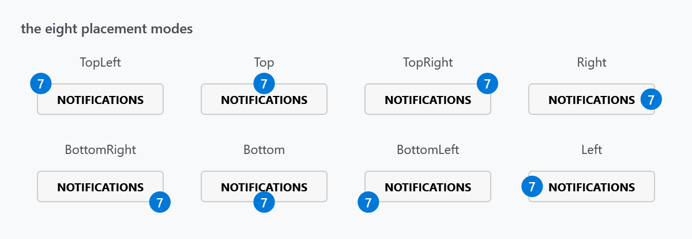
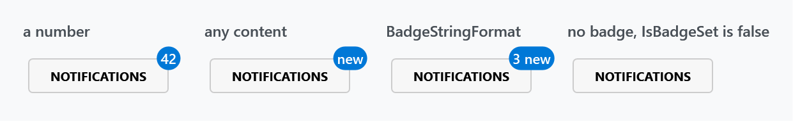
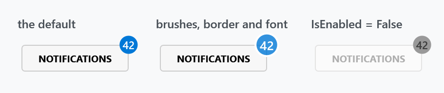

Title: Badged Control
Description: If you need to show a badge over a control then this is the right control
---

`Badged` wraps a control and draws a small badge over one of its corners or edges — an unread count, a status, a short word.



```xml
<mah:Badged Badge="42">
    <Button Content="Notifications" />
</mah:Badged>
```

The badge is placed by `BadgePlacementMode`, which defaults to `TopRight`:

```xml
<mah:Badged Badge="{Binding UnreadCount}" BadgePlacementMode="BottomRight">
    <Button>
        <iconPacks:PackIconFontAwesome Kind="CommentOutline" />
    </Button>
</mah:Badged>
```

:::{.alert .alert-info}
The `iconPacks` control in that sample comes from [MahApps.Metro.IconPacks](https://github.com/MahApps/MahApps.Metro.IconPacks), a separate package.
:::

## The badge content

`Badge` is an `object`, so it takes anything a `ContentControl` would — a number, a string, an element, or a view model with a `BadgeTemplate`.



```xml
<mah:Badged Badge="3" BadgeStringFormat="{}{0} new" />
```

The fourth panel has no `Badge` at all: when it is null or empty the badge is hidden and `IsBadgeSet` is `false`. Bind the count and the badge appears and disappears on its own — there is no visibility to manage.

## Styling the badge



```xml
<mah:Badged Badge="42"
            BadgeBackground="{DynamicResource MahApps.Brushes.Accent}"
            BadgeForeground="{DynamicResource MahApps.Brushes.IdealForeground}"
            BadgeBorderBrush="{DynamicResource MahApps.Brushes.ThemeBackground}"
            BadgeBorderThickness="2"
            BadgeFontSize="13">
    <Button Content="Notifications" />
</mah:Badged>
```

A border in the window's background colour is the usual trick for a badge that overlaps busy content — it gives the disc a ring of clear space.

## The pop when the value changes

This is the one property MahApps adds; everything else on this page comes from `BadgedEx` in ControlzEx, which `Badged` derives from.

| Property | Type | Default |
| --- | --- | --- |
| `BadgeChangedStoryboard` | `Storyboard` | a scale animation |

When `Badge` changes, the storyboard is started on the badge container, so the disc springs briefly as the number goes up. The default scales X and Y through a `SineEase`; replace it to change the gesture, or set it to `{x:Null}` for no animation at all:

```xml
<mah:Badged Badge="{Binding UnreadCount}" BadgeChangedStoryboard="{x:Null}" />
```

:::{.alert .alert-warning}
A storyboard that cannot run on the badge container — one targeting a property the container does not have, for instance — is not swallowed. `Badged` catches the failure and rethrows it as a `MahAppsException` with the message *"Uups, it seems like there is something wrong with the given Storyboard."*, so a bad animation surfaces at the first badge change rather than silently doing nothing.
:::

## Properties

| Property | Type | Default | |
| --- | --- | --- | --- |
| `Badge` | `object` | `null` | what the badge shows |
| `BadgePlacementMode` | `BadgePlacementMode` | `TopRight` | where it sits |
| `BadgeMargin` | `Thickness` | `1 0` | nudges the badge from that position |
| `BadgeBackground` | `Brush` | `MahApps.Brushes.Badged.Background` | |
| `BadgeForeground` | `Brush` | `MahApps.Brushes.Badged.Foreground` | |
| `BadgeBorderBrush` | `Brush` | `null` | |
| `BadgeBorderThickness` | `Thickness` | `0` | |
| `BadgeFontFamily`, `BadgeFontSize`, `BadgeFontStyle`, `BadgeFontStretch`, `BadgeFontWeight` | | `11`, `DemiBold` for the last two | the badge's own font, independent of the content's |
| `BadgeStringFormat` | `string` | `null` | format for a non-string `Badge` |
| `BadgeTemplate`, `BadgeTemplateSelector` | | `null` | for a badge that is more than text |
| `BadgeChangedStoryboard` | `Storyboard` | a scale animation | see above |
| `IsBadgeSet` | `bool`, read-only | | whether there is anything to show |
| `BadgeChanged` | `RoutedEvent` | | raised when `Badge` changes |

## BadgePlacementMode

Eight values, all shown in the first figure: `TopLeft`, `Top`, `TopRight`, `Right`, `BottomRight`, `Bottom`, `BottomLeft`, `Left`.

The corner modes put the badge outside the control's corner; the edge modes centre it on that edge. Either way the badge overhangs, so leave a little room around a `Badged` or the badge will be clipped by a tight container.
