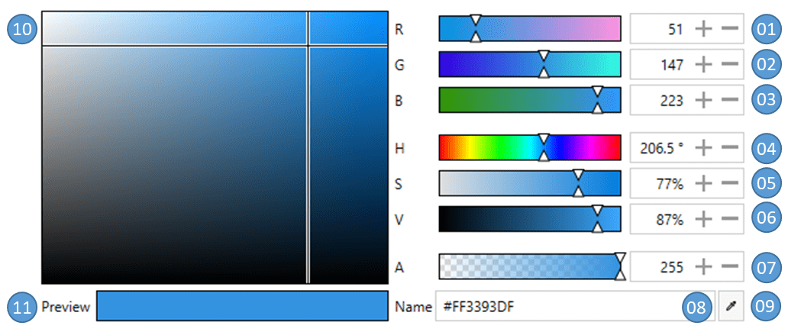
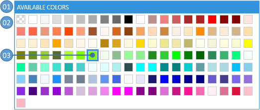
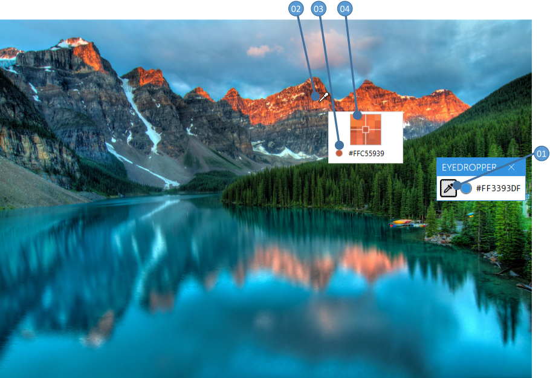
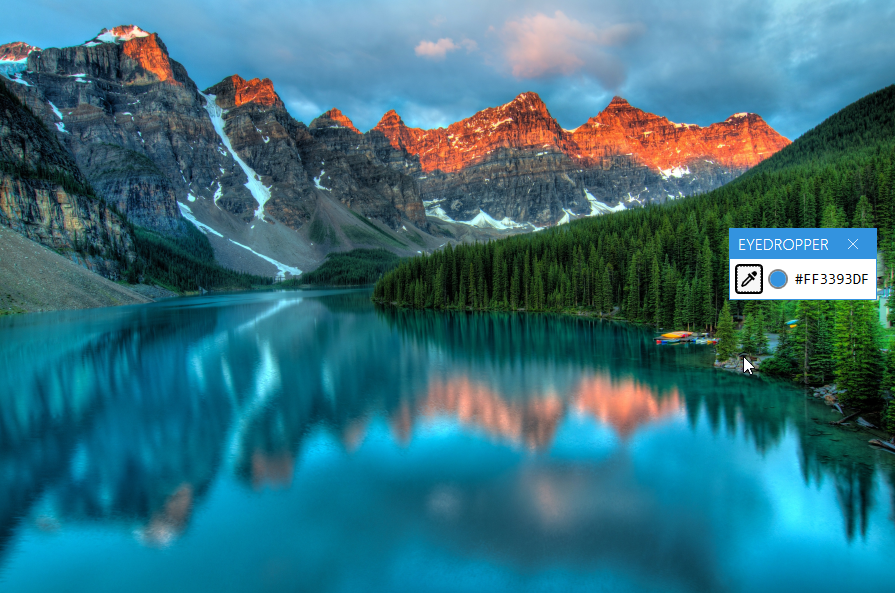
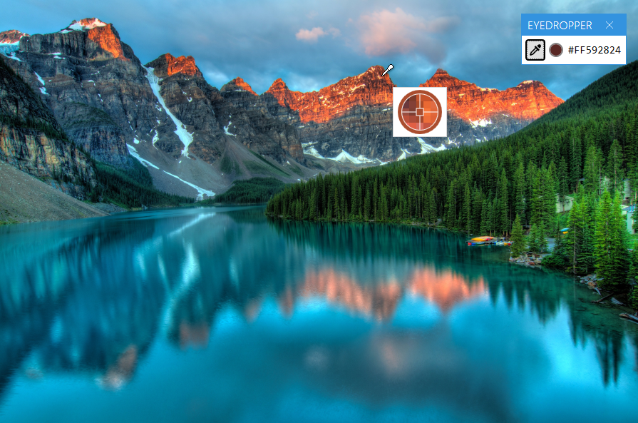
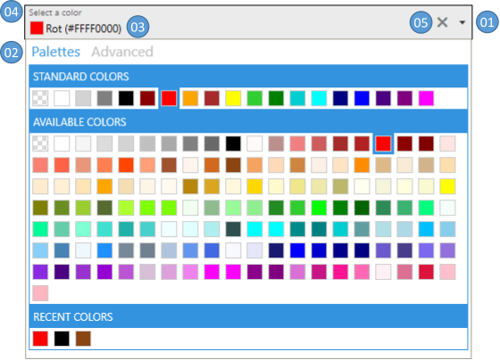
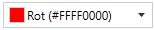
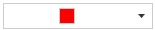
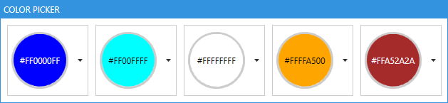
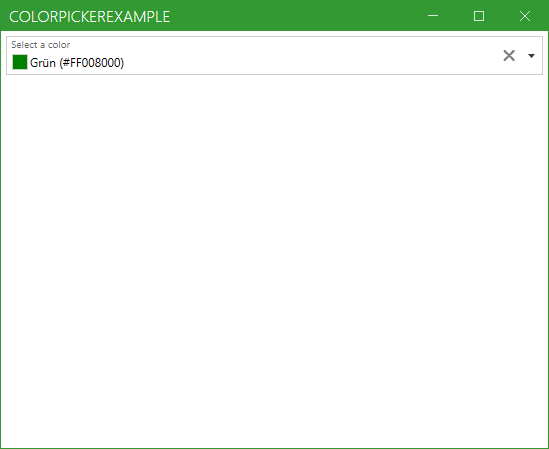

Title: ColorPicker
Description: Four controls for picking a colour, and the names the library gives one
---

Four controls pick a `System.Windows.Media.Color`.

| Control | What it is |
| --- | --- |
| [`ColorCanvas`](#colorcanvas) | a colour set channel by channel, as [ARGB](https://en.wikipedia.org/wiki/RGB_color_model) or [AHSV](https://en.wikipedia.org/wiki/HSL_and_HSV) |
| [`ColorPalette`](#colorpalette) | a swatch of colours to choose from, a `ListBox` underneath |
| [`ColorEyeDropper`](#coloreyedropper) | a colour taken from any pixel on the screen, your application or not |
| [`ColorPicker`](#colorpicker) | the other three in a drop-down, a combo box to look at |

`ColorCanvas` and `ColorPicker` both derive from `ColorPickerBase`, so everything in the next section belongs to both.

## The colour itself

| Property | Type | Default | |
| --- | --- | --- | --- |
| `SelectedColor` | `Color?` | `null` | the colour, two-way by default |
| `DefaultColor` | `Color?` | `null` | what `SelectedColor` falls back to instead of staying `null` |
| `SelectedHSVColor` | `HSVColor` | black | the same colour in hue, saturation and value; read-only |
| `ColorName` | `string` | `null` | the name of the colour, two-way by default |
| `ColorNamesDictionary` | `Dictionary<Color, string>` | `null` | the names to look it up in, see [the names](#colour-names-and-the-colorhelper) |
| `ColorHelper` | `ColorHelper` | `null` | who does the looking up, see [the names](#colour-names-and-the-colorhelper) |
| `A` `R` `G` `B` | `byte` | `255` `0` `0` `0` | the four ARGB channels, each two-way by default |
| `Hue` | `double` | `0` | 0° to 360° |
| `Saturation` `Value` | `double` | `0` | 0% to 100% |

The channel properties are not a second copy of the colour. Setting one writes `SelectedColor`, and setting `SelectedColor` writes all of them, which is what lets a slider bind to `R` and a text box to `ColorName` on the same control.

Every label beside a field can be given words of your own. All nine are typed `object` rather than `string`, so a label can be an icon or a whole template instead of text.

| Property | Default | | Property | Default |
| --- | --- | --- | --- | --- |
| `LabelAlphaChannel` | `"A"` | | `LabelHueChannel` | `"H"` |
| `LabelRedChannel` | `"R"` | | `LabelSaturationChannel` | `"S"` |
| `LabelGreenChannel` | `"G"` | | `LabelValueChannel` | `"V"` |
| `LabelBlueChannel` | `"B"` | | `LabelColorPreview` | `"Preview"` |
| | | | `LabelColorName` | `"Name"` |

Five switches decide how much of the control is drawn. All of them start out `true`.

| Property | |
| --- | --- |
| `AreRgbChannelsVisible` | the A, R, G and B sliders |
| `AreHsvChannelsVisible` | the hue, saturation and value sliders |
| `IsAlphaChannelVisible` | the alpha slider, and whether the name is looked up with the alpha channel |
| `IsColorNameVisible` | the field the name is typed into |
| `IsEyeDropperVisible` | the dropper button |

`SelectedColorChanged` is raised when the colour changes. It is a `RoutedPropertyChangedEventHandler<Color?>`, so the handler is handed the old colour along with the new one.

## ColorCanvas

`ColorCanvas` is `ColorPickerBase` with a template and nothing else: no property of its own, only the parts below.



| No. | |
| --- | --- |
| 01 to 03 | the red, green and blue channel, 0 to 255 |
| 04 | the hue, 0° to 360° |
| 05, 06 | the saturation and the value, 0% to 100% |
| 07 | the alpha channel, 0 to 255 |
| 08 | the colour name, or its HTML notation |
| 09 | a [`ColorEyeDropper`](#coloreyedropper) for a colour from anywhere on the screen |
| 10 | the saturation and the value dragged in one square |
| 11 | the colour as it stands |

```xml
<mah:ColorCanvas SelectedColor="Blue"
                 DefaultColor="Transparent"
                 LabelAlphaChannel="Alpha"
                 LabelBlueChannel="Blue"
                 LabelGreenChannel="Green"
                 LabelRedChannel="Red" />
```

These resources shape what the template draws.

| Key | Type | |
| --- | --- | --- |
| `MahApps.Brushes.Tile` | `Brush` | the chequerboard behind a colour that is not opaque |
| `MahApps.DataTemplates.ColorPicker.NoColor` | `DataTemplate` | the preview while nothing is picked |
| `MahApps.Styles.Slider.ColorComponent.ARGB` | `Style` | the A, R, G and B sliders |
| `MahApps.Styles.Slider.ColorComponent.Hue` | `Style` | the hue slider |
| `MahApps.Styles.Slider.ColorComponent.SV` | `Style` | the saturation and value sliders |
| `MahApps.Styles.ColorEyeDropper.ColorCanvas` | `Style` | the dropper in the corner |

## ColorPalette

`ColorPalette` derives from `ListBox`, so the colours go into `Items` or `ItemsSource` and the pick is read from `SelectedValue`, `SelectedItem` or `SelectedIndex` as on any list.



| No | |
| --- | --- |
| 01 | the header |
| 02 | the colours |
| 03 | the selected colour, marked |

It adds five properties of its own.

| Property | Type | Default | |
| --- | --- | --- | --- |
| `Header` | `object` | `null` | the caption above the swatches |
| `HeaderTemplate` | `DataTemplate` | `null` | how the caption is drawn |
| `ColorNamesDictionary` | `Dictionary<Color, string>` | `null` | the names the tooltips are taken from |
| `ColorHelper` | `ColorHelper` | `null` | who does the looking up |
| `IsAlphaChannelVisible` | `bool` | `true` | whether a name is looked up with the alpha channel |

```xml
<mah:ColorPalette Header="An example palette" ItemsSource="{x:Static mah:BuildInColorPalettes.WpfColorsPalette}" />
```

Colours can also be written straight into the markup.

```xml
<mah:ColorPalette Header="A second example palette">
    <Color>Red</Color>
    <Color>Green</Color>
    <Color>Blue</Color>
</mah:ColorPalette>
```

| Key | Type | |
| --- | --- | --- |
| `MahApps.Sizes.ColorListBox.ItemWidth` | `double` | the width of one swatch |
| `MahApps.Sizes.ColorListBox.ItemHeight` | `double` | the height of one swatch |
| `MahApps.Brushes.Tile.Small` | `Brush` | the chequerboard behind a swatch that is not opaque |
| `MahApps.Styles.ListBoxItem.ColorPaletteItem` | `Style` | one swatch |
| `MahApps.Templates.ColorPaletteItem` | `DataTemplate` | what a swatch is made of |
| `MahApps.Styles.ColorPalette` | `Style` | the palette itself |

### The palettes the library brings

`BuildInColorPalettes` carries three of them. `StandardColorsPalette` is the primary colours, a plain `Color[]`. `WpfColorsPalette` is everything in `System.Windows.Media.Colors`, sorted by hue, then saturation, then value downwards. `RecentColors` is where a picker keeps what was chosen lately.

The last two are an `ObservableCollection`, so adding to one or taking from it shows up in every palette bound to it.

## ColorEyeDropper

`ColorEyeDropper` derives from `Button` and reads a pixel off the screen, including one outside your own window.

Pressing it turns the cursor into a dropper and brings up a preview. The button stays down while the pointer moves, a magnifier with a cross hair shows which pixel is under it, and `SelectedColor` is written when the button is let go.





| Property | Type | Default | |
| --- | --- | --- | --- |
| `SelectedColor` | `Color?` | `null` | the colour that was taken, two-way by default |
| `PreviewImageOuterPixelCount` | `int` | `2` | how many pixels around the pointer the magnifier shows |
| `EyeDropperCursor` | `Cursor` | `null` | the cursor while a colour is being taken |
| `PreviewContentTemplate` | `DataTemplate` | `null` | what the preview is made of |

It raises `SelectedColorChanged` in the same shape the other controls do.

```xml
<mah:ColorEyeDropper Content="This is my EyeDropper" SelectedColor="{Binding MyColorToBind}" />
```

`PreviewContentTemplate` is written against `MahApps.Metro.Controls.ColorEyePreviewData`, which carries the magnified `PreviewImage` and a `PreviewBrush` of the pixel under the cross hair. The template below makes the magnifier round and paints the ring in the colour it is about to take.



```xml
<!-- xmlns:po="http://schemas.microsoft.com/winfx/2006/xaml/presentation/options" -->
<mah:ColorEyeDropper Content="{iconPacks:Material Kind=Eyedropper}"
                     SelectedColor="{DynamicResource MahApps.Colors.AccentBase}">
    <mah:ColorEyeDropper.PreviewContentTemplate>
        <DataTemplate DataType="{x:Type mah:ColorEyePreviewData}">
            <Border Width="62"
                    Height="62"
                    Padding="0"
                    BorderBrush="{Binding PreviewBrush}"
                    BorderThickness="5"
                    CornerRadius="{Binding RelativeSource={RelativeSource Mode=Self}, Path=ActualHeight, Converter={mah:SizeToCornerRadiusConverter}}">
                <Grid HorizontalAlignment="Center" VerticalAlignment="Center">
                    <Grid.Clip>
                        <EllipseGeometry Center="25,25"
                                         RadiusX="25"
                                         RadiusY="25" />
                    </Grid.Clip>
                    <Image x:Name="PART_PreviewImage"
                           Width="50"
                           Height="50"
                           RenderOptions.BitmapScalingMode="NearestNeighbor"
                           Source="{Binding PreviewImage}" />
                    <Path Stroke="{Binding PreviewBrush, Converter={x:Static mah:BackgroundToForegroundConverter.Instance}}" StrokeThickness="1">
                        <Path.Data>
                            <PathGeometry po:Freeze="true" Figures=" m 0 25 20 0  m 5 5 0 20  m 5 -25 20 0  m -25 -25 0 20 m -5 0 H20 H30 V30 H20 z" />
                        </Path.Data>
                    </Path>
                </Grid>
            </Border>
        </DataTemplate>
    </mah:ColorEyeDropper.PreviewContentTemplate>
</mah:ColorEyeDropper>
```

## ColorPicker

`ColorPicker` is a field with a drop-down that holds up to five [palettes](#colorpalette) on one tab and a [canvas](#colorcanvas) on the other.



| No | |
| --- | --- |
| 01 | the chevron that opens and closes the drop-down |
| 02 | the palettes tab and the advanced tab |
| 03 | the colour as it stands |
| 04 | a floating watermark, if one was asked for |
| 05 | a clear button, which puts `SelectedColor` back to `DefaultColor` or to `null` |

Everything under [the colour itself](#the-colour-itself) applies, and these come on top.

| Property | Type | Default | |
| --- | --- | --- | --- |
| `SelectedColorTemplate` | `DataTemplate` | `null` | what the field shows, see [the content of the field](#the-content-of-the-field) |
| `DropDownHeight` `DropDownWidth` | `double` | `300` | the size of what comes down |
| `IsDropDownOpen` | `bool` | `false` | whether it is down, two-way by default |
| `CloseOnSelectedColorChanged` | `bool` | `false` | whether picking from a palette closes it again |
| `IsColorPalettesTabVisible` | `bool` | `true` | the palettes tab |
| `IsAdvancedTabVisible` | `bool` | `true` | the canvas tab |
| `ColorPalettesTabHeader` | `object` | `"Palettes"` | the caption of the palettes tab |
| `AdvancedTabHeader` | `object` | `"Advanced"` | the caption of the canvas tab |
| `ColorPalettesTabHeaderTemplate` `AdvancedTabHeaderTemplate` | `DataTemplate` | `null` | how those captions are drawn |
| `TabControlStyle` | `Style` | `null` | the `TabControl` inside the drop-down |
| `TabItemStyle` | `Style` | `null` | its two tabs |

`DropDownOpened` and `DropDownClosed` say when the drop-down moved, `SelectedColorChanged` when the colour did.

### The five palettes

Each of the five carries the same five properties with its own name in front: `StandardColorPalette`, `AvailableColorPalette`, `RecentColorPalette`, `CustomColorPalette01` and `CustomColorPalette02`.

| Property | Type | |
| --- | --- | --- |
| `<name>Header` | `object` | the caption above the swatches |
| `<name>HeaderTemplate` | `DataTemplate` | how the caption is drawn |
| `<name>ItemsSource` | `IEnumerable` | the colours |
| `<name>Style` | `Style` | the palette |
| `Is<name>Visible` | `bool` | whether it is drawn at all |

The headers start out as the name of the palette: `"Standard"`, `"Available"`, `"Recent"`, `"Custom 01"` and `"Custom 02"`. Standard, available and recent are visible to begin with, the two custom ones are not.

### The recent colours

The recent palette is the one the picker writes to itself. Two properties decide when, and how far back.

| Property | Type | Default | |
| --- | --- | --- | --- |
| `AddToRecentColorsTrigger` | `AddToRecentColorsTrigger` | `ColorPickerClosed` | `Never`, `ColorPickerClosed` or `SelectedColorChanged` |
| `BuildInColorPalettes.MaximumRecentColorsCount` | `int` | | an attached property; the oldest entries go once the palette is longer than this |

```xml
<mah:ColorPicker SelectedColor="{Binding MyColor}"
                 AddToRecentColorsTrigger="SelectedColorChanged"
                 mah:BuildInColorPalettes.MaximumRecentColorsCount="10"
                 mah:TextBoxHelper.ClearTextButton="True"
                 mah:TextBoxHelper.UseFloatingWatermark="True"
                 mah:TextBoxHelper.Watermark="Select a color" />
```

`RecentColors` on `BuildInColorPalettes` is one collection for the whole application, so two pickers left alone share a history.

| Key | Type | |
| --- | --- | --- |
| `MahApps.Templates.ColorPickerContent.ColorAndName` | `DataTemplate` | the default `SelectedColorTemplate` |
| `MahApps.Brushes.Tile` | `Brush` | the chequerboard behind a colour that is not opaque |
| `MahApps.Styles.TabControl.ColorPicker` | `Style` | the `TabControl` in the drop-down |
| `MahApps.Styles.ToggleButton.ColorPickerDropDown` | `Style` | the chevron |
| `MahApps.Styles.ColorPalette.ColorPickerDropDown` | `Style` | a [palette](#colorpalette) in the drop-down |

### The content of the field

`SelectedColorTemplate` decides what stands where the pick is shown, **03** in the figure above. Two templates come with the library, both in [ColorPicker.xaml](https://github.com/MahApps/MahApps.Metro/blob/develop/src/MahApps.Metro/Themes/ColorPicker/ColorPicker.xaml).

`MahApps.Templates.ColorPickerContent.ColorAndName` is the default, a swatch with the name of the colour beside it.



`MahApps.Templates.ColorPickerContent.ColorOnly` drops the name.

```xml
<mah:ColorPicker Width="150"
                 SelectedColor="Red"
                 SelectedColorTemplate="{DynamicResource MahApps.Templates.ColorPickerContent.ColorOnly}" />
```



A template of your own is bound against the `Color?` itself. The one below fills a round swatch with it and writes the colour over the top in whichever of black and white can be read on it, which is what `BackgroundToForegroundConverter` is for. The `DataTrigger` on `{x:Null}` is what hides the whole thing while nothing is picked.

```xml
<UserControl.Resources>
    <DataTemplate x:Key="My.Datatemplates.CustomColorPickerContent">
        <Grid x:Name="RootGrid">
            <Grid.ColumnDefinitions>
                <ColumnDefinition Width="Auto" />
                <ColumnDefinition Width="*" />
            </Grid.ColumnDefinitions>

            <Border x:Name="SwatchBorder"
                    Grid.Column="0"
                    Width="80"
                    Height="80"
                    Background="{DynamicResource MahApps.Brushes.Tile.Small}"
                    BorderBrush="{DynamicResource MahApps.Brushes.Control.Border}"
                    BorderThickness="3"
                    CornerRadius="{Binding RelativeSource={RelativeSource Mode=Self}, Path=ActualHeight, Converter={mah:SizeToCornerRadiusConverter}}">
                <Grid x:Name="SwatchGrid" Background="{Binding Converter={x:Static mah:ColorToSolidColorBrushConverter.DefaultInstance}}">
                    <Grid.Clip>
                        <MultiBinding Converter="{x:Static mah:ClipGeometryConverter.Instance}">
                            <Binding ElementName="SwatchGrid" Path="ActualWidth" />
                            <Binding ElementName="SwatchGrid" Path="ActualHeight" />
                            <Binding ElementName="SwatchBorder" Path="CornerRadius" />
                            <Binding ElementName="SwatchBorder" Path="BorderThickness" />
                            <Binding ElementName="SwatchBorder" Path="Padding" />
                        </MultiBinding>
                    </Grid.Clip>
                    <TextBlock HorizontalAlignment="Center"
                               VerticalAlignment="Center"
                               Foreground="{Binding RelativeSource={RelativeSource Mode=FindAncestor, AncestorType=Grid}, Path=Background, Converter={x:Static mah:BackgroundToForegroundConverter.Instance}}"
                               Text="{Binding}" />
                </Grid>
            </Border>
        </Grid>
        <DataTemplate.Triggers>
            <DataTrigger Binding="{Binding}" Value="{x:Null}">
                <Setter TargetName="RootGrid" Property="Visibility" Value="Collapsed" />
            </DataTrigger>
        </DataTemplate.Triggers>
    </DataTemplate>
</UserControl.Resources>

<mah:ColorPicker Height="100"
                 HorizontalAlignment="Left"
                 SelectedColor="Blue"
                 SelectedColorTemplate="{StaticResource My.Datatemplates.CustomColorPickerContent}" />
```



### A theme from the colour that was picked

`SelectedColorChanged` carries the new colour, which is enough to build a `Theme` around it and hand that to ControlzEx.

```xml
<mah:ColorPicker SelectedColorChanged="ColorPicker_SelectedColorChanged"
                 AddToRecentColorsTrigger="SelectedColorChanged"
                 mah:TextBoxHelper.ClearTextButton="True"
                 mah:TextBoxHelper.UseFloatingWatermark="True"
                 mah:TextBoxHelper.Watermark="Select a color" />
```

```csharp
using ControlzEx.Theming;
using System.Windows;
using System.Windows.Media;

private void ColorPicker_SelectedColorChanged(object sender, RoutedPropertyChangedEventArgs<Color?> e)
{
    if (e.NewValue.HasValue)
    {
        Theme newTheme = new Theme(name: "CustomTheme",
                                   displayName: "CustomTheme",
                                   baseColorScheme: "Light",
                                   colorScheme: "CustomAccent",
                                   primaryAccentColor: e.NewValue.Value,
                                   showcaseBrush: new SolidColorBrush(e.NewValue.Value),
                                   isRuntimeGenerated: true,
                                   isHighContrast: false);

        ThemeManager.Current.ChangeTheme(Application.Current, newTheme);
    }
}
```



## Colour names and the ColorHelper

A colour has a name, and the name can be translated. `ColorHelper` turns one into the other, in both directions, against a `Dictionary<Color, string>`.

:::{.alert .alert-warning}
**`ColorHelper` is an instance class on `develop` and was a static one in 2.4.11.** Calls go through `ColorHelper.DefaultInstance` rather than through the type, `ColorNamesDictionary` is read-only, the dictionary key is `Color` rather than `Color?`, and `GetColorName` takes a third argument saying whether the alpha channel counts.
:::

```csharp
// the name of a colour, from the default dictionary, alpha ignored
string? name = ColorHelper.DefaultInstance.GetColorName(myColor, null, false);

// the short way, which does the same
string? name = ColorHelper.DefaultInstance.GetColorName(myColor);
```

Going the other way looks the name up first and falls back to [`ColorConverter.ConvertFromString`](https://docs.microsoft.com/dotnet/api/system.windows.media.colorconverter.convertfromstring), which is what makes the HTML notation work. A name that is neither gives `null`.

```csharp
// the German word for blue
Color? blue = ColorHelper.DefaultInstance.ColorFromString("Blau", null);

// the HTML notation
Color? black = ColorHelper.DefaultInstance.ColorFromString("#FF000000", null);
```

A `null` dictionary means the one the helper was built with. `DefaultInstance` follows the current culture, `DefaultInstanceInvariant` stays on the invariant one, which is the English names whatever the machine is set to.

The library ships English and German. Translations are welcome, and [ResXManager](https://marketplace.visualstudio.com/items?itemName=TomEnglert.ResXManager) is the comfortable way to write them.

### Names of your own

`ColorHelper.DefaultInstance.ColorNamesDictionary` can be added to, taken from and changed. A dictionary built somewhere else and bound to `ColorNamesDictionary` leaves the default one alone, which is how two pickers in one window end up with different names.

```csharp
public Dictionary<Color, string> MyColorNames { get; } = new()
{
    { Colors.Green, "everything is fine" },
    { Colors.Yellow, "warning" },
    { Colors.Red, "error" }
};
```

```xml
<mah:ColorPicker ColorNamesDictionary="{Binding MyColorNames}" />
```

### A ColorHelper of your own

`ColorFromString` and `GetColorName` are `virtual`, so the whole lookup can be replaced. A `ColorHelper` can also be built on a culture and a resource dictionary type of your own, when the names are to come from your resources rather than from the library's.

```csharp
using MahApps.Metro.Controls;

public class MyColorHelper : ColorHelper
{
    public static new readonly MyColorHelper DefaultInstance = new();

    public override Color? ColorFromString(string? colorName, Dictionary<Color, string>? colorNamesDictionary)
    {
        // your logic goes here
    }

    public override string? GetColorName(Color? color, Dictionary<Color, string>? colorNamesDictionary, bool useAlphaChannel)
    {
        // your logic goes here
    }
}
```

`ColorPicker`, `ColorCanvas` and `ColorPalette` all take one through their `ColorHelper` property.

```xml
<!-- xmlns:my="clr-namespace:MyNamespace;assembly=YourAssembly" -->
<mah:ColorPicker ColorHelper="{Binding Source={x:Static my:MyColorHelper.DefaultInstance}}" />
```

## The Windows looks

:::{.alert .alert-info}
New on `develop`.
:::

`MahApps.Styles.ColorPicker.Win10` and `MahApps.Styles.ColorPicker.WinUI` put the control in the look of the [Windows 10](../stylevariants/win10) and the [WinUI](../stylevariants/winui) set. Either one is the combo box of that set with a swatch and the name of a colour where the one pick would stand: the same fill, the same frame, the same padding and the same chevron, so a picker and a combo box standing next to each other in a form are the same height and the same colour. The WinUI one rounds its corners and says the focus with the stronger line along its bottom edge.

What comes down behind the field follows the set as well. The groups of swatches are headed by plain text rather than by a filled bar, because neither Windows 10 nor WinUI heads a group with one, and the boxes on the canvas are the text box and the up-down of the set. WinUI rounds the swatches, the square hue and value are picked in, the preview and the bars by the same number it rounds a control by.

```xml
<mah:ColorPicker Width="280"
                 SelectedColor="{Binding MyColor}"
                 Style="{DynamicResource MahApps.Styles.ColorPicker.WinUI}" />
```

Merging one of the two sets gives every picker that look without naming the style. `MahApps.Styles.ColorCanvas.Win10`, `…ColorCanvas.WinUI`, `MahApps.Styles.ColorPalette.Win10`, `…ColorPalette.WinUI`, `MahApps.Styles.ColorEyeDropper.Win10` and `…ColorEyeDropper.WinUI` are the canvas, the palette and the eye dropper on their own, for a window that shows any of them without the drop-down. The dropper of either set is the button of that set, and on a canvas it keeps the corners of the box it stands against.

## Related

The sliders inside the canvas are described under [Slider](../styles/slider), which carries the colour component styles the channels are drawn with. [TextBoxHelper](../helper/textboxhelper) is where the watermark and the clear button on the field come from.
