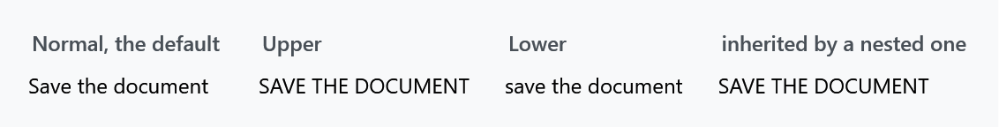
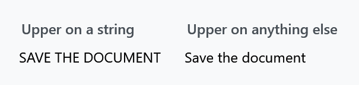
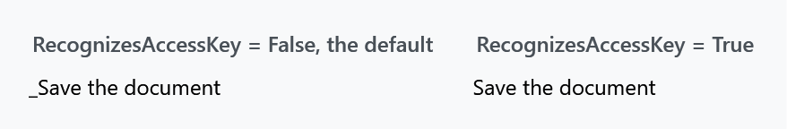

Title: ContentControlEx
Description: ContentControl with some special properties
---

`ContentControlEx` is a `ContentControl` with two extra properties and one piece of behaviour that has no property at all. You rarely place one yourself — it is the presenter inside most MahApps templates, which is where its properties come from.

| Property | Type | Default | |
| --- | --- | --- | --- |
| `ContentCharacterCasing` | `CharacterCasing` | `Normal` | upper-cases or lower-cases string content |
| `RecognizesAccessKey` | `bool` | `False` | whether an underscore marks an access key |

## Character casing



```xml
<mah:ContentControlEx Content="Save the document" ContentCharacterCasing="Upper" />
```

`CharacterCasing` is WPF's own enum with three values — `Normal`, `Upper` and `Lower`. The control does the work in three template triggers, each swapping the presenter's `Content` for the same value through a `ToUpperConverter` or a `ToLowerConverter`.

Because it is a **converter on the content**, not a text transform, it applies to the string and nothing else:



```xml
<mah:ContentControlEx ContentCharacterCasing="Upper">
    <TextBlock Text="Save the document" />
</mah:ContentControlEx>
```

The converter returns anything that is not a `string` untouched, so wrapping the text in a `TextBlock` opts out of the casing entirely — which is a useful escape hatch when a template forces `Upper` on you. The conversion is culture-aware, using the binding's culture.

### It inherits

`ContentCharacterCasing` is registered with `FrameworkPropertyMetadataOptions.Inherits`, so a nested `ContentControlEx` picks the value up from an outer one — the fourth panel in the first figure.

:::{.alert .alert-warning}
It inherits, but it is **not an attached property**. `<StackPanel mah:ContentControlEx.ContentCharacterCasing="Upper">` fails to parse; the value can only be set on a `ContentControlEx` itself.

What templates actually use is `ControlsHelper.ContentCharacterCasing`, which *is* attached and can go on any control. The MahApps templates bind it through:

```xml
<mah:ContentControlEx ContentCharacterCasing="{Binding RelativeSource={RelativeSource TemplatedParent},
                                                       Path=(mah:ControlsHelper.ContentCharacterCasing)}" />
```

That is why writing `mah:ControlsHelper.ContentCharacterCasing="Normal"` on a [GroupBox](../styles/groupbox), an [Expander](../styles/expander), a tab header or a [ToolTip](../styles/tooltip) turns their upper-casing off. See [ControlsHelper](../helper/controlshelper).
:::

## Access keys



```xml
<mah:ContentControlEx Content="_Save the document" RecognizesAccessKey="True" />
```

`RecognizesAccessKey` is passed straight to the inner `ContentPresenter`. With it off — the default — an underscore in the content is just an underscore. With it on, the underscore marks the next character as an access key: WPF underlines it while Alt is held and routes the shortcut to the control.

The default here is `False`, which is the opposite of what a `Button` template normally does, so a template that wants access keys has to say so.

## Buttons in the title bar

The behaviour with no property is in `OnContentChanged`. When the content is an `IInputElement`, `ContentControlEx` binds that content's `WindowChrome.IsHitTestVisibleInChrome` to its own, and clears the binding when the content is replaced.

That single binding is why a button placed in a [MetroWindow](metrowindow)'s title bar can be clicked at all. The title bar is window chrome as far as the system is concerned, and chrome swallows mouse input unless an element opts out; `ContentControlEx` passes that opt-out down to whatever you put inside it, so [WindowCommands](WindowCommands) and the window title work without anyone setting the attached property by hand.

## Where it turns up

Eighteen other dictionaries in the library use it as their content presenter, among them the styles for [Buttons](../styles/buttons), [TabControl](../styles/tabcontrol) and [MetroTabItem](MetroTabItem), [GroupBox](../styles/groupbox) and [Expander](../styles/expander) headers, [ToolTip](../styles/tooltip), `GridViewColumnHeader` in a [ListView](../styles/listview), [ToolBar](../styles/toolbar), [SplitButton](splitbutton) and [DropDownButton](dropdownbutton), [MetroHeader](MetroHeader) and [WindowCommands](WindowCommands).

`MahApps.Styles.MetroThumbContentControl` is `MahApps.Styles.ContentControlEx` with nothing changed — see [MetroThumbContentControl](MetroThumbContentControl).

## The style

`MahApps.Styles.ContentControlEx` is applied through `Generic.xaml`, so a `ContentControlEx` you place yourself is styled already. It is deliberately unobtrusive: a transparent background, `Focusable` and `IsTabStop` both `False`, and everything stretched. It is a presenter, not a control the user interacts with.
