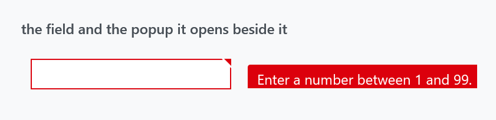

Title: CustomValidationPopup
Description: A special popup for validation visualization
---

`CustomValidationPopup` is the popup that carries a validation message next to the control that failed. You almost never place one: it is part of `MahApps.Templates.ValidationError`, so every styled input control already has one. See [Validation](../styles/validation) for the error template as a whole.



It derives from WPF's `Popup`, and the whole point of it is what a plain `Popup` will not do.

## Why a plain Popup is not enough

A `Popup` is its own top-level window. It has no idea what happens to the window it belongs to, which is exactly wrong for something anchored to a text box. `CustomValidationPopup` subscribes to everything that could move it or make it wrong, and reacts:

| It watches | What it does |
| --- | --- |
| the host window's `LocationChanged` and `SizeChanged` | repositions itself |
| the `PlacementTarget`'s `SizeChanged` | repositions itself |
| the window's `Activated` and `Deactivated` | becomes topmost with the window, and stops being topmost when the window loses focus, so it does not float over other applications |
| the window's `StateChanged` | on restore from minimised, closes and forces the error adorner to be rebuilt |
| the nearest ancestor `ScrollViewer` | repositions, and **closes when the field scrolls out of view** |
| an ancestor `MetroContentControl` or `TransitioningContentControl` | suppresses itself while a transition is running |
| an ancestor [Flyout](flyouts) | suppresses itself while the flyout is opening or closing |

All of it is unhooked again when the popup unloads.

That last group is what `CanShow` reports.

## Properties

| Property | Type | Default | |
| --- | --- | --- | --- |
| `AdornedElement` | `UIElement` | `null` | the control the popup belongs to; the template binds it |
| `CanShow` | `bool`, read-only | `False` | whether it is safe to open right now |
| `CloseOnMouseLeftButtonDown` | `bool` | **`True`** | clicking the popup dismisses it |
| `ShowValidationErrorOnMouseOver` | `bool` | `False` | open on hover, not only on focus |

`CanShow` is the interesting one. It is `False` while an ancestor is animating — a flyout sliding in, a `MetroContentControl` transitioning — and the error template's trigger requires it before opening the popup:

```xml
<MultiDataTrigger.Conditions>
    <Condition Binding="{Binding ElementName=ValidationPopup, Path=CanShow}" Value="True" />
    <Condition Binding="{Binding ElementName=placeholder, Path=AdornedElement.IsKeyboardFocusWithin}" Value="True" />
    <Condition Binding="{Binding ElementName=placeholder, Path=AdornedElement.(Validation.HasError)}" Value="True" />
</MultiDataTrigger.Conditions>
```

Without it the message would appear pinned to where the field is going to be, halfway through the animation that puts it there.

## Two properties, two places

:::{.alert .alert-warning}
`CloseOnMouseLeftButtonDown` and `ShowValidationErrorOnMouseOver` exist **twice**, once on this control and once on [ValidationHelper](../helper/validationhelper) as attached properties, and their defaults disagree:

| | on the popup | on `ValidationHelper` |
| --- | --- | --- |
| `CloseOnMouseLeftButtonDown` | `True` | `False` |
| `ShowValidationErrorOnMouseOver` | `False` | `False` |

Set them through `ValidationHelper` on your control — that is the pair you can reach from XAML without replacing the template. The popup's own properties are what the template reads, and the click handler consults **both**: a click closes the popup if either the popup's `CloseOnMouseLeftButtonDown` is `True` or the helper's is set on the adorned element. If neither is, the click is swallowed rather than falling through to whatever is behind.
:::

```xml
<TextBox Text="{Binding Age, ValidatesOnDataErrors=True}"
         mah:ValidationHelper.ShowValidationErrorOnMouseOver="True"
         mah:ValidationHelper.CloseOnMouseLeftButtonDown="True" />
```

## The style

`MahApps.Styles.CustomValidationPopup` is implicit, from `Styles/Controls.xaml`, and is five setters — `Placement="Right"`, both offsets zero, `HorizontalAlignment="Right"` and `PopupAnimation="Fade"`. That is what puts the card to the right of the field, as in the figure.

## A detail worth knowing

WPF has no method for "recompute this popup's placement". `CustomValidationPopup` gets around it the way everyone does: it sets `HorizontalOffset` to one more than it is and back again, which forces the placement to be recalculated. If you build something similar on top of `Popup`, that is the trick.

## Related

[Validation](../styles/validation) for the error template, the layered card and what opens it; [ValidationHelper](../helper/validationhelper) for the two attached properties.
