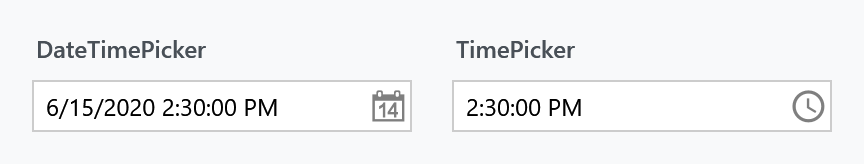
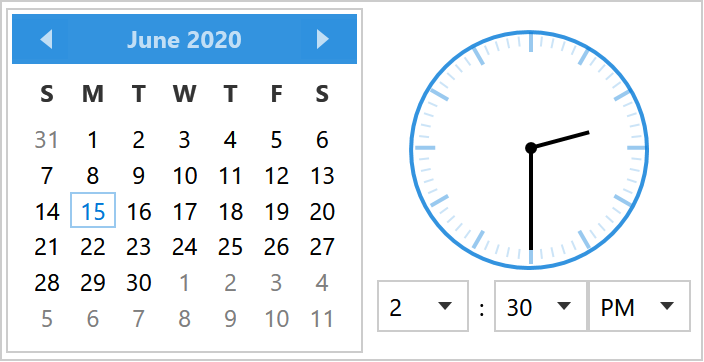
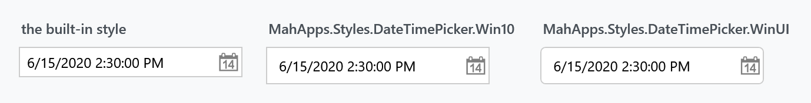
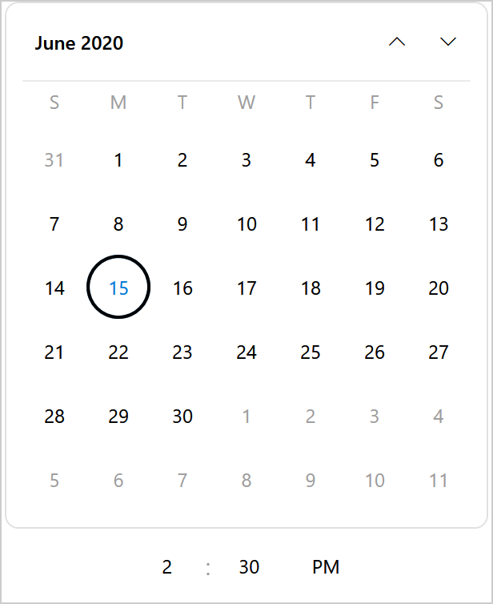
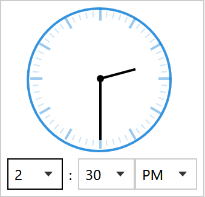
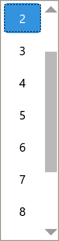

Title: DateTimePicker
Description: A date and time picker with a calendar and a clock
---

`DateTimePicker` is a text field with a drop-down that holds a calendar, an analogue clock and three lists for hour, minute and AM/PM. [TimePicker](TimePicker) is the same control without the calendar; both derive from `TimePickerBase`, so everything below applies to either unless it mentions a date.



```xml
<mah:DateTimePicker Width="190" SelectedDateTime="{Binding Appointment}" />
```



## The value

| Property | Type | |
| --- | --- | --- |
| `SelectedDateTime` | `DateTime?` | the whole value, date and time together |
| `SelectedTimeFormat` | `TimePickerFormat` | `Long` (14:30:00), the default, or `Short` (14:30) |
| `Culture` | `CultureInfo` | formatting and the twelve- or twenty-four-hour clock |
| `IsReadOnly` | `bool` | |

`SelectedDateTime` is the one to bind. There is no separate date and time property — a `DateTimePicker` is one value, which is the point of it.

`DateTimePicker` also takes over the `DatePicker` properties for the calendar half: `DisplayDate`, `DisplayDateStart`, `DisplayDateEnd`, `FirstDayOfWeek`, `IsTodayHighlighted` and `SelectedDateFormat`.

:::{.alert .alert-info}
The style sets `IsTodayHighlighted="True"`, so today's date is filled in the accent colour whether or not it is the selected day. The figures on this page set it to `False` and pin `DisplayDate`, or they would show a different month every day.
:::

## What the drop-down shows

| Property | Type | Default | |
| --- | --- | --- | --- |
| `IsClockVisible` | `bool` | `True` | the analogue clock face |
| `PickerVisibility` | `TimePartVisibility` | `HourMinute` | which of the three lists appear |
| `HandVisibility` | `TimePartVisibility` | `HourMinute` | which hands the clock draws |
| `Orientation` | `Orientation` | `Horizontal` | calendar beside the clock, or above it |

`TimePartVisibility` is a flags enum — `Hour`, `Minute`, `Second`, plus `HourMinute` and `All`. Seconds are off by default in both places:

```xml
<mah:DateTimePicker PickerVisibility="All" HandVisibility="All" />
```

`SourceHours`, `SourceMinutes` and `SourceSeconds` replace what the lists offer, which is how you get a picker that only offers quarter hours:

```xml
<mah:TimePicker SourceMinutes="{Binding QuarterHours}" />
```

Each has a matching `HoursItemStringFormat`, `MinutesItemStringFormat` and `SecondsItemStringFormat` for how the entries are written.

## Two nicer alternatives

The built-in drop-down puts the accent-banded [Calendar](../styles/calendar) next to the clock. This site ships two drop-in dictionaries that give the picker the same treatment as the [calendar variants](../styles/calendar): a rounded Fluent look and a square Windows 10 one.



| | | |
| --- | --- | --- |
| **[`Controls.DateTimePicker.Win10.xaml`](../../assets/xaml/Controls.DateTimePicker.Win10.xaml)** | `MahApps.Styles.DateTimePicker.Win10` | square, with the square Win10 calendar |
| **[`Controls.DateTimePicker.WinUI.xaml`](../../assets/xaml/Controls.DateTimePicker.WinUI.xaml)** | `MahApps.Styles.DateTimePicker.WinUI` | rounded, with the rounded WinUI calendar |

Each also brings the modern time selection described [below](#a-modern-time-selection).

Each needs the matching calendar dictionary merged first:

```xml
<ResourceDictionary Source="pack://application:,,,/MahApps.Metro;component/Styles/Controls.xaml" />
<ResourceDictionary Source="Styles/Controls.Calendar.WinUI.xaml" />
<ResourceDictionary Source="Styles/Controls.DateTimePicker.WinUI.xaml" />
```

```xml
<Style BasedOn="{StaticResource MahApps.Styles.DateTimePicker.WinUI}" TargetType="{x:Type mah:DateTimePicker}" />
<Style BasedOn="{StaticResource MahApps.Styles.TimePicker.WinUI}" TargetType="{x:Type mah:TimePicker}" />
```

The drop-down then carries the whole calendar variant with it:




Both are **styles, not replacement templates**. Everything they change is something the built-in template already exposes — `ControlsHelper.CornerRadius` for the field, `CalendarStyle` for the drop-down, `MinHeight` and `Padding` — so they keep working when the library's template changes underneath them. That is also their limit.

:::{.alert .alert-warning}
**The drop-down frame stays square, and neither variant can help it.** `PART_PopupBorder` in the picker template is written as

```xml
<Border x:Name="PART_PopupBorder"
        Background="{DynamicResource MahApps.Brushes.Control.Background}"
        BorderBrush="{DynamicResource MahApps.Brushes.Control.Border}"
        BorderThickness="1">
```

with no `CornerRadius` and no `TemplateBinding` on any of the three. So the popup's corners, its background and its border colour cannot be reached from the control at all — only by replacing the four-hundred-line template or by redefining `MahApps.Brushes.Control.Background` and `.Border` for the whole application.

It is the same on `develop`, and it is tracked as [#4582](https://github.com/MahApps/MahApps.Metro/issues/4582). Rounding the field but not its drop-down is visible in the WinUI figure above, and it is the one thing that keeps the variant from being finished.

The `ComboBox` popup behind the hour and minute lists had the same shape and is **already fixed on `develop`**: its `PopupBorder` is now a `ClipBorder` with a `CornerRadius`. In a released version those little lists are still square.
:::

## A modern time selection

The analogue clock is the oldest-looking part of the drop-down, and Fluent has no clock face at all — in WinUI the time is three plain columns. `IsClockVisible` is a normal property, so a style can simply switch the clock off:




Both figures are a `TimePicker` drop-down, which is the time selection with no calendar above it. The second is what `MahApps.Styles.TimePicker.WinUI` gives you: no clock, no field chrome, no chevrons, just centred numbers. Open a column and the selected value is an accent-filled pill:



The Win10 variant is the same row — the two only part company inside the open list, where one pill is rounded and the other square.

### Reaching the lists without styling every ComboBox

The hour, minute, second and AM/PM lists are ordinary `ComboBox`es with **no `Style` of their own**, so the only way to reach them is an implicit `ComboBox` style. Putting one in the application's resources would restyle every other `ComboBox` in the application, which is far too blunt.

The way out is `Style.Resources`. Resource lookup from inside a template walks up to the templated parent's style, so an implicit style declared there is found by the drop-down and by nothing else:

```xml
<Style x:Key="MahApps.Styles.DateTimePicker.WinUI"
       BasedOn="{StaticResource {x:Type mah:DateTimePicker}}"
       TargetType="{x:Type mah:DateTimePicker}">
    <Style.Resources>
        <!--  Reaches PART_HourPicker and friends, and no other ComboBox.  -->
        <Style BasedOn="{StaticResource MahApps.Styles.ComboBox.DateTimePicker.WinUI}" TargetType="{x:Type ComboBox}" />
        <Style BasedOn="{StaticResource MahApps.Styles.Label.DateTimePicker.WinUI}" TargetType="{x:Type Label}" />
    </Style.Resources>
    <Setter Property="IsClockVisible" Value="False" />
    <!--  ...  -->
</Style>
```

The `Label` entry is the `:` between the columns, which has no style of its own either.

That is the whole mechanism, and it is worth knowing for any control whose template contains unstyled children.

:::{.alert .alert-info}
The selected row is a rounded pill only because the dictionary carries a small `ComboBoxItem` template: in a released version the stock item's `Border` has no `CornerRadius` binding, so a setter alone cannot round it. That was fixed on `develop` by [#4288](https://github.com/MahApps/MahApps.Metro/issues/4288) — `ComboBoxItem` now binds `ControlsHelper.CornerRadius` — so once that ships, the little template can go and one setter will do.

A true WinUI **looping selector** stays out of reach either way: the columns scrolling under a fixed highlight band, with an accept/dismiss row beneath, need code to keep the selection centred. A resource dictionary cannot do it.
:::

Prefer to keep the clock? It is one setter:

```xml
<Style BasedOn="{StaticResource MahApps.Styles.DateTimePicker.WinUI}" TargetType="{x:Type mah:DateTimePicker}">
    <Setter Property="IsClockVisible" Value="True" />
</Style>
```

## Watermarks and the clear button

Both pickers set a watermark: *Select a date* and *Select a time*. They are ordinary [TextBoxHelper](../helper/textboxhelper) values, so they are replaced the usual way, and the clear button and floating watermark work as on any text box:

```xml
<mah:DateTimePicker mah:TextBoxHelper.Watermark="When?"
                    mah:TextBoxHelper.UseFloatingWatermark="True"
                    mah:TextBoxHelper.ClearTextButton="True" />
```

`DatePickerHelper.DropDownButtonContent` is the glyph on the button — the `TimePicker` style points it at a clock path, the `DateTimePicker` keeps the calendar one.

## Validation

Both carry `MahApps.Templates.ValidationError`, so a failed binding gets the red border and the popup described on the [Validation](../styles/validation) page.

## Related

[TimePicker](TimePicker) for the time alone, [DatePicker](../styles/datepicker) for the date alone, and [Calendar](../styles/calendar) for the calendar the drop-down shows — including the two variants these styles reuse.
