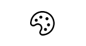

Title: FontIcon
Description: A control to render an icon from the Segoe MDL2 Assets font
---

The `FontIcon` class represents an icon that uses a glyph from the specified font.

## Examples

```xml
<Grid xmlns:mah="http://metro.mahapps.com/winfx/xaml/controls">
    <mah:FontIcon FontFamily="Segoe MDL2 Assets" Glyph="&#xE790;" />
</Grid>
```



```c#
var newButton = new Button();
var fontIcon = new FontIcon();
fontIcon.FontFamily = new FontFamily("Segoe MDL2 Assets");
fontIcon.Glyph = "\xE790";
newButton.Content = fontIcon;
```


## Remarks

Use `FontIcon` to specify an icon using a Glyph value from a FontFamily. You must have the font available for the glyphs to show. Glyph values are assigned by font developers to private Unicode values that don’t map to existing code points. Windows 10 uses the Segoe MDL2 Assets FontFamily, and the glyphs are included in the Symbol enumeration.
