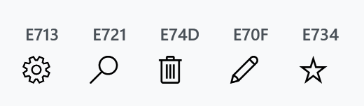
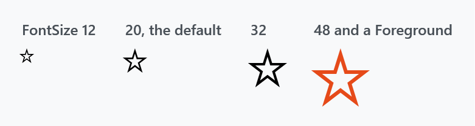
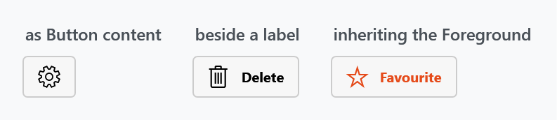

Title: FontIcon
Description: An icon drawn as a glyph from a symbol font
---

`FontIcon` draws one character from a symbol font. That is the whole control: a `Glyph` property and a template that puts it in a `TextBlock`.



```xml
<mah:FontIcon Glyph="&#xE713;" />
```

```csharp
var icon = new FontIcon { Glyph = "\uE713" };
```

`Glyph` is a `string`, not a character, so it can hold a surrogate pair or several characters if a font needs them.

## You do not need to set the FontFamily

The style already points at the symbol font, so the old advice to write `FontFamily="Segoe MDL2 Assets"` on every icon is unnecessary — and it costs you the embedded fallback, as the note below explains.

```xml
<Setter Property="FontFamily" Value="{DynamicResource MahApps.Fonts.Family.SymbolTheme}" />
<Setter Property="FontSize" Value="20" />
```

To use a different icon font, override `FontFamily` on the control or redefine `MahApps.Fonts.Family.SymbolTheme` for the whole application.

:::{.alert .alert-info}
**MahApps ships the font, so you do not need it installed.** `MahApps.Fonts.Family.SymbolTheme` is a **fallback chain**: the installed font first, then a copy embedded in the library.

```xml
<FontFamily x:Key="MahApps.Fonts.Family.SymbolTheme">Segoe MDL2 Assets,/MahApps.Metro;component/Assets/#Segoe MDL2 Assets</FontFamily>
```

`Assets/segmdl2.ttf` is compiled into `MahApps.Metro.dll` as a WPF resource, so the second half resolves even on a machine where *Segoe MDL2 Assets* is not installed. Older documentation's "you must have the font available for the glyphs to show" was true of plain WPF, not of MahApps.

This is exactly why you should **not** write `FontFamily="Segoe MDL2 Assets"` on your icons. A bare family name replaces the whole chain and throws the embedded copy away, so the icons work on your Windows 11 machine and turn into empty boxes wherever the font is missing.
:::

## Size and colour



`FontIcon` derives from `Control`, so it has no size or brush properties of its own — a glyph is text, and `FontSize`, `FontWeight`, `FontStyle` and `Foreground` are what shape it. The default `FontSize` is **20**.

`Foreground` has no setter in the style, so it inherits. That is what makes an icon inside a button follow the button's colour without being told:



```xml
<Button Foreground="#FFE64A19">
    <StackPanel Orientation="Horizontal">
        <mah:FontIcon Margin="0 0 8 0" FontSize="16" Glyph="&#xE734;" />
        <TextBlock VerticalAlignment="Center" Text="Favourite" />
    </StackPanel>
</Button>
```

## It is decoration, not a control

The style makes that explicit: `Focusable="False"`, `IsTabStop="False"` and `FocusVisualStyle="{x:Null}"`. A `FontIcon` never takes focus and never appears in the tab order, which is what you want for something sitting inside a button.

Two more details in the template are worth knowing if you are styling around it:

- the inner `TextBlock` is given `Style="{x:Null}"`, so an implicit `TextBlock` style in your application cannot reach it and change the glyph's look
- `TextOptions.TextRenderingMode` is `Aliased`, which keeps small glyphs crisp instead of blurring them across pixels

The template's root `Grid` has no background, so a `FontIcon` is not hit-testable on its own. Put it in something that is — a `Button`, or a panel with a `Background` — if it needs to react to the mouse.

## Finding glyph codes

Codes are private-use code points assigned by the font's designers, so they mean nothing outside that font. For *Segoe MDL2 Assets*, Microsoft publishes the full list in the [Segoe MDL2 Assets icon list](https://learn.microsoft.com/windows/apps/design/style/segoe-ui-symbol-font); the *Character Map* utility shipped with Windows will also show them.

:::{.alert .alert-info}
There is **no `Symbol` enumeration** in MahApps.Metro. That is a UWP and WinUI API, and older documentation mentioned it here by mistake. In WPF you write the code point yourself, as `&#xE713;` in XAML or `"\uE713"` in C#.
:::

## IconElement

`FontIcon` derives from `IconElement`, an abstract class that derives from `Control` and adds nothing at all — it exists as a common base so icon types can be treated alike. `FontIcon` is currently the only one in the library, so there is no reason to type a property as `IconElement` rather than `FontIcon` today.

## Related

For vector icons rather than font glyphs, `MahApps.Styles.ContentControl.PathIcon` takes path geometry as its content and is what the library's own templates use for chevrons and similar marks.
