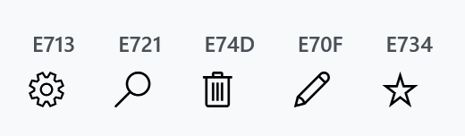
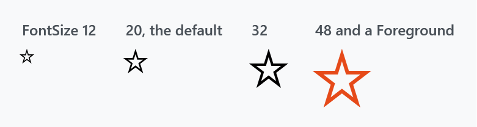
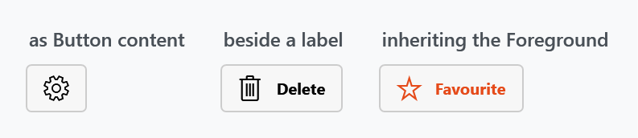

Title: FontIcon
Description: The two icon controls, one a glyph and one a path
---

`FontIcon` draws one character from a symbol font. That is the whole control: a `Glyph` property and a template that puts it in a `TextBlock`.



```xml
<mah:FontIcon Glyph="&#xE713;" />
```

```csharp
var icon = new FontIcon { Glyph = "\uE713" };
```

`Glyph` is a `string`, not a character, so it can hold a surrogate pair or several characters if a font needs them.

## You do not need to set the FontFamily

The style already points at the symbol font, so the old advice to write `FontFamily="Segoe MDL2 Assets"` on every icon is unnecessary — and it costs you the embedded fallback, as the note below explains.

```xml
<Setter Property="FontFamily" Value="{DynamicResource MahApps.Fonts.Family.SymbolTheme}" />
<Setter Property="FontSize" Value="20" />
```

To use a different icon font, override `FontFamily` on the control or redefine `MahApps.Fonts.Family.SymbolTheme` for the whole application.

:::{.alert .alert-info}
**MahApps ships the font, so you do not need it installed.** `MahApps.Fonts.Family.SymbolTheme` is a **fallback chain**: the installed font first, then a copy embedded in the library.

```xml
<FontFamily x:Key="MahApps.Fonts.Family.SymbolTheme">Segoe MDL2 Assets,/MahApps.Metro;component/Assets/#Segoe MDL2 Assets</FontFamily>
```

`Assets/segmdl2.ttf` is compiled into `MahApps.Metro.dll` as a WPF resource, so the second half resolves even on a machine where *Segoe MDL2 Assets* is not installed. Older documentation's "you must have the font available for the glyphs to show" was true of plain WPF, not of MahApps.

This is exactly why you should **not** write `FontFamily="Segoe MDL2 Assets"` on your icons. A bare family name replaces the whole chain and throws the embedded copy away, so the icons work on your Windows 11 machine and turn into empty boxes wherever the font is missing.
:::

## Size and colour



`FontIcon` derives from `Control`, so it has no size or brush properties of its own — a glyph is text, and `FontSize`, `FontWeight`, `FontStyle` and `Foreground` are what shape it. The default `FontSize` is **20**.

`Foreground` is registered to inherit and the style sets none, so an icon takes its colour from around it. What happens when the icon is handed to a control as content is under [IconElement](#iconelement) below:



```xml
<Button Foreground="#FFE64A19">
    <StackPanel Orientation="Horizontal">
        <mah:FontIcon Margin="0 0 8 0" FontSize="16" Glyph="&#xE734;" />
        <TextBlock VerticalAlignment="Center" Text="Favourite" />
    </StackPanel>
</Button>
```

## It is decoration, not a control

The style makes that explicit: `Focusable="False"`, `IsTabStop="False"` and `FocusVisualStyle="{x:Null}"`. A `FontIcon` never takes focus and never appears in the tab order, which is what you want for something sitting inside a button.

Two more details in the template are worth knowing if you are styling around it:

- the inner `TextBlock` is given `Style="{x:Null}"`, so an implicit `TextBlock` style in your application cannot reach it and change the glyph's look
- `TextOptions.TextRenderingMode` is `Aliased`, which keeps small glyphs crisp instead of blurring them across pixels

The template's root `Grid` has no background, so a `FontIcon` is not hit-testable on its own. Put it in something that is — a `Button`, or a panel with a `Background` — if it needs to react to the mouse.

## Finding glyph codes

Codes are private-use code points assigned by the font's designers, so they mean nothing outside that font. For *Segoe MDL2 Assets*, Microsoft publishes the full list in the [Segoe MDL2 Assets icon list](https://learn.microsoft.com/windows/apps/design/style/segoe-ui-symbol-font); the *Character Map* utility shipped with Windows will also show them.

:::{.alert .alert-info}
There is **no `Symbol` enumeration** in MahApps.Metro. That is a UWP and WinUI API, and older documentation mentioned it here by mistake. In WPF you write the code point yourself, as `&#xE713;` in XAML or `"\uE713"` in C#.
:::

## PathIcon

`PathIcon` is the other icon in the library. It draws vector geometry rather than a glyph, and it is what the library's own templates use for the chevron on a [DropDownButton](dropdownbutton), the clear button on a text box and marks of that kind.

```xml
<mah:PathIcon Data="M7.41,8.58L12,13.17L16.59,8.58L18,10L12,16L6,10L7.41,8.58Z" />
```

`Data` is a `Geometry` with a `GeometryConverter` on it, so the path markup syntax works straight from the attribute. The template puts the path in a `Viewbox` and stretches it uniformly, which means `Width` and `Height`, both **16** to begin with, are what size an icon and `Padding` is the room left around it. The path is filled with `Foreground` and never stroked, so a geometry drawn as an outline comes out solid.

:::{.alert .alert-info}
`PathIcon` is new on `develop`. In 2.4.11 the same thing was a `ContentControl` carrying `MahApps.Styles.ContentControl.PathIcon` with the geometry as its `Content`, and that style key is gone.
:::

## IconElement

`FontIcon` and `PathIcon` both derive from `IconElement`, which is where the colour is settled.

`Foreground` is registered on it to inherit, and an icon that was given none of its own takes the one of its **visual** parent rather than its logical one. That is the difference that matters: an icon handed to a `Button` as content is put into the button's template, so its logical parent is the button and its visual parent is whatever part of the template holds the content. Binding to the visual parent is what makes the icon follow the colour the template is painting with, including the one a checked or disabled state switches to.

`InheritsForegroundFromVisualParent` is the read-only property saying whether that is happening. It is `True` while the icon carries no `Foreground` of its own and its two parents differ, which is exactly the case of an icon handed to a control as content. Give the icon a `Foreground` and it stops, and the colour you set is the colour it keeps.

:::{.alert .alert-info}
`IconElement` was an empty base class in 2.4.11 with `FontIcon` as its only subclass. Both the colour handling and `PathIcon` are new on `develop`.
:::

## Related

[MahApps.Metro.IconPacks](https://github.com/MahApps/MahApps.Metro.IconPacks) is the separate package with the large icon sets in it, if neither a symbol font nor a path of your own is what you want. [Buttons](../styles/buttons) and [ToggleButton](../styles/togglebutton) show an icon used as the content of a control.
