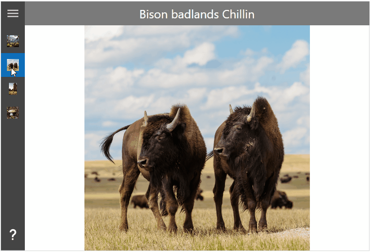

Title: HamburgerMenu
Description: The HamburgerMenu control
---

The `HamburgerMenu` control provides an easy-to-use, side-bar menu which users can show or hide by using a Hamburger button. By tapping the icon, it opens up a side menu with a selection of options or additional pages.

The 3-line Hamburger menu icon, allows developers to pack more features into their apps or navigation. The tiny icon takes up a minimal amount of screen real estate and creates a clean, minimalist look.

Developers can place menu specific content, navigation, images, text or custom controls.

# Example



## Example Code

This sample demonstrates how to add custom menu items to the `HamburgerMenu` control.

```xml
<Controls:MetroWindow ...
                      xmlns:Controls="http://metro.mahapps.com/winfx/xaml/controls"
                      xmlns:iconPacks="http://metro.mahapps.com/winfx/xaml/iconpacks">

  <Controls:MetroWindow.Resources>
    <ResourceDictionary>

      <!--  Place for the DataTemplates for the menu items (see below)  -->

    </ResourceDictionary>
  </Controls:MetroWindow.Resources>

  <Controls:HamburgerMenu x:Name="HamburgerMenuControl"
                          DisplayMode="CompactOverlay"
                          HamburgerWidth="48"
                          ItemInvoked="HamburgerMenuControl_OnItemInvoked"
                          ItemTemplate="{StaticResource HamburgerMenuItem}"
                          OptionsItemTemplate="{StaticResource HamburgerOptionsMenuItem}">
    <!--  Header  -->
    <Controls:HamburgerMenu.HamburgerMenuHeaderTemplate>
      <DataTemplate>
        <TextBlock HorizontalAlignment="Center"
                   VerticalAlignment="Center"
                   FontSize="16"
                   Foreground="White"
                   Text="Pictures" />
      </DataTemplate>
    </Controls:HamburgerMenu.HamburgerMenuHeaderTemplate>

    <!--  Items  -->
    <Controls:HamburgerMenu.ItemsSource>
      <Controls:HamburgerMenuItemCollection>
        <Controls:HamburgerMenuGlyphItem Glyph="/Assets/Photos/BigFourSummerHeat.png" Label="Big four summer heat" />
        <Controls:HamburgerMenuGlyphItem Glyph="/Assets/Photos/BisonBadlandsChillin.png" Label="Bison badlands Chillin" />
        <Controls:HamburgerMenuGlyphItem Glyph="/Assets/Photos/GiantSlabInOregon.png" Label="Giant slab in Oregon" />
        <Controls:HamburgerMenuGlyphItem Glyph="/Assets/Photos/LakeAnnMushroom.png" Label="Lake Ann Mushroom" />
      </Controls:HamburgerMenuItemCollection>
    </Controls:HamburgerMenu.ItemsSource>

    <!--  Options  -->
    <Controls:HamburgerMenu.OptionsItemsSource>
      <Controls:HamburgerMenuItemCollection>

        <Controls:HamburgerMenuIconItem Label="About">
          <Controls:HamburgerMenuIconItem.Icon>
            <iconPacks:PackIconMaterial Width="22"
                                        Height="22"
                                        HorizontalAlignment="Center"
                                        VerticalAlignment="Center"
                                        Kind="Help" />
          </Controls:HamburgerMenuIconItem.Icon>
          <Controls:HamburgerMenuIconItem.Tag>
            <TextBlock HorizontalAlignment="Center"
                       VerticalAlignment="Center"
                       FontSize="28"
                       FontWeight="Bold">
                About
            </TextBlock>
          </Controls:HamburgerMenuIconItem.Tag>
        </Controls:HamburgerMenuIconItem>

      </Controls:HamburgerMenuItemCollection>
    </Controls:HamburgerMenu.OptionsItemsSource>

    <!--  Content  -->
    <Controls:HamburgerMenu.ContentTemplate>
      <DataTemplate>
        <Grid x:Name="ContentGrid">
          <Grid.RowDefinitions>
            <RowDefinition Height="48" />
            <RowDefinition />
          </Grid.RowDefinitions>
          <Border Grid.Row="0"
                  Margin="-1 0 -1 0"
                  Background="#7A7A7A">
            <TextBlock x:Name="Header"
                       HorizontalAlignment="Center"
                       VerticalAlignment="Center"
                       FontSize="24"
                       Foreground="White"
                       Text="{Binding Label}" />
          </Border>
          <Controls:TransitioningContentControl Grid.Row="1"
                                                Content="{Binding}"
                                                RestartTransitionOnContentChange="True"
                                                Transition="Default">

            <Controls:TransitioningContentControl.Resources>
              <DataTemplate DataType="{x:Type Controls:HamburgerMenuGlyphItem}">
                  <Image Source="{Binding Glyph, Mode=OneWay, Converter={converters:NullToUnsetValueConverter}}" />
              </DataTemplate>

              <DataTemplate DataType="{x:Type Controls:HamburgerMenuIconItem}">
                  <ContentControl Content="{Binding Tag, Mode=OneWay}"
                                  Focusable="True"
                                  IsTabStop="False" />
              </DataTemplate>
            </Controls:TransitioningContentControl.Resources>

          </Controls:TransitioningContentControl>
        </Grid>
      </DataTemplate>
    </Controls:HamburgerMenu.ContentTemplate>
  </Controls:HamburgerMenu>

</Controls:MetroWindow>
```

In order to render the items like in the sample above, you need to declare DataTemplate for both item types.

```xml
<Controls:MetroWindow.Resources>
  <ResourceDictionary>

    <!--  This is the template for all menu items. In this sample we use the glyph items.  -->
    <DataTemplate x:Key="HamburgerMenuItem" DataType="{x:Type Controls:HamburgerMenuGlyphItem}">
      <DockPanel Height="48" LastChildFill="True">
        <Grid x:Name="IconPart"
              Width="{Binding RelativeSource={RelativeSource AncestorType={x:Type Controls:HamburgerMenu}}, Path=CompactPaneLength}"
              DockPanel.Dock="Left">
          <Image Margin="12"
                 HorizontalAlignment="Center"
                 VerticalAlignment="Center"
                 Source="{Binding Glyph}" />
        </Grid>
        <TextBlock x:Name="TextPart"
                   VerticalAlignment="Center"
                   FontSize="16"
                   Text="{Binding Label}" />
      </DockPanel>
      <DataTemplate.Triggers>
        <DataTrigger Binding="{Binding RelativeSource={RelativeSource AncestorType={x:Type Controls:HamburgerMenu}}, Path=PanePlacement}" Value="Right">
          <Setter TargetName="IconPart" Property="DockPanel.Dock" Value="Right" />
          <Setter TargetName="TextPart" Property="Margin" Value="8 0 0 0" />
        </DataTrigger>
      </DataTemplate.Triggers>
    </DataTemplate>

    <!--  This is the template for the option menu item  -->
    <DataTemplate x:Key="HamburgerOptionsMenuItem" DataType="{x:Type Controls:HamburgerMenuIconItem}">
      <DockPanel Height="48" LastChildFill="True">
        <ContentControl x:Name="IconPart"
                        Width="{Binding RelativeSource={RelativeSource AncestorType={x:Type Controls:HamburgerMenu}}, Path=CompactPaneLength}"
                        Content="{Binding Icon}"
                        DockPanel.Dock="Left"
                        Focusable="False"
                        IsTabStop="False" />
        <TextBlock x:Name="TextPart"
                   VerticalAlignment="Center"
                   FontSize="16"
                   Text="{Binding Label}" />
      </DockPanel>
      <DataTemplate.Triggers>
        <DataTrigger Binding="{Binding RelativeSource={RelativeSource AncestorType={x:Type Controls:HamburgerMenu}}, Path=PanePlacement}" Value="Right">
          <Setter TargetName="IconPart" Property="DockPanel.Dock" Value="Right" />
          <Setter TargetName="TextPart" Property="Margin" Value="8 0 0 0" />
        </DataTrigger>
      </DataTemplate.Triggers>
    </DataTemplate>

  </ResourceDictionary>
</Controls:MetroWindow.Resources>
```

You can navigate to the items by using the following code.

```csharp
private void HamburgerMenuControl_OnItemInvoked(object sender, HamburgerMenuItemInvokedEventArgs e)
{
  this.HamburgerMenuControl.Content = e.InvokedItem;

  if (!e.IsItemOptions && this.HamburgerMenuControl.IsPaneOpen)
  {
    // You can close the menu if an item was selected
    // this.HamburgerMenuControl.SetCurrentValue(HamburgerMenuControl.IsPaneOpenProperty, false);
  }
}
```

# Properties

| Property                    | Type                     | Description                                                                                                                                                            |
|-----------------------------|--------------------------|------------------------------------------------------------------------------------------------------------------------------------------------------------------------|
| CanResizeOpenPane           | bool                     | Gets or Sets whether the open pane can be resized by the user. The default value is false.                                                                             |
| CompactPaneLength           | double                   | Gets or sets the width of the pane when in its compact display mode.                                                                                                   |
| ContentTransition           | `TransitionType`         | Gets or sets the `TransitionType` for the TransitioningContentControl which shows the selected menu item content.                                                      |
| DisplayMode                 | `SplitViewDisplayMode`   | Gets or sets a value that specifies how the pane and content areas are shown.                                                                                          |
| HamburgerButtonHelpText     | string                   | Gets or sets the AutomationProperties.HelpTextProperty for the HamburgerMenu button.                                                                                   |
| HamburgerButtonName         | string                   | Gets or sets theAutomationProperties.NameProperty for the HamburgerMenu button.                                                                                        |
| HamburgerButtonStyle        | Style                    | Gets or sets the FrameworkElement.Style for the HamburgerMenu button.                                                                                                  |
| HamburgerButtonTemplate     | DataTemplate             | Gets or sets the ContentControl.ContentTemplate for the HamburgerMenu button.                                                                                          |
| HamburgerHeight             | double                   | Gets or sets the FrameworkElement.Height for the HamburgerMenu button.                                                                                                 |
| HamburgerMargin             | Thickness                | Gets or sets the margin for the HamburgerMenu button.                                                                                                                  |
| HamburgerMenuHeaderTemplate | DataTemplate             | Gets or sets the ContentControl.ContentTemplate for the HamburgerMenu pane header.                                                                                     |
| HamburgerVisibility         | Visibility               | Gets or sets the UIElement.Visibility for the HamburgerMenu button.                                                                                                    |
| HamburgerWidth              | double                   | Gets or sets HamburgerMenu button's FrameworkElement.Width.                                                                                                            |
| HeaderItemContainerStyle    | Style                    | Gets or sets the Style used for each header item.                                                                                                                      |
| IsPaneOpen                  | bool                     | Gets or sets a value indicating whether the pane is expanded to its full width.                                                                                        |
| ItemCommand                 | ICommand                 | Gets or sets a ICommand which will be executed if an item was clicked by the user.                                                                                     |
| ItemCommandParameter        | object                   | Gets or sets the ICommand parameter which will be passed by the ItemCommand.                                                                                           |
| ItemContainerStyle          | Style                    | Gets or sets the Style used for each item.                                                                                                                             |
| ItemFocusVisualStyle        | Style                    | Gets or sets the default FocusVisualStyle for a HamburgerMenuItem. This style can be override at the HamburgerMenuItem style by setting the FocusVisualStyle property. |
| Items                       | ItemCollection           | Gets the collection used to generate the content of the items list.                                                                                                    |
| ItemsSource                 | object                   | Gets or sets an object source used to generate the content of the menu.                                                                                                |
| ItemTemplate                | DataTemplate             | Gets or sets the DataTemplate used to display each item.                                                                                                               |
| ItemTemplateSelector        | DataTemplateSelector     | Gets or sets the DataTemplateSelector used to display each item.                                                                                                       |
| MaximumOpenPaneLength       | double                   | Gets or sets the maximum width of the SplitView pane when it's fully expanded.                                                                                         |
| MinimumOpenPaneLength       | double                   | Gets or sets the minimum width of the SplitView pane when it's fully expanded.                                                                                         |
| OpenPaneLength              | double                   | Gets or sets the width of the pane when it's fully expanded.                                                                                                           |
| OptionsItemCommand          | ICommand                 | Gets or sets a ICommand which will be executed if an options item was clicked by the user.                                                                             |
| OptionsItemCommandParameter | object                   | Gets or sets the ICommand parameter which will be passed by the OptionsItemCommand.                                                                                    |
| OptionsItemContainerStyle   | Style                    | Gets or sets the Style used for each item in the options.                                                                                                              |
| OptionsItems                | ItemCollection           | Gets the collection used to generate the content of the option list.                                                                                                   |
| OptionsItemsSource          | object                   | Gets or sets an object source used to generate the content of the options.                                                                                             |
| OptionsItemTemplate         | DataTemplate             | Gets or sets the DataTemplate used to display each item in the options.                                                                                                |
| OptionsItemTemplateSelector | DataTemplateSelector     | Gets or sets the DataTemplateSelector used to display each item in the options.                                                                                        |
| OptionsVisibility           | Visibility               | Gets or sets the Visibility of the options menu.                                                                                                                       |
| PaneBackground              | Brush                    | Gets or sets the Brush to apply to the background of the pane area of the HamburgerMenu.                                                                               |
| PaneForeground              | Brush                    | Gets or sets the Brush to apply to the foreground of the pane area of the HamburgerMenu.                                                                               |
| PaneHeaderMargin            | Thickness                | Gets or sets the margin for the pane header.                                                                                                                           |
| PaneMargin                  | Thickness                | Gets or sets the margin for the SplitView pane.                                                                                                                        |
| PanePlacement               | `SplitViewPanePlacement` | Gets or sets a value that specifies whether the pane is shown on the right or on left side of the HamburgerMenu.                                                       |
| ResizeThumbStyle            | Style                    | Gets or Sets the Style for the resizing Thumb (type of MetroThumb)                                                                                                     |
| SelectedIndex               | int                      | Gets or sets the selected menu index.                                                                                                                                  |
| SelectedItem                | object                   | Gets or sets the selected menu item.                                                                                                                                   |
| SelectedOptionsIndex        | int                      | Gets or sets the selected options menu index.                                                                                                                          |
| SelectedOptionsItem         | object                   | Gets or sets the selected options menu item.                                                                                                                           |
| SeparatorItemContainerStyle | Style                    | Gets or sets the Style used for each separator item.                                                                                                                   |
| ShowSelectionIndicator      | bool                     | Gets or sets whether a selection indicator will be shown on the HamburgerMenuItem.                                                                                     |
| VerticalScrollBarOnLeftSide | bool                     | Gets or sets whether the ScrollBar of the HamburgerMenu is on the left side or on the right side of the menu items.                                                    |

# Events

| Event                | Description                                            |
|----------------------|--------------------------------------------------------|
| HamburgerButtonClick | Event raised when the hamburger menu button is clicked |
| ItemClick            | Event raised when an item is clicked                   |
| ItemInvoked          | Event raised when an item is invoked                   |
| OptionsItemClick     | Event raised when an options' item is clicked          |

# Navigation Example


## Navigation Example Code

This sample demonstrates how to use the `HamburgerMenu` control with a Frame inside. The complete sample is available at [this repository](https://github.com/punker76/code-samples/tree/main/MahAppsMetroHamburgerMenuNavigation).

```xml
<controls:MetroWindow x:Class="MahAppsMetroHamburgerMenuNavigation.MainWindow"
                      xmlns="http://schemas.microsoft.com/winfx/2006/xaml/presentation"
                      xmlns:x="http://schemas.microsoft.com/winfx/2006/xaml"
                      xmlns:controls="http://metro.mahapps.com/winfx/xaml/controls"
                      xmlns:d="http://schemas.microsoft.com/expression/blend/2008"
                      xmlns:mc="http://schemas.openxmlformats.org/markup-compatibility/2006"
                      xmlns:viewModels="clr-namespace:MahAppsMetroHamburgerMenuNavigation.ViewModels"
                      Title="MainWindow"
                      Width="600"
                      Height="450"
                      GlowBrush="{DynamicResource MahApps.Brushes.AccentBase}"
                      WindowStartupLocation="CenterScreen"
                      WindowTransitionsEnabled="False"
                      mc:Ignorable="d">

  <controls:MetroWindow.DataContext>
    <viewModels:ShellViewModel />
  </controls:MetroWindow.DataContext>

  <controls:MetroWindow.LeftWindowCommands>
    <controls:WindowCommands ShowSeparators="False">
      <Button x:Name="GoBackButton"
              Width="{Binding ElementName=HamburgerMenuControl, Path=CompactPaneLength}"
              AutomationProperties.Name="Go back"
              Click="GoBack_OnClick">
        <controls:FontIcon AutomationProperties.Name="Go back icon"
                           FontSize="14"
                           Glyph="&#xE72B;" />
      </Button>
    </controls:WindowCommands>
  </controls:MetroWindow.LeftWindowCommands>

  <controls:MetroWindow.Resources>

    <DataTemplate x:Key="MenuItemTemplate" DataType="{x:Type viewModels:MenuItem}">
      <Grid Height="48">
        <Grid.ColumnDefinitions>
          <ColumnDefinition Width="{Binding RelativeSource={RelativeSource AncestorType={x:Type controls:HamburgerMenu}}, Path=CompactPaneLength, Mode=OneWay}" />
          <ColumnDefinition />
        </Grid.ColumnDefinitions>
        <ContentControl Grid.Column="0"
                        HorizontalAlignment="Center"
                        VerticalAlignment="Center"
                        Content="{Binding Icon}"
                        Focusable="False" />
        <TextBlock Grid.Column="1"
                   VerticalAlignment="Center"
                   FontSize="16"
                   Text="{Binding Label}" />
      </Grid>
    </DataTemplate>

    <Style BasedOn="{StaticResource {x:Type Frame}}" TargetType="{x:Type Frame}">
      <Setter Property="Background" Value="{DynamicResource MahApps.Brushes.Accent4}" />
      <Setter Property="ClipToBounds" Value="True" />
      <Setter Property="ContentTemplate">
        <Setter.Value>
          <DataTemplate>
            <controls:TransitioningContentControl Content="{Binding}"
                                                  RestartTransitionOnContentChange="True"
                                                  Transition="Custom">
              <controls:TransitioningContentControl.CustomVisualStates>
                <VisualState x:Name="CustomTransition">
                  <Storyboard>
                    <DoubleAnimationUsingKeyFrames BeginTime="00:00:00"
                                                   Storyboard.TargetName="CurrentContentPresentationSite"
                                                   Storyboard.TargetProperty="(UIElement.Opacity)">
                      <SplineDoubleKeyFrame KeyTime="00:00:00" Value="0" />
                      <SplineDoubleKeyFrame KeyTime="00:00:00.150" Value="1" />
                    </DoubleAnimationUsingKeyFrames>
                    <DoubleAnimationUsingKeyFrames BeginTime="00:00:00"
                                                   Storyboard.TargetName="CurrentContentPresentationSite"
                                                   Storyboard.TargetProperty="(UIElement.RenderTransform).(TransformGroup.Children)[3].(TranslateTransform.Y)">
                      <SplineDoubleKeyFrame KeyTime="00:00:00" Value="200" />
                      <SplineDoubleKeyFrame KeySpline="0.1, 0.9, 0.2, 1"
                                            KeyTime="00:00:00.300"
                                            Value="0" />
                    </DoubleAnimationUsingKeyFrames>

                    <DoubleAnimationUsingKeyFrames BeginTime="00:00:00"
                                                   Storyboard.TargetName="PreviousContentPresentationSite"
                                                   Storyboard.TargetProperty="(UIElement.Opacity)">
                      <SplineDoubleKeyFrame KeyTime="00:00:00" Value="0" />
                    </DoubleAnimationUsingKeyFrames>
                  </Storyboard>
                </VisualState>
              </controls:TransitioningContentControl.CustomVisualStates>
            </controls:TransitioningContentControl>
          </DataTemplate>
        </Setter.Value>
      </Setter>
    </Style>

  </controls:MetroWindow.Resources>

  <controls:HamburgerMenu x:Name="HamburgerMenuControl"
                          DisplayMode="CompactInline"
                          IsPaneOpen="False"
                          ItemInvoked="HamburgerMenuControl_OnItemInvoked"
                          ItemTemplate="{StaticResource MenuItemTemplate}"
                          ItemsSource="{Binding Menu}"
                          OptionsItemTemplate="{StaticResource MenuItemTemplate}"
                          OptionsItemsSource="{Binding OptionsMenu}" />

</controls:MetroWindow>
```

Using this Frame object, you can navigate to your pages by using the following code.

```csharp
using System;
using System.Linq;
using System.Windows;
using System.Windows.Navigation;
using MahApps.Metro.Controls;
using MenuItem = MahAppsMetroHamburgerMenuNavigation.ViewModels.MenuItem;

namespace MahAppsMetroHamburgerMenuNavigation
{
  /// <summary>
  /// Interaction logic for MainWindow.xaml
  /// </summary>
  public partial class MainWindow : MetroWindow
  {
    private readonly Navigation.NavigationServiceEx navigationServiceEx;

    public MainWindow()
    {
      this.InitializeComponent();

      this.navigationServiceEx = new Navigation.NavigationServiceEx();
      this.navigationServiceEx.Navigated += this.NavigationServiceEx_OnNavigated;
      this.HamburgerMenuControl.Content = this.navigationServiceEx.Frame;

      // Navigate to the home page.
      this.Loaded += (sender, args) => this.navigationServiceEx.Navigate(new Uri("Views/MainPage.xaml", UriKind.RelativeOrAbsolute));
    }

    private void HamburgerMenuControl_OnItemInvoked(object sender, HamburgerMenuItemInvokedEventArgs e)
    {
      if (e.InvokedItem is MenuItem menuItem && menuItem.IsNavigation)
      {
        this.navigationServiceEx.Navigate(menuItem.NavigationDestination);
      }
    }

    private void NavigationServiceEx_OnNavigated(object sender, NavigationEventArgs e)
    {
      // select the menu item
      this.HamburgerMenuControl.SelectedItem = this.HamburgerMenuControl
                                                   .Items
                                                   .OfType<MenuItem>()
                                                   .FirstOrDefault(x => x.NavigationDestination == e.Uri);
      this.HamburgerMenuControl.SelectedOptionsItem = this.HamburgerMenuControl
                                                          .OptionsItems
                                                          .OfType<MenuItem>()
                                                          .FirstOrDefault(x => x.NavigationDestination == e.Uri);

      // or when using the NavigationType on menu item
      // this.HamburgerMenuControl.SelectedItem = this.HamburgerMenuControl
      //                                              .Items
      //                                              .OfType<MenuItem>()
      //                                              .FirstOrDefault(x => x.NavigationType == e.Content?.GetType());
      // this.HamburgerMenuControl.SelectedOptionsItem = this.HamburgerMenuControl
      //                                                     .OptionsItems
      //                                                     .OfType<MenuItem>()
      //                                                     .FirstOrDefault(x => x.NavigationType == e.Content?.GetType());

      // update back button
      this.GoBackButton.Visibility = this.navigationServiceEx.CanGoBack ? Visibility.Visible : Visibility.Collapsed;
    }

    private void GoBack_OnClick(object sender, RoutedEventArgs e)
    {
      this.navigationServiceEx.GoBack();
    }
  }
}
```

The `MenuItem` is derived from the `HamburgerMenuIconItem` class and adds the `NavigationDestination` and `NavigationType` properties for this navigation sample.

```csharp
using System;
using System.Windows;
using MahApps.Metro.Controls;

namespace MahAppsMetroHamburgerMenuNavigation.ViewModels
{
  public class MenuItem : HamburgerMenuIconItem
  {
    public static readonly DependencyProperty NavigationDestinationProperty = DependencyProperty.Register(
      nameof(NavigationDestination), typeof(Uri), typeof(MenuItem), new PropertyMetadata(default(Uri)));

    public Uri NavigationDestination
    {
      get => (Uri)this.GetValue(NavigationDestinationProperty);
      set => this.SetValue(NavigationDestinationProperty, value);
    }

    public static readonly DependencyProperty NavigationTypeProperty = DependencyProperty.Register(
      nameof(NavigationType), typeof(Type), typeof(MenuItem), new PropertyMetadata(default(Type)));

    public Type NavigationType
    {
      get => (Type)this.GetValue(NavigationTypeProperty);
      set => this.SetValue(NavigationTypeProperty, value);
    }

    public bool IsNavigation => this.NavigationDestination != null;
  }
}
```

The `ShellViewModel` defines the Items and OptionsItems for the `HamburgerMenu`. The `BindableBase` class implements the `INotifyPropertyChanged` with a helper method `SetProperty`. This sample uses the [IconPacks](https://github.com/MahApps/MahApps.Metro.IconPacks) NuGet package, so you need to add this to your project.

```csharp
using System;
using System.Collections.ObjectModel;
using MahApps.Metro.IconPacks;
using MahAppsMetroHamburgerMenuNavigation.Mvvm;
using MahAppsMetroHamburgerMenuNavigation.Views;

namespace MahAppsMetroHamburgerMenuNavigation.ViewModels
{
  public class ShellViewModel : BindableBase
  {
    private static readonly ObservableCollection<MenuItem> AppMenu = new ObservableCollection<MenuItem>();
    private static readonly ObservableCollection<MenuItem> AppOptionsMenu = new ObservableCollection<MenuItem>();

    public ObservableCollection<MenuItem> Menu => AppMenu;

    public ObservableCollection<MenuItem> OptionsMenu => AppOptionsMenu;

    public ShellViewModel()
    {
      // Build the menus
      this.Menu.Add(new MenuItem()
                    {
                      Icon = new PackIconFontAwesome() { Kind = PackIconFontAwesomeKind.BugSolid },
                      Label = "Bugs",
                      NavigationType = typeof(BugsPage),
                      NavigationDestination = new Uri("Views/BugsPage.xaml", UriKind.RelativeOrAbsolute)
                    });
      this.Menu.Add(new MenuItem()
                    {
                      Icon = new PackIconFontAwesome() { Kind = PackIconFontAwesomeKind.UserSolid },
                      Label = "User",
                      NavigationType = typeof(UserPage),
                      NavigationDestination = new Uri("Views/UserPage.xaml", UriKind.RelativeOrAbsolute)
                    });
      this.Menu.Add(new MenuItem()
                    {
                      Icon = new PackIconFontAwesome() { Kind = PackIconFontAwesomeKind.CoffeeSolid },
                      Label = "Break",
                      NavigationType = typeof(BreakPage),
                      NavigationDestination = new Uri("Views/BreakPage.xaml", UriKind.RelativeOrAbsolute)
                    });
      this.Menu.Add(new MenuItem()
                    {
                      Icon = new PackIconFontAwesome() { Kind = PackIconFontAwesomeKind.FontAwesomeBrands },
                      Label = "Awesome",
                      NavigationType = typeof(AwesomePage),
                      NavigationDestination = new Uri("Views/AwesomePage.xaml", UriKind.RelativeOrAbsolute)
                    });

      this.OptionsMenu.Add(new MenuItem()
                           {
                             Icon = new PackIconFontAwesome() { Kind = PackIconFontAwesomeKind.CogsSolid },
                             Label = "Settings",
                             NavigationType = typeof(SettingsPage),
                             NavigationDestination = new Uri("Views/SettingsPage.xaml", UriKind.RelativeOrAbsolute)
                           });
      this.OptionsMenu.Add(new MenuItem()
                           {
                             Icon = new PackIconFontAwesome() { Kind = PackIconFontAwesomeKind.InfoCircleSolid },
                             Label = "About",
                             NavigationType = typeof(AboutPage),
                             NavigationDestination = new Uri("Views/AboutPage.xaml", UriKind.RelativeOrAbsolute)
                           });
    }
  }
}
```

The `NavigationServiceEx` is a helper class with a Frame to allow easy navigation in this sample.

```csharp
using System;
using System.Windows.Controls;
using System.Windows.Navigation;

namespace MahAppsMetroHamburgerMenuNavigation.Navigation
{
  public class NavigationServiceEx
  {
    public event NavigatedEventHandler Navigated;

    public event NavigationFailedEventHandler NavigationFailed;

    private Frame _frame;

    public Frame Frame
    {
      get
      {
        if (this._frame == null)
        {
          this._frame = new Frame() { NavigationUIVisibility = NavigationUIVisibility.Hidden };
          this.RegisterFrameEvents();
        }

        return this._frame;
      }
      set
      {
        this.UnregisterFrameEvents();
        this._frame = value;
        this.RegisterFrameEvents();
      }
    }

    public bool CanGoBack => this.Frame.CanGoBack;

    public bool CanGoForward => this.Frame.CanGoForward;

    public void GoBack() => this.Frame.GoBack();

    public void GoForward() => this.Frame.GoForward();

    public bool Navigate(Uri sourcePageUri, object extraData = null)
    {
      if (this.Frame.CurrentSource != sourcePageUri)
      {
        return this.Frame.Navigate(sourcePageUri, extraData);
      }

      return false;
    }

    public bool Navigate(Type sourceType)
    {
      if (this.Frame.NavigationService?.Content?.GetType() != sourceType)
      {
        return this.Frame.Navigate(Activator.CreateInstance(sourceType));
      }

      return false;
    }

    private void RegisterFrameEvents()
    {
      if (this._frame != null)
      {
        this._frame.Navigated += this.Frame_Navigated;
        this._frame.NavigationFailed += this.Frame_NavigationFailed;
      }
    }

    private void UnregisterFrameEvents()
    {
      if (this._frame != null)
      {
        this._frame.Navigated -= this.Frame_Navigated;
        this._frame.NavigationFailed -= this.Frame_NavigationFailed;
      }
    }

    private void Frame_NavigationFailed(object sender, NavigationFailedEventArgs e) => this.NavigationFailed?.Invoke(sender, e);

    private void Frame_Navigated(object sender, NavigationEventArgs e) => this.Navigated?.Invoke(sender, e);
  }
}
```
