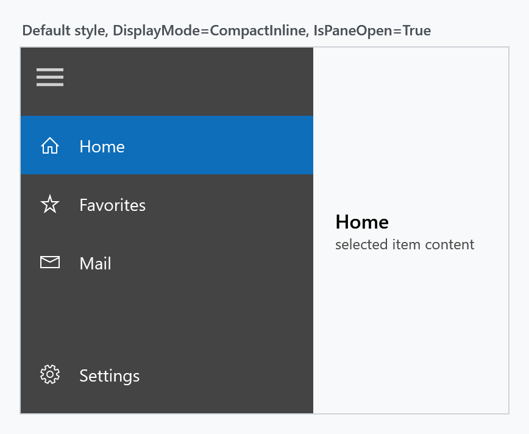
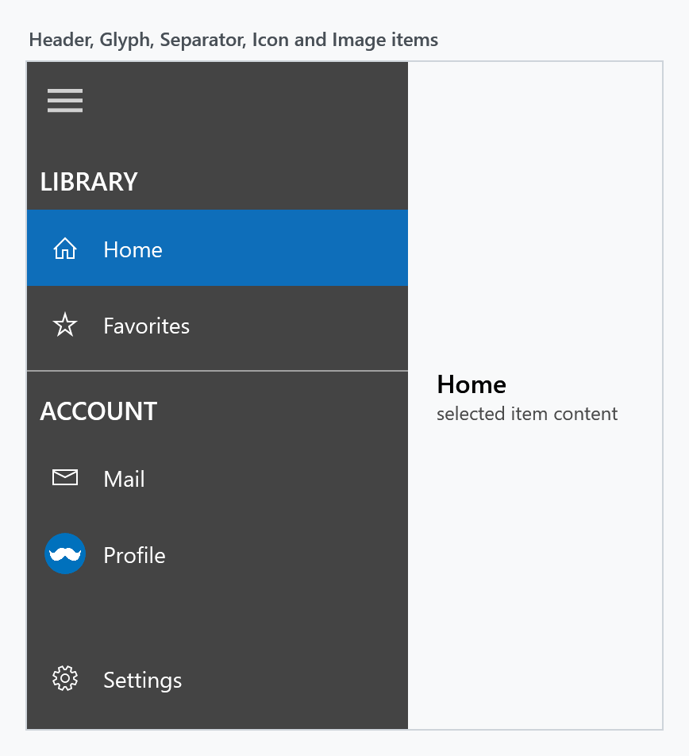
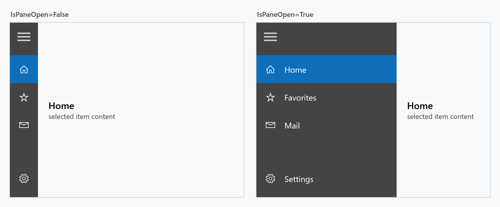
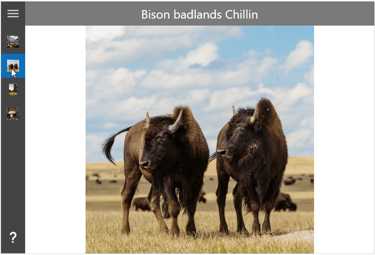
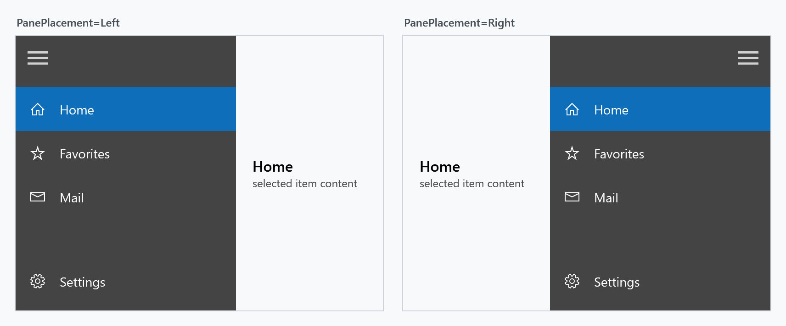
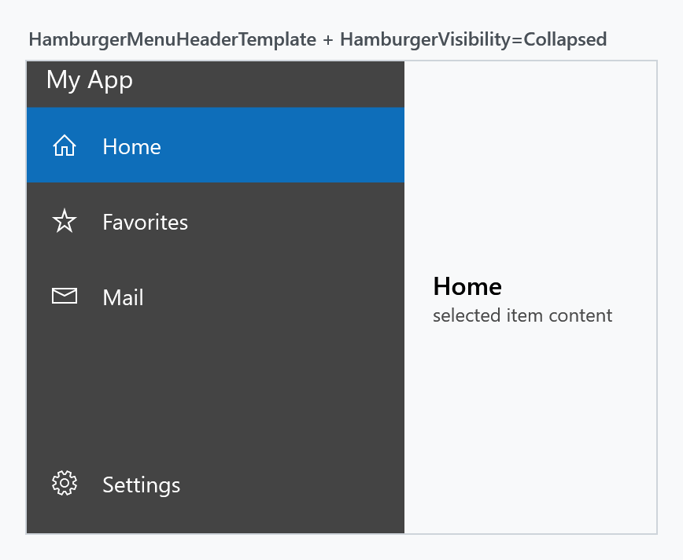
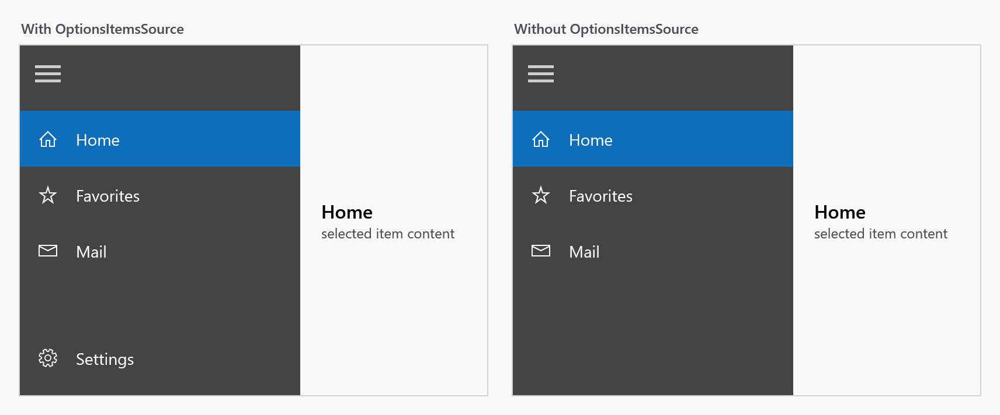
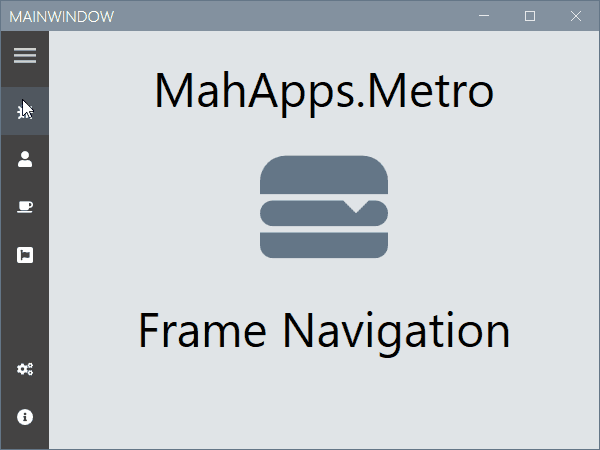
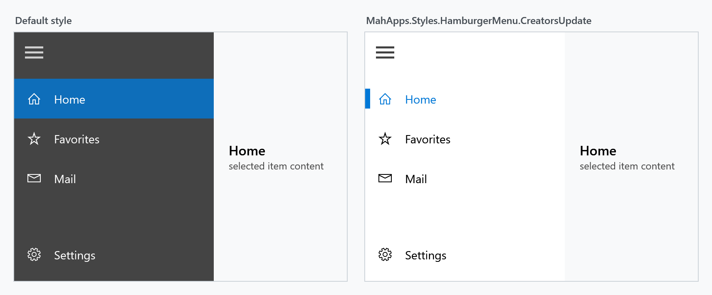

Title: HamburgerMenu
Description: The HamburgerMenu control
---

The `HamburgerMenu` is a navigation control: a list of destinations in a pane that collapses to a strip of icons, next to the content of whatever is selected. It wraps a [SplitView](splitview) for the pane behaviour and adds the item list, the hamburger button, an options list pinned to the bottom, and a content area.



Because the pane is a `SplitView`, `DisplayMode`, `PanePlacement`, `IsPaneOpen`, the four pane lengths, `CanResizeOpenPane` and `ResizeThumbStyle` behave exactly as described on the [SplitView page](splitview) — they are forwarded to it. Two defaults differ: `DisplayMode` starts at `CompactInline` instead of `Overlay`, and `OpenPaneLength` at `240` instead of `320`.

## Basic usage

Menu entries come from `ItemsSource`, usually a `HamburgerMenuItemCollection` written inline:

```xml
<mah:HamburgerMenu x:Name="Menu" IsPaneOpen="True">

    <mah:HamburgerMenu.ItemsSource>
        <mah:HamburgerMenuItemCollection>
            <mah:HamburgerMenuGlyphItem Glyph="&#xE80F;" Label="Home" />
            <mah:HamburgerMenuGlyphItem Glyph="&#xE734;" Label="Favorites" />
        </mah:HamburgerMenuItemCollection>
    </mah:HamburgerMenu.ItemsSource>

    <mah:HamburgerMenu.OptionsItemsSource>
        <mah:HamburgerMenuItemCollection>
            <mah:HamburgerMenuGlyphItem Glyph="&#xE713;" Label="Settings" />
        </mah:HamburgerMenuItemCollection>
    </mah:HamburgerMenu.OptionsItemsSource>

</mah:HamburgerMenu>
```

**MahApps ships no `DataTemplate` for the menu item types.** Without one the list renders the type name of each item, so an `ItemTemplate` — or a `DataTemplate` keyed by `DataType`, which is what lets a single menu mix item types — is effectively required. Bind the icon column to `CompactPaneLength` so the icons stay put when the pane opens and closes:

```xml
<DataTemplate DataType="{x:Type mah:HamburgerMenuGlyphItem}">
    <Grid Height="48">
        <Grid.ColumnDefinitions>
            <ColumnDefinition Width="{Binding RelativeSource={RelativeSource AncestorType={x:Type mah:HamburgerMenu}}, Path=CompactPaneLength}" />
            <ColumnDefinition />
        </Grid.ColumnDefinitions>
        <TextBlock Grid.Column="0"
                   HorizontalAlignment="Center"
                   VerticalAlignment="Center"
                   FontFamily="Segoe MDL2 Assets"
                   FontSize="16"
                   Text="{Binding Glyph}" />
        <TextBlock Grid.Column="1"
                   VerticalAlignment="Center"
                   Text="{Binding Label}" />
    </Grid>
</DataTemplate>
```

## Menu items

All item types derive from `HamburgerMenuItemBase`, which is a `Freezable` — not a `UIElement`. They carry data, and the templates above turn them into visuals.

| Type | Adds | Purpose |
| --- | --- | --- |
| `HamburgerMenuItemBase` | `Tag`, `IsVisible` | base of all items |
| `HamburgerMenuItem` | `Label`, `TargetPageType`, `Command`, `CommandParameter`, `CommandTarget`, `IsEnabled`, `ToolTip` | a selectable entry |
| `HamburgerMenuGlyphItem` | `Glyph` (string) | entry with a font glyph |
| `HamburgerMenuIconItem` | `Icon` (object) | entry with an arbitrary element as icon |
| `HamburgerMenuImageItem` | `Thumbnail` (`ImageSource`) | entry with a picture |
| `HamburgerMenuHeaderItem` | `Label` | a non-selectable group caption |
| `HamburgerMenuSeparatorItem` | — | a divider line |



Header and separator items are not selectable, but they *do* occupy an index. Watch out when setting `SelectedIndex` by hand: in the menu above index 0 is the `LIBRARY` header, so the first real entry is index 1.

```xml
<mah:HamburgerMenu.ItemsSource>
    <mah:HamburgerMenuItemCollection>
        <mah:HamburgerMenuHeaderItem Label="LIBRARY" />
        <mah:HamburgerMenuGlyphItem Glyph="&#xE80F;" Label="Home" />
        <mah:HamburgerMenuGlyphItem Glyph="&#xE734;" Label="Favorites" />
        <mah:HamburgerMenuSeparatorItem />
        <mah:HamburgerMenuHeaderItem Label="ACCOUNT" />
        <mah:HamburgerMenuIconItem Label="Mail">
            <mah:HamburgerMenuIconItem.Icon>
                <TextBlock FontFamily="Segoe MDL2 Assets" Text="&#xE715;" />
            </mah:HamburgerMenuIconItem.Icon>
        </mah:HamburgerMenuIconItem>
        <mah:HamburgerMenuImageItem Label="Profile" Thumbnail="/assets/avatar.png" />
    </mah:HamburgerMenuItemCollection>
</mah:HamburgerMenu.ItemsSource>
```

`Items` and `OptionsItems` expose the generated `ItemCollection` in code, the same way `ItemsControl.Items` does.

## Opening and closing the pane

`IsPaneOpen` expands the pane; the hamburger button toggles it for you.





`PanePlacement` moves the whole pane to the other side:



`VerticalScrollBarOnLeftSide` puts the item list's scroll bar on the left, which reads better when the pane sits on the right.

## The hamburger button and the pane header

`HamburgerMenuHeaderTemplate` fills the strip at the top of the pane, next to — or instead of — the hamburger button. Set `HamburgerVisibility` to `Collapsed` when your own toggle lives elsewhere.



```xml
<mah:HamburgerMenu HamburgerVisibility="Collapsed">
    <mah:HamburgerMenu.HamburgerMenuHeaderTemplate>
        <DataTemplate>
            <TextBlock Margin="12 0"
                       VerticalAlignment="Center"
                       FontSize="16"
                       Foreground="{DynamicResource MahApps.Brushes.IdealForeground}"
                       Text="My App" />
        </DataTemplate>
    </mah:HamburgerMenu.HamburgerMenuHeaderTemplate>
</mah:HamburgerMenu>
```

`HamburgerWidth`, `HamburgerHeight` and `HamburgerMargin` size the button, `HamburgerButtonStyle` and `HamburgerButtonTemplate` restyle it, and `HamburgerButtonName` and `HamburgerButtonHelpText` feed `AutomationProperties.Name` and `AutomationProperties.HelpText` for screen readers.

## Options

`OptionsItemsSource` fills a second list pinned to the bottom of the pane — the conventional place for settings or an account entry. It has its own `OptionsItemTemplate`, `OptionsItemTemplateSelector`, `OptionsItemContainerStyle`, `SelectedOptionsItem`, `SelectedOptionsIndex`, `OptionsItemCommand` and `OptionsItemCommandParameter`.



**`OptionsVisibility` no longer does anything.** It used to: the control template bound the options container's `Visibility` to it, and that worked up to and including MahApps.Metro 1.4.2. The binding was dropped in 1.5.0 when the pane's scroll bar behaviour was reworked ([#2914](https://github.com/MahApps/MahApps.Metro/pull/2914)) and never restored, so the property has been inert since. It is still there, still settable, and still ignored.

To leave the options block out, simply do not assign `OptionsItemsSource` — that is the difference shown above.

## Selection, content and navigation

`SelectedItem` and `SelectedIndex` track the item list, `SelectedOptionsItem` and `SelectedOptionsIndex` the options list.

**Setting `SelectedIndex` in XAML does not fill the content area.** The control assigns `Content` only when an item is actually invoked, so a menu that starts on index 0 comes up with an empty content area. That is why the samples wire up `ItemInvoked`:

```csharp
private void Menu_ItemInvoked(object sender, HamburgerMenuItemInvokedEventArgs e)
{
    this.Menu.Content = e.InvokedItem;
}
```

If you would rather stay declarative, bind `Content` to the selection instead:

```xml
<mah:HamburgerMenu x:Name="Menu"
                   SelectedIndex="0"
                   Content="{Binding RelativeSource={RelativeSource Self}, Path=SelectedItem}" />
```

Either way a `ContentTemplate` renders whatever ends up in `Content`. The common pattern is to park the view for each entry in the item's `Tag` and unwrap it there:

```xml
<mah:HamburgerMenu.ContentTemplate>
    <DataTemplate DataType="{x:Type mah:HamburgerMenuIconItem}">
        <Grid Margin="20 0 10 0">
            <Grid.RowDefinitions>
                <RowDefinition Height="Auto" />
                <RowDefinition Height="*" />
            </Grid.RowDefinitions>
            <TextBlock Grid.Row="0"
                       Margin="0 15 0 5"
                       FontFamily="{DynamicResource MahApps.Fonts.Family.Header}"
                       FontSize="{DynamicResource MahApps.Font.Size.Header}"
                       Text="{Binding Label}" />
            <ContentControl Grid.Row="1" Content="{Binding Tag}" Focusable="False" />
        </Grid>
    </DataTemplate>
</mah:HamburgerMenu.ContentTemplate>
```

### A complete navigation example

This sample goes further than the snippets above: the menu is bound to a view model, and a `Frame` inside the content area does the navigating, which also gives the window's back button a back stack to work with. The complete sample is available at [this repository](https://github.com/punker76/code-samples/tree/main/MahAppsMetroHamburgerMenuNavigation).



```xml
<controls:MetroWindow x:Class="MahAppsMetroHamburgerMenuNavigation.MainWindow"
                      xmlns="http://schemas.microsoft.com/winfx/2006/xaml/presentation"
                      xmlns:x="http://schemas.microsoft.com/winfx/2006/xaml"
                      xmlns:controls="http://metro.mahapps.com/winfx/xaml/controls"
                      xmlns:d="http://schemas.microsoft.com/expression/blend/2008"
                      xmlns:mc="http://schemas.openxmlformats.org/markup-compatibility/2006"
                      xmlns:viewModels="clr-namespace:MahAppsMetroHamburgerMenuNavigation.ViewModels"
                      Title="MainWindow"
                      Width="600"
                      Height="450"
                      GlowBrush="{DynamicResource MahApps.Brushes.AccentBase}"
                      WindowStartupLocation="CenterScreen"
                      WindowTransitionsEnabled="False"
                      mc:Ignorable="d">

  <controls:MetroWindow.DataContext>
    <viewModels:ShellViewModel />
  </controls:MetroWindow.DataContext>

  <controls:MetroWindow.LeftWindowCommands>
    <controls:WindowCommands ShowSeparators="False">
      <Button x:Name="GoBackButton"
              Width="{Binding ElementName=HamburgerMenuControl, Path=CompactPaneLength}"
              AutomationProperties.Name="Go back"
              Click="GoBack_OnClick">
        <controls:FontIcon AutomationProperties.Name="Go back icon"
                           FontSize="14"
                           Glyph="&#xE72B;" />
      </Button>
    </controls:WindowCommands>
  </controls:MetroWindow.LeftWindowCommands>

  <controls:MetroWindow.Resources>

    <DataTemplate x:Key="MenuItemTemplate" DataType="{x:Type viewModels:MenuItem}">
      <Grid Height="48">
        <Grid.ColumnDefinitions>
          <ColumnDefinition Width="{Binding RelativeSource={RelativeSource AncestorType={x:Type controls:HamburgerMenu}}, Path=CompactPaneLength, Mode=OneWay}" />
          <ColumnDefinition />
        </Grid.ColumnDefinitions>
        <ContentControl Grid.Column="0"
                        HorizontalAlignment="Center"
                        VerticalAlignment="Center"
                        Content="{Binding Icon}"
                        Focusable="False" />
        <TextBlock Grid.Column="1"
                   VerticalAlignment="Center"
                   FontSize="16"
                   Text="{Binding Label}" />
      </Grid>
    </DataTemplate>

    <Style BasedOn="{StaticResource {x:Type Frame}}" TargetType="{x:Type Frame}">
      <Setter Property="Background" Value="{DynamicResource MahApps.Brushes.Accent4}" />
      <Setter Property="ClipToBounds" Value="True" />
      <Setter Property="ContentTemplate">
        <Setter.Value>
          <DataTemplate>
            <controls:TransitioningContentControl Content="{Binding}"
                                                  RestartTransitionOnContentChange="True"
                                                  Transition="Custom">
              <controls:TransitioningContentControl.CustomVisualStates>
                <VisualState x:Name="CustomTransition">
                  <Storyboard>
                    <DoubleAnimationUsingKeyFrames BeginTime="00:00:00"
                                                   Storyboard.TargetName="CurrentContentPresentationSite"
                                                   Storyboard.TargetProperty="(UIElement.Opacity)">
                      <SplineDoubleKeyFrame KeyTime="00:00:00" Value="0" />
                      <SplineDoubleKeyFrame KeyTime="00:00:00.150" Value="1" />
                    </DoubleAnimationUsingKeyFrames>
                    <DoubleAnimationUsingKeyFrames BeginTime="00:00:00"
                                                   Storyboard.TargetName="CurrentContentPresentationSite"
                                                   Storyboard.TargetProperty="(UIElement.RenderTransform).(TransformGroup.Children)[3].(TranslateTransform.Y)">
                      <SplineDoubleKeyFrame KeyTime="00:00:00" Value="200" />
                      <SplineDoubleKeyFrame KeySpline="0.1, 0.9, 0.2, 1"
                                            KeyTime="00:00:00.300"
                                            Value="0" />
                    </DoubleAnimationUsingKeyFrames>

                    <DoubleAnimationUsingKeyFrames BeginTime="00:00:00"
                                                   Storyboard.TargetName="PreviousContentPresentationSite"
                                                   Storyboard.TargetProperty="(UIElement.Opacity)">
                      <SplineDoubleKeyFrame KeyTime="00:00:00" Value="0" />
                    </DoubleAnimationUsingKeyFrames>
                  </Storyboard>
                </VisualState>
              </controls:TransitioningContentControl.CustomVisualStates>
            </controls:TransitioningContentControl>
          </DataTemplate>
        </Setter.Value>
      </Setter>
    </Style>

  </controls:MetroWindow.Resources>

  <controls:HamburgerMenu x:Name="HamburgerMenuControl"
                          DisplayMode="CompactInline"
                          IsPaneOpen="False"
                          ItemInvoked="HamburgerMenuControl_OnItemInvoked"
                          ItemTemplate="{StaticResource MenuItemTemplate}"
                          ItemsSource="{Binding Menu}"
                          OptionsItemTemplate="{StaticResource MenuItemTemplate}"
                          OptionsItemsSource="{Binding OptionsMenu}" />

</controls:MetroWindow>
```

Using this Frame object, you can navigate to your pages by using the following code.

```csharp
using System;
using System.Linq;
using System.Windows;
using System.Windows.Navigation;
using MahApps.Metro.Controls;
using MenuItem = MahAppsMetroHamburgerMenuNavigation.ViewModels.MenuItem;

namespace MahAppsMetroHamburgerMenuNavigation
{
  /// <summary>
  /// Interaction logic for MainWindow.xaml
  /// </summary>
  public partial class MainWindow : MetroWindow
  {
    private readonly Navigation.NavigationServiceEx navigationServiceEx;

    public MainWindow()
    {
      this.InitializeComponent();

      this.navigationServiceEx = new Navigation.NavigationServiceEx();
      this.navigationServiceEx.Navigated += this.NavigationServiceEx_OnNavigated;
      this.HamburgerMenuControl.Content = this.navigationServiceEx.Frame;

      // Navigate to the home page.
      this.Loaded += (sender, args) => this.navigationServiceEx.Navigate(new Uri("Views/MainPage.xaml", UriKind.RelativeOrAbsolute));
    }

    private void HamburgerMenuControl_OnItemInvoked(object sender, HamburgerMenuItemInvokedEventArgs e)
    {
      if (e.InvokedItem is MenuItem menuItem && menuItem.IsNavigation)
      {
        this.navigationServiceEx.Navigate(menuItem.NavigationDestination);
      }
    }

    private void NavigationServiceEx_OnNavigated(object sender, NavigationEventArgs e)
    {
      // select the menu item
      this.HamburgerMenuControl.SelectedItem = this.HamburgerMenuControl
                                                   .Items
                                                   .OfType<MenuItem>()
                                                   .FirstOrDefault(x => x.NavigationDestination == e.Uri);
      this.HamburgerMenuControl.SelectedOptionsItem = this.HamburgerMenuControl
                                                          .OptionsItems
                                                          .OfType<MenuItem>()
                                                          .FirstOrDefault(x => x.NavigationDestination == e.Uri);

      // or when using the NavigationType on menu item
      // this.HamburgerMenuControl.SelectedItem = this.HamburgerMenuControl
      //                                              .Items
      //                                              .OfType<MenuItem>()
      //                                              .FirstOrDefault(x => x.NavigationType == e.Content?.GetType());
      // this.HamburgerMenuControl.SelectedOptionsItem = this.HamburgerMenuControl
      //                                                     .OptionsItems
      //                                                     .OfType<MenuItem>()
      //                                                     .FirstOrDefault(x => x.NavigationType == e.Content?.GetType());

      // update back button
      this.GoBackButton.Visibility = this.navigationServiceEx.CanGoBack ? Visibility.Visible : Visibility.Collapsed;
    }

    private void GoBack_OnClick(object sender, RoutedEventArgs e)
    {
      this.navigationServiceEx.GoBack();
    }
  }
}
```

The `MenuItem` is derived from the `HamburgerMenuIconItem` class and adds the `NavigationDestination` and `NavigationType` properties for this navigation sample.

```csharp
using System;
using System.Windows;
using MahApps.Metro.Controls;

namespace MahAppsMetroHamburgerMenuNavigation.ViewModels
{
  public class MenuItem : HamburgerMenuIconItem
  {
    public static readonly DependencyProperty NavigationDestinationProperty = DependencyProperty.Register(
      nameof(NavigationDestination), typeof(Uri), typeof(MenuItem), new PropertyMetadata(default(Uri)));

    public Uri NavigationDestination
    {
      get => (Uri)this.GetValue(NavigationDestinationProperty);
      set => this.SetValue(NavigationDestinationProperty, value);
    }

    public static readonly DependencyProperty NavigationTypeProperty = DependencyProperty.Register(
      nameof(NavigationType), typeof(Type), typeof(MenuItem), new PropertyMetadata(default(Type)));

    public Type NavigationType
    {
      get => (Type)this.GetValue(NavigationTypeProperty);
      set => this.SetValue(NavigationTypeProperty, value);
    }

    public bool IsNavigation => this.NavigationDestination != null;
  }
}
```

The `ShellViewModel` defines the Items and OptionsItems for the `HamburgerMenu`. The `BindableBase` class implements the `INotifyPropertyChanged` with a helper method `SetProperty`. This sample uses the [IconPacks](https://github.com/MahApps/MahApps.Metro.IconPacks) NuGet package, so you need to add this to your project.

```csharp
using System;
using System.Collections.ObjectModel;
using MahApps.Metro.IconPacks;
using MahAppsMetroHamburgerMenuNavigation.Mvvm;
using MahAppsMetroHamburgerMenuNavigation.Views;

namespace MahAppsMetroHamburgerMenuNavigation.ViewModels
{
  public class ShellViewModel : BindableBase
  {
    private static readonly ObservableCollection<MenuItem> AppMenu = new ObservableCollection<MenuItem>();
    private static readonly ObservableCollection<MenuItem> AppOptionsMenu = new ObservableCollection<MenuItem>();

    public ObservableCollection<MenuItem> Menu => AppMenu;

    public ObservableCollection<MenuItem> OptionsMenu => AppOptionsMenu;

    public ShellViewModel()
    {
      // Build the menus
      this.Menu.Add(new MenuItem()
                    {
                      Icon = new PackIconFontAwesome() { Kind = PackIconFontAwesomeKind.BugSolid },
                      Label = "Bugs",
                      NavigationType = typeof(BugsPage),
                      NavigationDestination = new Uri("Views/BugsPage.xaml", UriKind.RelativeOrAbsolute)
                    });
      this.Menu.Add(new MenuItem()
                    {
                      Icon = new PackIconFontAwesome() { Kind = PackIconFontAwesomeKind.UserSolid },
                      Label = "User",
                      NavigationType = typeof(UserPage),
                      NavigationDestination = new Uri("Views/UserPage.xaml", UriKind.RelativeOrAbsolute)
                    });
      this.Menu.Add(new MenuItem()
                    {
                      Icon = new PackIconFontAwesome() { Kind = PackIconFontAwesomeKind.CoffeeSolid },
                      Label = "Break",
                      NavigationType = typeof(BreakPage),
                      NavigationDestination = new Uri("Views/BreakPage.xaml", UriKind.RelativeOrAbsolute)
                    });
      this.Menu.Add(new MenuItem()
                    {
                      Icon = new PackIconFontAwesome() { Kind = PackIconFontAwesomeKind.FontAwesomeBrands },
                      Label = "Awesome",
                      NavigationType = typeof(AwesomePage),
                      NavigationDestination = new Uri("Views/AwesomePage.xaml", UriKind.RelativeOrAbsolute)
                    });

      this.OptionsMenu.Add(new MenuItem()
                           {
                             Icon = new PackIconFontAwesome() { Kind = PackIconFontAwesomeKind.CogsSolid },
                             Label = "Settings",
                             NavigationType = typeof(SettingsPage),
                             NavigationDestination = new Uri("Views/SettingsPage.xaml", UriKind.RelativeOrAbsolute)
                           });
      this.OptionsMenu.Add(new MenuItem()
                           {
                             Icon = new PackIconFontAwesome() { Kind = PackIconFontAwesomeKind.InfoCircleSolid },
                             Label = "About",
                             NavigationType = typeof(AboutPage),
                             NavigationDestination = new Uri("Views/AboutPage.xaml", UriKind.RelativeOrAbsolute)
                           });
    }
  }
}
```

The `NavigationServiceEx` is a helper class with a Frame to allow easy navigation in this sample.

```csharp
using System;
using System.Windows.Controls;
using System.Windows.Navigation;

namespace MahAppsMetroHamburgerMenuNavigation.Navigation
{
  public class NavigationServiceEx
  {
    public event NavigatedEventHandler Navigated;

    public event NavigationFailedEventHandler NavigationFailed;

    private Frame _frame;

    public Frame Frame
    {
      get
      {
        if (this._frame == null)
        {
          this._frame = new Frame() { NavigationUIVisibility = NavigationUIVisibility.Hidden };
          this.RegisterFrameEvents();
        }

        return this._frame;
      }
      set
      {
        this.UnregisterFrameEvents();
        this._frame = value;
        this.RegisterFrameEvents();
      }
    }

    public bool CanGoBack => this.Frame.CanGoBack;

    public bool CanGoForward => this.Frame.CanGoForward;

    public void GoBack() => this.Frame.GoBack();

    public void GoForward() => this.Frame.GoForward();

    public bool Navigate(Uri sourcePageUri, object extraData = null)
    {
      if (this.Frame.CurrentSource != sourcePageUri)
      {
        return this.Frame.Navigate(sourcePageUri, extraData);
      }

      return false;
    }

    public bool Navigate(Type sourceType)
    {
      if (this.Frame.NavigationService?.Content?.GetType() != sourceType)
      {
        return this.Frame.Navigate(Activator.CreateInstance(sourceType));
      }

      return false;
    }

    private void RegisterFrameEvents()
    {
      if (this._frame != null)
      {
        this._frame.Navigated += this.Frame_Navigated;
        this._frame.NavigationFailed += this.Frame_NavigationFailed;
      }
    }

    private void UnregisterFrameEvents()
    {
      if (this._frame != null)
      {
        this._frame.Navigated -= this.Frame_Navigated;
        this._frame.NavigationFailed -= this.Frame_NavigationFailed;
      }
    }

    private void Frame_NavigationFailed(object sender, NavigationFailedEventArgs e) => this.NavigationFailed?.Invoke(sender, e);

    private void Frame_Navigated(object sender, NavigationEventArgs e) => this.Navigated?.Invoke(sender, e);
  }
}
```

`ContentTransition` picks the animation the underlying `TransitioningContentControl` plays on every content change: `Default`, `Normal`, `Up`, `Down`, `Left`, `LeftReplace`, `Right` or `RightReplace`.

Instead of handling events you can let each item carry a `Command`, or give the menu a single `ItemCommand` (and `OptionsItemCommand`) that receives the clicked item.

## Styling

MahApps ships two styles for the control:

| Style | Look |
| --- | --- |
| `MahApps.Styles.HamburgerMenu` | the default: dark pane, selected entry filled with the accent colour |
| `MahApps.Styles.HamburgerMenu.CreatorsUpdate` | pane in the theme background, selection marked by an accent bar (`ShowSelectionIndicator="True"`) |



`ShowSelectionIndicator` alone turns the indicator on for the default style too. `PaneBackground` and `PaneForeground` recolour the pane, `PaneMargin` and `PaneHeaderMargin` adjust its spacing.

Per-row appearance is governed by `ItemContainerStyle`, `HeaderItemContainerStyle`, `SeparatorItemContainerStyle` and `OptionsItemContainerStyle`; all target `ListBoxItem`. Base your own on the MahApps ones so you keep the selection and hover brushes, which come from `ItemHelper` attached properties:

```xml
<Style x:Key="MyItemStyle"
       BasedOn="{StaticResource MahApps.Styles.ListBoxItem.HamburgerMenuItem}"
       TargetType="{x:Type ListBoxItem}">
    <Setter Property="mah:ItemHelper.SelectedForegroundBrush" Value="{DynamicResource MahApps.Brushes.AccentBase}" />
    <Setter Property="mah:ItemHelper.HoverBackgroundBrush" Value="{DynamicResource MahApps.Brushes.Gray.SemiTransparent}" />
</Style>
```

### Material Design ripple

The demo application also ships a variant that borrows the ripple effect from [MaterialDesignThemes](https://github.com/MaterialDesignInXAML/MaterialDesignInXamlToolkit). The trick is a container style whose template puts a `materialDesign:Ripple` where the `ContentPresenter` normally goes:

```xml
<Style x:Key="MahApps.Styles.ListBoxItem.HamburgerMenuItem.Ripple"
       BasedOn="{StaticResource MahApps.Styles.ListBoxItem.HamburgerMenuItem}"
       TargetType="{x:Type ListBoxItem}">
    <Setter Property="Template">
        <Setter.Value>
            <ControlTemplate TargetType="{x:Type ListBoxItem}">
                <!-- ... border and selection indicator ... -->
                <materialDesign:Ripple Padding="{TemplateBinding Padding}"
                                       Content="{TemplateBinding Content}"
                                       ContentTemplate="{TemplateBinding ContentTemplate}"
                                       Feedback="{DynamicResource MahApps.Brushes.Gray.MouseOver}"
                                       Focusable="False" />
            </ControlTemplate>
        </Setter.Value>
    </Setter>
</Style>
```

The full template, including all selection and hover triggers, is in `HamburgerMenuRipple.xaml` in the MahApps demo. The effect itself is an animation on click, so it does not show in a screenshot; visually the style otherwise matches the Creators Update look above.

## Events

| Event | Event args | Raised when |
| --- | --- | --- |
| `ItemClick` | `ItemClickEventArgs` (`ClickedItem`) | an entry in the item list is clicked |
| `OptionsItemClick` | `ItemClickEventArgs` (`ClickedItem`) | an entry in the options list is clicked |
| `ItemInvoked` | `HamburgerMenuItemInvokedEventArgs` (`InvokedItem`, `IsItemOptions`) | either list invokes an entry |
| `HamburgerButtonClick` | `RoutedEventArgs` | the hamburger button is clicked |

`ItemInvoked` is the one to prefer for navigation: it fires for both lists and tells you which one through `IsItemOptions`.

## Property reference

### Pane, forwarded to the SplitView

| Property | Type | Effective default |
| --- | --- | --- |
| `DisplayMode` | `SplitViewDisplayMode` | `CompactInline` |
| `PanePlacement` | `SplitViewPanePlacement` | `Left` |
| `IsPaneOpen` | `bool` | `False` |
| `OpenPaneLength` | `double` | `240` |
| `CompactPaneLength` | `double` | `48` |
| `MinimumOpenPaneLength` | `double` | `100` |
| `MaximumOpenPaneLength` | `double` | `500` |
| `CanResizeOpenPane` | `bool` | `False` |
| `ResizeThumbStyle` | `Style` | `MahApps.Styles.MetroThumb.SplitView.Resize` |
| `PaneBackground` | `Brush` | `MahApps.HamburgerMenu.Pane.Background` |
| `PaneForeground` | `Brush` | `MahApps.HamburgerMenu.Pane.Foreground` |
| `PaneMargin` | `Thickness` | `0 0 0 8` |
| `PaneHeaderMargin` | `Thickness` | `0 0 0 8` |

### Items

| Property | Type | Effective default |
| --- | --- | --- |
| `ItemsSource` | `object` | `null` |
| `Items` | `ItemCollection` | read-only |
| `ItemTemplate` | `DataTemplate` | `null` |
| `ItemTemplateSelector` | `DataTemplateSelector` | `null` |
| `ItemContainerStyle` | `Style` | `MahApps.Styles.ListBoxItem.HamburgerMenuItem` |
| `HeaderItemContainerStyle` | `Style` | `MahApps.Styles.ListBoxItem.HamburgerMenuHeader` |
| `SeparatorItemContainerStyle` | `Style` | `MahApps.Styles.ListBoxItem.HamburgerMenuSeparator` |
| `SelectedItem` | `object` | `null` |
| `SelectedIndex` | `int` | `-1` |
| `ItemCommand` | `ICommand` | `null` |
| `ItemCommandParameter` | `object` | `null` |
| `ShowSelectionIndicator` | `bool` | `False` |
| `VerticalScrollBarOnLeftSide` | `bool` | `False` |
| `ItemFocusVisualStyle` | `Style` | read-only, recalculated by the control |

### Options

| Property | Type | Effective default |
| --- | --- | --- |
| `OptionsItemsSource` | `object` | `null` |
| `OptionsItems` | `ItemCollection` | read-only |
| `OptionsItemTemplate` | `DataTemplate` | `null` |
| `OptionsItemTemplateSelector` | `DataTemplateSelector` | `null` |
| `OptionsItemContainerStyle` | `Style` | `MahApps.Styles.ListBoxItem.HamburgerMenuItem` |
| `SelectedOptionsItem` | `object` | `null` |
| `SelectedOptionsIndex` | `int` | `-1` |
| `OptionsItemCommand` | `ICommand` | `null` |
| `OptionsItemCommandParameter` | `object` | `null` |
| `OptionsVisibility` | `Visibility` | `Visible` — inert since 1.5.0, see above |

### Hamburger button, header and content

| Property | Type | Effective default |
| --- | --- | --- |
| `HamburgerWidth` | `double` | `48` |
| `HamburgerHeight` | `double` | `48` |
| `HamburgerMargin` | `Thickness` | `0` |
| `HamburgerVisibility` | `Visibility` | `Visible` |
| `HamburgerButtonStyle` | `Style` | `MahApps.Styles.Button.Hamburger` |
| `HamburgerButtonTemplate` | `DataTemplate` | set by the default style |
| `HamburgerButtonName` | `string` | `HamburgerButton` |
| `HamburgerButtonHelpText` | `string` | empty |
| `HamburgerMenuHeaderTemplate` | `DataTemplate` | `null` |
| `ContentTransition` | `TransitionType` | `Normal` |

"Effective default" is the value a `HamburgerMenu` actually starts with. Many of these come from the control's default style rather than from the dependency property metadata; where the two disagree, the style wins and the value above is the one that applies.
