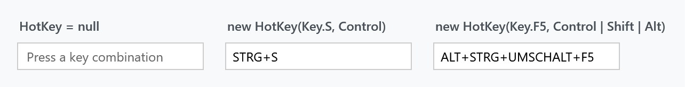

Title: HotKeyBox
Description: A field that records a key combination the user presses
---

`HotKeyBox` is a field that records whatever key combination the user presses into it, the way a *set shortcut* box in an options dialog does. It derives from `Control` and its only template part is a read-only `TextBox`.



```xml
<mah:HotKeyBox Width="175"
               HotKey="{Binding SaveShortcut}"
               mah:TextBoxHelper.Watermark="Press a key combination" />
```

The captions above name what was set in code; the boxes show what the control rendered, which is not the same thing — see [What it displays](#what-it-displays).

## Properties

| Property | Type | Default | |
| --- | --- | --- | --- |
| `HotKey` | `HotKey` | `null` | the recorded combination; binds two-way by default |
| `AreModifierKeysRequired` | `bool` | `False` | reject a key pressed without a modifier |
| `Text` | `string`, read-only | `""` | what the field shows |

`HotKey` has no type converter, so it cannot be written as an attribute in XAML — bind it, or set it in code:

```csharp
this.hotKeyBox.HotKey = new HotKey(Key.S, ModifierKeys.Control);
```

With `AreModifierKeysRequired` left at `False`, a bare <kbd>F5</kbd> is recorded as a hot key. Set it to `True` and a keystroke without at least one of Ctrl, Alt, Shift or Windows is ignored — the field keeps whatever it had.

## What it records

The control handles `PreviewKeyDown` on its inner text box, and the rules are short enough to state completely:

- **Modifiers alone are never recorded.** Both Shifts, Ctrls, Alts and Windows keys return early, as does <kbd>Tab</kbd> — so tabbing still moves focus out of the field.
- **<kbd>Backspace</kbd> with no modifier clears it**, setting `HotKey` to `null`. <kbd>Ctrl</kbd>+<kbd>Backspace</kbd>, on the other hand, is recorded as a combination.
- Everything else is recorded, as long as a modifier is held or `AreModifierKeysRequired` is `False`.
- <kbd>Alt</kbd> combinations arrive as `Key.System`, and the control reads `SystemKey` in that case, so <kbd>Alt</kbd>+<kbd>F4</kbd> and friends are captured rather than mangled.

:::{.alert .alert-info}
While the field has focus it **swallows every `WM_HOTKEY` message**:

```csharp
if (msg.message == (int)WM.HOTKEY)
{
    // swallow all hotkeys, so our control can catch the key strokes
    handled = true;
}
```

So a globally registered hot key does not fire while the user is recording one. The hook is added on `GotFocus` and removed on `LostFocus`.
:::

The control itself is not a focus stop: a class handler on `GotFocus` forwards focus onward — to the next element, or the previous one if <kbd>Shift</kbd> is held — so only the inner text box takes focus.

## The HotKeyChanged event

`HotKeyChanged` is a bubbling routed event with a `RoutedPropertyChangedEventHandler<HotKey?>`, so the handler gets both values:

```csharp
private void OnHotKeyChanged(object sender, RoutedPropertyChangedEventArgs<HotKey?> e)
{
    this.saveShortcut = e.NewValue;
}
```

:::{.alert .alert-warning}
**When it fires depends on the version.** On `develop` the event is raised only when the recorded combination differs from the one before, so pressing <kbd>Ctrl</kbd>+<kbd>S</kbd> twice raises it once. A released version raises it for every recorded keystroke, because it compares the old and the new instance by reference and the control builds a new one each time.
:::

## What it displays

`Text` is read-only and is simply `HotKey.ToString()`, or empty when `HotKey` is `null` **or** its `Key` is `Key.None`.

:::{.alert .alert-warning}
**The names come from the keyboard layout, not from the enum and not from the UI culture.** `HotKey.ToString()` asks Win32 `GetKeyNameText` for each part, so `new HotKey(Key.S, ModifierKeys.Control)` shows *Ctrl+S* on an English layout and *Strg+S* on a German one — which is what the figure above is showing.

Do not parse `Text`, and do not use it as a persisted value. Store `HotKey.Key` and `HotKey.ModifierKeys` instead.
:::

Modifiers are always written in a fixed order — **Alt, Ctrl, Shift, Windows** — whatever order you pass them in. Only the Windows key is spelled literally, as `Windows+`; the other three are localized.

The style sets `ControlsHelper.ContentCharacterCasing` to `Upper`, so the text is upper-cased before it is shown. `Normal` and `Lower` are honoured too, through three template triggers.

## The HotKey class

```csharp
public class HotKey : IEquatable<HotKey>
{
    public HotKey(Key key, ModifierKeys modifierKeys = ModifierKeys.None);

    public Key Key { get; }
    public ModifierKeys ModifierKeys { get; }
}
```

It is immutable, and both properties are get-only — to change a shortcut you assign a new instance, which is exactly what the control does on every keystroke.

:::{.alert .alert-warning}
**`==` compares the key and the modifier keys, but only on `develop`.** `HotKey` overrides `Equals` and `GetHashCode` and, on `develop`, also overloads `operator ==` and `operator !=`, so two instances that carry the same key and the same modifiers are equal:

```csharp
var a = new HotKey(Key.S, ModifierKeys.Control);
var b = new HotKey(Key.S, ModifierKeys.Control);

a == b        // true on develop, false in a released version
a.Equals(b)   // true
```

Both operators take `null` on either side, and `Equals(null)` returns `false`.

A released version has no operators, so there `==` is reference equality. The control hands you a fresh instance every time the user presses something, which makes an `==` check against a stored value always `false`, so compare with `Equals` until the next release.

In a released version, `Equals(HotKey other)` also throws a `NullReferenceException` when passed `null`, because it dereferences `other` without a check. `Equals(object)` is safe, as its `is HotKey` test rejects `null`. A null guard was added on `develop` and ships with the next release.
:::

Because `GetHashCode` and `Equals` are implemented, `HotKey` works correctly as a dictionary key — which is the usual way to keep a table of shortcuts.

## Styling

The template is a single `TextBox`, and the usual [TextBoxHelper](../helper/textboxhelper) properties are passed through to it: `Watermark`, `UseFloatingWatermark`, `WatermarkAlignment` and `WatermarkTrimming`. `ControlsHelper.FocusBorderBrush` and `MouseOverBorderBrush` are set by the style, as is `Validation.ErrorTemplate`, so a failed binding gets the usual [validation](../styles/validation) treatment.

## Related

[TextBoxHelper](../helper/textboxhelper) for the watermark, [ControlsHelper](../helper/controlshelper) for the casing and border brushes.
