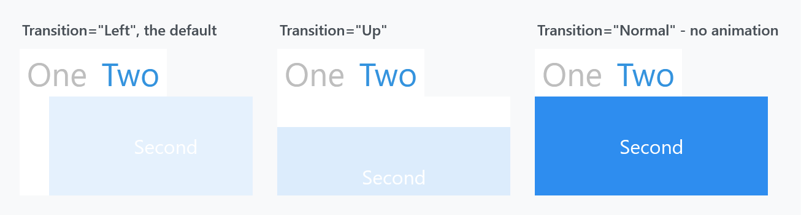
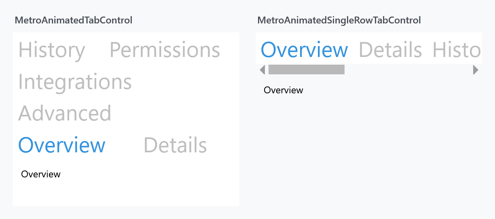

Title: MetroAnimatedTabControl
Description: A MetroTabControl that animates the switch between tabs
---

`MetroAnimatedTabControl` is a [MetroTabControl](MetroTabControl) whose content slides in when you switch tabs. The class itself is four lines — it derives from `BaseMetroTabControl` and only points at a different default style. Everything below is that style.



```xml
<mah:MetroAnimatedTabControl>
    <TabItem Header="Overview">
        <!--  content  -->
    </TabItem>
    <TabItem Header="Details">
        <!--  content  -->
    </TabItem>
</mah:MetroAnimatedTabControl>
```

Because it derives from `BaseMetroTabControl`, everything on the [MetroTabControl](MetroTabControl) page applies here too — closeable tabs, `CloseTabCommand`, the header styling through [TabControlHelper](../helper/tabcontrolhelper), and so on.

## Where the animation comes from

The template hosts the tab content in a [TransitioningContentControl](transitioningcontentcontrol), replayed on every tab change:

```xml
<mah:TransitioningContentControl behaviors:ReloadBehavior.OnSelectedTabChanged="True"
                                 Transition="{TemplateBinding mah:TabControlHelper.Transition}"
                                 ... />
```

That is the whole mechanism, and it explains both how to change the animation and what its limits are. A plain [MetroTabControl](MetroTabControl) has no `TransitioningContentControl` in its template at all, which is why it does not animate.

## Choosing the transition

`TabControlHelper.Transition` sets it, and the style's default is **`Left`**:

```xml
<mah:MetroAnimatedTabControl mah:TabControlHelper.Transition="Up">
```

The value is a `TransitionType`, so every option on the [TransitioningContentControl](transitioningcontentcontrol) page is available here — including `Normal`, which does not animate at all and is the way to keep this control's template while turning the movement off, and `Custom` for your own visual state.

## Headers wrap onto more rows



The headers sit in a plain `TabPanel`, so when they do not fit across the control they **wrap onto further rows**, and each row takes space away from the content. The left panel above shows six headers in a 280px-wide control folding onto three rows.

Note that the selected tab's row is moved down next to the content — that is `TabPanel`'s own behaviour, not something MahApps does, and it is why *Overview* appears on the bottom row rather than the top.

If you would rather have one row that scrolls, use [MetroAnimatedSingleRowTabControl](MetroAnimatedSingleRowTabControl), which is the same control with a `ScrollViewer` around the headers.

## Related

[MetroTabControl](MetroTabControl) for the shared API and the non-animated version. [MetroAnimatedSingleRowTabControl](MetroAnimatedSingleRowTabControl) for the scrolling-header variant. [TransitioningContentControl](transitioningcontentcontrol) for what the transitions actually do.
