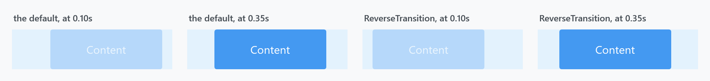

Title: MetroContentControl
Description: A ContentControl that slides and fades its content in when it appears
---

`MetroContentControl` is a `ContentControl` that plays a short slide-and-fade whenever it appears. It is what gives a MahApps page its characteristic entrance.


```xml
<mah:MetroContentControl>
    <!--  page content  -->
</mah:MetroContentControl>
```

:::{.alert .alert-warning}
**It does not animate when the content changes.** Nothing in the control watches `Content` — there is no `OnContentChanged` override and no callback on the property. The transition runs when the control is **loaded** and when it **becomes visible**, and that is all.

Assigning a new `Content` swaps it instantly, with no animation. For a control that animates one content into the next, use [TransitioningContentControl](transitioningcontentcontrol); to re-run this control's transition on a change, see [Replaying it](#replaying-it) below.
:::

## The animation



Two things happen at once, defined as visual states in the template:

| | |
| --- | --- |
| opacity | 0 → 1 over **0.4s** |
| `TranslateTransform.X` | **30 → 0** over **0.7s**, with easing |

So the content drifts in from the right while fading up. `ReverseTransition` flips the slide to −30, bringing it in from the left instead — the two right-hand panels above. The tinted strip in each panel is a fixed-width backdrop, there so the displacement can be seen against something that does not move with it.

Leaving the control (the `AfterUnLoaded` state) plays the same thing backwards in 0.1s.

## Properties

| Property | Type | Default | |
| --- | --- | --- | --- |
| `TransitionsEnabled` | `bool` | **`True`** | play the transition at all |
| `ReverseTransition` | `bool` | `False` | come in from the left instead of the right |
| `OnlyLoadTransition` | `bool` | `False` | play it once, at load, and never again |
| `IsTransitioning` | `bool`, read-only | `False` | whether an animation is running |

`OnlyLoadTransition` is the one to reach for when a control is shown and hidden repeatedly and you only want the entrance once. It is latched at load time, and once latched the control ignores visibility changes.

:::{.alert .alert-info}
`TransitionsEnabled` has **no property-changed callback**. With it set to `False`, the `Loaded` handler is what resets the template's `RootGrid` to full opacity and zero offset — so switching the property at runtime does nothing until the control is loaded again. Set it in XAML, not later from code.
:::

## Replaying it

`Reload()` runs the transition again:

```csharp
this.contentControl.Reload();
```

It returns without doing anything when `TransitionsEnabled` is `False` **or** when `OnlyLoadTransition` is `True` — the latter is easy to miss, since the two properties otherwise look unrelated.

`ReloadBehavior` wires `Reload()` to two common triggers, so you rarely have to call it yourself:

```xml
<mah:MetroContentControl mah:ReloadBehavior.OnDataContextChanged="True">
    <!--  content  -->
</mah:MetroContentControl>
```

| Attached property | Replays the transition when |
| --- | --- |
| `ReloadBehavior.OnDataContextChanged` | the control's `DataContext` changes |
| `ReloadBehavior.OnSelectedTabChanged` | a `TabControl` above it raises `SelectionChanged` |

`OnDataContextChanged` is the practical answer to "animate when the content changes": bind the view model to the `DataContext` and the transition replays with each new one. `OnSelectedTabChanged` also works on [TransitioningContentControl](transitioningcontentcontrol).

## Events

Both are bubbling routed events.

| | |
| --- | --- |
| `TransitionStarted` | the storyboard's clock is running |
| `TransitionCompleted` | the storyboard finished |

:::{.alert .alert-warning}
**`TransitionStarted` fires many times per transition, not once.** It is raised from the storyboard's `CurrentTimeInvalidated` handler, which runs on every frame, guarded only by a check that the clock is active:

```csharp
if (clock.CurrentState == ClockState.Active)
{
    this.SetValue(IsTransitioningPropertyKey, BooleanBoxes.TrueBox);
    this.RaiseEvent(new RoutedEventArgs(TransitionStartedEvent));
}
```

One transition of a default `MetroContentControl` raises **37 `TransitionStarted` events and a single `TransitionCompleted`**. It is the same on `develop`.

So do not treat it as "the transition began" — put anything that must happen once behind a flag of your own, or use `TransitionCompleted`, which really is raised once. `IsTransitioning` is set repeatedly to the same value, which is harmless.
:::

## Where else it shows up

[CustomValidationPopup](customvalidationpopup) checks for an ancestor `MetroContentControl` and suppresses itself while one is transitioning, so a validation message never appears pinned to a control that is still sliding into place.

## Related

[TransitioningContentControl](transitioningcontentcontrol) animates *between* two contents and offers a choice of transitions; this control animates its own appearance. [Flyout](flyouts) has its own slide and does not need either.
