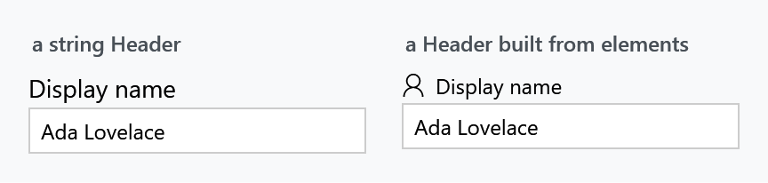
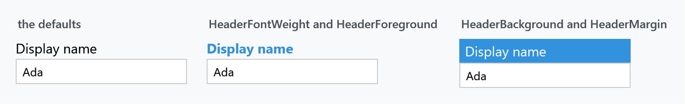

Title: MetroHeader
Description: A labelled container for one control
---

`MetroHeader` puts a header above a piece of content — usually a label above an input control. It derives from `GroupBox`, so `Header`, `HeaderTemplate`, `HeaderTemplateSelector` and `HeaderStringFormat` all come from `HeaderedContentControl` and behave as usual. What MahApps adds is the template: a plain two-row grid with no border and no chrome.



```xml
<mah:MetroHeader Header="Display name">
    <TextBox Text="{Binding DisplayName}" />
</mah:MetroHeader>
```

`Header` takes any object. Give it a string and it is rendered as text; give it elements and they are rendered as they are:

```xml
<mah:MetroHeader>
    <mah:MetroHeader.Header>
        <StackPanel Orientation="Horizontal">
            <mah:FontIcon Margin="0 0 6 0" FontSize="13" Glyph="&#xE77B;" />
            <TextBlock VerticalAlignment="Center" Text="Display name" />
        </StackPanel>
    </mah:MetroHeader.Header>
    <TextBox Text="{Binding DisplayName}" />
</mah:MetroHeader>
```

For a header bound to something that is not a string, use `HeaderTemplate`:

```xml
<mah:MetroHeader Header="{Binding Field}">
    <mah:MetroHeader.HeaderTemplate>
        <DataTemplate>
            <TextBlock Text="{Binding Title}" />
        </DataTemplate>
    </mah:MetroHeader.HeaderTemplate>
</mah:MetroHeader>
```

Content is stretched both ways, so the `TextBox` above fills the width without being told to.

:::{.alert .alert-info}
**`BorderBrush` and `BorderThickness` do nothing.** The template binds neither, which is deliberate — `MetroHeader` is a layout wrapper, not a frame. For a bordered, titled container use a [GroupBox](../styles/groupbox), which is what `MetroHeader` derives from and what carries the MahApps group-box chrome.
:::

## Styling the header



Everything about the header is a [HeaderedControlHelper](../helper/headeredcontrolhelper) attached property, read by the template through `TemplateBinding`:

| Property | Default |
| --- | --- |
| `HeaderBackground` | the control's own `Background` |
| `HeaderForeground` | the control's own `Foreground` |
| `HeaderFontSize` | `MahApps.Font.Size.Default` |
| `HeaderMargin` | `0 0 0 2` |
| `HeaderFontFamily`, `HeaderFontWeight`, `HeaderFontStretch` | inherited |
| `HeaderHorizontalContentAlignment`, `HeaderVerticalContentAlignment` | |

```xml
<mah:MetroHeader Header="Display name"
                 mah:HeaderedControlHelper.HeaderFontWeight="Bold"
                 mah:HeaderedControlHelper.HeaderForeground="{DynamicResource MahApps.Brushes.Accent}">
    <TextBox Text="{Binding DisplayName}" />
</mah:MetroHeader>
```

Note the two defaults that bind back to the control: `HeaderBackground` follows `Background` and `HeaderForeground` follows `Foreground`. So setting `Foreground` on the `MetroHeader` recolours the header and not the content, which is the opposite of what you might expect — set the header property directly when you mean only the header.

The header is presented by a [ContentControlEx](contentcontrolex), so `ControlsHelper.ContentCharacterCasing` and `ControlsHelper.RecognizesAccessKey` work on it too.

## The layout is fixed — for now

In a released version the template is a two-row `Grid`: header on top, content below, always. There is no way to put the header beside the content.

:::{.alert .alert-info}
**Two additions are on `develop` and ship with the next release.** They are not in 2.4.11, and older documentation listed the first of them as though it already existed.

**`Orientation`** — an `Orientation` property defaulting to `Vertical`, where `Vertical` keeps the header above the content and `Horizontal` puts it beside:

```xml
<mah:MetroHeader Header="Display name" Orientation="Horizontal">
    <TextBox Text="{Binding DisplayName}" />
</mah:MetroHeader>
```

**An empty header collapses.** `MetroHeader` overrides `OnHeaderChanged` and hides the header presenter when `Header` is `null`, or an empty string:

```csharp
headerPresenter.Visibility = string.IsNullOrEmpty(headerText)
    ? Visibility.Collapsed
    : Visibility.Visible;
```

Until then, an empty header still occupies its row plus the 2px `HeaderMargin`.
:::

## Accessibility

`MetroHeader` supplies a `MetroHeaderAutomationPeer`, so screen readers announce the header as the labelled name of the content rather than as a separate element.

## Related

[HeaderedControlHelper](../helper/headeredcontrolhelper) for the header properties, shared with the other headered controls. [GroupBox](../styles/groupbox) when you want a border around the pair, and [ContentControlEx](contentcontrolex) for the casing and access-key behaviour of the header itself.
