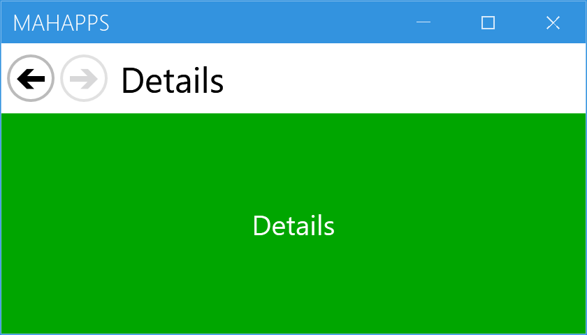

Title: MetroNavigationWindow
Description: WPF's NavigationWindow, rebuilt on MetroWindow
---

`MetroNavigationWindow` is WPF's `NavigationWindow` rebuilt on top of [MetroWindow](metrowindow): a window with a back/forward bar, a page title, and a `Frame` that hosts navigated `Page`s.



```xml
<mah:MetroNavigationWindow x:Class="MyApp.MainWindow"
                           xmlns:mah="http://metro.mahapps.com/winfx/xaml/controls"
                           Title="MahApps" />
```

```csharp
this.Navigate(new OverviewPage());
```

The bar above the content is part of the window, not something you add. The title next to the buttons is the navigated **`Page.Title`**, and the two circle buttons enable themselves from `CanGoBack` and `CanGoForward` — in the figure the window has navigated twice, so back is live and forward is not.

:::{.alert .alert-info}
Unlike almost every other control in the library, this one is **compiled XAML, not a `ControlTemplate`**. `MetroNavigationWindow.xaml` is a `MetroWindow` subclass with the bar laid out inside it, so there is no template to override and no way to restyle or rearrange the buttons. Everything a [MetroWindow](metrowindow) offers — `GlowBrush`, `WindowTitleBrush`, flyouts, the window commands — still applies, because it *is* one.
:::

## Navigating

The API mirrors `NavigationWindow`, and every call is forwarded to the internal `Frame`:

| | |
| --- | --- |
| `Navigate(object)` / `Navigate(Uri)` | with `(…, object extraData)` overloads for each |
| `GoBack()` / `GoForward()` | |
| `CanGoBack` / `CanGoForward` | |
| `BackStack` / `ForwardStack` | the journal, as `IEnumerable` |
| `AddBackEntry(CustomContentState)` / `RemoveBackEntry()` | |
| `Source` | the current URI |
| `NavigationService` | the `Frame`'s own service, if you need the rest of it |
| `StopLoading()` | |

All seven of the `Frame`'s navigation events are re-raised on the window, so you can subscribe there instead: `Navigating`, `Navigated`, `NavigationProgress`, `NavigationFailed`, `NavigationStopped`, `FragmentNavigation` and `LoadCompleted`.

`PageContent` is a read-only property holding whatever the frame currently shows, updated after every navigation.

:::{.alert .alert-warning}
**Navigate to a `Page`, not to anything else.** `Navigate` accepts `object`, but the window's `Navigated` handler casts the result without checking:

```csharp
PART_Title.Content = ((Page)PART_Frame.Content).Title;
```

Navigating to a `UserControl`, or to a URI whose root is not a `Page`, therefore throws an `InvalidCastException` from inside the handler rather than failing gracefully.

This is **fixed on `develop`** — the line is now `(e.Content as Page)?.Title` — so it ships repaired with the next release. Until then, wrap non-`Page` content in a `Page`.
:::

## The content property is the overlay, not the page

```csharp
[ContentProperty(nameof(OverlayContent))]
public partial class MetroNavigationWindow : MetroWindow, IUriContext
```

This catches people out. Child content written inside the window's XAML tags does **not** become the page — it becomes `OverlayContent`, which the window draws in a `ContentPresenter` at `Panel.ZIndex="1"`, on top of the frame:

```xml
<mah:MetroNavigationWindow>
    <!--  this is an overlay ON TOP of every page, not the page itself  -->
    <Border Background="#80000000">
        <TextBlock Text="Loading…" Foreground="White" />
    </Border>
</mah:MetroNavigationWindow>
```

That is useful for a busy indicator or a dimming layer that has to survive navigation, and useless as a way to set the first page. Pages come from `Navigate`.

:::{.alert .alert-info}
The content is hosted in a `Frame`, and a `Frame` is a boundary for **both** property value inheritance and resource lookup. A `Page` inside it will not see resources you merged into the window's own `Resources`, nor inherit values like `Foreground` from the window. Put shared resources in `App.xaml` instead.
:::

## Coming in the next release

`develop` reworks the navigation bar, and none of this is in 2.4.11:

| | |
| --- | --- |
| `ShowsNavigationUI` | hides the whole bar when `False` |
| `ShowHomeButton` | adds a third, leading Home button |
| `GoHome()` | navigates back to the first entry and clears the history behind it |

`GoHome()` removes back entries until one remains and then goes back to it, with the `Navigated` handler detached while it unwinds so the intermediate steps do not fire events.

## Related

[MetroWindow](metrowindow) for everything the window part can do — this control inherits all of it. [Flyout](flyouts) works here as well, since the flyouts live on the `MetroWindow`.
