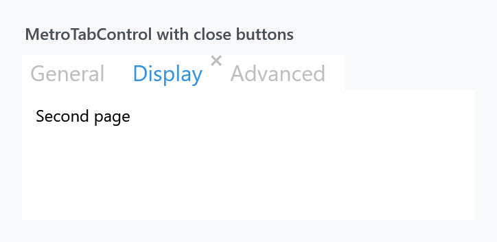

Title: MetroTabControl
Description: A TabControl with closable tabs and a choice about the visual tree
---

`MetroTabControl` looks like a styled [TabControl](../styles/tabcontrol) and adds three things: a close button per tab, a say in whether tab contents survive a switch, and a margin for the strip.



```xml
<mah:MetroTabControl>
    <mah:MetroTabItem Header="General" CloseButtonEnabled="True">
        <TextBlock Margin="10" Text="First page" />
    </mah:MetroTabItem>
    <mah:MetroTabItem Header="Display" CloseButtonEnabled="True">
        <TextBlock Margin="10" Text="Second page" />
    </mah:MetroTabItem>
</mah:MetroTabControl>
```

Its style is based on `MahApps.Styles.TabControl`, so everything on the [TabControl styles](../styles/tabcontrol) page applies: the placement triggers, the underline through [TabControlHelper](../helper/tabcontrolhelper), the large header font.

Bind `ItemsSource` and you do not have to make the items yourself — `GetContainerForItemOverride` hands back a [MetroTabItem](MetroTabItem), not a plain `TabItem`, so the close button is available either way.

## Keeping the visual tree

| Property | Type | Default | |
| --- | --- | --- | --- |
| `KeepVisualTreeInMemoryWhenChangingTabs` | `bool` | `False` | keep every tab's content alive instead of rebuilding it |

This is the property worth knowing about, and it works by swapping the template outright:

| | template | what the content is |
| --- | --- | --- |
| `False` | `MahApps.Templates.MetroTabControl.DoNotKeepVisualTreeInMemory` | a `ContentPresenter` bound to `SelectedContent`, as WPF does it — the old page is discarded on every switch |
| `True` | `MahApps.Templates.MetroTabControl.KeepVisualTreeInMemory` | a `PART_ItemsHolder` that the `TabControlEx` base fills with one container per tab and shows or hides |

```xml
<mah:MetroTabControl KeepVisualTreeInMemoryWhenChangingTabs="True" />
```

:::{.alert .alert-info}
Turn it on when rebuilding a page is expensive or throws away state — a half-filled form, a scroll position, a loaded document, a `WebView`. Leave it off when the tabs are many or heavy, because every one of them then stays realised for the lifetime of the control.

`MetroTabControl` derives from `TabControlEx` (ControlzEx), which is where the holder mechanism comes from. Note that it is the *template* that decides: a template of your own without `PART_ItemsHolder` will not keep anything, whatever the property says.
:::

## Closing tabs

`CloseTabCommand` on the control replaces the whole removal:

| Property | Type | |
| --- | --- | --- |
| `CloseTabCommand` | `ICommand` | run instead of removing the tab |

```xml
<mah:MetroTabControl CloseTabCommand="{Binding CloseDocumentCommand}" />
```

The parameter is the item's `CloseTabCommandParameter` if it has one, otherwise the `MetroTabItem` itself.

:::{.alert .alert-warning}
When this command is set, **the control does not remove the tab and does not raise `TabItemClosingEvent`** — it runs the command and stops. Removing the item is then yours to do.
:::

With no command set, the control raises a cancellable event instead:

```csharp
private void OnTabItemClosing(object sender, BaseMetroTabControl.TabItemClosingEventArgs e)
{
    if (e.ClosingTabItem.Header.ToString() == "Home")
    {
        e.Cancel = true;
    }
}
```

```xml
<mah:MetroTabControl TabItemClosingEvent="OnTabItemClosing" />
```

`TabItemClosingEventArgs` derives from `CancelEventArgs`, so `e.Cancel = true` keeps the tab. Left alone, the control removes the item — from `Items` when there is no `ItemsSource`, and from the bound collection otherwise, matching either the container or its `DataContext`.

The whole order, once a close button is clicked:

1. the item's own `CloseTabCommand`, if set, runs — see [MetroTabItem](MetroTabItem);
2. the control's `CloseTabCommand`, if set, runs and nothing further happens;
3. otherwise `TabItemClosingEvent` is raised, and unless it is cancelled the item is removed.

## TabStripMargin

| Property | Type | Default | |
| --- | --- | --- | --- |
| `TabStripMargin` | `Thickness` | `0` | margin around the header strip |

Room around the tabs without moving the content — useful when the strip shares a row with something of your own, such as a "new tab" button.

## The animated siblings

Two more controls share the same base, `BaseMetroTabControl`, and therefore the same closing behaviour, `TabStripMargin` and item type:

| Control | |
| --- | --- |
| `MetroAnimatedTabControl` | fades the page in when the tab changes |
| `MetroAnimatedSingleRowTabControl` | the same, with a strip that scrolls rather than wraps |

They are separate controls, not styles. The equivalents for a plain `TabControl` are `MahApps.Styles.TabControl.Animated` and `MahApps.Styles.TabControl.AnimatedSingleRow` — see [TabControl](../styles/tabcontrol).

Neither of those two exposes `KeepVisualTreeInMemoryWhenChangingTabs`; it is declared on `MetroTabControl` itself.
