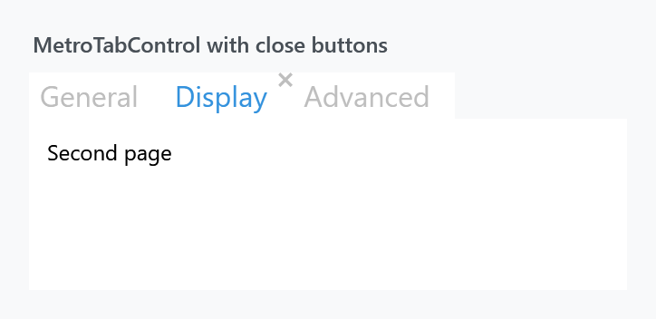

Title: MetroTabControl
Description: A TabControl with closable tabs and a choice about the visual tree
---

`MetroTabControl` looks like a styled [TabControl](../styles/tabcontrol) and adds three things: a close button per tab, a say in whether tab contents survive a switch, and a margin for the strip.



```xml
<mah:MetroTabControl>
    <mah:MetroTabItem Header="General" CloseButtonEnabled="True">
        <TextBlock Margin="10" Text="First page" />
    </mah:MetroTabItem>
    <mah:MetroTabItem Header="Display" CloseButtonEnabled="True">
        <TextBlock Margin="10" Text="Second page" />
    </mah:MetroTabItem>
</mah:MetroTabControl>
```

Its style is based on `MahApps.Styles.TabControl`, so everything on the [TabControl styles](../styles/tabcontrol) page applies: the placement triggers, the underline through [TabControlHelper](../helper/tabcontrolhelper), the large header font. On `develop` it has the two WinUI looks as well, under `MahApps.Styles.MetroTabControl.WinUI` and `MahApps.Styles.MetroTabControl.WinUI.SelectorBar`, each keeping the template this control brings.

Bind `ItemsSource` and you do not have to make the items yourself — `GetContainerForItemOverride` hands back a [MetroTabItem](metrotabitem), not a plain `TabItem`, so the close button is available either way.

## Keeping the visual tree

| Property | Type | Default | |
| --- | --- | --- | --- |
| `KeepVisualTreeInMemoryWhenChangingTabs` | `bool` | `False` | keep every tab's content alive instead of rebuilding it |

This is the property worth knowing about, and it works by swapping the template outright:

| | template | what the content is |
| --- | --- | --- |
| `False` | `MahApps.Templates.MetroTabControl.DoNotKeepVisualTreeInMemory` | a `ContentPresenter` bound to `SelectedContent`, as WPF does it — the old page is discarded on every switch |
| `True` | `MahApps.Templates.MetroTabControl.KeepVisualTreeInMemory` | a `PART_ItemsHolder` that the `TabControlEx` base fills with one container per tab and shows or hides |

```xml
<mah:MetroTabControl KeepVisualTreeInMemoryWhenChangingTabs="True" />
```

:::{.alert .alert-info}
Turn it on when rebuilding a page is expensive or throws away state — a half-filled form, a scroll position, a loaded document, a `WebView`. Leave it off when the tabs are many or heavy, because every one of them then stays realised for the lifetime of the control.

`MetroTabControl` derives from `TabControlEx` (ControlzEx), which is where the holder mechanism comes from. Note that it is the *template* that decides: a template of your own without `PART_ItemsHolder` will not keep anything, whatever the property says.
:::

## Closing tabs

A tab goes only when everyone who was asked agrees. Once a close button is clicked:

1. the item's own `CloseTabCommand`, if it has one, is asked whether it can run. A `No` keeps the tab and ends it there; a `Yes` runs the command. See [MetroTabItem](metrotabitem).
2. the closing event is raised, and any handler can say no.
3. the control's `CloseTabCommand`, if it has one, is asked and run. The removal is then whoever handles it to do.
4. with no command on the control, the item is taken out: of `Items` when there is no `ItemsSource`, of the bound collection otherwise, matching either the container or its `DataContext`.

:::{.alert .alert-info}
**Steps 1 and 2 are new on `develop`.** In 2.4.11 a command that answered `No` still lost its tab, and a `CloseTabCommand` on the control meant the closing event was never raised at all. Both are fixed, which also means a handler that cancels now stops a `CloseTabCommand` on the control as well.
:::

### Saying no

| Event | |
| --- | --- |
| `TabItemClosing` | raised before the tab goes |
| `TabItemClosingEvent` | the same event under the name it was given first; both are raised, this one before the other |

```csharp
private void OnTabItemClosing(object sender, BaseMetroTabControl.TabItemClosingEventArgs e)
{
    if (e.ClosingTabItem.Header.ToString() == "Home")
    {
        e.Cancel = true;
    }
}
```

```xml
<mah:MetroTabControl TabItemClosing="OnTabItemClosing" />
```

`TabItemClosingEventArgs` derives from `CancelEventArgs`, so `e.Cancel = true` keeps the tab where it is. Every handler is given args of its own and the first one to cancel is the last one asked.

### Taking your time over the answer

A handler that has to ask somebody before it answers asks for a deferral first. The closing waits for it, so the answer can arrive after a dialog, a save or a call over the wire, and the handler can be `async`.

```csharp
private async void OnTabItemClosing(object sender, BaseMetroTabControl.TabItemClosingEventArgs e)
{
    using var deferral = e.GetDeferral();

    var answer = await this.ShowMessageAsync("Close this tab?",
                                             "What is in it has not been saved.",
                                             MessageDialogStyle.AffirmativeAndNegative);

    e.Cancel = answer != MessageDialogResult.Affirmative;
}
```

`GetDeferral` hands back a `TabItemClosingDeferral`, and the closing goes on once it is completed. A `using` declaration completes it when the handler returns, which is what the example relies on; `Complete()` does it by hand, and saying it twice does nothing.

:::{.alert .alert-warning}
A deferral that is never completed leaves the tab where it is for good. Take one inside a `using`, or complete it in a `finally`.
:::

Nothing changes for a handler that does not ask for one. With no deferral taken the whole thing stays synchronous, exactly as it was.

:::{.alert .alert-info}
`TabItemClosing`, the deferral and the veto are on `develop` and ship with the next release. In 2.4.11 there is `TabItemClosingEvent` alone, and it has to answer on the spot.
:::

### The command on the control

| Property | Type | |
| --- | --- | --- |
| `CloseTabCommand` | `ICommand` | run instead of removing the tab |

```xml
<mah:MetroTabControl CloseTabCommand="{Binding CloseDocumentCommand}" />
```

The parameter is the item's `CloseTabCommandParameter` if it has one, otherwise the `MetroTabItem` itself.

:::{.alert .alert-warning}
When this command is set the control does **not** remove the tab. It runs the command and stops, so taking the item out is yours to do. What changed on `develop` is that the closing event is raised before the command, and a handler that cancels keeps the command from running at all.
:::

## TabStripMargin

| Property | Type | Default | |
| --- | --- | --- | --- |
| `TabStripMargin` | `Thickness` | `0` | margin around the header strip |

Room around the tabs without moving the content — useful when the strip shares a row with something of your own, such as a "new tab" button.

## The animated siblings

Two more controls share the same base, `BaseMetroTabControl`, and therefore the same closing behaviour, `TabStripMargin` and item type:

| Control | |
| --- | --- |
| `MetroAnimatedTabControl` | fades the page in when the tab changes |
| `MetroAnimatedSingleRowTabControl` | the same, with a strip that scrolls rather than wraps |

They are separate controls, not styles. The equivalents for a plain `TabControl` are `MahApps.Styles.TabControl.Animated` and `MahApps.Styles.TabControl.AnimatedSingleRow` — see [TabControl](../styles/tabcontrol).

Neither of those two exposes `KeepVisualTreeInMemoryWhenChangingTabs`; it is declared on `MetroTabControl` itself.
