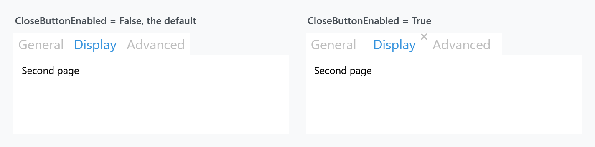

Title: MetroTabItem
Description: A TabItem with a close button
---

`MetroTabItem` is a `TabItem` with a close button and the four properties around it. It is what [MetroTabControl](metrotabcontrol) creates for you when you bind `ItemsSource`, and its style is based on `MahApps.Styles.TabItem`, so everything on the [TabControl styles](../styles/tabcontrol) page applies here too.



```xml
<mah:MetroTabControl>
    <mah:MetroTabItem Header="General" CloseButtonEnabled="True">
        <TextBlock Margin="10" Text="First page" />
    </mah:MetroTabItem>
</mah:MetroTabControl>
```

| Property | Type | Default | |
| --- | --- | --- | --- |
| `CloseButtonEnabled` | `bool` | `False` | whether the tab has a close button at all |
| `CloseButtonMargin` | `Thickness` | `0` | where that button sits |
| `CloseTabCommand` | `ICommand` | `null` | run when the button is clicked |
| `CloseTabCommandParameter` | `object` | `null` | what the command is handed |

## The button appears on the selected tab

Look at the figure: only *Display* has a cross, and all three tabs have `CloseButtonEnabled="True"`.

`CloseButtonEnabled` alone puts the button in the layout but leaves it `Hidden` — it takes up its space so the header does not jump. Two triggers make it `Visible`: the tab being **selected**, and the pointer being **over** it. That is the usual pattern for closable tabs, and it is why the figure shows one cross rather than three.

The button's size follows `HeaderedControlHelper.HeaderFontSize` through a converter, so it stays in proportion when you shrink the tab headers.

:::{.alert .alert-info}
`CloseButtonEnabled` and `CloseButtonMargin` are declared with `FrameworkPropertyMetadataOptions.Inherits`, but they are properties of `MetroTabItem`, not attached properties — you cannot write them on the `MetroTabControl`. Put them on each item, or in an `ItemContainerStyle`:

```xml
<mah:MetroTabControl.ItemContainerStyle>
    <Style BasedOn="{StaticResource {x:Type mah:MetroTabItem}}" TargetType="{x:Type mah:MetroTabItem}">
        <Setter Property="CloseButtonEnabled" Value="True" />
    </Style>
</mah:MetroTabControl.ItemContainerStyle>
```
:::

## What the close button does

The button raises no `Click` you can handle — a `CloseTabItemAction` behaviour is attached to it, and that runs a fixed sequence:

1. **The item's `CloseTabCommand`** is asked whether it can run. `CanExecute` returning `false` keeps the tab and ends it there; otherwise the command runs.
2. Then the control's `CloseThisTabItem` runs, which raises the closing event and, unless a handler says no, either executes the **control's** `CloseTabCommand` or removes the tab.

So there are three ways to keep a tab: a `CanExecute` of `false` on the item's command, a cancelled closing event on the [MetroTabControl](metrotabcontrol), or a `CloseTabCommand` on the control, which takes the removal over entirely.

:::{.alert .alert-info}
**The first of those three is new on `develop`.** In 2.4.11 the item's command could not stop anything: a `CanExecute` of `false` only meant the command did not run, and the tab went anyway.

The button itself is disabled while the answer is `false`, so the case only shows when the answer turns without the command saying that it has.
:::

```xml
<mah:MetroTabItem Header="Report"
                  CloseButtonEnabled="True"
                  CloseTabCommand="{Binding SaveBeforeCloseCommand}"
                  CloseTabCommandParameter="{Binding RelativeSource={RelativeSource Self}, Path=Header}" />
```

`CloseTabCommandParameter` does double duty: it is the parameter for the item's command, and the control's `CloseTabCommand` is handed it as well, falling back to the `MetroTabItem` itself where the item has none.

## The plain TabItem alternative

`TabControlHelper` has `CloseButtonEnabled`, `CloseTabCommand` and `CloseTabCommandParameter` as attached properties that work on an ordinary `TabItem`.

:::{.alert .alert-warning}
Those three are read **only by the Visual Studio tab style** in `Styles/VS/TabControl.xaml`. Under the ordinary MahApps styles they do nothing, and the close button in the figure above comes from `MetroTabItem`'s own properties. If you want closable tabs without the Visual Studio look, use `MetroTabItem`.
:::

## Related

[MetroTabControl](metrotabcontrol) for the closing pipeline seen from the other end, [TabControl](../styles/tabcontrol) for the look, and [TabControlHelper](../helper/tabcontrolhelper) for the underline and the transition.
