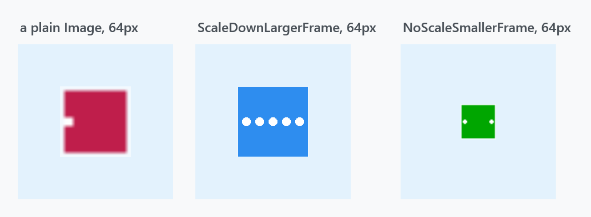
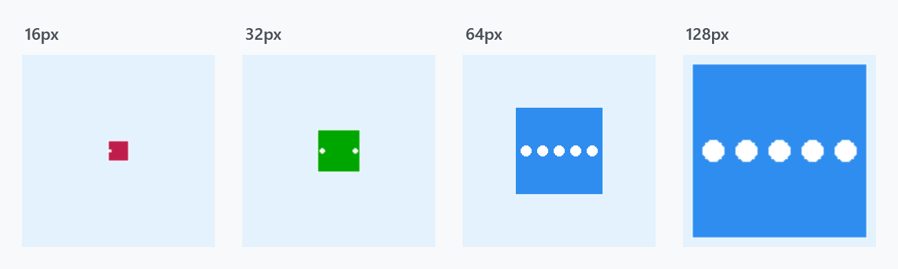

Title: MultiFrameImage
Description: An Image that picks the right frame out of a multi-resolution icon
---

An `.ico` file holds the same artwork several times over, drawn for different sizes. WPF's `Image` takes one of those frames and stretches it; `MultiFrameImage` picks the frame that suits the size it is being drawn at.



```xml
<mah:MultiFrameImage Width="64" Height="64" Source="app.ico" />
```

The icon in these figures is a demonstration one whose three frames are deliberately **different pictures** — crimson with one dot at 16px, green with two at 32px, blue with five at 128px — so you can see which frame was chosen. A real icon would draw the same thing at each size.

The left panel is a plain `Image` at 64px: it shows the decoder's first frame, the 16px one, blown up four times and blurred. The other two are the same file in a `MultiFrameImage`.

## The two modes

| `MultiFrameImageMode` | |
| --- | --- |
| **`ScaleDownLargerFrame`** | the default. Picks the first frame at least as large as the control's **longer** side and draws it stretched to fill. So it only ever scales *down* — unless no frame is big enough, in which case the largest is used. |
| `NoScaleSmallerFrame` | Picks the last frame no larger than the control's **shorter** side and draws it at its **native size, centred** — never scaled. If every frame is too big, the smallest is used. |

`ScaleDownLargerFrame` fills the control and stays sharp; `NoScaleSmallerFrame` guarantees pixel-exact artwork but may leave empty space around it, which is the green square floating in the third panel above.



Growing the control walks up the frames: at 16px the 16px frame, at 32px the 32px one, and from 64px upward the 128px frame scaled to fit.

The property is registered with `AffectsRender`, so changing it redraws immediately.

## Which frames it considers

When `Source` changes the control rebuilds its list:

```csharp
_frames.AddRange(
    decoder.Frames
           .GroupBy(f => f.PixelWidth * f.PixelHeight)
           .OrderBy(g => g.Key)
           .Select(g => g.OrderByDescending(f => f.Format.BitsPerPixel).First()));
```

Frames are grouped by pixel area and sorted smallest first, and **within one size only the frame with the highest colour depth survives**. An icon carrying a 4-bit and a 32-bit version of 32×32 contributes just the 32-bit one, so the old low-colour frames in a legacy icon never get picked.

:::{.alert .alert-warning}
**The `Source` has to be a `BitmapFrame`.** The control reads the frame list off `Source as BitmapFrame` and its `Decoder`. Anything else leaves the list empty, and `OnRender` then falls through to `base.OnRender` — a plain `Image` again, silently.

Setting `Source` in XAML is fine: the converter produces a `BitmapFrameDecode`, which is a `BitmapFrame`.

```xml
<!--  works: the converter yields a BitmapFrame  -->
<mah:MultiFrameImage Source="app.ico" />
```

Assigning a `BitmapImage` in code does **not** — `BitmapImage` derives from `BitmapSource`, not `BitmapFrame`, so the multi-frame handling is skipped without any error:

```csharp
// no: silently behaves like a plain Image
image.Source = new BitmapImage(new Uri("app.ico", UriKind.Relative));

// yes
image.Source = BitmapFrame.Create(new Uri("app.ico", UriKind.Relative));
```
:::

## Where it is used

[MetroWindow](metrowindow) draws its title-bar icon with a `MultiFrameImage`, which is what makes a proper multi-resolution `.ico` look right in the title bar at any DPI. The window exposes the mode as its own property:

```xml
<mah:MetroWindow Icon="app.ico" IconScalingMode="NoScaleSmallerFrame">
```

`IconScalingMode` is a `MultiFrameImageMode` and defaults to `ScaleDownLargerFrame`, the same as the control.

## Related

[MetroWindow](metrowindow) for `IconScalingMode` and the rest of the title bar. [FontIcon](fonticon) is the other way to put an icon on screen, from a symbol font rather than a bitmap.
