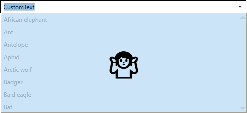

Title: MultiSelectionComboBox
Description: The documentation for the MultiSelectionComboBox

---

# Table of content
<!-- Start Document Outline -->

- [Table of content](#table-of-content)


<!-- End Document Outline -->

---

# Introduction

The `MultiSelectionComboBox` is like a normal `ComboBox`, but instead of limit the selection to one item the user is allowed to select multiple items.  

# The user interface


| No. | Description                                                                                                         |
|-----|---------------------------------------------------------------------------------------------------------------------|
| 01  | Displays the selected item(s), or, if the control is editable mode, a `TextBox` representing a concatenated `string` |
| 02  | This button opens or closes the popup (No. 03)                                                                      |
| 03  | A `DropDown` which displays all available items. Selected items are highlighted (blue background in the sample image)                   |

# Common Properties 

This control has all properties which are known from the normal `ComboBox` and in addition the following properties. 

| Property                              | Type                    | Description                                                                                                                                                                |
|---------------------------------------|-------------------------|----------------------------------------------------------------------------------------------------------------------------------------------------------------------------|
| AcceptsReturn                         | bool                    | Gets or sets if the `TextBox` accepts return (editable mode only)                                                                                                          |
| DisabledPopupOverlayContent           | object?                 | Gets or sets the content to render above the popup when the popup is disabled (see #todo)                                                                                  |
| DisabledPopupOverlayContentTemplate   | DataTemplate?           | Gets or sets the content template to render above the DropDown when the control has custom text (see #todo)                                                                |
| DropDownFooterContent                 | object?                 | Gets or sets the content of the popup footer                                                                                                                               |
| DropDownFooterContentStringFormat     | string?                 | Gets or sets the string format of the DropDown footer                                                                                                                      |
| DropDownFooterContentTemplate         | DataTemplate?           | Gets or sets the data template for the DropDown footer content                                                                                                             |
| DropDownFooterContentTemplateSelector | DataTemplateSelector?   | Gets or sets the data template selector for the popup footer content                                                                                                       |
| DropDownHeaderContent                 | object?                 | Gets or sets the content of the popup header                                                                                                                               |
| DropDownHeaderContentStringFormat     | string?                 | Gets or sets the string format of the popup header                                                                                                                         |
| DropDownHeaderContentTemplate         | DataTemplate?           | Gets or sets the data template for the popup header content                                                                                                                |
| DropDownHeaderContentTemplateSelector | DataTemplateSelector?   | Gets or sets the data template selector for the popup header content                                                                                                       |
| EditableTextStringComparision         | StringComparison        | Gets or Sets the StringComparison that is used to check if the entered Text matches to the SelectedItems                                                                   |
| HasCustomText                         | bool                    | Indicates if the text is user defined. This property is read-only                                                                                                          |
| InterceptKeyboardSelection            | bool                    | Gets or sets if the user can select items from the keyboard, e.g. with the ▲ ▼ Keys. This property is only applied when the SelectionMode is SelectionMode.Single.         |
| InterceptMouseWheelSelection          | bool                    | Gets or sets if the user can select items by mouse wheel. This property is only applied when the SelectionMode is SelectionMode.Single.                                    |
| IsDropDownFooterVisible               | bool                    | Gets or sets if the footer in the DropDown is visible                                                                                                                      |
| IsDropDownHeaderVisible               | bool                    | Gets or sets if the header in the DropDown is visible                                                                                                                      |
| ObjectToStringComparer                | ICompareObjectToString? | Gets or sets a function that is used to check if the entered Text matches an object that should be selected.                                                               |
| OrderSelectedItemsBy                  | SelectedItemsOrderType  | Gets or sets how the SelectedItems should be sorted.                                                                                                                       |
| SelectedItemContainerStyle            | Style?                  | Gets or sets the Style that is applied to the selected items                                                                                                               |
| SelectedItemContainerStyleSelector    | StyleSelector?          | Gets or sets the StyleSelector that is applied to the selected items                                                                                                       |
| SelectedItems                         | IList?                  | Gets a read-only list which holds the currently selected items.                                                                                                             |
| SelectedItemsPanelTemplate            | ItemsPanelTemplate?     | Gets or sets the template that defines the panel that controls the layout of the selected items.                                                                           |
| SelectedItemStringFormat              | string?                 | Gets or sets a how to format the selected items if they are displayed as strings.                                                                                          |
| SelectedItemTemplate                  | DataTemplate?           | Gets or sets the DataTemplate used to display the selcted items                                                                                                            |
| SelectedItemTemplateSelector          | DataTemplateSelector?   | Gets or sets the data template selector for the selected items                                                                                                             |
| SelectionMode                         | SelectionMode           | Gets or sets the SelectionMode                                                                                                                                             |
| SelectItemsFromTextInputDelay         | int                     | Gets or Sets the delay in milliseconds to wait before the selection is updated during text input. If this value is -1 the selection will not be updated during text input. <br>> Note: You also need to set ObjectToStringComparer to get this to work. |
| Separator                             | string?                 | Gets or sets the Separator which will be used if the ComboBox is editable.                                                                                                 |
| StringToObjectParser                  | IParseStringToObject?   | Gets or Sets a parser-class that implements IParseStringToObject (see #todo)                                                                                               |

# Styles

## MultiSelectionComboBox-Styles

MahApps ships two build in styles for this control.

The default style (`MahApps.Styles.MultiSelectionComboBox`) wraps the selected items, if not all fits into a single line:


If you want a single line you can use `MahApps.Styles.MultiSelectionComboBox.Horizontal` which will show a horizontal `ScrollViewer`, if not all items fit into the available space.


## ItemContainer-Styles

MahApps ships two build in styles for the item container visible when the `DropDown` is open. 

The default style (`MahApps.Styles.MultiSelectionComboBoxItem`) looks like the one from the normal `ComboBox`. 

If you want to present `CheckBoxes` to the user you can use the `MahApps.Styles.MultiSelectionComboBoxItem.CheckBox` style: 


## SelectedItemContainer-Styles

Also for this MahApps ships two build in styles. Please note that these are only applied if `IsEditable=false`.

The default one wraps each item in a nugget like container:


If you want to provide an option to remove from the selected items your can use `MahApps.Styles.MulitselectionComboBoxSelectedItem.Removeable` which will add a delete button next to each item: 


# Selection

## SelectionMode

The `MultiSelectionComboBox` supports all [`SelectionModes`](https://docs.microsoft.com/en-us/dotnet/api/system.windows.controls.selectionmode) which are known from other controls with multi selection support like `ListBox`. 

## SelectedItemsOrderType

This `enum` defines how the selected items should be presented to the user. The following values are possible: 

| Value            | Description                                                                           |
|------------------|---------------------------------------------------------------------------------------|
| SelectedOrder    | Displays the selected items in the same order as they were selected                   |
| ItemsSourceOrder | Displays the selected items in the same order as they are stored in the `ItemsSource` |


# Text processing
## Separator
The `Separator` is used to concatenate the selected items into one single string. if the text comes from user input the `Separator` is also used to split the input string into fragments which will be used to select the requested items. 

> **Note**: Take care which Separator to use. Ideally it should not be a valid (sub)-string of your items, as this may mess up with selection.

## Custom text
If the text entered into the editable `TextBox` does not match the `string` representation of the `SelectedItems` the `DropDown` will show an overlay above the `Items` and will disable selection. This will prevent loss any user input. The property `HasCustomText` will be set to `true` in this case. 


*Build-in overlay*

### Customize the overlay
If you don't like the build-in overlay you can roll your own as shown below. 

```xml
<mah:MultiSelectionComboBox ItemsSource="{Binding Animals}"
                            IsEditable="True"
                            Text="CustomText" >
    <mah:MultiSelectionComboBox.DisabledPopupOverlayContentTemplate>
        <DataTemplate>
            <!-- Note: mah:MultiSelectionComboBox.ClearContentCommand will reset the text to match the SelectedItems representation if executed -->
            <Button Background="{DynamicResource MahApps.Brushes.Accent4}" 
                    BorderThickness="0"
                    Command="{x:Static mah:MultiSelectionComboBox.ClearContentCommand}">
                <TextBlock Text="🤷" 
                           VerticalAlignment="Center" 
                           HorizontalAlignment="Center" 
                           FontSize="50" />
            </Button>
        </DataTemplate>
    </mah:MultiSelectionComboBox.DisabledPopupOverlayContentTemplate>
</mah:MultiSelectionComboBox>
```

The result will look like this:



## Selecting items from text input
If the control is editable and you have set a `ObjectToStringComparer`, the `MultiSelectionComboBox` will try to select the items from the user input. The build-in comparer will compare the input string fragments with the objects string representation while taking the [`StringComparison`](https://docs.microsoft.com/en-us/dotnet/api/system.stringcomparison) into account. 

### Basic Example
```xml
<mah:MultiSelectionComboBox ItemsSource="{Binding Animals}"            
                            SelectionMode="Multiple"
                            IsEditable="True"
                            Separator=", "                                                  // The Separator must be defined for automatic item selection
                            SelectItemsFromTextInputDelay="200"                             // This is optional. If it is set to -1, it means the items will be selected only after LostFocus
                            EditableTextStringComparision="OrdinalIgnoreCase"               // This is optional
                            ObjectToStringComparer="{mah:DefaultObjectToStringComparer}"    // Here we use the build in comparer, but you can also use your own
                            />
```

### Custom ObjectToStringComparer Example
You can use any class that implements the `ICompareObjectToString` interface to compare your items to the entered text. For this example lets assume you have the following class `User` where you want to select the items by `Userame` or `MailAddress`.

```cs
public class User
{
    public string Username {get; set;}
    public string Name {get; set;}
    public string GivenName {get; set;}
    public string MailAddress {get; set;}
}
```

We can now implement the interface as shown below: 

```cs
public class MyUserToStringComparer : ICompareObjectToString
{
    // This function is expected to be implemented. Returns true if the item matches, otherise false.
    public bool CheckIfStringMatchesObject(
        string? input,                      // The text fragment to test 
        object? objectToCompare,            // The item to test for match
        StringComparison stringComparison,  // The string comparison to use
        string? stringFormat)               // the string format to use
    {
        // we cast the object to compare to a user.
        var user = objectToCompare as User;
        
        // if the input is null or the user is null we return false. 
        if (input is null || user is null)
        {
            return false;
        }
        
        // If either the Username or the MailAddress matches the provided  
        // input string we return true, otherwise we return false.
        return input.Equals(user.Username, stringComparison) 
               || input.Equals(user.MailAddress, stringComparison);
    }
}

```

## Adding new items from text input 
If the control is editable and you have set a `StringToObjectParser`, the `MultiSelectionComboBox` will try to create a new item if the item was not found (see <a href="#selecting-items-from-text-input" target="_blank">Selecting items from text input</a>). The build-in parser will try to use reflection to create a new item from the input string, but you can also provide your own implementation.

### Basic Example
```xml
<mah:MultiSelectionComboBox ItemsSource="{Binding Animals}"
                            SelectionMode="Multiple"
                            IsEditable="True"
                            Separator=", "
                            SelectItemsFromTextInputDelay="200"
                            EditableTextStringComparision="OrdinalIgnoreCase"
                            ObjectToStringComparer="{mah:DefaultObjectToStringComparer}" 
                            StringToObjectParser="{x:Static mah:DefaultStringToObjectParser.Instance}" // We use the build in parser here
                            />
```

### Custom StringToObjectParser Example
You can use any class that implements the `IParseStringToObject` interface to parse the user input to a new object. The interface has one member called `TryCreateObjectFromString`. Let's assume we have a `List<string>` called `Animals`. The user can add new animals, but before adding a new animal, we want the user to confirm the input. 

```cs
public class MyObjectParser : IParseStringToObject
{
    public bool TryCreateObjectFromString(
        string? input,                      // The input string to parse
        out object? result,                 // return the object here if successful, otherwise return null
        CultureInfo? culture = null,        // The culture which should be used to parse. This parameter is optional
        string? stringFormat = null,        // The string format to apply. This parameter is optional
        Type? elementType = null)           // the Type to which the input should be converted to. This parameter is optional
    {
        // if we got an empty string, we return false and set the result to null
        if (string.IsNullOrWhiteSpace(input))
        {
            result = null;
            return false;
        }

        // We ask the user for confirmation
        if (MessageBox.Show($"Do you want to add \"{input}\" to the animals list?", "Add Animal", MessageBoxButtons.YesNo) == DialogResult.Yes)
        {
            result = input; // The user accepted this item. As our List contains only strings, we can just return the input string. 
            return true;
        }
        else
        {
            result = null;
            return false;
        }
    }
}
```