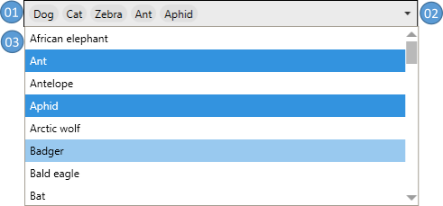
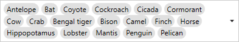
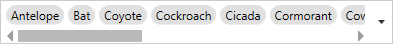
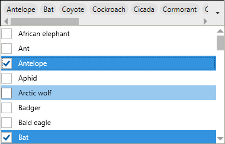
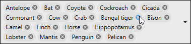
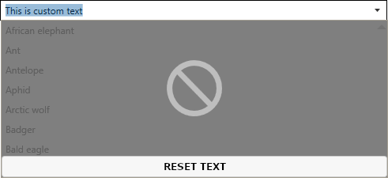
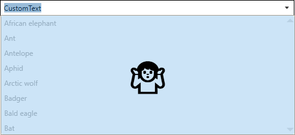

Title: MultiSelectionComboBox
Description: A combo box that keeps more than one answer
---

`MultiSelectionComboBox` is a `ComboBox` that holds more than one pick. Everything a `ComboBox` can do it can do, and the properties below come on top.

:::{.alert .alert-info}
This control is not in 2.4.11. It arrives with the next release and is in the 3.0.0 prereleases.
:::



| No. | |
| --- | --- |
| 01 | the picks, or a text box holding them as one string while the control is editable |
| 02 | the chevron that opens and closes the list |
| 03 | the list, with the picks marked |

## Selection

`SelectionMode` takes `Single`, `Multiple` or `Extended`, the [same three](https://docs.microsoft.com/dotnet/api/system.windows.controls.selectionmode) a `ListBox` takes, and starts out `Single`. Anything else is rejected, so a fourth value cannot be set by mistake.

| Property | Type | Default | |
| --- | --- | --- | --- |
| `SelectionMode` | `SelectionMode` | `Single` | how many items may be picked |
| `SelectedItems` | `IList` | `null` | what is picked, in `OrderSelectedItemsBy` order; read-only |
| `DisplaySelectedItems` | `IEnumerable` | `null` | the same in the order they are drawn; read-only |
| `OrderSelectedItemsBy` | `SelectedItemsOrderType` | `SelectedOrder` | `SelectedOrder` keeps the order they were picked in, `ItemsSourceOrder` the order they stand in the source |
| `InterceptKeyboardSelection` | `bool` | `true` | whether ▲ and ▼ move the pick; `Single` only |
| `InterceptMouseWheelSelection` | `bool` | `true` | whether the wheel moves the pick; `Single` only |

`SelectedItem`, `SelectedIndex` and `SelectedValue` are declared anew on the control, hiding the three a `ComboBox` brings. `SelectedItems` is the one to read wherever more than one item may be picked.

## Drawing the picks

| Property | Type | Default | |
| --- | --- | --- | --- |
| `SelectedItemTemplate` | `DataTemplate` | `null` | what one pick is made of |
| `SelectedItemTemplateSelector` | `DataTemplateSelector` | `null` | one template per pick |
| `SelectedItemStringFormat` | `string` | `null` | the format the picks are written in |
| `SelectedItemContainerStyle` | `Style` | `null` | the container around one pick |
| `SelectedItemContainerStyleSelector` | `StyleSelector` | `null` | one style per pick |
| `SelectedItemsPanelTemplate` | `ItemsPanelTemplate` | `null` | the panel the picks are laid out in |
| `TextWrapping` | `TextWrapping` | `NoWrap` | whether the text in the field wraps |
| `HorizontalScrollBarVisibility` `VerticalScrollBarVisibility` | `ScrollBarVisibility` | `Auto` | the scroll bars of the field |

## The header and the footer of the list

Both are hidden to begin with and neither is drawn until it is switched on.

| Property | Type | Default | |
| --- | --- | --- | --- |
| `IsDropDownHeaderVisible` `IsDropDownFooterVisible` | `bool` | `false` | whether they are drawn |
| `DropDownHeaderContent` `DropDownFooterContent` | `object` | `null` | what stands in them |
| `DropDownHeaderContentTemplate` `DropDownFooterContentTemplate` | `DataTemplate` | `null` | what that content is made of |
| `DropDownHeaderContentTemplateSelector` `DropDownFooterContentTemplateSelector` | `DataTemplateSelector` | `null` | one template per content |
| `DropDownHeaderContentStringFormat` `DropDownFooterContentStringFormat` | `string` | `null` | the format the content is written in |

## The styles

The default, `MahApps.Styles.MultiSelectionComboBox`, wraps the picks onto a second line when they do not fit on one.



`MahApps.Styles.MultiSelectionComboBox.Horizontal` keeps them on one line and gives them a horizontal scroll bar instead.



### The rows in the list

`MahApps.Styles.MultiSelectionComboBoxItem` is the default and looks like a row of an ordinary `ComboBox`. `MahApps.Styles.MultiSelectionComboBoxItem.CheckBox` puts a check box in front of every row, which says what is picked without relying on the highlight.



The two Windows sets bring their own rows along, `MahApps.Styles.MultiSelectionComboBoxItem.Win10` and `…WinUI` with `…CheckBox.Win10` and `…CheckBox.WinUI` beside them, and the set picks the plain one for you. All four share the one template, `MahApps.Templates.MultiSelectionComboBoxItem.CheckBox`, so what tells them apart is the colours.

### The containers around the picks

These apply while `IsEditable` is `False`, since an editable control shows one string rather than a row of containers.

The default wraps every pick in a nugget. `MahApps.Styles.MultiSelectionComboBoxSelectedItem.Removable` adds a delete button to each one, which runs `MultiSelectionComboBox.RemoveItemCommand` against the pick it sits on.



The two Windows sets bring their own nuggets along, `MahApps.Styles.MultiSelectionComboBoxSelectedItem.Win10` and `…WinUI` with `…Removable.Win10` and `…Removable.WinUI` beside them, and the set picks the plain one for you. A nugget of those two is a layer over the box rather than a colour of its own, because the box of either set changes its fill under the pointer and again while the list is down, and a nugget in a fixed grey would land on one of those colours.

### The Windows looks

:::{.alert .alert-info}
New on `develop`.
:::

`MahApps.Styles.MultiSelectionComboBox.Win10` and `MahApps.Styles.MultiSelectionComboBox.WinUI` put the control in the look of the [Windows 10](../stylevariants/win10) and the [WinUI](../stylevariants/winui) set. Either one is the combo box of that set holding more than one answer: the same fill, the same frame, the same padding, the same chevron and the same rows in the list that comes down, so the two standing next to each other in a form are the same height and the same colour. The WinUI one rounds its corners and says the focus with the stronger line along its bottom edge.

```xml
<mah:MultiSelectionComboBox Width="320"
                            ItemsSource="{Binding Names}"
                            SelectionMode="Multiple"
                            Style="{DynamicResource MahApps.Styles.MultiSelectionComboBox.WinUI}" />
```

Merging one of the two sets gives every one of these boxes that look without naming the style.

## The text of an editable control

`Separator` is what the picks are joined with, and what typed text is split on again. It is worth choosing one that cannot turn up inside an item, since a separator that can is a separator the control will split on in the wrong place.

| Property | Type | Default | |
| --- | --- | --- | --- |
| `Separator` | `string` | `null` | what the picks are joined with and split on |
| `EditableTextStringComparision` | `StringComparison` | `Ordinal` | how typed text is matched against the items |
| `AcceptsReturn` | `bool` | `false` | whether Return puts a line break in the field |
| `HasCustomText` | `bool` | `false` | whether what stands in the field is something the user typed; read-only |
| `SelectItemsFromTextInputDelay` | `int` | `-1` | how long to wait before matching typed text, in milliseconds; `-1` waits for the field to lose focus |

### When the text no longer matches the picks

Text in the field that does not read back as the picks is something the user typed and has not finished. `HasCustomText` goes `true`, and the list that comes down is covered by an overlay and stops taking picks, so nothing the user wrote is thrown away behind their back.



`DisabledPopupOverlayContent` and `DisabledPopupOverlayContentTemplate` put something else there. `MultiSelectionComboBox.ClearContentCommand` is what puts the text back to the picks, so a button running it is the way out of the state.

```xml
<mah:MultiSelectionComboBox ItemsSource="{Binding Animals}"
                            IsEditable="True"
                            Text="CustomText">
    <mah:MultiSelectionComboBox.DisabledPopupOverlayContentTemplate>
        <DataTemplate>
            <Button Background="{DynamicResource MahApps.Brushes.Accent4}"
                    BorderThickness="0"
                    Command="{x:Static mah:MultiSelectionComboBox.ClearContentCommand}">
                <TextBlock HorizontalAlignment="Center"
                           VerticalAlignment="Center"
                           FontSize="50"
                           Text="🤷" />
            </Button>
        </DataTemplate>
    </mah:MultiSelectionComboBox.DisabledPopupOverlayContentTemplate>
</mah:MultiSelectionComboBox>
```



## Picking items by typing

An editable control with an `ObjectToStringComparer` picks the items the typed text names. The comparer that comes with the library, `DefaultObjectToStringComparer`, holds each fragment against the string the item writes itself as, under the `EditableTextStringComparision` in force.

`Separator` has to be set for this, since it is what the typed text is cut into fragments along.

```xml
<mah:MultiSelectionComboBox ItemsSource="{Binding Animals}"
                            EditableTextStringComparision="OrdinalIgnoreCase"
                            IsEditable="True"
                            ObjectToStringComparer="{mah:DefaultObjectToStringComparer}"
                            SelectItemsFromTextInputDelay="200"
                            SelectionMode="Multiple"
                            Separator=", " />
```

### A comparer of your own

Anything implementing `ICompareObjectToString` can do the matching instead. Say the items are users and either the user name or the mail address should name one:

```csharp
public class User
{
    public string Username { get; set; }
    public string Name { get; set; }
    public string GivenName { get; set; }
    public string MailAddress { get; set; }
}
```

```csharp
public class MyUserToStringComparer : ICompareObjectToString
{
    public bool CheckIfStringMatchesObject(
        string? input,                      // the fragment that was typed
        object? objectToCompare,            // the item to hold it against
        StringComparison stringComparison,  // the comparison in force
        string? stringFormat)               // the format in force
    {
        if (input is null || objectToCompare is not User user)
        {
            return false;
        }

        return input.Equals(user.Username, stringComparison)
               || input.Equals(user.MailAddress, stringComparison);
    }
}
```

## Adding items by typing

A `StringToObjectParser` on top of that makes a new item out of a fragment that names nothing in the source. `DefaultStringToObjectParser` builds one by reflection, which is enough for a list of strings or of anything with a type converter.

```xml
<mah:MultiSelectionComboBox ItemsSource="{Binding Animals}"
                            EditableTextStringComparision="OrdinalIgnoreCase"
                            IsEditable="True"
                            ObjectToStringComparer="{mah:DefaultObjectToStringComparer}"
                            SelectItemsFromTextInputDelay="200"
                            SelectionMode="Multiple"
                            Separator=", "
                            StringToObjectParser="{x:Static mah:DefaultStringToObjectParser.Instance}" />
```

Two events sit around the parser. `AddingItem` is raised before the new item goes in, carrying the `Input`, the `ParsedObject` the parser made, the `TargetList` it is bound for and the `Parser` that did the work. `ParsedObject` can be replaced there, and either setting `Accepted` to `False` or marking the event `Handled` keeps the item out. The list it would go into is the `ItemsSource` itself, so a source that is read-only never gains an item however the event is answered. `AddedItem` follows once it is in, with the `AddedItem` itself and the `TargetList` it went into.

### A parser of your own

`IParseStringToObject` has one member. The one below asks before it adds, which is something a parser can do and the control cannot.

```csharp
public class MyObjectParser : IParseStringToObject
{
    public bool TryCreateObjectFromString(
        string? input,                      // the text to parse
        out object? result,                 // the object, or null
        CultureInfo? culture = null,        // optional
        string? stringFormat = null,        // optional
        Type? elementType = null)           // optional, the type to parse to
    {
        result = null;

        if (string.IsNullOrWhiteSpace(input))
        {
            return false;
        }

        if (MessageBox.Show($"Do you want to add \"{input}\" to the animals list?",
                            "Add animal",
                            MessageBoxButton.YesNo) != MessageBoxResult.Yes)
        {
            return false;
        }

        // the list holds strings, so the input is the item
        result = input;
        return true;
    }
}
```

## Related

[AutoSuggestBox](autosuggestbox) is the other box that answers as you type, with one pick rather than several. The plain drop-down is described under [ComboBox](../styles/combobox), and [ComboBoxHelper](../helper/comboboxhelper) carries the knobs both of them read.
