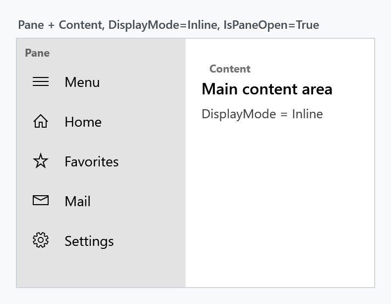
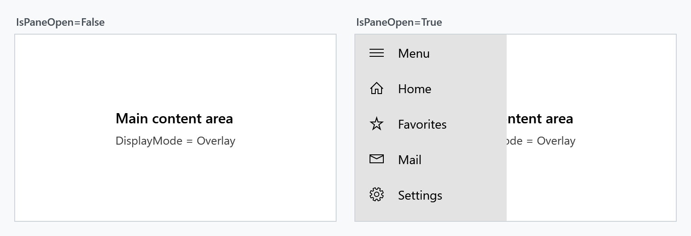
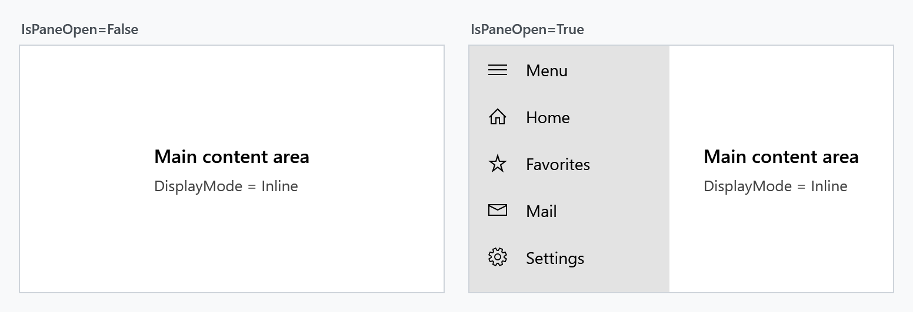
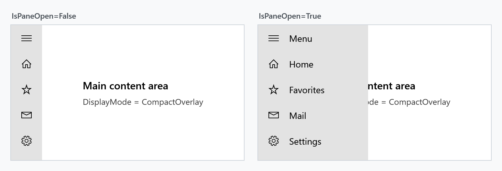
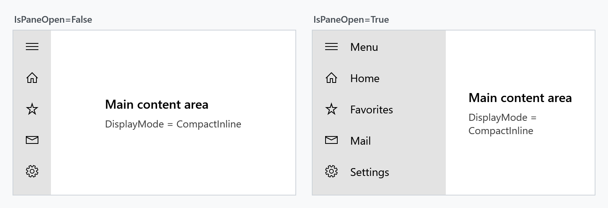
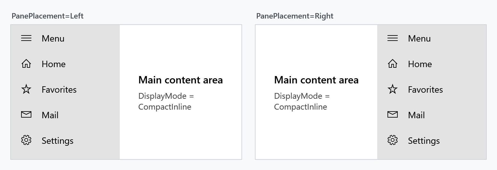
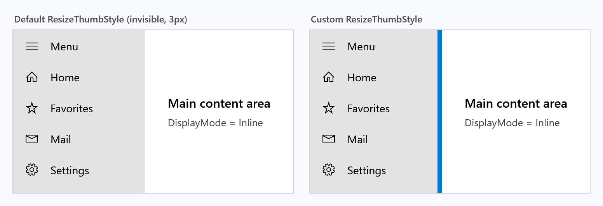
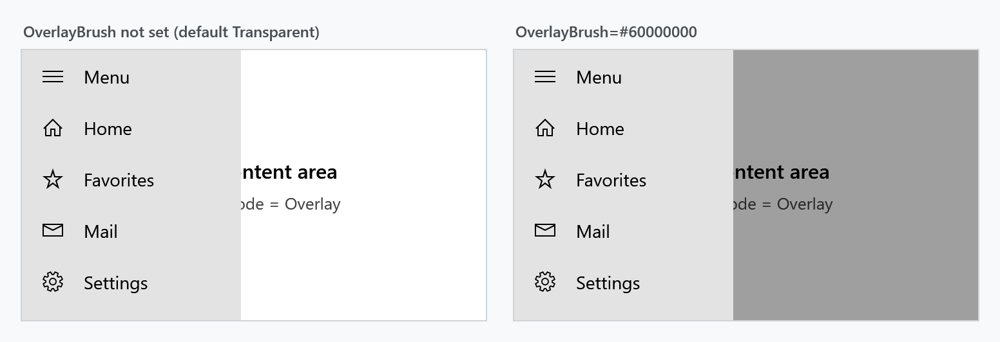

Title: SplitView
Description: The SplitView control
---

The `SplitView` is a container with two areas: a **pane** that can be expanded and collapsed, and the **content** next to it. It is the control behind the navigation drawer pattern known from Windows 10/11 apps — a narrow strip of icons that slides open into a full menu.



## Basic usage

`SplitView` derives from `Control`, not from `ContentControl`. Both `Pane` and `Content` are of type `UIElement`, so they take a single element each — not arbitrary objects. Plain text has to be wrapped in a `TextBlock`.

`Content` is the XAML content property, so the child element of a `SplitView` becomes the content area:

```xml
<mah:SplitView x:Name="SplitView"
               DisplayMode="CompactInline"
               IsPaneOpen="True"
               CompactPaneLength="48"
               OpenPaneLength="220">

    <mah:SplitView.Pane>
        <StackPanel>
            <Button Content="Home" />
            <Button Content="Settings" />
        </StackPanel>
    </mah:SplitView.Pane>

    <!-- everything else is the Content -->
    <Grid>
        <TextBlock Text="Main content area" />
    </Grid>

</mah:SplitView>
```

Toggling the pane is a matter of flipping `IsPaneOpen`, which binds nicely to a `ToggleButton`:

```xml
<ToggleButton IsChecked="{Binding IsPaneOpen, ElementName=SplitView}"
              Content="Menu" />
```

## DisplayMode

`DisplayMode` decides two things at once: whether the collapsed pane stays partly visible, and whether the open pane pushes the content aside or covers it.

| Value | Collapsed | Open |
| --- | --- | --- |
| `Overlay` (default) | pane is hidden completely | covers the content, no layout change |
| `Inline` | pane is hidden completely | pushes the content aside, takes up layout space |
| `CompactOverlay` | `CompactPaneLength` stays visible | covers the content |
| `CompactInline` | `CompactPaneLength` stays visible | pushes the content aside |

The `Compact*` modes are what you want for the icon-strip navigation pattern: lay the pane content out so that the first `CompactPaneLength` pixels hold the icons, and the labels appear as the pane opens.

**Overlay**



**Inline**



**CompactOverlay**



**CompactInline**



In the two overlay modes the pane is closed again when the user clicks the content area next to it (light dismiss). The inline modes have no such behaviour.

## PanePlacement

`PanePlacement` puts the pane on the `Left` (default) or on the `Right`.



## Pane lengths

| Property | Effective default | Meaning |
| --- | --- | --- |
| `OpenPaneLength` | `320` | width of the pane while it is open |
| `CompactPaneLength` | `48` | width that stays visible in the `Compact*` modes |
| `MinimumOpenPaneLength` | `100` | lower bound for `OpenPaneLength` |
| `MaximumOpenPaneLength` | `500` | upper bound for `OpenPaneLength` |

`OpenPaneLength` is coerced into the range described by the other three, and additionally never exceeds the control's own `ActualWidth`. In the `Compact*` modes the lower bound is the larger of `CompactPaneLength` and `MinimumOpenPaneLength` — an open pane can never be narrower than its own compact strip.

## Resizing the open pane

Set `CanResizeOpenPane` to `True` and the user can drag the edge between pane and content to change `OpenPaneLength`, within the minimum and maximum above.

The drag handle is a `MetroThumb` styled by `ResizeThumbStyle`. Its default style, `MahApps.Styles.MetroThumb.SplitView.Resize`, is 3px wide with a transparent background — the only hint the user gets is the resize cursor. Supply your own style to make it visible:



```xml
<mah:SplitView CanResizeOpenPane="True"
               MinimumOpenPaneLength="120"
               MaximumOpenPaneLength="400">
    <mah:SplitView.ResizeThumbStyle>
        <Style TargetType="mah:MetroThumb"
               BasedOn="{StaticResource MahApps.Styles.MetroThumb.SplitView.Resize}">
            <Setter Property="Background" Value="{DynamicResource MahApps.Brushes.Accent}" />
            <Setter Property="Width" Value="6" />
        </Style>
    </mah:SplitView.ResizeThumbStyle>
    <!-- Pane and Content -->
</mah:SplitView>
```

## Brushes

`PaneBackground` and `PaneForeground` colour the pane area. `OverlayBrush` is painted over the content while the pane is open in one of the overlay modes; it is `Transparent` by default, so nothing dims unless you ask for it.



```xml
<mah:SplitView DisplayMode="Overlay"
               OverlayBrush="#60000000"
               PaneBackground="{DynamicResource MahApps.Brushes.Accent}"
               PaneForeground="{DynamicResource MahApps.Brushes.IdealForeground}" />
```

## Events

`PaneClosing` is raised before the pane closes and can veto it through `SplitViewPaneClosingEventArgs.Cancel`. `PaneClosed` follows once the pane actually closed.

```csharp
private void SplitView_PaneClosed(object sender, EventArgs e)
{
    this.viewModel.IsNavigationVisible = false;
}
```

### Cancelling leaves IsPaneOpen behind

Vetoing keeps the pane on screen and suppresses `PaneClosed`, but it does **not** put `IsPaneOpen` back: the property stays `false` while the pane is still drawn open. And because the value never changed back, assigning `false` a second time is a no-op — `PaneClosing` is not raised again, so the veto only ever works once.

Restore the property yourself whenever you cancel:

```csharp
private void SplitView_PaneClosing(object sender, SplitViewPaneClosingEventArgs e)
{
    if (!this.viewModel.HasUnsavedChanges)
    {
        return;
    }

    e.Cancel = true;

    // Bring IsPaneOpen back in sync with the pane that stayed open. Deferred,
    // because we are inside the changed callback of that very property.
    var splitView = (SplitView)sender;
    splitView.Dispatcher.BeginInvoke(new Action(
        () => splitView.SetCurrentValue(SplitView.IsPaneOpenProperty, true)));
}
```

## Property reference

| Property | Type | Effective default |
| --- | --- | --- |
| `CanResizeOpenPane` | `bool` | `False` |
| `CompactPaneLength` | `double` | `48` |
| `Content` | `UIElement` | `null` |
| `DisplayMode` | `SplitViewDisplayMode` | `Overlay` |
| `IsPaneOpen` | `bool` | `False` |
| `MaximumOpenPaneLength` | `double` | `500` |
| `MinimumOpenPaneLength` | `double` | `100` |
| `OpenPaneLength` | `double` | `320` |
| `OverlayBrush` | `Brush` | `Transparent` |
| `Pane` | `UIElement` | `null` |
| `PaneBackground` | `Brush` | `SystemColors.ControlLightBrushKey` |
| `PaneForeground` | `Brush` | `MahApps.Brushes.Text` |
| `PanePlacement` | `SplitViewPanePlacement` | `Left` |
| `ResizeThumbStyle` | `Style` | `MahApps.Styles.MetroThumb.SplitView.Resize` |
| `TemplateSettings` | `SplitViewTemplateSettings` | read-only |

| Event | Event args | Purpose |
| --- | --- | --- |
| `PaneClosing` | `SplitViewPaneClosingEventArgs` | raised before closing, can cancel |
| `PaneClosed` | `EventArgs` | raised after closing |

"Effective default" is the value a `SplitView` actually starts with. Most of these come from the control's default style rather than from the dependency property metadata, and the two do not always agree — the values above are the ones that apply in practice.

`TemplateSettings` exposes the lengths the control template needs as `TemplateBinding` sources. It is only relevant when you retemplate the `SplitView`.

## Notes on data binding

The pane is attached with `AddLogicalChild`, which does not propagate the `DataContext` on its own. `SplitView` compensates for that and pushes its own `DataContext` onto the pane whenever it changes, so bindings inside the pane resolve against the same view model as the rest of the control.
