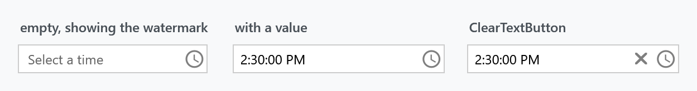
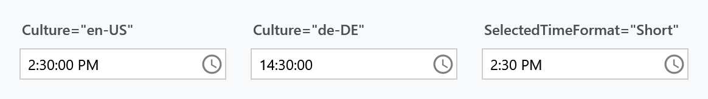
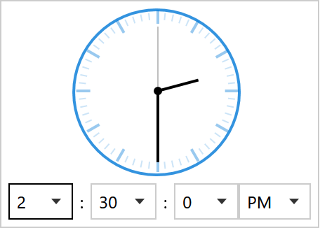
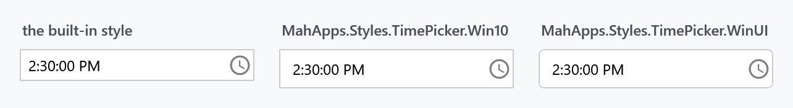

Title: TimePicker
Description: A time field with a clock and hour, minute and AM/PM lists
---

`TimePicker` is a text field with a drop-down for picking a time. It is [DateTimePicker](DateTimePicker) without the calendar half — both derive from `TimePickerBase` and share one control template.



```xml
<mah:TimePicker Width="170" SelectedDateTime="{Binding Departure}" />
```

## How it differs from DateTimePicker

Almost nothing separates the two, which is worth knowing because everything on the [DateTimePicker](DateTimePicker) page applies here as well.

| | |
| --- | --- |
| `IsDatePickerVisible` | `TimePicker`'s constructor sets it to `False`, and the shared template shows the calendar only when it is `True` |
| the drop-down button | a clock glyph instead of a calendar one, through `DatePickerHelper.DropDownButtonContent` |
| the watermark | *Select a time* instead of *Select a date* |
| typing into the field | parsed as a time; the date part of `SelectedDateTime` is kept |

:::{.alert .alert-info}
`IsDatePickerVisible` is a **read-only** dependency property with a `protected` setter, so you cannot turn the calendar back on from XAML. Use a [DateTimePicker](DateTimePicker) if you want both halves.
:::

## The value

`SelectedDateTime` is a `DateTime?`, not a `TimeSpan` — the same property the `DateTimePicker` uses. When the user types a time, `TimePicker` parses it and keeps whatever date was there:

```csharp
this.SetCurrentValue(SelectedDateTimeProperty,
                     this.SelectedDateTime.GetValueOrDefault().Date + timeSpan.TimeOfDay);
```

:::{.alert .alert-warning}
On an empty picker the date part depends on how the time was set, and the two ways disagree.

**Typing** a time keeps `SelectedDateTime.GetValueOrDefault().Date`, which is `default(DateTime)` when nothing was selected — so typing 14:30 gives you **0001-01-01 14:30**.

**Picking** from the drop-down runs through `ClockSelectedTimeChanged` instead, which falls back to today — so the same 14:30 gives you **today at 14:30**.

If your view model wants a time on a particular day, seed `SelectedDateTime` with that date first, or take `.TimeOfDay` from what you get back.
:::

:::{.alert .alert-info}
**`DateTimeKind` is `Unspecified` on `develop`. Before that it depended on the order.** Picking the time first produced `DateTimeKind.Local`, because that path fell back to `DateTime.Today`, while the calendar and the text field produced `Unspecified`. A view model bound to `SelectedDateTime` saw two different kinds from one control.

This is not in 2.4.11, nor in the 3.0 release candidate. Fixed for the next release in [#4551](https://github.com/MahApps/MahApps.Metro/issues/4551); all three paths report `Unspecified` now. The date the drop-down falls back to is unchanged, it is still today.
:::

## Format and culture



| Property | Type | Default | |
| --- | --- | --- | --- |
| `SelectedTimeFormat` | `TimePickerFormat` | **`Long`** | `Long` shows seconds, `Short` does not |
| `Culture` | `CultureInfo` | `null` | formatting and the twelve- or twenty-four-hour clock |
| `IsReadOnly` | `bool` | `False` | |

The default is `Long`, which is why an untouched picker already shows `2:30:00 PM` rather than `2:30 PM`.

With no `Culture` the control follows the thread's culture, and `Language` changes are watched too. `de-DE` gives a twenty-four-hour clock and drops the AM/PM list from the drop-down.

## The drop-down


| Property | Type | Default | |
| --- | --- | --- | --- |
| `IsClockVisible` | `bool` | `True` | the analogue clock face |
| `PickerVisibility` | `TimePartVisibility` | `HourMinute` | which lists appear |
| `HandVisibility` | `TimePartVisibility` | `HourMinute` | which hands the clock draws |
| `IsDropDownOpen` | `bool` | `False` | |

`TimePartVisibility` is a flags enum — `Hour`, `Minute`, `Second`, plus the combinations `HourMinute` and `All`. Seconds are off in both places by default, so turning them on takes two properties:

```xml
<mah:TimePicker PickerVisibility="All" HandVisibility="All" />
```



`SourceHours`, `SourceMinutes` and `SourceSeconds` replace what the lists offer — this is how you build a picker that only offers quarter hours:

```xml
<mah:TimePicker SourceMinutes="{Binding QuarterHours}" />
```

Each has a matching `HoursItemStringFormat`, `MinutesItemStringFormat` and `SecondsItemStringFormat`.

## Two nicer alternatives

The same two drop-in dictionaries that restyle the [DateTimePicker](DateTimePicker) carry a `TimePicker` style each.



| | | |
| --- | --- | --- |
| **[`Controls.DateTimePicker.Win10.xaml`](../../assets/xaml/Controls.DateTimePicker.Win10.xaml)** | `MahApps.Styles.TimePicker.Win10` | square |
| **[`Controls.DateTimePicker.WinUI.xaml`](../../assets/xaml/Controls.DateTimePicker.WinUI.xaml)** | `MahApps.Styles.TimePicker.WinUI` | rounded |

The files are named for the `DateTimePicker` because they cover both controls. For a `TimePicker` you only need the one dictionary — the calendar dictionary the [DateTimePicker](DateTimePicker) page asks for is used by the `DateTimePicker` styles alone.

```xml
<ResourceDictionary Source="pack://application:,,,/MahApps.Metro;component/Styles/Controls.xaml" />
<ResourceDictionary Source="Styles/Controls.DateTimePicker.WinUI.xaml" />
```

```xml
<Style BasedOn="{StaticResource MahApps.Styles.TimePicker.WinUI}" TargetType="{x:Type mah:TimePicker}" />
```

### What they change

Both switch the analogue clock off, because Fluent has no clock face — the three columns are the whole time selection there:


No chrome, no chevrons, just centred numbers. Open a column and the selected value is an accent-filled pill:


The Win10 variant is the same row; the two only part company inside the open list, where one pill is rounded and the other square. Set `IsClockVisible="True"` in a derived style to keep the clock.

Reaching those lists at all needs a trick, because they are plain `ComboBox`es with no style of their own — see [the DateTimePicker page](DateTimePicker) for how `Style.Resources` scopes an implicit style to one control's drop-down.

:::{.alert .alert-warning}
The drop-down frame stays square whichever variant you use. `PART_PopupBorder` in the shared template has no `CornerRadius` and none of its brushes is a `TemplateBinding`, so it cannot be reached from the control — tracked as [#4582](https://github.com/MahApps/MahApps.Metro/issues/4582).
:::

## Watermark and the clear button

The watermark and the clear button are ordinary [TextBoxHelper](../helper/textboxhelper) values:

```xml
<mah:TimePicker mah:TextBoxHelper.Watermark="When?"
                mah:TextBoxHelper.UseFloatingWatermark="True"
                mah:TextBoxHelper.ClearTextButton="True" />
```

## Related

[DateTimePicker](DateTimePicker) for date and time together — and for the properties both controls share. [DatePicker](../styles/datepicker) for the date alone.
