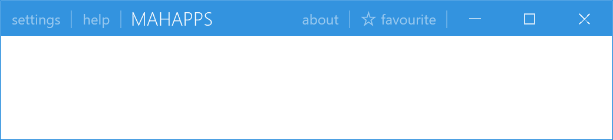
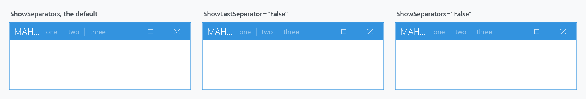

Title: WindowCommands
Description: The strip of buttons at either end of a MetroWindow's title bar
---

`WindowCommands` holds the buttons a [MetroWindow](metrowindow) puts in its title bar, left or right of the title. It is what you fill to add *settings*, *about* or a login indicator up there.



```xml
<mah:MetroWindow.LeftWindowCommands>
    <mah:WindowCommands>
        <Button Content="settings" />
        <Button Content="help" />
    </mah:WindowCommands>
</mah:MetroWindow.LeftWindowCommands>

<mah:MetroWindow.RightWindowCommands>
    <mah:WindowCommands>
        <Button Content="about" />
        <Button>
            <StackPanel Orientation="Horizontal">
                <mah:FontIcon FontSize="13" VerticalAlignment="Center" Glyph="&#xE734;" />
                <TextBlock Margin="4 0 0 0" VerticalAlignment="Center" Text="favourite" />
            </StackPanel>
        </Button>
    </mah:WindowCommands>
</mah:MetroWindow.RightWindowCommands>
```

The window's own `LeftWindowCommands` and `RightWindowCommands` properties are where they go. Content is arbitrary: plain `Button`s get the title-bar look automatically, and anything else you put in is left alone.

:::{.alert .alert-info}
`WindowCommands` derives from **`ToolBar`**, not from a plain `ItemsControl`. That is where its item handling comes from, and it means `ToolBar`'s properties are available — but also that a `ToolBar`'s overflow behaviour is in play if the buttons do not fit.
:::

Each child is wrapped in a `WindowCommandsItem`, a `ContentControl` with an `IsSeparatorVisible` property and a read-only `ParentWindowCommands` back-reference. `ItemContainerStyle` is typed to it, so that is the hook for restyling the wrapper rather than the buttons.

## Separators



| Property | Type | Default | |
| --- | --- | --- | --- |
| `ShowSeparators` | `bool` | `True` | draw separators at all |
| `ShowLastSeparator` | `bool` | `True` | include the one after the final item |
| `SeparatorHeight` | `double` | `15` | |

The trailing separator is the one people usually want gone, since it sits between your buttons and the window buttons:

```xml
<mah:WindowCommands ShowLastSeparator="False">
```

## Light and dark

| Property | Type | Default |
| --- | --- | --- |
| `Theme` | `string` | `ThemeManager.BaseColorLight` |
| `LightTemplate` | `ControlTemplate` | `null` |
| `DarkTemplate` | `ControlTemplate` | `null` |

`Theme` holds a **base-colour name**, not a theme object — the string `"Light"` or `"Dark"`. Its changed callback swaps `Template` for `LightTemplate` or `DarkTemplate`, and only if the matching one is set:

```csharp
case ThemeManager.BaseColorLightConst:
{
    if (windowCommands.LightTemplate != null)
    {
        windowCommands.SetValue(TemplateProperty, windowCommands.LightTemplate);
    }
    …
}
```

So the pair exists to give the commands a different template over a light title bar than over a dark one. Leave both `null` and `Theme` does nothing — which is the normal case, since the default template already adapts through the theme brushes.

`ParentWindow` is a read-only property pointing at the hosting [MetroWindow](metrowindow).

## Visibility over flyouts

The window decides whether its commands stay visible when a [Flyout](flyouts) is open, through `LeftWindowCommandsOverlayBehavior` and `RightWindowCommandsOverlayBehavior`. Both are a `WindowCommandsOverlayBehavior`, which has only `Never` and `HiddenTitleBar` — so window commands can **never** be drawn over an open flyout. See [Flyouts](flyouts) for the full table.

## Related

[WindowButtonCommands](WindowButtonCommands) for the minimise, maximise and close buttons at the end of the same title bar. [MetroWindow](metrowindow) hosts both.
