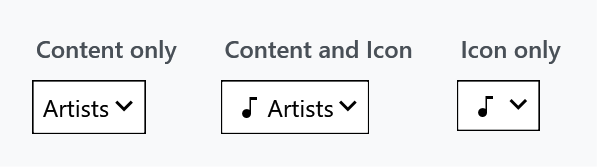
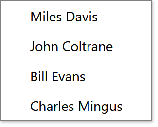
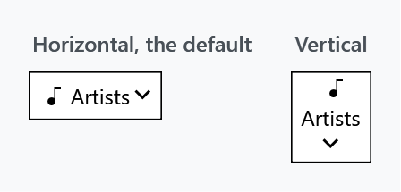
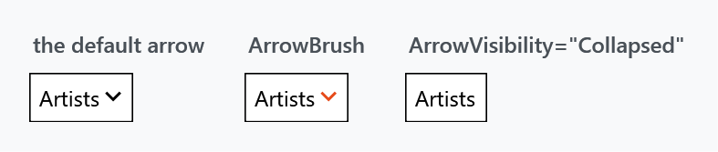

Title: DropDownButton
Description: A button that opens a menu of items
---

`DropDownButton` is a button with a list attached. The whole button is one surface: clicking it runs its `Command` **and** opens the menu.



```xml
<mah:DropDownButton Content="Artists" ItemsSource="{Binding Artists}" />
```

`ItemsSource` is the content property, so the items can also be written as the button's child element instead of bound.

## It is an ItemsControl, and the list is a ContextMenu

`DropDownButton` derives from `ItemsControl` and its list is a `ContextMenu` attached to the button inside the template. That single fact explains most of how it behaves:



- items become `MenuItem`s, not `ListBoxItem`s
- there is **no selection** — no `SelectedItem`, no `SelectedIndex`, no `SelectionChanged`
- the button's `Content` is yours and never changes on its own

The template forwards the usual `ItemsControl` properties to that menu — `DisplayMemberPath`, `ItemTemplate`, `ItemTemplateSelector`, `ItemContainerStyle`, `ItemContainerStyleSelector`, `ItemStringFormat`, `ItemsPanel` and `GroupStyleSelector` — so they work as you would expect even though the menu is not the control you are setting them on. `GroupStyle` entries are copied across in code, and the menu is given `MinWidth="{TemplateBinding ActualWidth}"` so it is never narrower than the button.

If you need selection or a button whose label follows the choice, use [SplitButton](splitbutton) instead.

## Reacting to a click

There are two separate things to hook, and they fire in this order:

| | |
| --- | --- |
| `Command` / `CommandParameter` / `CommandTarget` | run when the button itself is clicked |
| `Click` | a bubbling routed event, raised straight after |
| a command on each item | run when an entry in the menu is picked |

The button click and the menu are not alternatives. Looking at `ButtonClick`, the control runs the command, opens the menu if it has any items, and then raises `Click`:

```csharp
CommandHelpers.ExecuteCommandSource(this);

if (this.contextMenu?.HasItems == true)
{
    this.SetCurrentValue(IsExpandedProperty, BooleanBoxes.TrueBox);
}

e.RoutedEvent = ClickEvent;
this.RaiseEvent(e);
```

So a `Command` on the button runs on *every* click, including the one that opens the menu. If you only want the item commands, leave `Command` unset.

`DropDownButton` implements `ICommandSource` and overrides `IsEnabledCore`, so the button disables itself while its command reports `CanExecute == false`.

### Giving the items a command

Each `MenuItem` gets one entry from the `ItemsSource` as its `DataContext`, so a command on the item has to reach back out of that context. An `ItemContainerStyle` is the usual way:

```xml
<mah:DropDownButton Content="Genres"
                    DisplayMemberPath="Name"
                    ItemsSource="{Binding Genres}">
    <mah:DropDownButton.ItemContainerStyle>
        <Style BasedOn="{StaticResource {x:Type MenuItem}}" TargetType="{x:Type MenuItem}">
            <Setter Property="Command"
                    Value="{Binding RelativeSource={RelativeSource FindAncestor, AncestorType={x:Type mah:DropDownButton}}, Path=DataContext.GenreCommand}" />
            <Setter Property="CommandParameter" Value="{Binding Name}" />
        </Style>
    </mah:DropDownButton.ItemContainerStyle>
</mah:DropDownButton>
```

`{Binding Name}` reads the genre, because that is the item's `DataContext`; the `FindAncestor` binding walks out to the button to find the view model.

:::{.alert .alert-info}
The menu is a `ContextMenu`, but the **right mouse button does nothing** — `OnMouseRightButtonUp` marks the event handled. The menu opens on a normal left click, or by setting `IsExpanded`.
:::

## Properties

| Property | Type | Default | |
| --- | --- | --- | --- |
| `Content` | `object` | `null` | the button's label; static |
| `ContentTemplate` / `ContentTemplateSelector` / `ContentStringFormat` | | `null` | as on any `ContentControl` |
| `Icon` / `IconTemplate` | `object` / `DataTemplate` | `null` | shown before the content |
| `Orientation` | `Orientation` | `Horizontal` | stacks icon, content and arrow |
| `IsExpanded` | `bool` | `False` | two-way by default; opens the menu |
| `ArrowVisibility` | `Visibility` | `Visible` | |
| `ArrowBrush` / `ArrowMouseOverBrush` / `ArrowPressedBrush` | `Brush` | theme | the chevron in its three states |
| `ButtonStyle` | `Style` | `MahApps.Styles.Button.DropDown` | the button inside |
| `MenuStyle` | `Style` | `MahApps.Styles.ContextMenu` | the menu |
| `ExtraTag` | `object` | `null` | a second `Tag` |

`ButtonStyle` and `MenuStyle` are both registered with `Inherits`, so setting either one on a parent panel reaches every `DropDownButton` below it.

### Orientation



`Vertical` stacks the icon above the content and moves the chevron from the right edge to the bottom.

### The arrow



```xml
<mah:DropDownButton Content="Artists" ArrowVisibility="Collapsed" />
```

The chevron is a Material `ChevronDown` path drawn through `MahApps.Styles.ContentControl.PathIcon`. `ArrowMouseOverBrush` defaults to the accent brush, which is why the arrow picks up colour on hover while the rest of the button does not.

## Related

[SplitButton](splitbutton) — the same idea with a selection and a split surface. [ContentControlEx](contentcontrolex) is what presents the content, so `ControlsHelper.ContentCharacterCasing` and `ControlsHelper.RecognizesAccessKey` apply here too.
