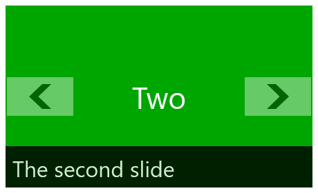
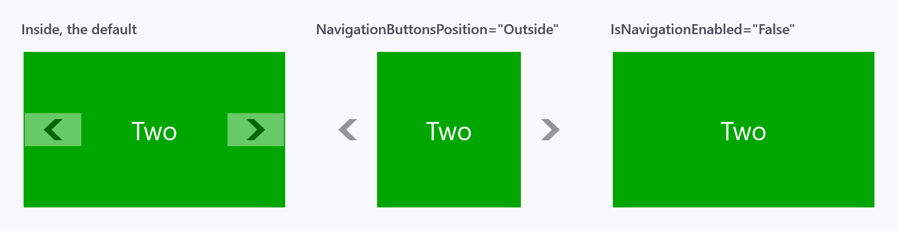
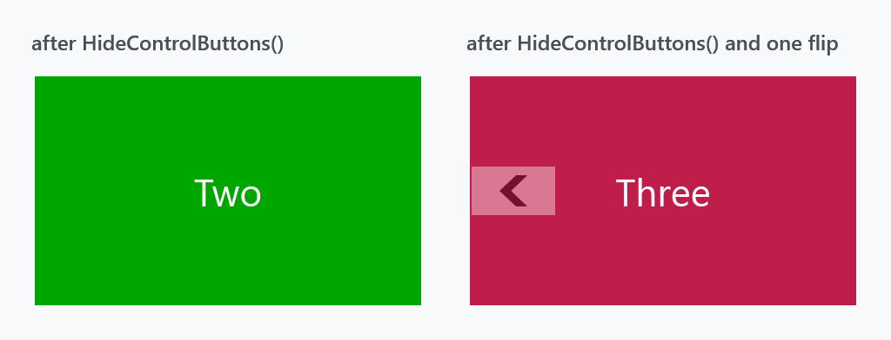
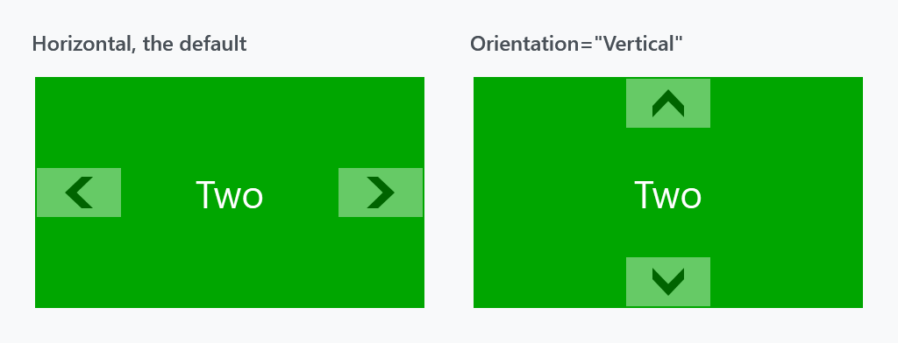
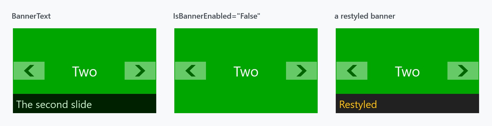
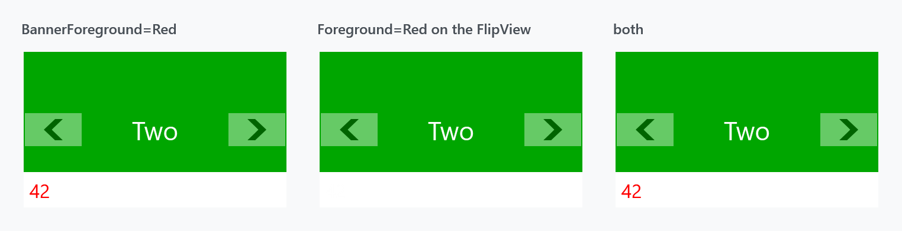
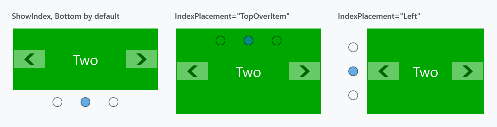

Title: FlipView
Description: A selector that shows one item at a time, with navigation and a banner
---

`FlipView` shows one item at a time and flips between them with animated transitions. It derives from `Selector`, so it is an items control with a selection — `ItemsSource`, `Items`, `SelectedItem` and `SelectedIndex` all work as usual.



```xml
<mah:FlipView Width="230" Height="140" BannerText="The second slide">
    <Grid Background="#FF2E8DEF" />
    <Grid Background="#FF00A600" />
    <Grid Background="#FFBF1E4B" />
</mah:FlipView>
```

It was inspired by the WinRT control of the same name but shares no code with it.

## Navigating

The user flips with the two buttons or with the arrow keys. In code:

| | |
| --- | --- |
| `GoBack()` / `GoForward()` | one item, honouring `CircularNavigation` |
| `SelectedIndex` | jump anywhere; the transition direction is worked out from the old and new index |
| `CircularNavigation` | `False` by default; when `True`, the ends wrap around |

Which button is visible is **computed, not fixed**. `DetectControlButtonsStatus` hides the back button on the first item and the forward button on the last, unless `CircularNavigation` is on.



| Property | Type | Default | |
| --- | --- | --- | --- |
| `IsNavigationEnabled` | `bool` | `True` | hides both buttons when `False` |
| `NavigationButtonsPosition` | `NavigationButtonsPosition` | `Inside` | `Inside` or `Outside` |
| `NavigationButtonStyle` | `Style` | `MahApps.Styles.Button.FlipView.Navigation` | |
| `ButtonBackContent` / `ButtonForwardContent` / `ButtonUpContent` / `ButtonDownContent` | `object` | chevrons | each with a matching `…Template` and `…StringFormat` |

`Outside` puts the buttons beside the item instead of over it, which costs width — compare the second panel above with the first.

:::{.alert .alert-info}
**There is no swipe gesture.** `FlipView` handles `OnKeyDown` and `OnMouseDown` and nothing else — no manipulation or touch handling anywhere in the control. Older documentation said otherwise.

The keyboard is also tied to the buttons: `OnKeyDown` only acts if the button for that direction is **visible and enabled**. So hiding the buttons — through `IsNavigationEnabled="False"` or `HideControlButtons()` — takes the arrow keys with it. `Left`/`Right` flip when horizontal, `Up`/`Down` when vertical.
:::

:::{.alert .alert-warning}
**`HideControlButtons()` does not stick.** It is a one-shot: it sets the buttons' visibility once and changes no state.

```csharp
public void HideControlButtons()
{
    this.ExecuteWhenLoaded(() => this.DetectControlButtonsStatus(Visibility.Hidden));
}
```

Anything that recomputes the buttons afterwards brings them back — a selection change among them, which is exactly what an automatic slideshow does:



Both panels called `HideControlButtons()`. The right one then flipped once, and the back button returned. (The forward button stays hidden because that panel is now on the last item.)

Use **`IsNavigationEnabled="False"`** instead. It is a dependency property, it is re-read on every recompute, and it survives.
:::

## Transitions

The animation between items is a `TransitioningContentControl`, and there is one `TransitionType` per direction:

| Property | Default |
| --- | --- |
| `LeftTransition` | `LeftReplace` |
| `RightTransition` | `RightReplace` |
| `UpTransition` | `Up` |
| `DownTransition` | `Down` |

`Orientation` decides which pair is used: `Horizontal` uses left/right, `Vertical` uses up/down, and it also moves the buttons.



## The banner

The strip along the bottom. It is on by default and slides open and shut.



| Property | Type | Default | |
| --- | --- | --- | --- |
| `IsBannerEnabled` | `bool` | `True` | |
| `BannerText` | `object` | `null` | plus `BannerTextTemplate`, `BannerTextTemplateSelector`, `BannerTextStringFormat` |
| `BannerBackground` | `Brush` | `MahApps.Brushes.ThemeForeground` | |
| `BannerForeground` | `Brush` | `MahApps.Brushes.ThemeBackground` | |
| `BannerOpacity` | `double` | `0.8` | applies to the whole strip, text included |

The banner does not follow the selection on its own — set `BannerText` from a `SelectionChanged` handler, or bind it:

```xml
<mah:FlipView ItemsSource="{Binding Slides}"
              BannerText="{Binding SelectedItem.Caption, RelativeSource={RelativeSource Self}}" />
```

:::{.alert .alert-info}
**The banner's text colour is `BannerForeground`, not `Foreground`.** Setting `Foreground` on the `FlipView` does nothing to the banner — the template binds the banner label to `BannerForeground`, which wins:



The middle panel sets `Foreground="Red"` and shows nothing at all, because `BannerForeground` is still its default of `MahApps.Brushes.ThemeBackground` — white text on the white banner. The third sets `Foreground="Blue"` and `BannerForeground="Red"` and comes out red.

`Foreground` is not useless, though: the item container style binds each `FlipViewItem`'s foreground to its owner's, so `Foreground` reaches the **items**.
:::

Changing `BannerText` fades the label out, swaps the text and fades it back in, so the new text does not appear instantly.

## The index

A row of dots showing how many items there are and which one is current. It is **off by default**, and the old documentation never mentioned it.



```xml
<mah:FlipView ShowIndex="True" IndexPlacement="TopOverItem" ItemsSource="{Binding Slides}" />
```

| Property | Type | Default | |
| --- | --- | --- | --- |
| `ShowIndex` | `bool` | `False` | |
| `IndexPlacement` | `NavigationIndexPlacement` | `Bottom` | |
| `IndexHorizontalAlignment` / `IndexVerticalAlignment` | | `Center` | within the strip |
| `IndexItemContainerStyle` | `Style` | `MahApps.Styles.ListBoxItem.FlipView.Index` | the dots |

`NavigationIndexPlacement` has eight values: `Left`, `Right`, `Top`, `Bottom`, and a `…OverItem` variant of each. The plain values give the index a strip of its own and shrink the item; the `OverItem` ones lay it over the item, as in the middle panel above.

The index is a `ListBox` in the template and it is clickable, so it navigates as well as reports.

## The hover border

A border drawn over the item while the mouse is inside, to show the control has focus for the arrow keys.

| Property | Type | Default |
| --- | --- | --- |
| `MouseHoverBorderEnabled` | `bool` | `True` |
| `MouseHoverBorderBrush` | `Brush` | theme |
| `MouseHoverBorderThickness` | `Thickness` | `4` |

## An automatic slideshow

Increment `SelectedIndex` on a timer, with `CircularNavigation` so it wraps and `IsNavigationEnabled="False"` so the buttons stay away:

```xml
<mah:FlipView x:Name="Slideshow"
              CircularNavigation="True"
              IsNavigationEnabled="False"
              ShowIndex="True"
              ItemsSource="{Binding Slides}" />
```

```csharp
var timer = new DispatcherTimer { Interval = TimeSpan.FromSeconds(4) };
timer.Tick += (_, _) => this.Slideshow.GoForward();
timer.Start();
```

`GoForward()` wraps by itself once `CircularNavigation` is on, so there is no index arithmetic to get wrong.

## Related

`FlipViewItem` is the container, styled by `MahApps.Styles.FlipViewItem`. The transitions come from [TransitioningContentControl](transitioningcontentcontrol).
