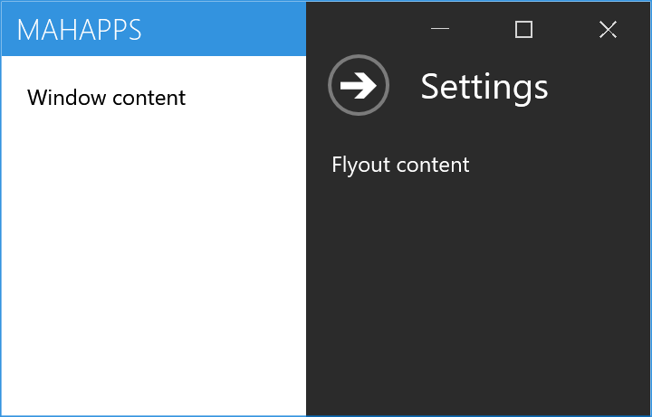
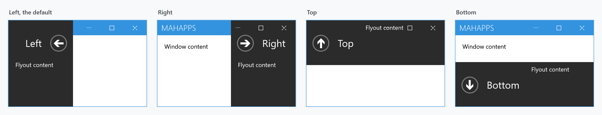
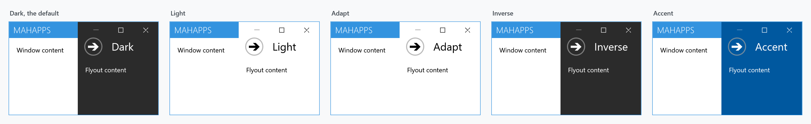
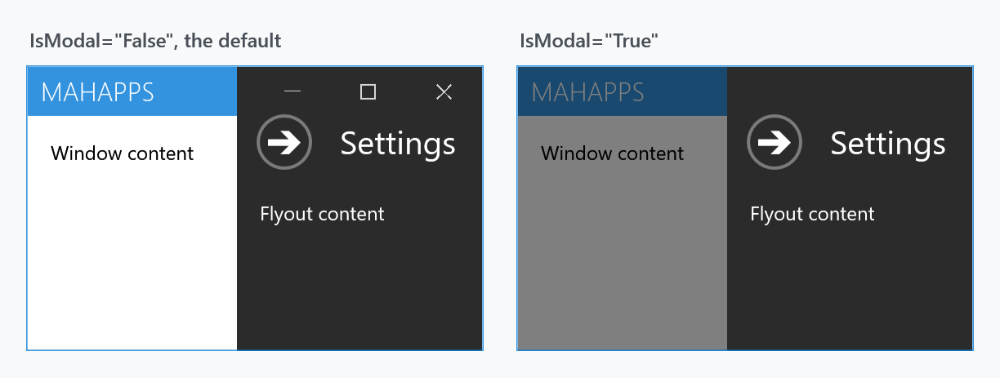
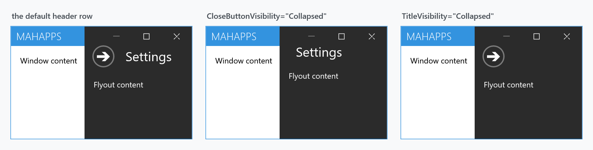

Title: Flyouts
Description: Panels that slide in over a MetroWindow
---

A `Flyout` is a panel that slides in over a [MetroWindow](metrowindow) from any of its four sides. It derives from `HeaderedContentControl`, so it has a `Header` and arbitrary content.



```xml
<mah:MetroWindow.Flyouts>
    <mah:FlyoutsControl>
        <mah:Flyout Header="Settings" Position="Right" Width="190" IsOpen="{Binding IsSettingsOpen}">
            <!--  content  -->
        </mah:Flyout>
    </mah:FlyoutsControl>
</mah:MetroWindow.Flyouts>
```

Every figure on this page is a real `MetroWindow`, because a `Flyout` only behaves like one inside one: it looks up its parent window to position itself, to dim the modal overlay and to adapt its theme.

## FlyoutsControl

`FlyoutsControl` is the `ItemsControl` that holds the flyouts for one window, and it belongs in the window's `Flyouts` property. A flyout outside one will not work properly.

It is a real items control, so `ItemsSource` works and each item is wrapped in a `Flyout` container. `ItemTemplate`, `ItemTemplateSelector` and `ItemStringFormat` are pushed onto each container's **content** properties, and `HeaderTemplate`, `HeaderTemplateSelector` and `HeaderStringFormat` set on a flyout are preserved when the container is prepared.

It adds exactly two properties of its own, both of which override every flyout below it:

| Property | Type | Default | |
| --- | --- | --- | --- |
| `OverrideIsPinned` | `bool` | `False` | when `True`, every flyout behaves as if `IsPinned` were `False` |
| `OverrideExternalCloseButton` | `MouseButton?` | `null` | when set, every flyout closes on that button, whatever its own `ExternalCloseButton` says |

## Opening and closing

`IsOpen` is the switch, and it is the one to bind. `IsShown` is a read-only companion, and `Owner` is the read-only back-reference to the `FlyoutsControl`.

Three routed events mark the stages:

| Event | |
| --- | --- |
| `IsOpenChanged` | `IsOpen` has changed; the animation is just starting |
| `OpeningFinished` | the slide-in has finished |
| `ClosingFinished` | the slide-out has finished |

:::{.alert .alert-warning}
**A flyout does not close when you click outside it — by default.** `IsPinned` defaults to **`True`**, which means pinned, which means clicks elsewhere in the window are ignored. The old documentation never mentioned the property.

The window's handler reads:

```csharp
foreach (var flyout in Flyouts.GetFlyouts()
                              .Where(x => x.IsOpen
                                          && x.ExternalCloseButton == e.ChangedButton
                                          && (!x.IsPinned || Flyouts.OverrideIsPinned)))
{
    flyout.IsOpen = false;
}
```

So for click-away-to-close, set `IsPinned="False"` on the flyout, or `OverrideIsPinned="True"` on the `FlyoutsControl` to do it for all of them.

`ExternalCloseButton` picks which button counts, and defaults to `MouseButton.Left`. Clicks on a flyout, on the modal overlay, on a dialog, on the window icon or on the window commands never count as "outside".
:::

### The close button

`CloseCommand` runs when the **close button** is clicked, with `CloseCommandParameter`. It does **not** run when `IsOpen` is set to `false` in code or by a binding — the XML documentation says so explicitly, and it is easy to trip over if you expect it as a general "flyout closed" hook. Use `ClosingFinished` for that.

`CloseButtonIsCancel` makes the button respond to <kbd>Esc</kbd>. Although `CloseCommand` is registered with `RegisterAttached`, there are no static `GetCloseCommand`/`SetCloseCommand` accessors, so it cannot actually be used as an attached property in XAML — set it on the flyout.

### Closing itself

| Property | Type | Default | |
| --- | --- | --- | --- |
| `IsAutoCloseEnabled` | `bool` | `False` | close after a delay |
| `AutoCloseInterval` | `long` | `5000` | milliseconds |

The timer starts when the flyout is open and the property is switched on, and stops when it is switched off.

## Position



`Position` is `Left`, `Right`, `Top` or `Bottom`, and **defaults to `Left`**. Left and right flyouts take their `Width`, top and bottom ones their `Height`. The header row and its arrow button flip to match, so the arrow always points the way out.

`AnimateOnPositionChange` (default `True`) animates a change of `Position` while the flyout is open.

## Themes



| Value | |
| --- | --- |
| `Dark` | **the default** |
| `Light` | |
| `Adapt` | follows the host window's theme |
| `Inverse` | follows it, inverted |
| `Accent` | the accent colour; you have to pick readable foregrounds yourself |

The figure is rendered against a light application theme, which is why `Adapt` matches `Light` and `Inverse` matches `Dark`.

:::{.alert .alert-info}
`BorderThickness` on `MahApps.Styles.Flyout` is **`0`**. A `Light` or `Adapt` flyout over a light window therefore has no visible edge at all — in the figure above you can only tell where those two are by the text inside them. If that matters, give the flyout a `BorderThickness` and `BorderBrush`.
:::

## Modal



`IsModal` (default `False`) dims the rest of the window and blocks input to it. It also pushes the window icon and all three sets of window commands behind the overlay, which is why the minimise, maximise and close buttons are gone in the right-hand panel.

## Header, title and close button



`CloseButtonVisibility` and `TitleVisibility` are both `Visible` by default and each hides one part of the header row. Hiding the close button without giving the user another way out — a binding on `IsOpen`, `IsPinned="False"`, or auto-close — leaves the flyout stuck open.

## Animation and focus

| Property | Type | Default | |
| --- | --- | --- | --- |
| `AreAnimationsEnabled` | `bool` | `True` | turn the slide off entirely |
| `AnimateOpacity` | `bool` | `False` | fade as well as slide |
| `AllowFocusElement` | `bool` | `True` | move focus into the flyout when it opens |
| `FocusedElement` | `FrameworkElement` | `null` | which element gets that focus |

## Overlay behaviour on the window

These four live on the [MetroWindow](metrowindow), not on the flyout, and decide what stays visible above an open flyout:

| Property | Type | Default |
| --- | --- | --- |
| `LeftWindowCommandsOverlayBehavior` | `WindowCommandsOverlayBehavior` | `Never` |
| `RightWindowCommandsOverlayBehavior` | `WindowCommandsOverlayBehavior` | `Never` |
| `WindowButtonCommandsOverlayBehavior` | `OverlayBehavior` | **`Always`** |
| `IconOverlayBehavior` | `OverlayBehavior` | `Never` |

`WindowCommandsOverlayBehavior` is `Never` or `HiddenTitleBar`. `OverlayBehavior` is a `[Flags]` enum, and `Always` is not a state of its own but the combination of the other two:

```csharp
[Flags]
public enum OverlayBehavior
{
    Never = 0,
    Flyouts = 1 << 0,
    HiddenTitleBar = 1 << 1,
    Always = ~(-1 << 2)
}
```

The minimise, maximise and close buttons are drawn over the flyouts in the figures on this page because their default is `Always`, which carries the `Flyouts` flag.

:::{.alert .alert-info}
The left and right window commands can never be drawn over an open flyout — `WindowCommandsOverlayBehavior` has no value for it.

**The icon can**, though, which older documentation denied. `IconOverlayBehavior` is an `OverlayBehavior`, and the window checks it per flyout:

```csharp
this.icon?.SetValue(Panel.ZIndexProperty,
    flyout.IsModal && flyout.IsOpen
        ? 0
        : (this.IconOverlayBehavior.HasFlag(OverlayBehavior.Flyouts) ? zIndex : 1));
```

So `IconOverlayBehavior="Flyouts"` does put the icon above one. A modal flyout still wins over both.
:::

## Related

[MetroWindow](metrowindow) hosts them and owns the overlay behaviour. [CustomValidationPopup](customvalidationpopup) suppresses itself while a flyout is animating, which is what `Flyout`'s animation state is used for elsewhere.
