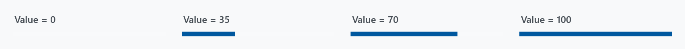
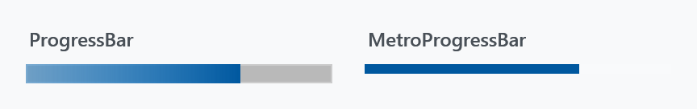
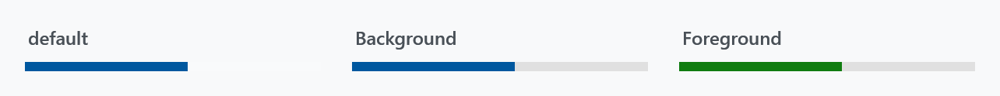
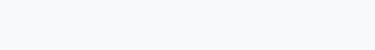
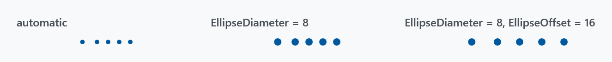
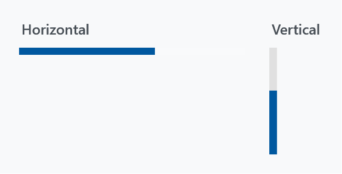

Title: MetroProgressBar
Description: A ProgressBar with a different indeterminate state
---

`MetroProgressBar` derives from `ProgressBar` and replaces its template. Determinate, it is a flat bar without a frame; indeterminate, it is five dots sweeping across instead of a striped fill.



```xml
<mah:MetroProgressBar Width="190" Value="70" />
```

Everything about the value is inherited, so `Minimum`, `Maximum`, `Value` and `IsIndeterminate` work exactly as on a `ProgressBar`.

## Against the styled ProgressBar



| | `ProgressBar` | `MetroProgressBar` |
| --- | --- | --- |
| indicator | gradient, `MahApps.Brushes.Progress` | flat, `Foreground` |
| `Foreground` | ignored, see [ProgressBar](../styles/progressbar) | honoured |
| track | `MahApps.Brushes.Gray5` | `#1FFFFFFF` |
| frame | 1px `MahApps.Brushes.Control.Border` | none |
| `MinHeight` | 10 | 6 |
| indeterminate | scrolling diagonal stripes | five sweeping dots |
| `Padding` | ignored | insets the determinate bar |

Neither is a variant of the other: `MahApps.Styles.MetroProgressBar` lives in `Themes/MetroProgressBar.xaml` and is applied as the control's default style through `Generic.xaml`, so it needs no `Style` reference.

## The invisible track

:::{.alert .alert-warning}
The style sets `Background` to `#1FFFFFFF` — white at 12% opacity. That reads as a faint lightening on a dark surface, which is what it was drawn for, and as nothing at all on a light one. Look at the `Value = 0` panel in the first figure: there is no bar there, just an empty strip. Give the control a `Background` of your own whenever it sits on a light background.
:::



```xml
<mah:MetroProgressBar Width="190"
                      Value="55"
                      Background="{DynamicResource MahApps.Brushes.Gray8}"
                      Foreground="#FF107C10" />
```

`Background`, `BorderBrush`, `BorderThickness` and `Foreground` are all template bindings here, so all four work. `Padding` is bound to the margin of the determinate part, which insets the bar inside the control's own bounds.

## Indeterminate



```xml
<mah:MetroProgressBar Width="190" IsIndeterminate="True" />
```

Five ellipses ease in from the left one after another, cross the bar together, and leave to the right, on a loop just under four seconds long. They are filled from `Foreground`, like the determinate bar.

The track is not merely covered while this runs — the animation fades the whole determinate part to zero, so `Background` and `BorderBrush` have nothing to paint. An indeterminate `MetroProgressBar` is the dots and nothing else.

For the same idea as a spinner rather than a strip, see [ProgressRing](progressring).

### EllipseDiameter and EllipseOffset

The two properties the control adds are the size of the dots and the gap between them:



*A single frame of the sweep, so the three are directly comparable.*

```xml
<mah:MetroProgressBar Width="190"
                      IsIndeterminate="True"
                      EllipseDiameter="8"
                      EllipseOffset="16" />
```

Left alone, both are picked from the bar's own length:

| Length | `EllipseDiameter` | `EllipseOffset` |
| --- | --- | --- |
| up to 180 | 4 | 4 |
| up to 280 | 5 | 7 |
| longer | 6 | 9 |

The control only fills them in while they are still `0`, and it does so with `SetCurrentValue`, so a value you set — or a binding — survives. Setting either back to `0` hands it to the automatic sizing again.

The control's height is a minimum (`MahApps.Sizes.ProgressBar.MinHeight`, 6), not a fixed size, so dots larger than that make the bar taller rather than being clipped.

## Vertical



```xml
<mah:MetroProgressBar Width="6"
                      Height="90"
                      Orientation="Vertical"
                      Value="60"
                      Background="{DynamicResource MahApps.Brushes.Gray8}" />
```

`Orientation="Vertical"` rotates the template by -90°, so the bar fills from the bottom and the dots sweep upwards. The trigger also swaps the minimum, putting the 6 on `MinWidth`; give the control the `Width` and `Height` you want, the rotation happens inside.

## Resizing

The sweep is a storyboard whose travel distances are computed from the actual length of the bar, so the control rebuilds and restarts it whenever the size changes, and again when it becomes visible after being hidden. That is handled for you — worth knowing only if you wonder why an indeterminate bar restarts its loop when its container is re-laid out.

## Where it is used

The [progress dialog](../dialogs/progress-dialogs) is built on a `MetroProgressBar`, and its `ProgressBarForeground` binds straight to this control's `Foreground` — which works precisely because this template honours it.
