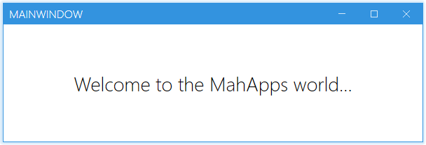
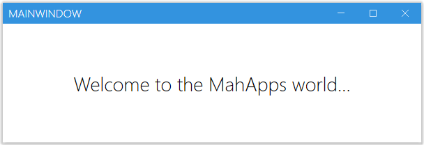

Order: 10
Title: MetroWindow
---

The `MetroWindow` is the main entry point of `MahApps` and replaces the normal `Window` to get the `MahApps` styles and themes to be work.  

If you don't know how to start with this then you can read the [Quick Start](/docs/guides/quick-start) section.  

# Window borders

The `MetroWindow` can be used with different borders. You can change the behavior by using the `BorderBrush`, `GlowBrush` and `BorderThickness` properties.

# Normal Border

A window with a normal border can be achieved by using the `BorderBrush` and `BorderThickness` property.

```xml
<Controls:MetroWindow x:Class="MahApps.Metro.Simple.Demo.MainWindow"
                      xmlns="http://schemas.microsoft.com/winfx/2006/xaml/presentation"
                      xmlns:x="http://schemas.microsoft.com/winfx/2006/xaml"
                      xmlns:Controls="http://metro.mahapps.com/winfx/xaml/controls"
                      Title="MainWindow"
                      Height="200"
                      Width="600"

                      BorderBrush="{DynamicResource MahApps.Brushes.Accent}"
                      BorderThickness="1"

                      WindowStartupLocation="CenterScreen">

</Controls:MetroWindow>
```


# Glow Border

A window with a border glow effect can be achieved with the `GlowBrush` property.

```xml
<Controls:MetroWindow x:Class="MahApps.Metro.Simple.Demo.MainWindow"
                      xmlns="http://schemas.microsoft.com/winfx/2006/xaml/presentation"
                      xmlns:x="http://schemas.microsoft.com/winfx/2006/xaml"
                      xmlns:Controls="http://metro.mahapps.com/winfx/xaml/controls"
                      Title="MainWindow"
                      Height="200"
                      Width="600"

                      GlowBrush="{DynamicResource MahApps.Brushes.Accent}"

                      WindowStartupLocation="CenterScreen">

</Controls:MetroWindow>
```



# Only Shadow

The window can also used without a border to get only a shadow arround it.

```xml
<Controls:MetroWindow x:Class="MahApps.Metro.Simple.Demo.MainWindow"
                      xmlns="http://schemas.microsoft.com/winfx/2006/xaml/presentation"
                      xmlns:x="http://schemas.microsoft.com/winfx/2006/xaml"
                      xmlns:Controls="http://metro.mahapps.com/winfx/xaml/controls"
                      Title="MainWindow"
                      Height="200"
                      Width="600"

                      BorderThickness="0"
                      GlowBrush="Black"
                      ResizeMode="CanResizeWithGrip"

                      WindowTransitionsEnabled="False"
                      WindowStartupLocation="CenterScreen">

</Controls:MetroWindow>
```



# Properties

One property not detailed is the `SaveWindowPosition="True|False"` (default `False`) option. Setting this property to `True` will mean on next launch, it will automatically be positioned and sized to what it was on exit. This is designed to improve UX and speed development as its one of those "plumbing" UI things that is done regularly.  

Be careful though - if a monitor is detached during application exit and restart, or if certain circumstances arise, your application may launch off screen. Be sure to provide a 'reset' option or handle that in code.

# Setting a custom Icon

:::{.alert .alert-info}
***Note***  
The `Icon`-Property can only contain content of type `ImageSource` (see [Microsoft Docs]( https://docs.microsoft.com/en-us/dotnet/api/system.windows.window.icon)). To show other content we have to use the `IconTemplate`
:::

You can adjust the appereance of the Icon by editing the `IconTemplate`. The below code snippet shows how to configure the `Icon-Image`: 

```xml
<mah:MetroWindow x:Class="MetroDemo.MainWindow"
                 xmlns="http://schemas.microsoft.com/winfx/2006/xaml/presentation"
                 xmlns:x="http://schemas.microsoft.com/winfx/2006/xaml"
                 xmlns:mah="http://metro.mahapps.com/winfx/xaml/controls"
                 Icon="mahapps.metro.logo2.ico"
                 ShowIconOnTitleBar="True">
    <mah:MetroWindow.IconTemplate>
        <DataTemplate>
            <!-- Setting a Margin and enable hight-quality image -->
            <Image Margin="4"
                   RenderOptions.BitmapScalingMode="HighQuality"
                   Source="{Binding}" />
        </DataTemplate>
    </mah:MetroWindow.IconTemplate>
    [...]
</mah:MetroWindow>
```

You can also use any other content here as well. In the following snippet we will use an icon form the [MahApps.Metro.IconPacks](https://github.com/MahApps/MahApps.Metro.IconPacks) but you can use any other content as well. 

```xml
<mah:MetroWindow x:Class="MetroDemo.MainWindow"
                 xmlns="http://schemas.microsoft.com/winfx/2006/xaml/presentation"
                 xmlns:x="http://schemas.microsoft.com/winfx/2006/xaml"
                 xmlns:iconPacks="http://metro.mahapps.com/winfx/xaml/iconpacks"
                 xmlns:mah="http://metro.mahapps.com/winfx/xaml/controls"
                 ShowIconOnTitleBar="True">
    <mah:MetroWindow.IconTemplate>
        <DataTemplate>
            <iconPacks:PackIconUnicons Kind="BatteryBolt" 
                                       Width="30" 
                                       Height="30"
                                       HorizontalAlignment="Center"
                                       VerticalAlignment="Center"
                                       Margin="4"
                                       Foreground="{DynamicResource MahApps.Brushes.IdealForeground}"/>
        </DataTemplate>
    </mah:MetroWindow.IconTemplate>
    [...]
</mah:MetroWindow>
```