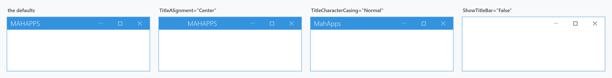
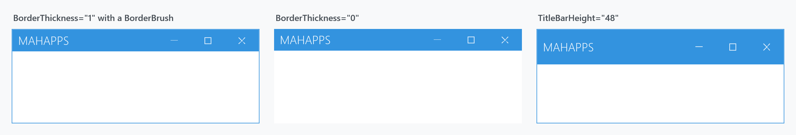
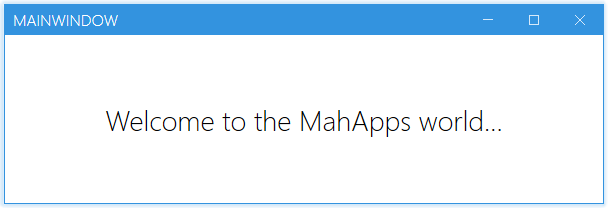
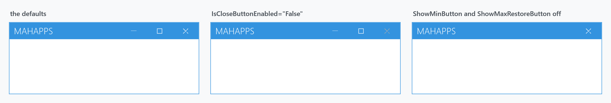

Order: 10
Title: MetroWindow
Description: The window that everything else in MahApps.Metro is built on
---

`MetroWindow` replaces WPF's `Window`. Using it is what gives an application the MahApps title bar, and it is the host for [flyouts](flyouts), dialogs and the title-bar commands. If you are starting out, read the [Quick Start](../guides/quick-start) first.

It has around fifty properties. They are grouped here by what they do rather than listed alphabetically.

## The title bar



| Property | Type | Default | |
| --- | --- | --- | --- |
| `ShowTitleBar` | `bool` | `True` | |
| `TitleBarHeight` | `int` | `30` | |
| `TitleAlignment` | `HorizontalAlignment` | `Stretch` | |
| `TitleCharacterCasing` | `CharacterCasing` | **`Upper`** | why titles shout by default |
| `TitleForeground` | `Brush` | | |
| `TitleTemplate` | `DataTemplate` | `null` | replace the title's presentation entirely |
| `WindowTitleBrush` | `Brush` | `Transparent` | the bar's background |
| `NonActiveWindowTitleBrush` | `Brush` | `Gray` | the same while the window is inactive |
| `UseNoneWindowStyle` | `bool` | `False` | no title bar and no border at all |

`TitleCharacterCasing="Normal"` is the one most people reach for first — the third panel above.

:::{.alert .alert-info}
`ShowTitleBar="False"` removes the bar but **not** the window buttons: the fourth panel above still has minimise, maximise and close floating over the content. That is `WindowButtonCommandsOverlayBehavior`, which defaults to `Always` and so includes the hidden-title-bar case. Set it to `Never` if you want them gone with the bar.
:::

`WindowTitleBrush` being `Transparent` by default is worth knowing: the accent colour you see comes from the theme, not from this property, so setting it is how you get a title bar that ignores the theme.

## Borders, glow and shadow



A normal border is `BorderBrush` plus `BorderThickness`, inherited from `Window`:

```xml
<mah:MetroWindow BorderBrush="{DynamicResource MahApps.Brushes.Accent}"
                 BorderThickness="1" />
```

`GlowBrush` instead draws a soft glow around the frame:

```xml
<mah:MetroWindow GlowBrush="{DynamicResource MahApps.Brushes.Accent}" />
```



:::{.alert .alert-info}
The glow is painted by **separate windows around the frame**, not by the window's own visual tree. A `BorderThickness="0"` window with no `GlowBrush` therefore has no edge at all — the middle panel of the first figure.
:::

For a drop shadow and no border, set `BorderThickness="0"` with a dark `GlowBrush`:

```xml
<mah:MetroWindow BorderThickness="0"
                 GlowBrush="Black"
                 ResizeMode="CanResizeWithGrip"
                 WindowTransitionsEnabled="False" />
```

| Property | Type | Default | |
| --- | --- | --- | --- |
| `GlowBrush` | `Brush` | `null` | |
| `NonActiveGlowBrush` | `Brush` | | the glow while inactive |
| `NonActiveBorderBrush` | `Brush` | `Gray` | |
| `KeepBorderOnMaximize` | `bool` | `True` | |
| `ResizeBorderThickness` | `Thickness` | `6` | the invisible grab area for resizing |

## The window buttons



There are two pairs of properties, and they do different things:

| | |
| --- | --- |
| `ShowMinButton`, `ShowMaxRestoreButton`, `ShowCloseButton` | remove the button |
| `IsMinButtonEnabled`, `IsMaxRestoreButtonEnabled`, `IsCloseButtonEnabled` | keep it, greyed out |

All six default to `True`. The middle panel above is a disabled close button — still there, still visibly a button; the right-hand one has the other two removed outright.

`WindowButtonCommands` is the control itself, should you want to reach it — see [WindowButtonCommands](WindowButtonCommands), which also has the cancellable `ClosingWindow` event.

`ShowSystemMenu` and `ShowSystemMenuOnRightClick` (both `True`) control the system menu.

## Title-bar commands and the icon

`LeftWindowCommands` and `RightWindowCommands` take a [WindowCommands](WindowCommands) each, for your own buttons at either end of the bar. `OverrideDefaultWindowCommandsBrush` forces a brush onto all of them at once.

| Property | Type | Default | |
| --- | --- | --- | --- |
| `ShowIconOnTitleBar` | `bool` | `True` | |
| `IconTemplate` | `DataTemplate` | `null` | |
| `IconScalingMode` | `MultiFrameImageMode` | `ScaleDownLargerFrame` | see [MultiFrameImage](MultiFrameImage) |
| `IconBitmapScalingMode` | `BitmapScalingMode` | | |
| `IconEdgeMode` | `EdgeMode` | | |
| `IconOverlayBehavior` | `OverlayBehavior` | `Never` | whether the icon shows over a flyout |

:::{.alert .alert-info}
`Icon` is inherited from `Window` and takes only an `ImageSource` ([Microsoft docs](https://learn.microsoft.com/dotnet/api/system.windows.window.icon)). For anything else, use `IconTemplate` — the icon is bound to it, so `{Binding}` inside the template is the `Icon`.
:::

```xml
<mah:MetroWindow Icon="app.ico" ShowIconOnTitleBar="True">
    <mah:MetroWindow.IconTemplate>
        <DataTemplate>
            <Image Margin="4" RenderOptions.BitmapScalingMode="HighQuality" Source="{Binding}" />
        </DataTemplate>
    </mah:MetroWindow.IconTemplate>
</mah:MetroWindow>
```

The template does not have to show the `Icon` at all — put an icon-pack glyph in it and the window has a vector icon:

```xml
<mah:MetroWindow.IconTemplate>
    <DataTemplate>
        <iconPacks:PackIconUnicons Width="30" Height="30" Margin="4"
                                   Kind="BatteryBolt"
                                   Foreground="{DynamicResource MahApps.Brushes.IdealForeground}" />
    </DataTemplate>
</mah:MetroWindow.IconTemplate>
```

Because the icon is drawn by a [MultiFrameImage](MultiFrameImage), a multi-resolution `.ico` picks the frame that suits the title bar rather than being stretched — `IconScalingMode` is that control's mode.

## Flyouts and dialogs

`Flyouts` takes the `FlyoutsControl` holding the window's [flyouts](flyouts), and `FlyoutOverlayBrush` paints the dimming behind a modal one.

| Property | Type | Default | |
| --- | --- | --- | --- |
| `MetroDialogOptions` | `MetroDialogSettings` | | defaults for the dialogs shown on this window |
| `ShowDialogsOverTitleBar` | `bool` | `True` | |
| `OverlayBrush` | `Brush` | | the dialog overlay |
| `OverlayOpacity` | `double` | `0.7` | |
| `OverlayFadeIn` / `OverlayFadeOut` | `Storyboard` | | replace the fade |
| `IsAnyDialogOpen` | `bool`, read-only | `False` | |
| `IsCloseButtonEnabledWithDialog` | `bool`, read-only | `True` | whether the close button works while a dialog is up |

The four overlay-behaviour properties — `LeftWindowCommandsOverlayBehavior`, `RightWindowCommandsOverlayBehavior`, `WindowButtonCommandsOverlayBehavior` and `IconOverlayBehavior` — decide what stays visible above an open flyout. They are documented with their defaults on the [Flyouts](flyouts) page.

## Position, dragging and startup

| Property | Type | Default | |
| --- | --- | --- | --- |
| `SaveWindowPosition` | `bool` | `False` | restore size and position on next launch |
| `WindowPlacementSettings` | `IWindowPlacementSettings` | `null` | where that is stored |
| `IgnoreTaskbarOnMaximize` | `bool` | `False` | maximise over the taskbar |
| `IsWindowDraggable` | `bool` | `True` | drag the window by its title bar |
| `WindowTransitionsEnabled` | `bool` | `True` | the content's entrance animation |
| `TryToBeFlickerFree` | `bool` | `False` | |

:::{.alert .alert-warning}
`SaveWindowPosition="True"` is a nice convenience and a real support risk. If a monitor is detached between exit and restart, the window can come back **off screen** with no way for the user to get at it. Provide a reset, or validate the restored placement against the current screens yourself.
:::

`IsWindowDraggable` is what [MetroThumbContentControl](MetroThumbContentControl) checks — the title bar is one of those, and dragging it is what moves the window.

## Related

[WindowCommands](WindowCommands) and [WindowButtonCommands](WindowButtonCommands) for the title bar's two sets of buttons. [Flyouts](flyouts) for the overlay panels and the overlay-behaviour table. [MetroNavigationWindow](MetroNavigationWindow) is a `MetroWindow` with a navigation bar built in.
