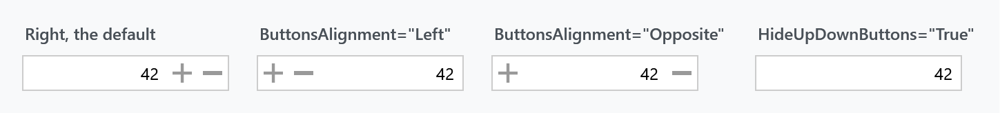
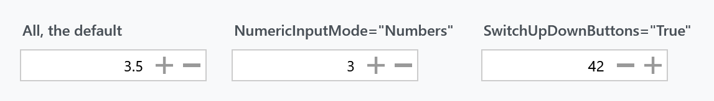
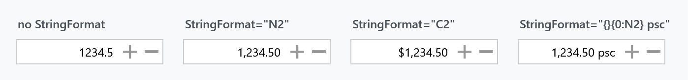

Title: NumericUpDown
Description: A numeric text field with increment and decrement buttons
---

`NumericUpDown` is a text field for a number, with a button to step it up and one to step it down.



```xml
<mah:NumericUpDown Minimum="0"
                   Maximum="10000"
                   Interval="100"
                   StringFormat="C2"
                   Value="{Binding Amount}" />
```

## The value and its range

| Property | Type | Default |
| --- | --- | --- |
| `Value` | `double?` | `null` |
| `Minimum` | `double` | `double.MinValue` |
| `Maximum` | `double` | `double.MaxValue` |
| `Interval` | `double` | `1` |

`Value` is **nullable**, so an empty field is a real state rather than zero. Bind to a `double?` if the user is allowed to clear it.

`SnapToMultipleOfInterval` (default `False`) rounds every new value to the nearest multiple of `Interval`:

```csharp
value = Math.Round(newValue / this.Interval) * this.Interval;
```

It is applied to values that arrive by any route, not just to the buttons, and turning the property on rounds the current value immediately.

## How the user changes it

| Property | Default | |
| --- | --- | --- |
| `InterceptArrowKeys` | `True` | <kbd>↑</kbd> and <kbd>↓</kbd> step by `Interval` |
| `InterceptMouseWheel` | `True` | the wheel steps by `Interval` while the control has focus |
| `TrackMouseWheelWhenMouseOver` | `False` | when `True`, the wheel works on hover, without focus |
| `InterceptManualEnter` | `True` | the number can be typed |
| `ChangeValueOnTextChanged` | `True` | when `False`, typing updates `Value` only on <kbd>Enter</kbd> or lost focus |

`ChangeValueOnTextChanged` is worth knowing about for bound scenarios: left at its default, every keystroke pushes a value, so typing `15` in an empty field momentarily sets `1`.

Holding a button repeats the step. `Delay` (default **500** ms) is the pause before the repeat begins, and `Speedup` (default `True`) makes the repeat accelerate the longer the button is held. Set `Speedup="False"` for a constant rate.

## The buttons

| Property | Type | Default | |
| --- | --- | --- | --- |
| `ButtonsAlignment` | `ButtonsAlignment` | `Right` | `Left`, `Right` or `Opposite` |
| `HideUpDownButtons` | `bool` | `False` | |
| `SwitchUpDownButtons` | `bool` | `False` | puts the down button first |
| `UpDownButtonsWidth` | `double` | `20` | each button |
| `UpDownButtonsFocusable` | `bool` | `True` | |

`Opposite` puts one button at each end of the field, as in the third panel at the top of this page.



Hiding the buttons does not make the control read-only — the arrow keys, the wheel and typing all still work. To make it look inert when it is, drive the property from `IsReadOnly`:

```xml
<Style BasedOn="{StaticResource {x:Type mah:NumericUpDown}}" TargetType="{x:Type mah:NumericUpDown}">
    <Style.Triggers>
        <Trigger Property="IsReadOnly" Value="True">
            <Setter Property="HideUpDownButtons" Value="True" />
        </Trigger>
    </Style.Triggers>
</Style>
```

## Formatting



`StringFormat` takes a standard or custom .NET numeric format string:

| | |
| --- | --- |
| `N2` | `1,234.50` |
| `C2` | `$1,234.50` |
| `P0` | a percentage |
| `{}{0:N2} psc` | a composite format; the leading `{}` escapes the brace for XAML |

`Culture` (default `null`, meaning the thread's culture) decides the separators and the currency symbol. The examples above are `en-US`.

`ParsingNumberStyle` (default `NumberStyles.Any`) is what typed text is parsed with, if you need to be stricter than that.

### Decimals

`NumericInputMode` is a `[Flags]` enum with `Numbers`, `Decimal` and `All`, and defaults to **`All`**. Set it to `Numbers` and the decimal separator is refused, so `3.5` becomes `3` — the second panel above.

:::{.alert .alert-info}
The old documentation called this a replacement for a `HasDecimals` property. That property has not existed since v1.x; `NumericInputMode` is simply the current API.
:::

### The numeric keypad's decimal key

`DecimalPointCorrection` solves a small, real annoyance: the <kbd>.</kbd> key on the numeric keypad produces a period regardless of the keyboard layout, which is wrong in every culture whose decimal separator is a comma.

| Value | |
| --- | --- |
| `Inherits` | **the default** — no correction; the key inserts whatever it produces |
| `Number` | insert `NumberFormat.NumberDecimalSeparator` instead |
| `Currency` | insert `CurrencyDecimalSeparator` |
| `Percent` | insert `PercentDecimalSeparator` |

The control intercepts `Key.Decimal` only — the period key on the main keyboard is left alone — marks the event handled, and inserts the separator its `Culture` calls for. The three non-default modes exist because those three separators can differ within one culture.

## Related

`DataGridNumericUpDownColumn` puts one of these in a `DataGrid` cell and forwards most of these properties to it, `DecimalPointCorrection` included.
