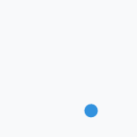
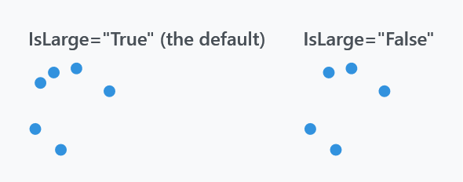
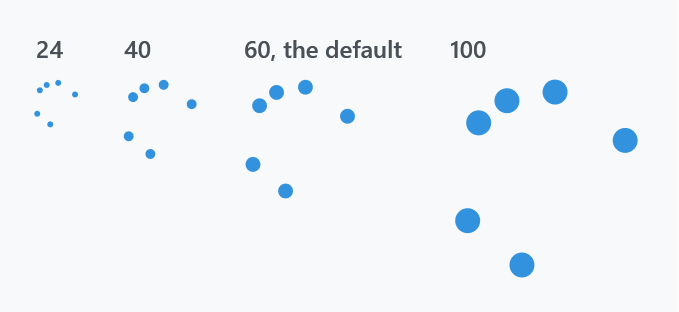
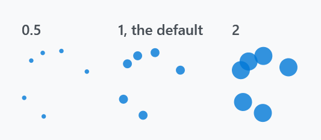
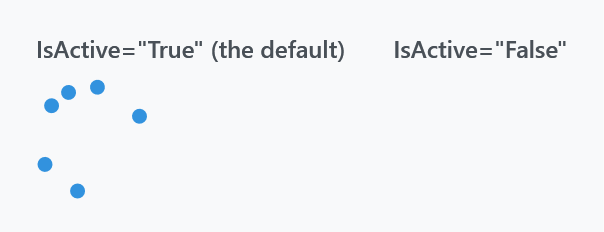
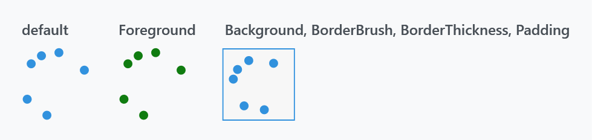

Title: ProgressRing
Description: The circular activity indicator
---

`ProgressRing` is the Windows 8 activity indicator: dots chasing each other around a circle. It shows that something is happening, not how far along it is — there is no `Value`, and it derives from `Control`, not from `ProgressBar`.



```xml
<mah:ProgressRing />
```

That is the whole minimum. `IsActive` defaults to `True`, so a ring you place starts spinning; the style gives it a size and the accent colour. The loop runs four and a bit seconds: the dots appear one after another, chase each other round, and fade out again before it starts over.

The figures below are single frames of that loop, which is why the dots always sit part-way round rather than evenly spaced.

## The style

`Themes/ProgressRing.xaml` holds it, and it is applied as the control's default style, so nothing needs merging and nothing needs a `Style` reference.

| Property | Set to |
| --- | --- |
| `Foreground` | `MahApps.Brushes.Accent` |
| `Width`, `Height` | `60` |
| `MinWidth`, `MinHeight` | `20` |
| `HorizontalAlignment`, `VerticalAlignment` | `Center` |
| `IsTabStop` | `False` |

:::{.alert .alert-info}
The style is written without an `x:Key`, unlike the rest of the library — there is no `MahApps.Styles.ProgressRing` to reference. To derive from it, base your style on the type instead:

```xml
<Style BasedOn="{StaticResource {x:Type mah:ProgressRing}}" TargetType="{x:Type mah:ProgressRing}">
    <Setter Property="Width" Value="32" />
    <Setter Property="Height" Value="32" />
</Style>
```
:::

Because the style sets `Width` and `Height` outright, the ring does not grow to fill its container. Set both yourself when you want another size.

## IsLarge is a dot count

:::{.alert .alert-warning}
`IsLarge` does **not** change the size. It switches the sixth dot on and off — six dots when `True` (the default), five when `False`. The ring is exactly as big either way.
:::



```xml
<mah:ProgressRing IsLarge="False" />
```

Size is `Width` and `Height`, and the dots scale with them:



```xml
<mah:ProgressRing Width="24" Height="24" />
```

Everything about the geometry is derived from the control's **width** alone, through read-only properties the control keeps up to date as it is resized:

| | |
| --- | --- |
| `EllipseDiameter` | width ÷ 8, times `EllipseDiameterScale` |
| `EllipseOffset` | a top margin of width ÷ 2, which is what puts each dot on its orbit |
| `MaxSideLength` | the width, but never below 20 — it keeps the ring square |
| `BindableWidth` | the current `ActualWidth`, which the other three are computed from |

Since the height plays no part in that, keep `Width` and `Height` equal.

`EllipseDiameterScale` is the one of the five you can set, and the way to make the dots heavier or finer without changing the ring:



```xml
<mah:ProgressRing Width="60" Height="60" EllipseDiameterScale="2" />
```

:::{.alert .alert-info}
[MetroProgressBar](metroprogressbar) has properties called `EllipseDiameter` and `EllipseOffset` too, but there they are writable, `EllipseOffset` is a plain gap between dots rather than an orbit radius, and there is no `EllipseDiameterScale`. The two controls only look related.
:::

## Stopping it



```xml
<mah:ProgressRing IsActive="{Binding IsBusy}" />
```

An inactive ring is not a still ring — the template collapses it, so nothing is drawn. The control keeps its 60×60 of layout, though, so the space stays reserved and the surrounding layout does not jump when the work starts.

`Visibility` and `IsActive` are wired together: whenever `Visibility` changes, the control writes the matching value into `IsActive`, so hiding a ring also stops its animation. The link runs one way only — an inactive ring is still `Visible` as far as layout is concerned — and it writes with `SetCurrentValue`, so a binding on `IsActive` survives it but will be overridden until the source pushes a new value. Drive one or the other, not both.

## Colours



```xml
<mah:ProgressRing Foreground="#FF107C10" />
```

`Foreground` fills the dots. `Background`, `BorderBrush` and `BorderThickness` paint the box the ring sits in — the control is a `Border` around the ring, so they frame it rather than touching the dots.

`Padding` shrinks the ring inside that box, but the offsets that place the dots are still computed from the control's full width, so a padded ring is both smaller and no longer centred. Prefer a smaller `Width` and `Height` over padding.

## Related

[MetroProgressBar](metroprogressbar) is the same idea as a strip rather than a circle, and [ProgressBar](../styles/progressbar) is the determinate one.
