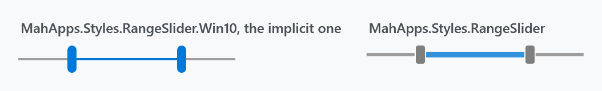
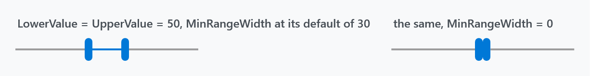
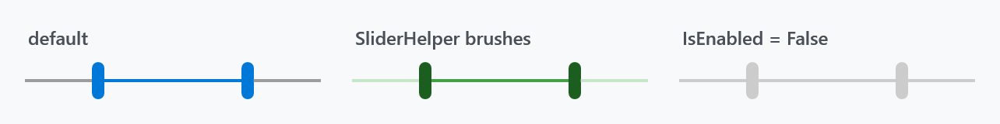
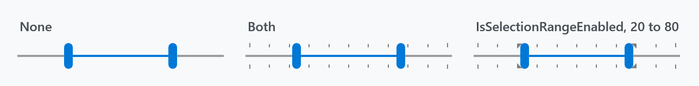
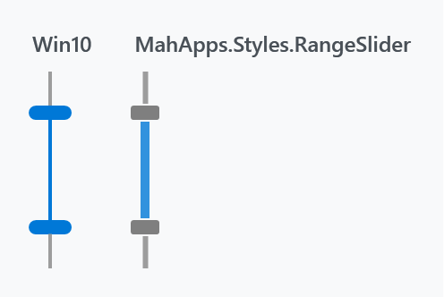

Title: RangeSlider
Description: A slider with a lower and an upper value
---

`RangeSlider` picks a range rather than a value. It has three thumbs — one at each end and one for the band between them — and derives from `RangeBase`, so `Minimum`, `Maximum`, `SmallChange` and `LargeChange` are the familiar ones. The range itself is `LowerValue` and `UpperValue`.



```xml
<mah:RangeSlider Width="190"
                 Minimum="0"
                 Maximum="100"
                 LowerValue="30"
                 UpperValue="70" />
```

:::{.alert .alert-warning}
Set `Minimum` and `Maximum`. Unlike the [Slider](../styles/slider) styles, neither `RangeSlider` style sets them, so they come straight from `RangeBase` as **0 and 1** — a range slider without them clamps everything you give it to 1.
:::

## The two styles

| Style | |
| --- | --- |
| `MahApps.Styles.RangeSlider.Win10` | **the implicit one** — a 2px track and tall rounded thumbs |
| `MahApps.Styles.RangeSlider` | a thicker track and small grey thumbs |

Both live in `Themes/RangeSlider.xaml` and the implicit one is applied through `Generic.xaml`, so neither needs a dictionary merged. As with the plain slider, the Win10 style additionally sets `IsMoveToPointEnabled="True"`.

```xml
<mah:RangeSlider Style="{DynamicResource MahApps.Styles.RangeSlider}" />
```

## MinRange and MinRangeWidth

These two sound alike and are not:

| | | |
| --- | --- | --- |
| `MinRange` | in value units | how close `LowerValue` and `UpperValue` may get. Default `0` |
| `MinRangeWidth` | in pixels | the minimum width of the middle thumb. Default `30` |

`MinRangeWidth` is the one that surprises people, because it is a floor on the *drawn* band, not on the values:



Both panels have `LowerValue` and `UpperValue` at 50. On the left, the default `MinRangeWidth` of 30 keeps thirty pixels of filled track between the thumbs anyway; only `MinRangeWidth="0"` lets them meet.

```xml
<mah:RangeSlider Minimum="0" Maximum="100"
                 LowerValue="50" UpperValue="50"
                 MinRangeWidth="0" />
```

It is also coerced: it can never exceed half the track length once the side thumbs are accounted for. The value-to-pixel mapping subtracts it from the usable width, which is why the thumbs above straddle the midpoint rather than sitting on it.

:::{.alert .alert-info}
The XML documentation on `MinRangeWidth` in the library reads *"Get/sets the minimal distance between two thumbs"*, which describes `MinRange` instead. The API reference repeats it, so go by the table above.
:::

## Colours

Both styles take their brushes from [SliderHelper](../helper/sliderhelper), the same twelve as the plain slider — thumb, track and filled track, each with a hover, pressed and disabled variant. The middle thumb is painted from the `TrackValue` set.



```xml
<mah:RangeSlider Minimum="0" Maximum="100" LowerValue="30" UpperValue="70"
                 mah:SliderHelper.ThumbFillBrush="#FF1B5E20"
                 mah:SliderHelper.TrackValueFillBrush="#FF43A047"
                 mah:SliderHelper.TrackFillBrush="#FFC8E6C9" />
```

Set the `Hover` and `Pressed` variants too, or the slider goes back to the theme colour as soon as the pointer is over it.

`Foreground` is the tick colour here, not the track colour.

## Ticks and the selection range



```xml
<mah:RangeSlider Minimum="0" Maximum="100" LowerValue="30" UpperValue="70"
                 TickFrequency="10"
                 TickPlacement="Both" />
```

`TickFrequency`, `Ticks`, `TickPlacement` and `IsSnapToTickEnabled` behave as they do on a `Slider`. `IsSnapToTickEnabled` makes both thumbs land on ticks.

`IsSelectionRangeEnabled` together with `SelectionStart` and `SelectionEnd` marks a sub-range — the grey wedges in the third panel. Those markers are drawn **on the tick bars**, so they are invisible unless `TickPlacement` is also set.

## Interaction

| Property | Default | |
| --- | --- | --- |
| `IsMoveToPointEnabled` | `False`, but `True` in the Win10 style | clicking the track jumps the nearest thumb there instead of stepping |
| `Interval` | `100` | milliseconds between steps while the button is held, when `IsMoveToPointEnabled` is off |
| `MoveWholeRange` | `False` | a click outside the range moves the whole band instead of just the near thumb |
| `ExtendedMode` | `False` | see below |
| `AutoToolTipPlacement` | `None` | `TopLeft` or `BottomRight` to show the value while dragging |
| `AutoToolTipPrecision` | `0` | decimal places in that tooltip |

Without `ExtendedMode`, clicking inside the range only drags the band. With it on, **Ctrl + left click** inside the range moves the lower thumb and **Ctrl + right click** moves the upper one, so both ends stay reachable without leaving the band.

The middle mouse button toggles `MoveWholeRange` — undocumented in the library, but it is there.

## Vertical



```xml
<mah:RangeSlider Height="110"
                 Orientation="Vertical"
                 Minimum="0" Maximum="100"
                 LowerValue="30" UpperValue="70" />
```

Each style carries a second template and swaps to it on `Orientation="Vertical"` through a trigger. That trigger beats a `Template` setter in a style derived from it — see the warning under [Slider](../styles/slider#vertical), which applies here word for word.

## The drag tooltip

`AutoToolTipPlacement` shows the value being dragged. Three templates shape it: `AutoToolTipLowerValueTemplate` and `AutoToolTipUpperValueTemplate` for the end thumbs, and `AutoToolTipRangeValuesTemplate` for the middle one, whose data context is a `RangeSliderAutoTooltipValues` carrying both values.

```xml
<mah:RangeSlider Width="190"
                 Minimum="0" Maximum="100"
                 LowerValue="30" UpperValue="70"
                 AutoToolTipPlacement="TopLeft"
                 AutoToolTipPrecision="2">
    <mah:RangeSlider.AutoToolTipRangeValuesTemplate>
        <DataTemplate DataType="mah:RangeSliderAutoTooltipValues">
            <UniformGrid Columns="2" Rows="2">
                <TextBlock HorizontalAlignment="Right" Text="From:" />
                <TextBlock HorizontalAlignment="Right" Text="{Binding LowerValue, StringFormat='{}{0:N2}'}" />
                <TextBlock HorizontalAlignment="Right" Text="To:" />
                <TextBlock HorizontalAlignment="Right" Text="{Binding UpperValue, StringFormat='{}{0:N2}'}" />
            </UniformGrid>
        </DataTemplate>
    </mah:RangeSlider.AutoToolTipRangeValuesTemplate>
</mah:RangeSlider>
```

## Events

`LowerValueChanged` and `UpperValueChanged` fire for the individual ends, `RangeSelectionChanged` for the range as a whole. Each of the three thumbs also raises its own `DragStarted`, `DragDelta` and `DragCompleted` — `LowerThumbDragStarted`, `CentralThumbDragDelta`, `UpperThumbDragCompleted` and so on — which is what to hang expensive work off, rather than recomputing on every value change while a thumb is moving.

## Mouse wheel

[SliderHelper](../helper/sliderhelper) applies here as well:

```xml
<mah:RangeSlider mah:SliderHelper.EnableMouseWheel="MouseHover"
                 mah:SliderHelper.ChangeValueBy="LargeChange"
                 SmallChange="1"
                 LargeChange="10" />
```

## Origin

The control came from the Avalon Controls Library (MS-PL) by way of [this fork](https://github.com/jogibear9988/avaloncontrolslib); the original CodePlex site is gone. It has been rewritten considerably since.
