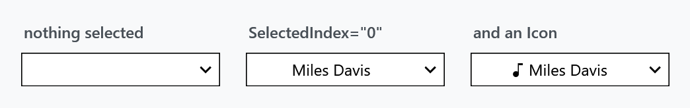
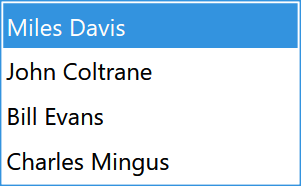
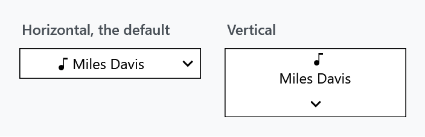
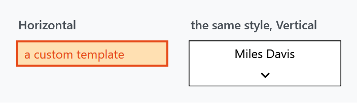

Title: SplitButton
Description: A button with a separate arrow that drops down a list
---

`SplitButton` is a button split into two halves: the left runs a command, the right opens a list. Picking from the list changes what the left half shows.



```xml
<mah:SplitButton ItemsSource="{Binding Artists}"
                 SelectedIndex="0"
                 Command="{Binding PlayCommand}" />
```

`ItemsSource` is the content property, so the items can also be written as the button's child element.

## It is a ComboBox

`SplitButton` derives from `ComboBox`, which is where most of its API comes from and is the shortest explanation of how it differs from [DropDownButton](dropdownbutton):



`SelectedItem`, `SelectedIndex`, `SelectionChanged`, `ItemsSource`, `DisplayMemberPath`, `ItemTemplate`, `IsDropDownOpen`, `MaxDropDownHeight` and the rest all behave exactly as they do on a `ComboBox`. Items become `ComboBoxItem`s in a `Popup`.

The button's label is not a property of its own — the template binds it to `SelectionBoxItem`, so it *is* the selected item and follows the selection. With nothing selected the label is empty, as in the first panel above.

Virtualization is on by default: the style sets `IsVirtualizing`, `IsVirtualizingWhenGrouping` and `VirtualizationMode="Recycling"`, so long lists cost what they should.

:::{.alert .alert-warning}
`IsEditable` is **coerced to `False` and cannot be changed.** The control overrides its metadata with a coercion callback that returns `false` unconditionally:

```csharp
private static object CoerceIsEditableProperty(DependencyObject dependencyObject, object value)
{
    // For now SplitButton is not editable
    return false;
}
```

Setting it in XAML is accepted and then silently ignored.
:::

## The two halves

| | |
| --- | --- |
| `PART_Button`, the left half | runs `Command`, raises `Click`, then **closes** the drop-down |
| `PART_Expander`, the arrow | toggles `IsDropDownOpen`, and nothing else |

This is the opposite of [DropDownButton](dropdownbutton), where one click both runs the command and opens the list. Here the two are genuinely separate, which is the point of splitting the button.

`SplitButton` implements `ICommandSource` and overrides `IsEnabledCore`, so it disables itself while its command reports `CanExecute == false` — and the template disables the arrow along with it.

Both halves are real `Button`s and are styled separately:

| | | |
| --- | --- | --- |
| `ButtonStyle` | `MahApps.Styles.Button.Split` | the left half |
| `ButtonArrowStyle` | `MahApps.Styles.Button.Split.Arrow` | the arrow |

Both are registered with `Inherits`, so either can be set on a parent panel to reach every `SplitButton` below it.

## Properties of its own

| Property | Type | Default | |
| --- | --- | --- | --- |
| `Icon` / `IconTemplate` | `object` / `DataTemplate` | `null` | shown before the selected item |
| `Orientation` | `Orientation` | `Horizontal` | see below |
| `ArrowBrush` / `ArrowMouseOverBrush` / `ArrowPressedBrush` | `Brush` | theme | the chevron in its three states |
| `ButtonStyle` / `ButtonArrowStyle` | `Style` | see above | the two halves |
| `ExtraTag` | `object` | `null` | a second `Tag` |
| `Click` | routed event | | bubbling, raised by the left half |

Unlike `DropDownButton` there is no `ArrowVisibility`: the arrow is the only way to open the list, so it cannot be hidden.

### Orientation



```xml
<mah:SplitButton Orientation="Vertical" ItemsSource="{Binding Artists}" SelectedIndex="0" />
```

`Vertical` puts the arrow underneath instead of beside, and stacks the icon above the label.

:::{.alert .alert-warning}
**`Orientation` is two separate templates, and that breaks a custom one.** The style ships `MahApps.Templates.SplitButton.Horizontal` and `MahApps.Templates.SplitButton.Vertical` and switches between them from a `Style.Triggers` entry on `Orientation`.

A trigger outranks a plain setter anywhere in the style chain, so a derived style that sets `Template` is beaten by that inherited trigger the moment the button turns vertical:



Both buttons above use the same derived style with the same custom `Template`. To make a custom template survive, repeat the trigger in your own style:

```xml
<Style BasedOn="{StaticResource {x:Type mah:SplitButton}}" TargetType="{x:Type mah:SplitButton}">
    <Setter Property="Template" Value="{StaticResource MyHorizontalTemplate}" />
    <Style.Triggers>
        <Trigger Property="Orientation" Value="Vertical">
            <Setter Property="Template" Value="{StaticResource MyVerticalTemplate}" />
        </Trigger>
    </Style.Triggers>
</Style>
```

The [Slider](../styles/slider) style has the same shape and the same trap.
:::

## The drop-down frame

The popup's `PopupBorder` takes its `BorderBrush` from the control, but its `Background` is a fixed `MahApps.Brushes.ThemeBackground`, its `BorderThickness` is a hardcoded `1`, and it has no `CornerRadius` at all. So `ControlsHelper.CornerRadius` rounds the button and leaves the list square. The same shape in the [DateTimePicker](DateTimePicker) template is tracked as [#4582](https://github.com/MahApps/MahApps.Metro/issues/4582).

## Related

[DropDownButton](dropdownbutton) — no selection, a static label, and a `ContextMenu` instead of a popup list. [ContentControlEx](contentcontrolex) presents the label, so `ControlsHelper.ContentCharacterCasing` and `ControlsHelper.RecognizesAccessKey` apply here too.
