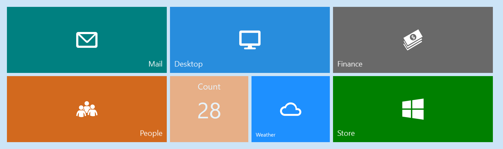
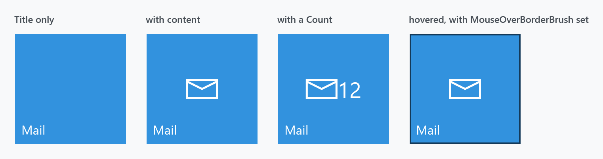
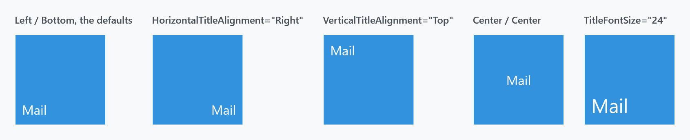

Title: Tile
Description: A square button in the style of a Windows Start screen tile
---

`Tile` is a square button that looks like a tile from the Windows 8 or 10 Start screen: a coloured block with a caption in a corner and room for an icon in the middle.



That is the tile wall from the main demo, reproduced markup for markup. A `WrapPanel` and two sizes of tile is all there is to it:

```xml
<WrapPanel Width="924">
    <mah:Tile Title="Mail"
              Background="Teal"
              HorizontalTitleAlignment="Right"
              Style="{StaticResource LargeTileStyle}"
              mah:ControlsHelper.MouseOverBorderBrush="{DynamicResource MahApps.Brushes.ThemeForeground}">
        <iconPacks:PackIconModern Width="40" Height="40" Kind="Email" />
    </mah:Tile>
    <mah:Tile Title="Finance" Background="DimGray" Style="{StaticResource LargeTileStyle}">
        <iconPacks:PackIconModern Width="40" Height="40" Kind="Money" />
    </mah:Tile>
    <mah:Tile Title="Count"
              Background="#FF842D"
              Count="28"
              CountFontSize="42"
              HorizontalTitleAlignment="Center"
              IsEnabled="False"
              Style="{StaticResource SmallTileStyle}"
              TitleFontSize="16"
              VerticalTitleAlignment="Top" />
    <!--  …  -->
</WrapPanel>
```

```xml
<Style x:Key="LargeTileStyle" TargetType="mah:Tile">
    <Setter Property="Width" Value="300" />
    <Setter Property="Height" Value="125" />
    <Setter Property="TitleFontSize" Value="14" />
</Style>

<Style x:Key="SmallTileStyle" TargetType="mah:Tile">
    <Setter Property="Width" Value="147" />
    <Setter Property="Height" Value="125" />
    <Setter Property="TitleFontSize" Value="10" />
</Style>
```

The icons come from [MahApps.Metro.IconPacks](https://github.com/MahApps/MahApps.Metro.IconPacks), a separate package, with

```xml
xmlns:iconPacks="http://metro.mahapps.com/winfx/xaml/iconpacks"
```

The *Count* tile is the faded one: it has no content of its own, just a `Count`, and `IsEnabled="False"` drops it to 55% opacity.

## A single tile

```xml
<mah:Tile Title="Mail" Command="{Binding OpenMailCommand}">
    <mah:FontIcon FontSize="40" Glyph="&#xE715;" />
</mah:Tile>
```

It derives from `Button`, so `Click`, `Command`, `CommandParameter` and `IsEnabled` all work exactly as on any button — there is no tile-specific way to react to a press.

Left alone it is square: the style sets **`Width` and `Height` to 140**, with a `Margin` of 3, the accent brush as `Background` and `MahApps.Brushes.IdealForeground` as `Foreground`. Override any of them, as the demo's two styles above do.

## Title, content and count



A tile has three separate places to put something:

| | |
| --- | --- |
| `Content` | the button's own content, centred — usually an icon |
| `Count` | a string drawn immediately after the content, at `CountFontSize` (default **28**) |
| `Title` | the caption, positioned in a corner, at `TitleFontSize` (default **16**) |

`Content` and `Count` share a horizontal `StackPanel` with no spacing between them, so a count sits flush against the icon — the third panel above. Add a right margin to the content if you want a gap.

The title is rendered in an `AccessText`, so `Title="_Mail"` gives it an access key, and it wraps rather than clipping when it does not fit.



`HorizontalTitleAlignment` (default `Left`) and `VerticalTitleAlignment` (default `Bottom`) place the title independently of the content, which is aligned by the usual `HorizontalContentAlignment` and `VerticalContentAlignment` — both `Center` in the style.

## Hover and press

:::{.alert .alert-info}
**There is no hover effect until you ask for one.** The style sets `ControlsHelper.MouseOverBorderBrush` to `{x:Null}`, and the template's trigger requires it to be non-null before the border is shown:

```xml
<Condition Binding="{Binding … Path=(mah:ControlsHelper.MouseOverBorderBrush), Converter={x:Static converters:IsNullConverter.Instance}}" Value="False" />
<Condition Binding="{Binding … Path=IsMouseOver}" Value="True" />
```

So an untouched tile does nothing at all under the pointer. Give it a brush and a 2px border fades in at 60% opacity:

```xml
<mah:Tile Title="Mail" mah:ControlsHelper.MouseOverBorderBrush="{DynamicResource MahApps.Brushes.ThemeForeground}" />
```

The last panel of the four-tile figure above shows that border. It is what the demo's *Mail* and *Desktop* tiles set, and why only those two react to the mouse.
:::

Pressing a tile scales it to 0.98 about its centre, which is the small "push" the Start screen tiles had. That comes from a trigger on `Button.IsPressed` and needs no setting up.

## Two properties that do nothing

:::{.alert .alert-warning}
`Tile` declares **`KeepDragging`** and **`TiltFactor`**, and neither has any effect. Nothing in the library reads either one: `TiltFactor` appears only at its own declaration in `Tile.cs`, and the tile template contains no behaviour, no `Interaction.Behaviors` and no tilt code at all.

The tilt effect they look like they control lives in **`TiltBehavior`**, which has its own `KeepDragging` and `TiltFactor` properties and has to be attached explicitly:

```xml
<mah:Tile Title="Mail">
    <i:Interaction.Behaviors>
        <mah:TiltBehavior TiltFactor="10" />
    </i:Interaction.Behaviors>
</mah:Tile>
```

Both dead properties are **removed on `develop`** (in `bc0c0560`), so they will be gone from the next release. Do not start using them.
:::

## Related

`TiltBehavior` for the tilt-on-press effect. [FontIcon](fonticon) is a convenient thing to put inside a tile, and [Badged](Badged) is the alternative when you want a count as a badge rather than beside the icon.
