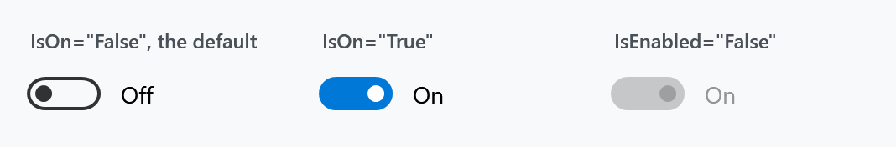
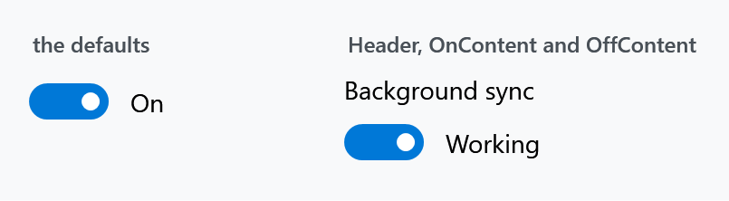
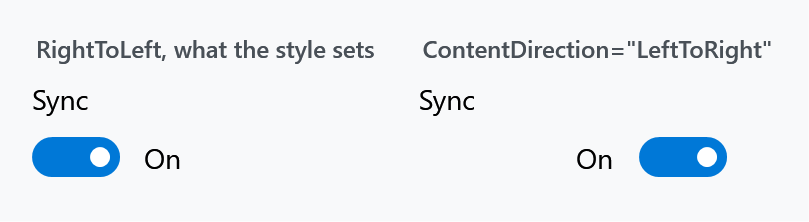
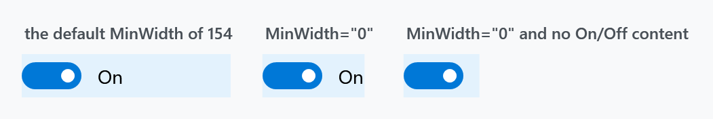

Title: ToggleSwitch
Description: An on/off switch with a header and per-state content
---

`ToggleSwitch` is an on/off switch. It does the same job as a `CheckBox` but says its state in words as well as shape, and it is easier to hit with a finger. It derives from `HeaderedContentControl` and implements `ICommandSource`.



```xml
<mah:ToggleSwitch Header="Background sync" IsOn="{Binding SyncEnabled}" />
```

`IsOn` is the state and binds two-way by default. The knob can be clicked or dragged, and the switch is toggled by <kbd>Space</kbd> as well.

## Header and per-state content



| Property | Type | Default | |
| --- | --- | --- | --- |
| `Header` | `object` | `null` | a label above the switch, from `HeaderedContentControl` |
| `OnContent` | `object` | **`"On"`** | shown beside the switch while on |
| `OffContent` | `object` | **`"Off"`** | shown beside the switch while off |

`OnContent` and `OffContent` each have a matching `…Template`, `…TemplateSelector` and `…StringFormat`. Both default to text, which is why an untouched switch already says *On* and *Off* — set them to `{x:Null}` for a bare switch.

The header is styled through [HeaderedControlHelper](../helper/headeredcontrolhelper): the style sets `HeaderFontFamily`, `HeaderFontSize`, `HeaderForeground` and `HeaderMargin`, so those are what to change rather than the header's own properties.

### Which side the switch is on



`ContentDirection` is a `FlowDirection` that decides whether the switch sits before or after its on/off content.

:::{.alert .alert-info}
The dependency property's default is `LeftToRight`, but `MahApps.Styles.ToggleSwitch` sets **`RightToLeft`**, and that style is applied to every `ToggleSwitch` through `Generic.xaml`. So the effective default is `RightToLeft` — switch on the left, text on its right — and setting `LeftToRight` is what mirrors it.
:::

## Width



:::{.alert .alert-warning}
A `ToggleSwitch` is **much wider than it looks**. The style sets

```xml
<Setter Property="MinWidth" Value="{DynamicResource ToggleSwitchThemeMinWidth}" />
```

and `ToggleSwitchThemeMinWidth` is **154**. The switch and its label take far less, so the rest is invisible padding that still consumes layout space — the tinted boxes in the figure are the controls' actual bounds.

In a tight layout set `MinWidth="0"`, and clear `OnContent` and `OffContent` if you do not want the words either.
:::

`ContentPadding` (default: an empty `Thickness`) pads the on/off content, and the theme exposes `ToggleSwitchPreContentMargin`, `ToggleSwitchPostContentMargin` and `ToggleSwitchContentSpaceMargin` as `GridLength` resources for the spacing around it.

## Reacting to a change

There are four hooks and they do **not** fire in the same situations. This is the part worth getting right.

| | Fires when |
| --- | --- |
| `Toggled` | `IsOn` changes **for any reason** — a click, a binding, a property set in code |
| `Command` | the user toggles the switch, in either direction |
| `OnCommand` | the user toggles it **on** |
| `OffCommand` | the user toggles it **off** |

The commands are executed from `Toggle()`, which only user interaction reaches:

```csharp
private void Toggle()
{
    var newValue = !this.IsOn;
    this.SetCurrentValue(IsOnProperty, BooleanBoxes.Box(newValue));

    CommandHelpers.ExecuteCommandSource(this);
    CommandHelpers.ExecuteCommandSource(this, newValue ? this.OnCommand : this.OffCommand);
}
```

`Toggled`, by contrast, is raised from the `IsOn` property-changed callback. So setting `IsOn` in code raises `Toggled` and runs **no** command, while a click does both. Pick `Toggled` for "the value changed" and the commands for "the user changed it".

`Command` and the pair share one `CommandParameter` and `CommandTarget`. All three can be set at once; `Command` runs first.

:::{.alert .alert-warning}
**`Toggled` is not a routed event.** Despite its `RoutedEventHandler` signature it is a plain CLR event:

```csharp
public event RoutedEventHandler Toggled;
```

It is raised with `Toggled?.Invoke(this, new RoutedEventArgs())`, so it does not bubble and cannot be attached with an `EventSetter` in a style or handled on a parent element. Subscribe on the switch itself, or use the commands.
:::

## Other properties

| Property | Type | |
| --- | --- | --- |
| `IsPressed` | `bool`, read-only | whether the switch is being pressed or dragged |
| `ContentPadding` | `Thickness` | padding around the on/off content |

The template parts are `SwitchKnobBounds`, `SwitchKnob`, `KnobTranslateTransform` and `SwitchThumb`, plus a content presenter for each of the header, content, on-content and off-content. The `Thumb` is what makes the knob draggable, and `ToggleSwitchTranslateDuration` (0.5 s) is the resource that times the slide.

## Validation

The style sets `Validation.ErrorTemplate` to `MahApps.Templates.ValidationError`, so a failed binding on `IsOn` gets the same treatment as any other input control — see [Validation](../styles/validation).

## Related

[HeaderedControlHelper](../helper/headeredcontrolhelper) for the header's font and colour. [ToggleButtonHelper](../helper/togglebuttonhelper) and the [CheckBox](../styles/checkbox) styles cover the other two-state controls.
