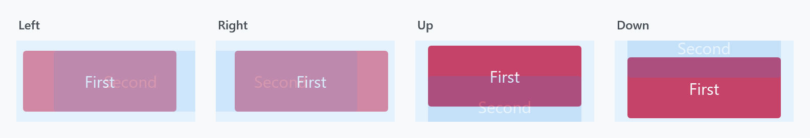
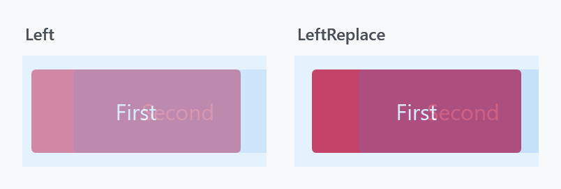

Title: TransitioningContentControl
Description: A ContentControl that animates from the old content to the new one
---

`TransitioningContentControl` animates *between* two contents: assign a new `Content` and the old one is animated out while the new one is animated in. It is a `ContentControl`, so it holds one child at a time.



```xml
<mah:TransitioningContentControl Width="250" Height="250"
                                 Content="{Binding CurrentPage}"
                                 Transition="Left" />
```

Both contents are only on screen together for the first fraction of a second, which is the moment the figures show: the old one (*First*) on its way out, the new one (*Second*) on its way in.

This is the counterpart to [MetroContentControl](metrocontentcontrol), which animates its own appearance and does **not** react to a content change at all.

It began as a port of the Silverlight control of the same name.

## The transitions

`Transition` takes a `TransitionType`, and each value maps to a visual state in the template:

| Value | Visual state | |
| --- | --- | --- |
| `Default` | `DefaultTransition` | the default: a cross-fade over 0.3s, no movement |
| `Normal` | `Normal` | **no animation** — it only hides the previous presenter, so the swap is instant |
| `Up` / `Down` | `UpTransition` / `DownTransition` | slide vertically |
| `Left` / `Right` | `LeftTransition` / `RightTransition` | slide horizontally |
| `LeftReplace` / `RightReplace` | `LeftReplaceTransition` / `RightReplaceTransition` | see below |
| `Custom` | whatever `CustomVisualStatesName` says | |

`Normal` is the one to pick when you want the control's API but none of its animation.



The *replace* variants are not just a different direction — they are a different idea and a different length:

| | plain `Left` | `LeftReplace` |
| --- | --- | --- |
| new content | fades in over 0.4s, slides 30px over **0.7s** | fades in over 0.3s, slides 40px over **0.3s** |
| old content | fades out over 0.1s **and slides away** | fades out over 0.3s, **stays put** |

So `Left` moves both layers past each other, while `LeftReplace` slides the new content over an old one that only dissolves. In the figure above the old content is still strongly coloured on the right, because it is a third of the way through a 0.3s fade rather than half way through a 0.1s one.

:::{.alert .alert-info}
`Transition` is registered with `FrameworkPropertyMetadataOptions.Inherits`, so setting it once on a parent panel applies it to every `TransitioningContentControl` underneath.
:::

## When the content changes again mid-transition

| Property | Type | Default |
| --- | --- | --- |
| `RestartTransitionOnContentChange` | `bool` | `False` |

The name undersells what it decides. `StartTransition` reads:

```csharp
if (!this.IsTransitioning || this.RestartTransitionOnContentChange)
```

With the default `False`, a content change arriving **while a transition is still running** puts the new content into the presenter but does **not** start the animation again — the running transition simply finishes with the newer content in place. Set it to `True` and every change restarts the animation from the beginning, which is what you want when content can change faster than 0.7s.

## Methods and events

| | |
| --- | --- |
| `ReloadTransition()` | play the transition again with the same content |
| `AbortTransition()` | stop the running one immediately |
| `TransitionCompleted` | raised when the storyboard finishes |

`ReloadBehavior.OnSelectedTabChanged` replays the transition when a `TabControl` above the control raises `SelectionChanged` — see [MetroContentControl](metrocontentcontrol) for the behavior's other attached property.

:::{.alert .alert-warning}
**`TransitionCompleted` is not a routed event.** Despite the `RoutedEventHandler` signature it is a plain CLR event:

```csharp
public event RoutedEventHandler TransitionCompleted;
```

It is raised with `Invoke`, so it does not bubble and cannot be attached with an `EventSetter`. Subscribe on the control itself. ([ToggleSwitch](toggleswitch) has the same arrangement for its `Toggled` event.)
:::

:::{.alert .alert-warning}
**Never write to `IsTransitioning`.** It is registered as an ordinary read/write dependency property, but the control guards it with an internal flag and any write from outside is rejected with a bare exception:

```csharp
if (!source.allowIsTransitioningPropertyWrite)
{
    source.IsTransitioning = (bool)e.OldValue;
    throw new InvalidOperationException();
}
```

There is no message on it, which makes it puzzling to hit. Read it, or bind to it **one-way**; a two-way binding will throw as soon as the target pushes a value back.
:::

## Custom transitions

If none of the built-in states fit, supply your own. Set `Transition="Custom"`, name the state in `CustomVisualStatesName`, and put the `VisualState` in `CustomVisualStates`. The two presenters you animate are named `CurrentContentPresentationSite` and `PreviousContentPresentationSite`.

```xml
<mah:TransitioningContentControl Width="250" Height="50"
                                 Content="First"
                                 CustomVisualStatesName="CustomTransition"
                                 Transition="Custom">
    <mah:TransitioningContentControl.CustomVisualStates>
        <VisualState x:Name="CustomTransition">
            <Storyboard>
                <DoubleAnimationUsingKeyFrames BeginTime="00:00:00"
                                               Storyboard.TargetName="CurrentContentPresentationSite"
                                               Storyboard.TargetProperty="(UIElement.Opacity)">
                    <SplineDoubleKeyFrame KeyTime="00:00:00" Value="0" />
                    <SplineDoubleKeyFrame KeyTime="00:00:00.5" Value="0" />
                    <EasingDoubleKeyFrame KeyTime="00:00:01" Value="1">
                        <EasingDoubleKeyFrame.EasingFunction>
                            <SineEase />
                        </EasingDoubleKeyFrame.EasingFunction>
                    </EasingDoubleKeyFrame>
                </DoubleAnimationUsingKeyFrames>
                <DoubleAnimationUsingKeyFrames BeginTime="00:00:00"
                                               Storyboard.TargetName="PreviousContentPresentationSite"
                                               Storyboard.TargetProperty="(UIElement.Opacity)">
                    <SplineDoubleKeyFrame KeyTime="00:00:00" Value="1" />
                    <SplineDoubleKeyFrame KeyTime="00:00:00.5" Value="0" />
                </DoubleAnimationUsingKeyFrames>
            </Storyboard>
        </VisualState>
    </mah:TransitioningContentControl.CustomVisualStates>
</mah:TransitioningContentControl>
```

`CustomVisualStatesName` defaults to `"CustomTransition"`, so the name above can be left out if you use that one.

:::{.alert .alert-warning}
**Get the state name wrong and the exception will not tell you so.** When the control cannot find the state for the transition it has been given, it reverts the property and throws — but the message is a leftover placeholder:

```csharp
throw new ArgumentException(string.Format(CultureInfo.CurrentCulture, "Temporary removed exception message", newTransition));
```

The format string has no placeholder, so the transition name passed alongside it is discarded too. This is unchanged on `develop`. A mistyped `CustomVisualStatesName` is the usual way to reach it, so check that first when you see it.

A second, better-worded failure exists for the same problem at template time: `'{transition}' transition could not be found!`, thrown as a `MahAppsException` from `OnApplyTemplate`.
:::

## Related

[MetroContentControl](metrocontentcontrol) for a control that animates its own entrance rather than the change between contents. [FlipView](flipview) uses a `TransitioningContentControl` internally, which is where its `LeftTransition` and friends come from.
