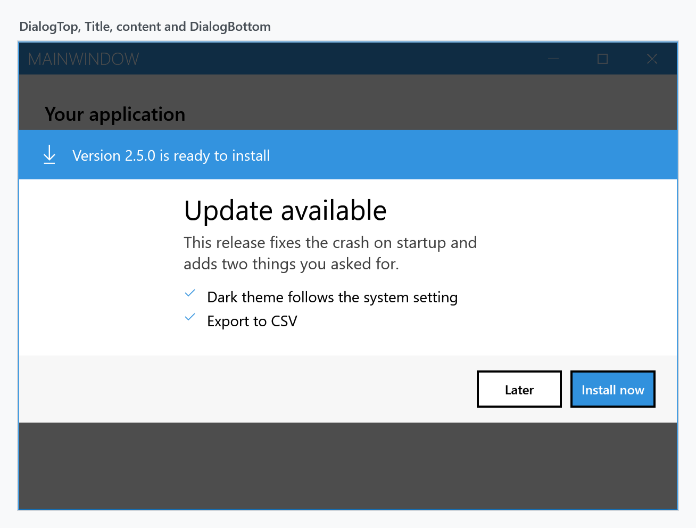
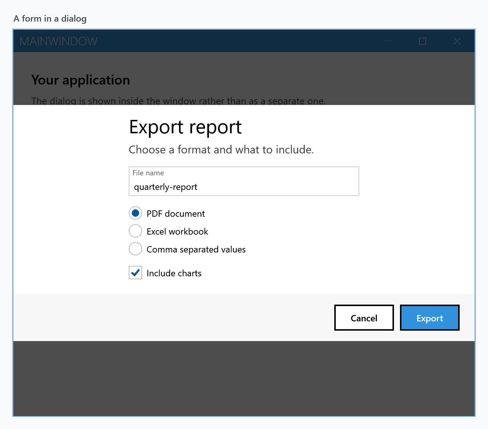
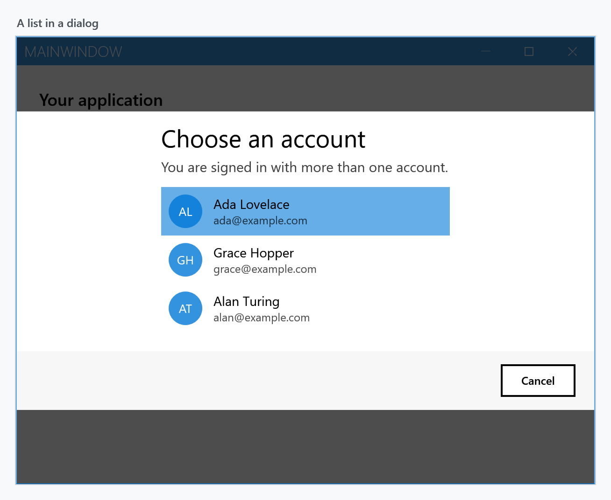
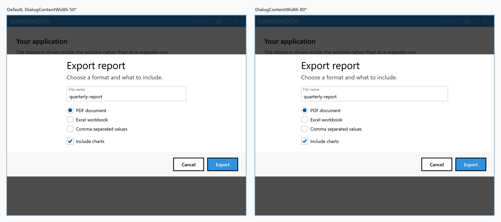

Order: 70
Title: Custom Dialogs
Description: Create your own dialogs
---

When none of the built-in dialogs fits, `CustomDialog` gives you the same overlay with whatever content you put in it. It is a `ContentControl`, so anything that goes in a `UserControl` goes in a dialog.



## Anatomy

A dialog has four regions, and knowing which is which is most of the job:

| Region | |
| --- | --- |
| `DialogTop` | full width, above everything. Good for a coloured band or a banner |
| `Title` | a `TextBlock` above the content, in the dialog title font. Hidden when `null` |
| `Content` | your content |
| `DialogBottom` | full width, below everything. Where a button bar goes |

`Title` and `Content` sit in the middle column of a three-column grid — `DialogContentMargin`, `DialogContentWidth`, `DialogContentMargin`, which default to `25*`, `50*` and `25*`. So they occupy the middle half of the window and stay centred as it is resized. `DialogTop` and `DialogBottom` are outside that grid and always span the full width, which is what makes the coloured band above and the button bar below reach the edges.

The dialog in the figure is this, and nothing else:

```xml
<mah:CustomDialog x:Class="MyApp.UpdateDialog"
                  xmlns="http://schemas.microsoft.com/winfx/2006/xaml/presentation"
                  xmlns:x="http://schemas.microsoft.com/winfx/2006/xaml"
                  xmlns:mah="http://metro.mahapps.com/winfx/xaml/controls"
                  Title="Update available">

    <mah:CustomDialog.DialogTop>
        <Border Padding="20 14" Background="{DynamicResource MahApps.Brushes.Accent}">
            <StackPanel Orientation="Horizontal">
                <TextBlock VerticalAlignment="Center"
                           FontFamily="Segoe MDL2 Assets"
                           FontSize="18"
                           Foreground="{DynamicResource MahApps.Brushes.IdealForeground}"
                           Text="&#xE896;" />
                <TextBlock Margin="12 0 0 0"
                           VerticalAlignment="Center"
                           FontSize="14"
                           Foreground="{DynamicResource MahApps.Brushes.IdealForeground}"
                           Text="Version 2.5.0 is ready to install" />
            </StackPanel>
        </Border>
    </mah:CustomDialog.DialogTop>

    <StackPanel Margin="0 4 0 20">
        <TextBlock Margin="0 0 0 12"
                   FontSize="15"
                   Opacity="0.75"
                   Text="This release fixes the crash on startup and adds two things you asked for."
                   TextWrapping="Wrap" />
        <!-- one row per change -->
    </StackPanel>

    <mah:CustomDialog.DialogBottom>
        <Border Padding="20 14" Background="{DynamicResource MahApps.Brushes.Gray10}">
            <StackPanel HorizontalAlignment="Right" Orientation="Horizontal">
                <Button Content="Later" Style="{DynamicResource MahApps.Styles.Button.Dialogs}" />
                <Button Margin="8 0 0 0"
                        Content="Install now"
                        Style="{DynamicResource MahApps.Styles.Button.Dialogs.Accent}" />
            </StackPanel>
        </Border>
    </mah:CustomDialog.DialogBottom>

</mah:CustomDialog>
```

Use the theme brushes rather than fixed colours — `MahApps.Brushes.Accent` with `MahApps.Brushes.IdealForeground` on top of it, `MahApps.Brushes.Gray10` for the quiet strip — and the dialog follows the application's theme without further work.

### Button styles

Three styles make your buttons look like the ones in the built-in dialogs. They are the same styles those dialogs use.

| Style | |
| --- | --- |
| `MahApps.Styles.Button.Dialogs` | the plain one |
| `MahApps.Styles.Button.Dialogs.Accent` | filled with the accent colour, for the affirmative action |
| `MahApps.Styles.Button.Dialogs.AccentHighlight` | the highlight variant |

## Showing and hiding

`ShowMetroDialogAsync` puts the dialog on screen. It returns as soon as it is up — **not** when the user has answered — so closing it is your job:

```csharp
var dialog = new UpdateDialog();

await this.ShowMetroDialogAsync(dialog);
```

```csharp
await this.HideMetroDialogAsync(dialog);
```

From inside the dialog, `RequestCloseAsync` does the same without needing the window:

```csharp
private async void OnLaterClick(object sender, RoutedEventArgs e)
{
    await this.RequestCloseAsync();
}
```

:::{.alert .alert-info}
`RequestCloseAsync` works both for a dialog shown inside a `MetroWindow` and for one shown in its own window, despite what its XML doc says about throwing for the first case — it routes to `HideMetroDialogAsync` for you.
:::

There is also an overload that constructs the dialog for you:

```csharp
await this.ShowMetroDialogAsync<UpdateDialog>();
```

It uses `Activator.CreateInstance(typeof(TDialog), window, settings)`, so the type needs a `(MetroWindow, MetroDialogSettings)` constructor. A dialog defined in XAML has only the generated parameterless one unless you add it, and without it this overload throws `MissingMethodException`.

`GetCurrentDialogAsync<T>()` hands back the topmost dialog of that type, or `null`:

```csharp
var dialog = await this.GetCurrentDialogAsync<UpdateDialog>();
```

## Getting an answer back

Since the show call does not wait, a custom dialog needs its own way to report what the user chose. A `TaskCompletionSource` set by the buttons turns it back into something awaitable:

```csharp
public partial class ExportDialog : CustomDialog
{
    private readonly TaskCompletionSource<ExportOptions> result = new();

    public ExportDialog()
    {
        this.InitializeComponent();
    }

    public Task<ExportOptions> WaitForResultAsync() => this.result.Task;

    private async void OnExportClick(object sender, RoutedEventArgs e)
    {
        this.result.TrySetResult(new ExportOptions(this.FileName.Text, this.IncludeCharts.IsChecked == true));
        await this.RequestCloseAsync();
    }

    private async void OnCancelClick(object sender, RoutedEventArgs e)
    {
        this.result.TrySetResult(null);
        await this.RequestCloseAsync();
    }
}
```

which reads like any other dialog at the call site:

```csharp
var dialog = new ExportDialog();
await this.ShowMetroDialogAsync(dialog);

var options = await dialog.WaitForResultAsync();
if (options is not null)
{
    await ExportAsync(options);
}
```

`TrySetResult` rather than `SetResult`, so a second click cannot throw. Where there is nothing to report back, `WaitUntilUnloadedAsync()` is enough on its own:

```csharp
await this.ShowMetroDialogAsync(dialog);
await dialog.WaitUntilUnloadedAsync();
```

## A form

Ordinary controls need no special treatment. The MahApps styles apply to them inside a dialog as everywhere else, so a `TextBox` keeps its floating watermark and the radio buttons and checkbox keep the accent colour:



```xml
<StackPanel Margin="0 4 0 20">
    <TextBlock Margin="0 0 0 14" FontSize="15" Opacity="0.75" Text="Choose a format and what to include." />

    <TextBox x:Name="FileName"
             Margin="0 0 0 14"
             mah:TextBoxHelper.UseFloatingWatermark="True"
             mah:TextBoxHelper.Watermark="File name"
             Text="quarterly-report" />

    <RadioButton Margin="0 0 0 6" Content="PDF document" IsChecked="True" />
    <RadioButton Margin="0 0 0 6" Content="Excel workbook" />
    <RadioButton Margin="0 0 0 14" Content="Comma separated values" />

    <CheckBox x:Name="IncludeCharts" Content="Include charts" IsChecked="True" />
</StackPanel>
```

## A list

Nor is there anything stopping an `ItemsControl` — this is a `ListBox` with `BorderThickness="0"` so it does not draw a frame inside the dialog:



In a real application the items come from a binding and each one gets a `DataTemplate`; the picture above spells them out to keep the sample short.

## Making the content wider

`DialogContentWidth` and `DialogContentMargin` are `GridLength`s, so they take star values. Widening the content to `80*` narrows the two margins to what is left:



```xml
<mah:CustomDialog Title="Export report" DialogContentWidth="80*" />
```

Absolute values work too — `DialogContentWidth="400"` with `DialogContentMargin="*"` gives a fixed-width block centred in the window.

## From a view model

`IDialogCoordinator` carries the same three methods, with the context object in front. See [MVVM dialogs](mvvm-dialog) for how the context is wired up.

```csharp
await this.dialogCoordinator.ShowMetroDialogAsync(this, dialog);
await this.dialogCoordinator.HideMetroDialogAsync(this, dialog);
```

## In a window of its own

Where there is no `MetroWindow` to draw into, a custom dialog can open in one:

```csharp
new UpdateDialog().ShowDialogExternally();       // returns immediately
new UpdateDialog().ShowModalDialogExternally();  // blocks until it is closed
```

Both take an optional owner window and an `Action<Window>` that lets you set the size, title or position of the window that is created for it.

## Settings

A custom dialog takes a `MetroDialogSettings` like the built-in ones, and reads the parts that are not about buttons: `ColorScheme`, the three font sizes, `AnimateShow` and `AnimateHide`, `OwnerCanCloseWithDialog` and `CustomResourceDictionary`. The button labels and `CancellationToken` do nothing here — the buttons are yours, and so is closing the dialog. See [Dialog Settings](dialogsettings).
