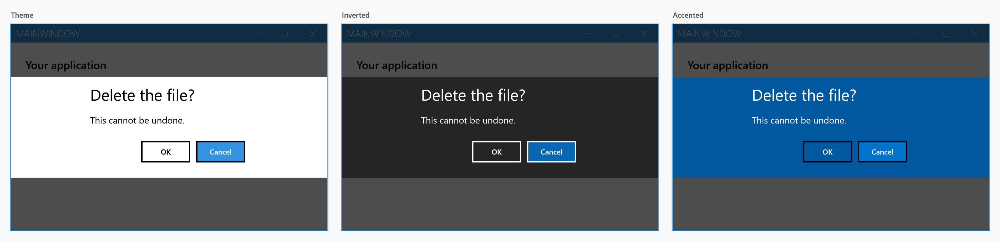
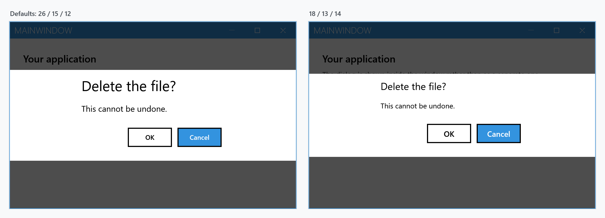

Order: 80
Title: Dialog Settings
Description: Customize dialogs with MetroDialogSettings
---

`MetroDialogSettings` is the one object every built-in dialog takes. It is the last argument of each `Show...Async` method, and it decides the button labels, the colours, the font sizes, the animations and how the dialog can be cancelled.

```csharp
var settings = new MetroDialogSettings
               {
                   AffirmativeButtonText = "Delete",
                   NegativeButtonText = "Keep",
                   ColorScheme = MetroDialogColorScheme.Accented
               };

var result = await this.ShowMessageAsync("Delete the file?", "This cannot be undone.",
                                         MessageDialogStyle.AffirmativeAndNegative, settings);
```

Not every dialog type reads every setting — a progress dialog has no affirmative button to label. The [reference](#reference) below says which reads what, and each dialog page repeats the part that applies to it.

## Where the settings come from

Pass `null` — or leave the argument off — and the dialog falls back to the window's `MetroDialogOptions`, which every `MetroWindow` creates for itself in its constructor. So the order is: the argument, then the window's options, then the defaults.

That makes `MetroDialogOptions` the place for defaults that should hold across a window:

```xml
<mah:MetroWindow x:Class="MyApp.MainWindow"
                 xmlns:mah="http://metro.mahapps.com/winfx/xaml/controls">

    <mah:MetroWindow.MetroDialogOptions>
        <mah:MetroDialogSettings AffirmativeButtonText="Yes"
                                 NegativeButtonText="No"
                                 ColorScheme="Accented" />
    </mah:MetroWindow.MetroDialogOptions>

</mah:MetroWindow>
```

or from code:

```csharp
this.MetroDialogOptions.ColorScheme = MetroDialogColorScheme.Accented;
```

Settings are read when the dialog is created, so changing the object after a dialog is up has no effect on it.

:::{.alert .alert-warning}
**Login dialogs do not use `MetroDialogOptions`.** `ShowLoginAsync` takes a `LoginDialogSettings` and falls back to `new LoginDialogSettings()` when you pass none, so the window's defaults never reach it. Every other type — message, input, progress, and the custom dialogs shown with `ShowMetroDialogAsync` — does fall back to the window.
:::

## Reference

| Setting | Type | Default | Read by |
| --- | --- | --- | --- |
| `AffirmativeButtonText` | `string` | `OK` | message, input, login (`Login`) |
| `NegativeButtonText` | `string` | `Cancel` | message, input, login, progress |
| `FirstAuxiliaryButtonText` | `string` | `null` | message |
| `SecondAuxiliaryButtonText` | `string` | `null` | message |
| `ColorScheme` | `MetroDialogColorScheme` | `Theme` | all |
| `DialogTitleFontSize` | `double` | `26` | all |
| `DialogMessageFontSize` | `double` | `15` | all |
| `DialogButtonFontSize` | `double` | the system message font size | all |
| `AnimateShow` | `bool` | `true` | all |
| `AnimateHide` | `bool` | `true` | all |
| `CancellationToken` | `CancellationToken` | `None` | all, but see below |
| `OwnerCanCloseWithDialog` | `bool` | `false` | all, but see below |
| `CustomResourceDictionary` | `ResourceDictionary` | `null` | all |
| `DefaultText` | `string` | empty | input |
| `DefaultButtonFocus` | `MessageDialogResult` | `Negative` | message |
| `DialogResultOnCancel` | `MessageDialogResult?` | `null` | message |
| `MaximumBodyHeight` | `double` | `NaN`, unlimited | message |

The three font sizes are only applied when they are not `NaN`, which is what they start as — leaving one alone keeps the theme's value rather than setting it to zero.

## Buttons

The four button labels cover the most a dialog can show. A message dialog uses as many as its `MessageDialogStyle` asks for, an input and a login dialog use the first two, and a progress dialog uses only `NegativeButtonText` for its cancel button.

Nothing here controls *whether* a button appears. That is the `MessageDialogStyle` argument for a message dialog, `NegativeButtonVisibility` in `LoginDialogSettings`, and the `isCancelable` argument of `ShowProgressAsync`.

## Colour scheme

`MetroDialogColorScheme` has three values. `Theme` draws the dialog in the current theme's background and foreground, `Inverted` in the inverse theme — light-on-dark under a light theme — and `Accented` fills it with the accent colour.



`Inverted` throws if the current theme has no inverse to switch to, which is the case for a custom theme that was never registered as part of a light/dark pair.

## Font sizes

`DialogTitleFontSize`, `DialogMessageFontSize` and `DialogButtonFontSize` override the theme's `MahApps.Font.Size.Dialog.*` resources for one dialog.



```csharp
var settings = new MetroDialogSettings
               {
                   DialogTitleFontSize = 18,
                   DialogMessageFontSize = 13,
                   DialogButtonFontSize = 14
               };
```

To change them for every dialog in the application, override the resources instead:

```xml
<system:Double x:Key="MahApps.Font.Size.Dialog.Title">18</system:Double>
```

## Animations

`AnimateShow` and `AnimateHide` cover both the dialog and the overlay that dims the window behind it. Turning them off makes the dialog appear and disappear in one frame, which is what you want in a test that would otherwise race the animation.

## Cancellation

`CancellationToken` closes a message, input or login dialog from code, without the user pressing anything. The call then returns the same result it would have returned for a cancel.

:::{.alert .alert-info}
A progress dialog is the exception: the token marks it cancelled and raises `Canceled`, but does not close it. See [Progress Dialog](progress-dialogs).
:::

## Closing the window while a dialog is open

By default a `MetroWindow` refuses to close while one of its dialogs is up, and the close button in the title bar is greyed out. `OwnerCanCloseWithDialog = true` allows it.

:::{.alert .alert-warning}
This only takes effect when the window's `ShowDialogsOverTitleBar` is `False`. That property defaults to `True`, and while it is on both the closing guard and the close button ignore `OwnerCanCloseWithDialog` — the dialog is drawn across the title bar, so the window stays closed to the user either way.
:::

```xml
<mah:MetroWindow ShowDialogsOverTitleBar="False">
    <mah:MetroWindow.MetroDialogOptions>
        <mah:MetroDialogSettings OwnerCanCloseWithDialog="True" />
    </mah:MetroWindow.MetroDialogOptions>
</mah:MetroWindow>
```

## Custom resources

`CustomResourceDictionary` is merged into the dialog's own resources, so it can override any brush, style or template the dialog resolves dynamically — without touching the rest of the application.

```csharp
var settings = new MetroDialogSettings
               {
                   CustomResourceDictionary = new ResourceDictionary
                                              {
                                                  Source = new Uri("pack://application:,,,/MyApp;component/DialogStyles.xaml")
                                              }
               };
```

The [message dialog](message-dialog) page shows what this looks like in practice.

## Login dialogs

`LoginDialogSettings` derives from `MetroDialogSettings` and adds the username, password and remember-checkbox settings. Everything on this page applies to it as well, with the fallback caveat noted above. See [Login Dialog](login-dialogs).
