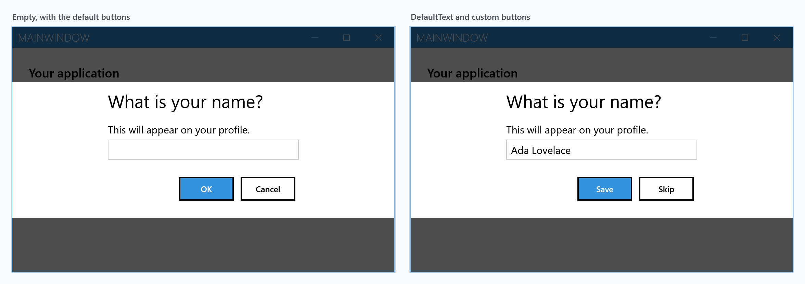
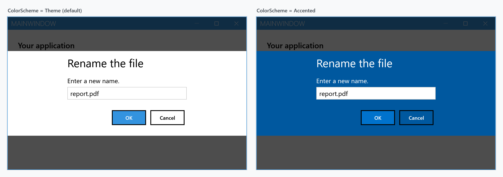

Order: 30
Title: Input Dialog
Description: Dialog to allow simple user input.
---

An input dialog asks for one line of text. Like the other dialogs it is drawn inside the `MetroWindow` rather than in a window of its own.

`ShowInputAsync` returns the text that was entered, or `null` if the user backed out:

```csharp
private async void OnButtonClick(object sender, RoutedEventArgs e)
{
    var name = await this.ShowInputAsync("What is your name?", "This will appear on your profile.");

    if (name is null)
    {
        return; // cancelled
    }

    // use name
}
```



From a view model, use the [dialog coordinator](mvvm-dialog) instead of reaching for the window.

## The null result

Everything that is not "the user pressed the affirmative button" gives you `null`: the negative button, <kbd>Esc</kbd>, <kbd>Alt</kbd>+<kbd>F4</kbd>, and cancelling the `CancellationToken`.

:::{.alert .alert-info}
`null` and an empty string are different answers. An empty string means the user confirmed an empty box; `null` means there was no answer at all. Check for `null` rather than using `string.IsNullOrEmpty` if the two should behave differently.
:::

## Prefilling the box

`DefaultText` puts a value in the box before the dialog opens. It arrives selected, so typing replaces it and confirming keeps it:

```csharp
var settings = new MetroDialogSettings
               {
                   DefaultText = "Ada Lovelace",
                   AffirmativeButtonText = "Save",
                   NegativeButtonText = "Skip"
               };

var name = await this.ShowInputAsync("What is your name?", "This will appear on your profile.", settings);
```

## Checking what was typed

**`InputDialogSettings` is on `develop` and ships with the next release.** It is not in 2.4.11, where
the only way to turn an answer down is to take it, look at it and ask again.

Left to itself the dialog hands back whatever is in the box. `InputDialogSettings` adds a check that
decides whether it may be left at all:

```csharp
var settings = new InputDialogSettings
               {
                   ValidateInput = input => input?.Length >= 3 ? null : "at least three characters"
               };

var name = await this.ShowInputAsync("What is your name?", "This will appear on your profile.", settings);
```

The check runs every time the affirmative button is pressed, and on <kbd>Enter</kbd>. Return `null`
to let the dialog close, or the reason it cannot: the dialog stays where it is, the box is marked the
way any invalid field is, and what was returned is shown with it. Typing over the line takes the mark
off again.

Backing out is not checked. The negative button, <kbd>Esc</kbd> and the `CancellationToken` all still
give `null` straight away, whatever is in the box.

`InputDialogSettings` derives from `MetroDialogSettings`, so everything below applies to it as well,
and a call that passes plain settings keeps behaving as it always has.

## Colour scheme

`ColorScheme` works as it does for the other dialogs: `Theme` follows the current theme, `Accented` fills the dialog with the accent colour, `Inverted` uses the inverse of the theme.



## Which settings actually apply

`MetroDialogSettings` is shared by all the dialog types, and an input dialog reads only part of it. The rest is accepted and ignored, which is worth knowing before you spend time on a setting that cannot take effect here.

| Setting | Effect on an input dialog |
| --- | --- |
| `DefaultText` | prefills the box |
| `ValidateInput` | on `InputDialogSettings`, `develop` only: decides whether the dialog may be left, see above |
| `AffirmativeButtonText` | label of the confirm button, `OK` by default |
| `NegativeButtonText` | label of the cancel button, `Cancel` by default |
| `ColorScheme` | as above |
| `DialogTitleFontSize`, `DialogMessageFontSize`, `DialogButtonFontSize` | as for the other dialogs |
| `AnimateShow`, `AnimateHide` | as for the other dialogs |
| `OwnerCanCloseWithDialog` | whether the window can be closed while the dialog is up |
| `CancellationToken` | closes the dialog; the call returns `null` |
| `CustomResourceDictionary` | resources for the dialog |
| `FirstAuxiliaryButtonText`, `SecondAuxiliaryButtonText` | **ignored** — an input dialog has exactly two buttons |
| `DefaultButtonFocus` | on `develop`: marks the button it names, **ignored** in 2.4.11. The caret starts in the text box either way |
| `DialogResultOnCancel` | **ignored** — cancelling always gives `null` |
| `MaximumBodyHeight` | **ignored** — only the message dialog uses it |

## Keyboard

Focus starts in the text box, so the user can type straight away. <kbd>Enter</kbd> confirms and returns the text. <kbd>Esc</kbd> cancels and returns `null`.

## Outside a MetroWindow

Where there is no `MetroWindow` to draw into, `ShowModalInputExternal` opens the dialog in a window of its own and blocks until it is answered:

```csharp
string name = this.ShowModalInputExternal("What is your name?", "This will appear on your profile.");
```

Being synchronous, it is not the one to use from an `async` path.
