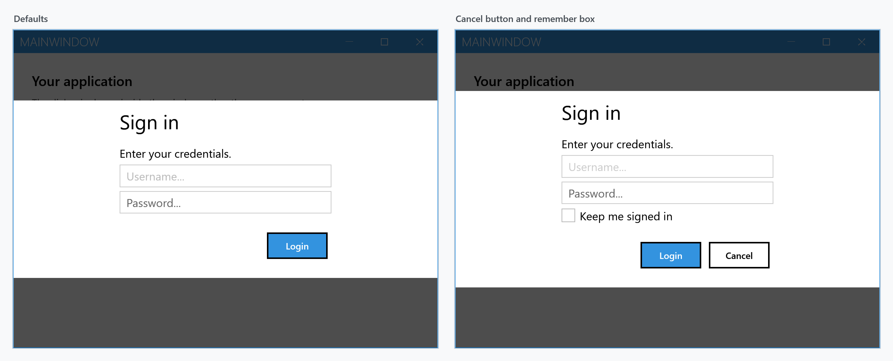
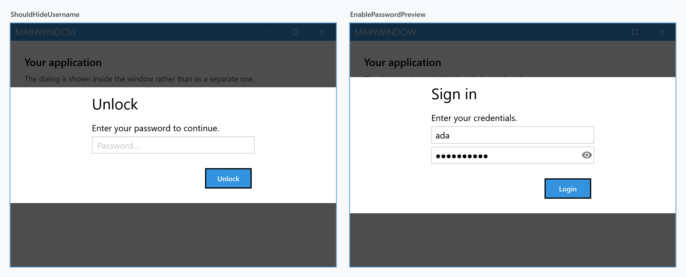

Order: 40
Title: Login Dialog
Description: Dialog for login scenarios.
---

A login dialog asks for a username and a password. Like the other dialogs it is drawn inside the `MetroWindow` rather than in a window of its own.

`ShowLoginAsync` returns a `LoginDialogData`, or `null` if the user backed out:

```csharp
private async void OnSignInClick(object sender, RoutedEventArgs e)
{
    var result = await this.ShowLoginAsync("Sign in", "Enter your credentials.");

    if (result is null)
    {
        return; // cancelled
    }

    await this.SignInAsync(result.Username, result.SecurePassword);
}
```



Note the left one: **there is no cancel button by default.** `NegativeButtonVisibility` starts at `Collapsed`, so out of the box the dialog can only be dismissed with <kbd>Esc</kbd>. Show the button if the user should be able to see a way out.

From a view model, use the [dialog coordinator](mvvm-dialog) rather than reaching for the window.

## What you get back

| Member | Type | |
| --- | --- | --- |
| `Username` | `string` | what was typed in the first box |
| `SecurePassword` | `SecureString` | the password |
| `Password` | `string` | the same password as a plain string |
| `ShouldRemember` | `bool` | state of the remember checkbox, `false` when it is hidden |

:::{.alert .alert-warning}
Prefer `SecurePassword`. The `Password` property is not a stored value — each read marshals the `SecureString` into a managed `string`, which then sits in memory until the garbage collector happens to reclaim it, and cannot be cleared. Use it only when an API you cannot change demands a `string`, and keep it out of variables that live longer than the call.
:::

## Settings

`ShowLoginAsync` takes a `LoginDialogSettings`, which derives from `MetroDialogSettings` and adds the login-specific parts.

| Setting | Default | |
| --- | --- | --- |
| `InitialUsername` | `null` | prefills the username box |
| `InitialPassword` | `null` | prefills the password box |
| `UsernameWatermark` | `Username...` | placeholder in the empty username box |
| `PasswordWatermark` | `Password...` | placeholder in the empty password box |
| `UsernameCharacterCasing` | `Normal` | force the username to upper or lower case as it is typed |
| `ShouldHideUsername` | `false` | hide the username box entirely |
| `EnablePasswordPreview` | `false` | add a button that reveals the password while held |
| `NegativeButtonVisibility` | `Collapsed` | show the cancel button |
| `RememberCheckBoxVisibility` | `Collapsed` | show the remember checkbox |
| `RememberCheckBoxText` | `Remember` | its label |
| `RememberCheckBoxChecked` | `false` | its initial state |
| `AffirmativeButtonText` | `Login` | note the different default from the other dialogs |

Inherited from `MetroDialogSettings`: `NegativeButtonText`, `ColorScheme`, the three font sizes, `AnimateShow` and `AnimateHide`, `OwnerCanCloseWithDialog`, `CancellationToken` and `CustomResourceDictionary`. As with the input dialog, `DefaultButtonFocus`, `DialogResultOnCancel` and `MaximumBodyHeight` have no effect here.

## Variants

`ShouldHideUsername` turns the dialog into a password prompt, which suits unlocking something that already knows who you are. `EnablePasswordPreview` adds the reveal button to the password box:



```csharp
var settings = new LoginDialogSettings
               {
                   InitialUsername = "ada",
                   EnablePasswordPreview = true,
                   NegativeButtonVisibility = Visibility.Visible,
                   NegativeButtonText = "Cancel",
                   RememberCheckBoxVisibility = Visibility.Visible,
                   RememberCheckBoxText = "Keep me signed in"
               };

var result = await this.ShowLoginAsync("Sign in", "Enter your credentials.", settings);
```

## Caps lock warning

You get one for free. While the password box has focus, an indicator appears inside it whenever <kbd>Caps Lock</kbd> is on, carrying the tooltip *Caps lock is on*. Nothing has to be switched on for this — it comes from the MahApps `PasswordBox` style, which every `PasswordBox` picks up implicitly, and it survives `EnablePasswordPreview` because that style inherits from the same base.

The icon and the tooltip are attached properties on the password box, so they can be replaced:

```xml
<PasswordBox mah:PasswordBoxHelper.CapsLockWarningToolTip="Caps Lock is turned on" />
```

Inside a login dialog you cannot reach the box directly to set these; overriding them means supplying your own style through `CustomResourceDictionary`.

## Keyboard

<kbd>Enter</kbd> confirms and returns the data. <kbd>Esc</kbd> cancels and returns `null` — which it does whether or not the cancel button is visible.

## Outside a MetroWindow

Where there is no `MetroWindow` to draw into — a login prompt before the main window exists is the usual case — `ShowModalLoginExternal` opens the dialog in a window of its own and blocks until it is answered:

```csharp
LoginDialogData result = this.ShowModalLoginExternal("Sign in", "Enter your credentials.");
```

Being synchronous, it is not the one to use from an `async` path.
