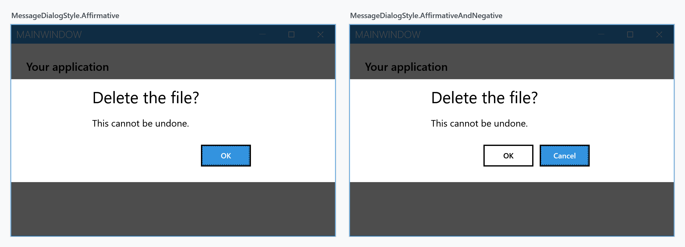
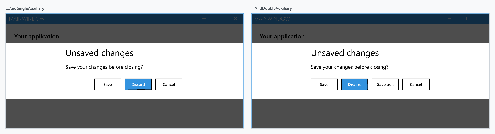
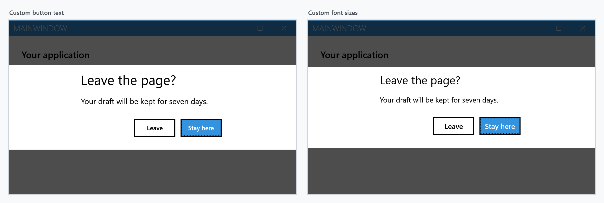
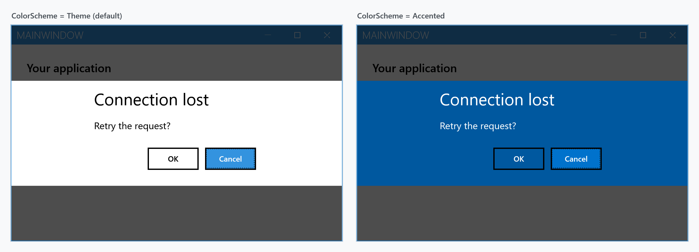

Order: 20
Title: Message Dialog
Description: Dialog to show simple messages to the user.
---

A message dialog asks a question or states a fact and waits for a button. It is drawn inside the `MetroWindow` rather than in a window of its own, so it dims what is behind it instead of stacking another frame on the desktop.

`ShowMessageAsync` is an extension method on `MetroWindow`. From code-behind that means calling it on `this`:

```csharp
private async void OnButtonClick(object sender, RoutedEventArgs e)
{
    await this.ShowMessageAsync("This is the title", "Some message");
}
```

From a view model you would not reach for the window at all — use the [dialog coordinator](mvvm-dialog) instead, which takes the same arguments.

## Which buttons appear

The third parameter picks the button set. Each returns a different `MessageDialogResult`, and awaiting the call gives you that result.

| `MessageDialogStyle` | Buttons | Possible results |
| --- | --- | --- |
| `Affirmative` (default) | one | `Affirmative` |
| `AffirmativeAndNegative` | two | `Affirmative`, `Negative` |
| `AffirmativeAndNegativeAndSingleAuxiliary` | three | + `FirstAuxiliary` |
| `AffirmativeAndNegativeAndDoubleAuxiliary` | four | + `SecondAuxiliary` |





```csharp
var result = await this.ShowMessageAsync(
    "Delete the file?",
    "This cannot be undone.",
    MessageDialogStyle.AffirmativeAndNegative);

if (result == MessageDialogResult.Affirmative)
{
    // delete it
}
```

`MessageDialogResult` also has a `Canceled` member. A message dialog does not produce it — it belongs to the dialogs that can be dismissed without an answer, such as a login dialog.

## Button labels and appearance

Everything else is set through `MetroDialogSettings`, passed as the last argument. The buttons are labelled `OK` and `Cancel` unless you say otherwise, which is rarely what you want for a question:



```csharp
var settings = new MetroDialogSettings
               {
                   AffirmativeButtonText = "Leave",
                   NegativeButtonText = "Stay here"
               };

var result = await this.ShowMessageAsync(
    "Leave the page?",
    "Your draft will be kept for seven days.",
    MessageDialogStyle.AffirmativeAndNegative,
    settings);
```

`FirstAuxiliaryButtonText` and `SecondAuxiliaryButtonText` label the third and fourth buttons. `DialogTitleFontSize`, `DialogMessageFontSize` and `DialogButtonFontSize` override the sizes; leave them alone and the theme decides.

`ColorScheme` paints the dialog. `Theme` follows the current theme, `Accented` fills it with the accent colour, and `Inverted` uses the inverse of the theme:



## Keyboard

<kbd>Enter</kbd> activates the focused button. `DefaultButtonFocus` decides which one that is at the start — it defaults to `Negative`, so the safe choice is preselected on a two-button dialog.

<kbd>Esc</kbd> and <kbd>Alt</kbd>+<kbd>F4</kbd> close the dialog. What that returns depends on `DialogResultOnCancel`: set it and you get that value, leave it unset and you get `Affirmative` for a one-button dialog and `Negative` for every other style.

:::{.alert .alert-info}
Escape always returns *something* — a message dialog has no "no answer" result. If cancelling has to be distinguishable from choosing the negative button, set `DialogResultOnCancel` to one of the auxiliary values and check for it.
:::

```csharp
var settings = new MetroDialogSettings
               {
                   AffirmativeButtonText = "Save",
                   NegativeButtonText = "Discard",
                   FirstAuxiliaryButtonText = "Cancel",
                   DefaultButtonFocus = MessageDialogResult.Affirmative,
                   DialogResultOnCancel = MessageDialogResult.FirstAuxiliary
               };
```

## Settings reference

| Property | Type | Default |
| --- | --- | --- |
| `AffirmativeButtonText` | `string` | `OK` |
| `NegativeButtonText` | `string` | `Cancel` |
| `FirstAuxiliaryButtonText` | `string` | `null` |
| `SecondAuxiliaryButtonText` | `string` | `null` |
| `ColorScheme` | `MetroDialogColorScheme` | `Theme` |
| `DefaultButtonFocus` | `MessageDialogResult` | `Negative` |
| `DialogResultOnCancel` | `MessageDialogResult?` | `null` |
| `DialogTitleFontSize` | `double` | `NaN` — theme decides |
| `DialogMessageFontSize` | `double` | `NaN` — theme decides |
| `DialogButtonFontSize` | `double` | `NaN` — theme decides |
| `MaximumBodyHeight` | `double` | `NaN` — unbounded |
| `AnimateShow` / `AnimateHide` | `bool` | `true` |
| `OwnerCanCloseWithDialog` | `bool` | `false` |
| `CancellationToken` | `CancellationToken` | `None` |
| `CustomResourceDictionary` | `ResourceDictionary` | `null` |

`MaximumBodyHeight` gives the message area a fixed height and lets it scroll, which keeps a long message from pushing the dialog past the window. Left at `NaN` the area sizes itself to the text.

`CancellationToken` closes the dialog from your own code — cancel the token and the awaited call returns. Note that it returns `Affirmative` for a one-button dialog and `Negative` for the others, and that it does **not** honour `DialogResultOnCancel`, unlike pressing <kbd>Esc</kbd>. If you need to tell a programmatic cancel apart from a button press, track that yourself.

`OwnerCanCloseWithDialog` allows the window itself to be closed while the dialog is up. By default it cannot be, and the window's close button is disabled for as long as the dialog is showing.

## Defaults for the whole window

Rather than passing the same settings everywhere, set them once on the window. `ShowMessageAsync` falls back to `MetroDialogOptions` when no settings are given:

```xml
<mah:MetroWindow.MetroDialogOptions>
    <mah:MetroDialogSettings AffirmativeButtonText="Yes"
                             NegativeButtonText="No"
                             ColorScheme="Accented" />
</mah:MetroWindow.MetroDialogOptions>
```

Note that it is a fallback, not a merge: pass a `MetroDialogSettings` to a single call and that object is used on its own, with its own defaults for anything you did not set.

## Outside a MetroWindow

`ShowMessageAsync` needs a `MetroWindow` to draw into. When there is not one — early startup, a plain `Window`, a console-hosted tool — `ShowModalMessageExternal` opens the dialog in a separate window of its own and blocks until it is answered:

```csharp
MessageDialogResult result = this.ShowModalMessageExternal(
    "Delete the file?",
    "This cannot be undone.",
    MessageDialogStyle.AffirmativeAndNegative);
```

It is synchronous, so it is not the one to reach for from an `async` path.
