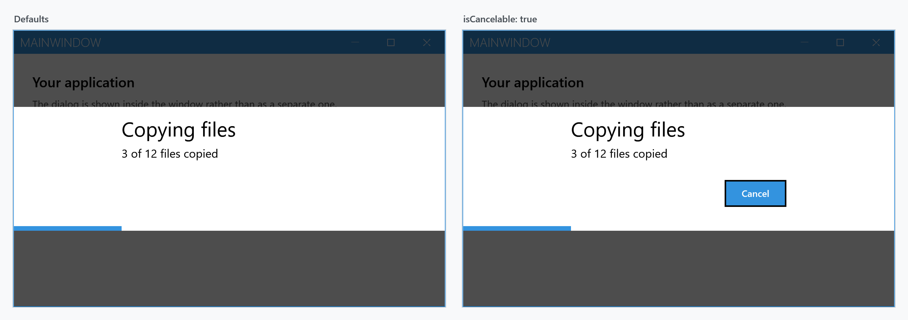
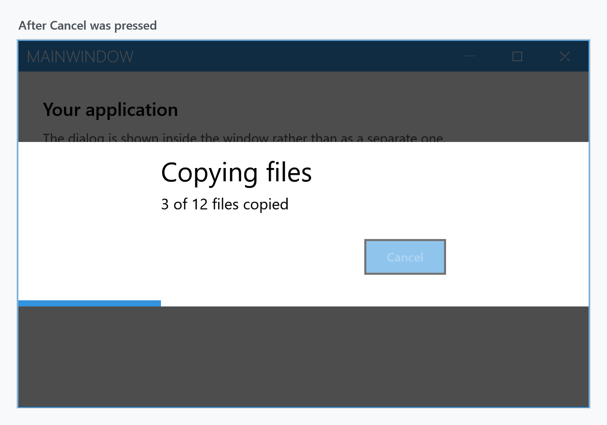
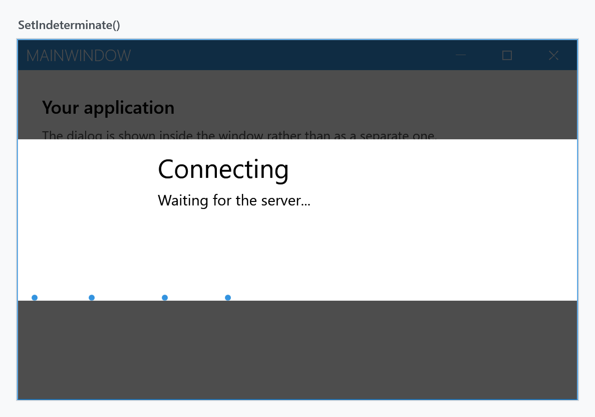
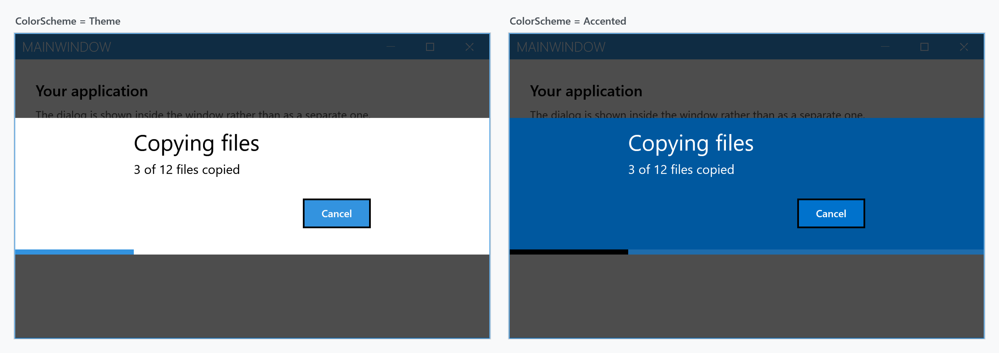

Order: 50
Title: Progress Dialog
Description: Dialog with a progress bar
---

A progress dialog reports how far a long-running operation has got. Like the other dialogs it is drawn inside the `MetroWindow` rather than in a window of its own.

It is the one dialog that does not wait for an answer. `ShowProgressAsync` returns as soon as the dialog is on screen and hands you a `ProgressDialogController` — the handle you drive the dialog with, and the only way to close it again:

```csharp
private async void OnCopyClick(object sender, RoutedEventArgs e)
{
    var controller = await this.ShowProgressAsync("Copying files", "Starting...");

    for (var i = 0; i < files.Count; i++)
    {
        controller.SetMessage($"{i} of {files.Count} files copied");
        controller.SetProgress((double)i / files.Count);

        await CopyAsync(files[i]);
    }

    await controller.CloseAsync();
}
```



The dialog reserves the space for the cancel button whether or not it is shown, which is why both panels are the same height. Pass `isCancelable: true` to fill it.

From a view model, use the [dialog coordinator](mvvm-dialog) rather than reaching for the window — `IDialogCoordinator.ShowProgressAsync` takes the same arguments after the context object.

:::{.alert .alert-warning}
Whatever happens, the dialog stays up until something calls `CloseAsync`. There is no button that dismisses it, <kbd>Esc</kbd> does nothing, and — unlike the other dialogs — neither does the `CancellationToken`. Put the call in a `finally` block if the work can throw.
:::

## Progress runs from 0 to 1

The progress bar is created with `Minimum="0.0"` and `Maximum="1.0"`, not 0 to 100. `SetProgress` throws `ArgumentOutOfRangeException` for anything outside that range, so the percentage that looks like the obvious argument fails on the first call:

```csharp
controller.SetProgress(0.25);   // a quarter done
controller.SetProgress(25);     // ArgumentOutOfRangeException
```

Set your own range instead of scaling every value if that reads better:

```csharp
controller.Minimum = 0;
controller.Maximum = files.Count;
controller.SetProgress(i);
```

## The controller

| Member | |
| --- | --- |
| `SetProgress(double)` | sets the value and switches the bar back to determinate |
| `SetIndeterminate()` | switches the bar to the indeterminate animation |
| `Minimum`, `Maximum` | the range, `0.0` to `1.0` by default |
| `SetMessage(string)` | replaces the body text |
| `SetTitle(string)` | replaces the title |
| `SetCancelable(bool)` | shows or hides the cancel button after the fact |
| `SetProgressBarForegroundBrush(Brush)` | recolours the bar |
| `IsCanceled` | `true` once the user has pressed cancel |
| `IsOpen` | `false` once `CloseAsync` has finished |
| `Canceled` | raised when the user presses cancel |
| `Closed` | raised when `CloseAsync` has finished |
| `CloseAsync()` | closes the dialog |

Every one of these marshals to the UI thread by itself, so they can be called straight from the worker that is doing the work.

`CloseAsync` throws `InvalidOperationException` if the dialog is no longer visible, so close it exactly once.

## Cancelling

Pressing cancel does **not** close the dialog. It disables the cancel button, sets `IsCanceled` and raises `Canceled` — the operation is expected to notice, stop, and close the dialog itself:



That gives you somewhere to run the rollback while the dialog is still telling the user something is happening. Polling `IsCanceled` in the loop is the usual shape:

```csharp
var controller = await this.ShowProgressAsync("Copying files", "Starting...", isCancelable: true);

foreach (var file in files)
{
    if (controller.IsCanceled)
    {
        break;
    }

    controller.SetMessage($"Copying {file.Name}");
    await CopyAsync(file);
}

await controller.CloseAsync();
```

Use the `Canceled` event where the work is not a loop you control — to signal a `CancellationTokenSource` of your own, for instance:

```csharp
var cts = new CancellationTokenSource();
controller.Canceled += (_, _) => cts.Cancel();
```

:::{.alert .alert-info}
The `CancellationToken` in `MetroDialogSettings` does the same thing as the button, not more: it marks the dialog cancelled and raises `Canceled`. It does not close it. That differs from the message, input and login dialogs, where the token ends the dialog and the call returns.
:::

## Indeterminate

`SetIndeterminate()` switches the bar to the animation that says *something is happening* without saying how much is left — the state to use before the total is known. Any later `SetProgress` switches it back.



## Colour scheme

`ColorScheme` works as it does for the other dialogs. The bar itself follows only in part: under `Theme` it is drawn in the accent colour, under `Accented` and `Inverted` in the theme foreground, so that it stays visible against the filled background.



## Which settings actually apply

`MetroDialogSettings` is shared by all the dialog types, and a progress dialog reads only part of it.

| Setting | Effect on a progress dialog |
| --- | --- |
| `NegativeButtonText` | label of the cancel button, `Cancel` by default |
| `ColorScheme` | as above |
| `DialogTitleFontSize`, `DialogMessageFontSize`, `DialogButtonFontSize` | as for the other dialogs |
| `AnimateShow`, `AnimateHide` | as for the other dialogs |
| `OwnerCanCloseWithDialog` | whether the window can be closed while the dialog is up |
| `CancellationToken` | marks the dialog cancelled; **does not close it** |
| `CustomResourceDictionary` | resources for the dialog |
| `AffirmativeButtonText`, `FirstAuxiliaryButtonText`, `SecondAuxiliaryButtonText` | **ignored** — a progress dialog has at most the cancel button |
| `DefaultButtonFocus` | **ignored** |
| `DefaultText` | **ignored** — only the input dialog uses it |
| `DialogResultOnCancel` | **ignored** — a progress dialog has no result |
| `MaximumBodyHeight` | **ignored** — only the message dialog uses it |

Note that whether the cancel button is shown is not a setting: it is the `isCancelable` argument of `ShowProgressAsync`, or `SetCancelable` later on.

## Outside a MetroWindow

There is no external variant. The message, input and login dialogs each have a `ShowModal...External` method that opens them in a window of their own; the progress dialog has none, so it needs a `MetroWindow` to be drawn into.
