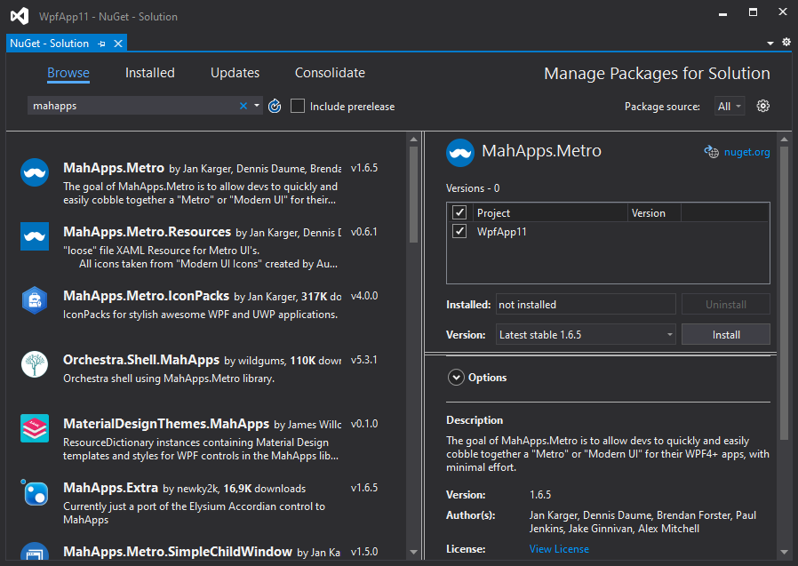
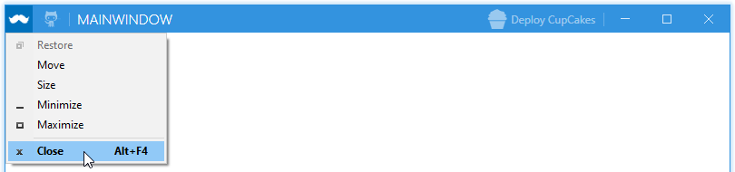

Order: 10
Title: Quick Start
Description: How to start with MahApps.Metro
RedirectFrom: guides/quick-start.html
---

This guide will introduce you to how `MahApps.Metro` works and how to incorporate it into your app.

## Installation

You can install `MahApps.Metro` via the NuGet UI or with the Package Manager Console.



With the Package Manager Console:

```powershell
PM> Install-Package MahApps.Metro
```

If you want to use a pre-release packages of `MahApps.Metro`, you need to enable **Include Prerelease** in the NuGet UI:


With the Package Manager Console:

```powershell
PM> Install-Package MahApps.Metro -Pre
```

## MahApps build-in styles and themes

All resources of `MahApp.Metro` are located within separate resource dictionaries. To adopt the MahApps.Metro theme, you will need to add the resource dictionaries to your `App.xaml`.  

```xml
<Application x:Class="SampleApp"
             xmlns="http://schemas.microsoft.com/winfx/2006/xaml/presentation"
             xmlns:x="http://schemas.microsoft.com/winfx/2006/xaml"
             StartupUri="MainWindow.xaml">
  <Application.Resources>
    <ResourceDictionary>
      <ResourceDictionary.MergedDictionaries>
        <!-- MahApps.Metro resource dictionaries. Make sure that all file names are Case Sensitive! -->
        <ResourceDictionary Source="pack://application:,,,/MahApps.Metro;component/Styles/Controls.xaml" />
        <ResourceDictionary Source="pack://application:,,,/MahApps.Metro;component/Styles/Fonts.xaml" />
        <!-- Theme setting -->
        <ResourceDictionary Source="pack://application:,,,/MahApps.Metro;component/Styles/Themes/Light.Blue.xaml" />
      </ResourceDictionary.MergedDictionaries>
    </ResourceDictionary>
  </Application.Resources>
</Application>
```

:::{.alert .alert-info}
***Note***  
Make sure that all resource file names are Case Sensitive!
:::

## Using the MetroWindow

To start with the full MahApps styling and full window support you need to change your normal `Window` to our [MetroWindow](/docs/controls/metrowindow).

- Open up your main window, normally named `MainWindow.xaml`
- Add the namespace attribute inside the opening Window tag  
  ```xml
  xmlns:mah="clr-namespace:MahApps.Metro.Controls;assembly=MahApps.Metro"
  ```
  or  
  ```xml
  xmlns:mah="http://metro.mahapps.com/winfx/xaml/controls"
  ```
- Change the `<Window ... </Window>` tag to `<mah:MetroWindow ... </mah:MetroWindow>`

Now you should have something like this (don't copy and paste this directly)

```xml
<mah:MetroWindow x:Class="SampleApp.MainWindow"
                 xmlns="http://schemas.microsoft.com/winfx/2006/xaml/presentation"
                 xmlns:x="http://schemas.microsoft.com/winfx/2006/xaml"
                 xmlns:d="http://schemas.microsoft.com/expression/blend/2008"
                 xmlns:mah="clr-namespace:MahApps.Metro.Controls;assembly=MahApps.Metro"
                 xmlns:mc="http://schemas.openxmlformats.org/markup-compatibility/2006"
                 Title="MainWindow"
                 Width="800"
                 Height="450"
                 WindowStartupLocation="CenterScreen"
                 mc:Ignorable="d">
  <Grid>
    <!--  Your content  -->
  </Grid>
</mah:MetroWindow>
```

You'll also need to modify the code behind of the window file so that the base class matches the `MetroWindow` class of the XAML file.

```csharp
using MahApps.Metro.Controls;

namespace SampleApp
{
    /// <summary>
    /// Interaction logic for MainWindow.xaml
    /// </summary>
    public partial class MainWindow : MetroWindow
    {
        public MainWindow()
        {
            InitializeComponent();
        }
    }
}
```

But in most cases you can just drop the base class (because this is a `partial` class the XAML should take care of this).

```csharp
namespace SampleApp
{
    /// <summary>
    /// Interaction logic for MainWindow.xaml
    /// </summary>
    public partial class MainWindow
    {
        public MainWindow()
        {
            InitializeComponent();
        }
    }
}
```

The end result will look something like this:


## Extend the MetroWindow

The `MetroWindow` can be extend and changed with some extra features.

1. The visibility of the `TitleBar` can be changed with the property `ShowTitleBar`
2. Use the `LeftWindowCommands` and `RightWindowCommands` to add controls to the title bar. Button, ToggleButton, SplitButton and DropDownButton will use a default style. For all other controls you must create your own styles.
3. The `WindowButtonCommands` are also changable, so you can create your own Min, Max/Restore and Close button styles.  
The visibility of the Min and Max / Restore buttons are also effected by the `ResizeMode`. If `ResizeMode="NoResize"` the buttons are collapsed. If `ResizeMode="CanMinimize"` the Max / Restore button is collapsed.

4. Show a resize grip on the right bottom corner for better resizing.


:::{.alert .alert-info}
***Note***  
Make sure to include the [MahApps.Metro.IconPacks](https://github.com/MahApps/MahApps.Metro.IconPacks) to get the cupcake icon.
:::

```xml
<mah:MetroWindow x:Class="SampleApp.MainWindow"
                 xmlns="http://schemas.microsoft.com/winfx/2006/xaml/presentation"
                 xmlns:x="http://schemas.microsoft.com/winfx/2006/xaml"
                 xmlns:d="http://schemas.microsoft.com/expression/blend/2008"
                 xmlns:iconPacks="http://metro.mahapps.com/winfx/xaml/iconpacks"
                 xmlns:mah="clr-namespace:MahApps.Metro.Controls;assembly=MahApps.Metro"
                 xmlns:mc="http://schemas.openxmlformats.org/markup-compatibility/2006"
                 Title="MainWindow"
                 Width="800"
                 Height="450"
                 GlowBrush="{DynamicResource MahApps.Brushes.Accent}"
                 ResizeMode="CanResizeWithGrip"
                 WindowStartupLocation="CenterScreen"
                 mc:Ignorable="d">

  <mah:MetroWindow.LeftWindowCommands>
    <mah:WindowCommands>
      <Button Click="LaunchGitHubSite" ToolTip="Open up the GitHub site">
        <iconPacks:PackIconModern Width="22"
                                  Height="22"
                                  Kind="SocialGithubOctocat" />
      </Button>
    </mah:WindowCommands>
  </mah:MetroWindow.LeftWindowCommands>

  <mah:MetroWindow.RightWindowCommands>
    <mah:WindowCommands>
      <Button Click="DeployCupCakes" Content="Deploy CupCakes">
        <Button.ContentTemplate>
          <DataTemplate>
            <StackPanel Orientation="Horizontal">
              <iconPacks:PackIconModern Width="22"
                                        Height="22"
                                        VerticalAlignment="Center"
                                        Kind="FoodCupcake" />
              <TextBlock Margin="4 0 0 0"
                         VerticalAlignment="Center"
                         Text="{Binding}" />
            </StackPanel>
          </DataTemplate>
        </Button.ContentTemplate>
      </Button>
    </mah:WindowCommands>
  </mah:MetroWindow.RightWindowCommands>

  <Grid>
    <!--  Your content  -->
  </Grid>
</mah:MetroWindow>
```

```csharp
using System.Windows;
using MahApps.Metro.Controls;

namespace SampleApp
{
    /// <summary>
    /// Interaction logic for MainWindow.xaml
    /// </summary>
    public partial class MainWindow : MetroWindow
    {
        public MainWindow()
        {
            InitializeComponent();
        }

        private void LaunchGitHubSite(object sender, RoutedEventArgs e)
        {
            // Launch the GitHub site...
        }

        private void DeployCupCakes(object sender, RoutedEventArgs e)
        {
            // deploy some CupCakes...
        }
    }
}
```

You can also show an `Icon` on the title bar by setting the `Icon` property or by using the `IconTemplate` property.



## What's Next?

For extended documentation, take a look at the [Styles](/docs/styles) and [Controls](/docs/controls) section.
