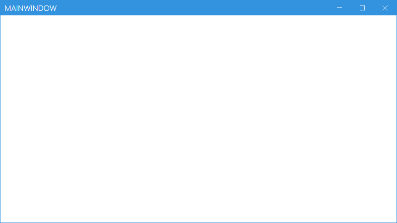
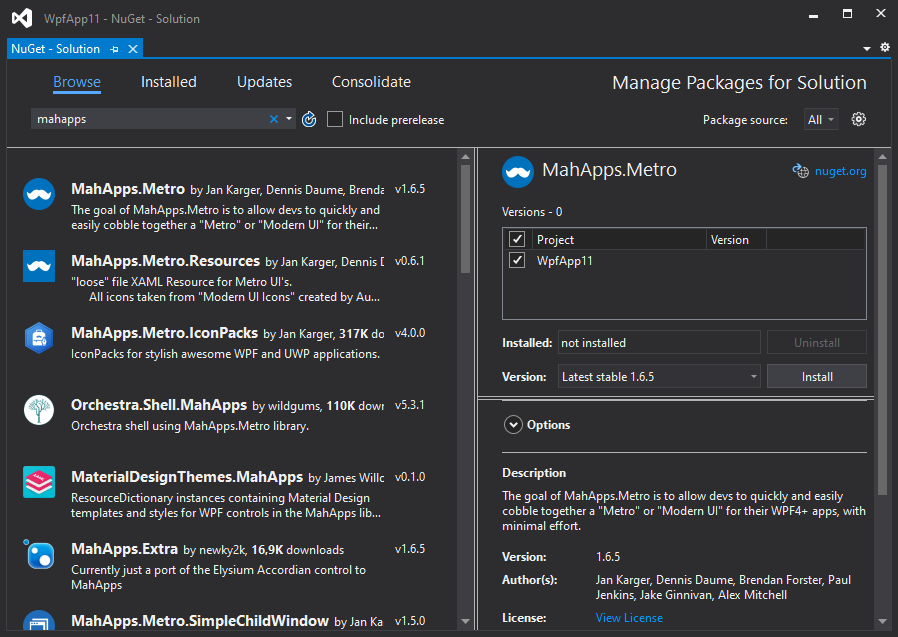
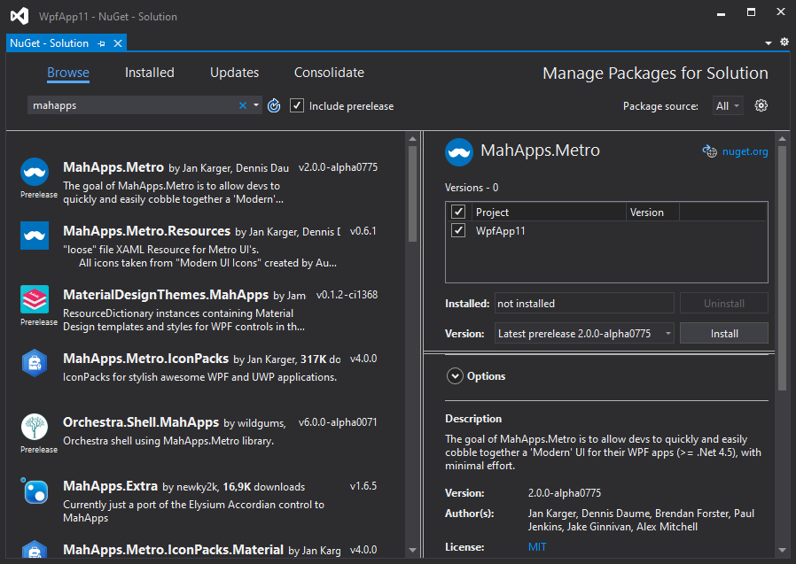
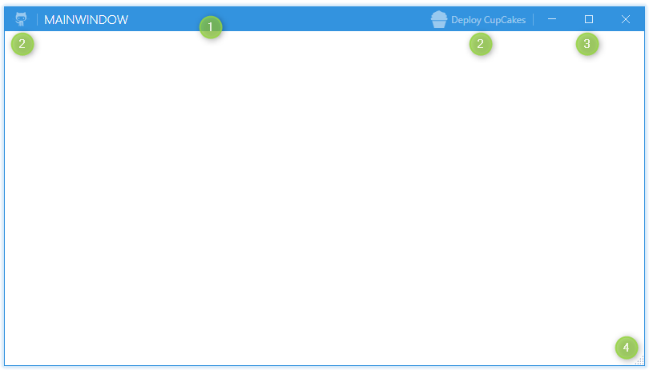
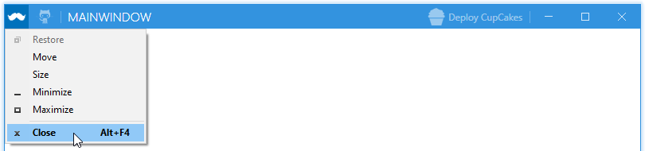

Order: 10
Title: Quick Start
Description: How to start with MahApps.Metro
RedirectFrom: guides/quick-start.html
---

Three steps take a stock WPF application to a styled one: install the package, merge the resource dictionaries, swap `Window` for `MetroWindow`. Nothing else in your XAML has to change — your existing controls are restyled where they stand.

This is where you will end up:



## 1. Install the package

Pick whichever you prefer — the .NET CLI, the Package Manager Console, or the NuGet UI.

```
dotnet add package MahApps.Metro
```

```powershell
PM> Install-Package MahApps.Metro
```



For a pre-release build, tick **Include prerelease** in the NuGet UI:



or add the flag on the console:

```powershell
PM> Install-Package MahApps.Metro -Pre
```

## 2. Add the resource dictionaries

Every resource in MahApps.Metro lives in its own dictionary. Merge them into your `App.xaml` and the styling applies across the application.

```xml
<Application x:Class="SampleApp"
             xmlns="http://schemas.microsoft.com/winfx/2006/xaml/presentation"
             xmlns:x="http://schemas.microsoft.com/winfx/2006/xaml"
             StartupUri="MainWindow.xaml">
  <Application.Resources>
    <ResourceDictionary>
      <ResourceDictionary.MergedDictionaries>
        <!-- MahApps.Metro resource dictionaries. Make sure that all file names are Case Sensitive! -->
        <ResourceDictionary Source="pack://application:,,,/MahApps.Metro;component/Styles/Controls.xaml" />
        <ResourceDictionary Source="pack://application:,,,/MahApps.Metro;component/Styles/Fonts.xaml" />
        <!-- Theme setting -->
        <ResourceDictionary Source="pack://application:,,,/MahApps.Metro;component/Styles/Themes/Light.Blue.xaml" />
      </ResourceDictionary.MergedDictionaries>
    </ResourceDictionary>
  </Application.Resources>
</Application>
```

The last entry picks the theme — here the light base theme with a blue accent. Swapping that one line is enough to change the look, and [Themes](../themes) covers the rest, including switching at runtime.

:::{.alert .alert-warning}
**Case matters.** The pack URIs are case sensitive. A wrong letter fails at runtime, not at build time.
:::

## 3. Switch to MetroWindow

Your window needs to become a [MetroWindow](../controls/metrowindow) to get the custom title bar, the glow border and the dialog overlay.

Open `MainWindow.xaml`, declare the namespace and change the root element from `Window` to `mah:MetroWindow`. Either namespace form works:

```xml
xmlns:mah="clr-namespace:MahApps.Metro.Controls;assembly=MahApps.Metro"
```

```xml
xmlns:mah="http://metro.mahapps.com/winfx/xaml/controls"
```

The result looks like this — do not copy it over your own file wholesale, take the parts you need:

```xml
<mah:MetroWindow x:Class="SampleApp.MainWindow"
                 xmlns="http://schemas.microsoft.com/winfx/2006/xaml/presentation"
                 xmlns:x="http://schemas.microsoft.com/winfx/2006/xaml"
                 xmlns:d="http://schemas.microsoft.com/expression/blend/2008"
                 xmlns:mah="clr-namespace:MahApps.Metro.Controls;assembly=MahApps.Metro"
                 xmlns:mc="http://schemas.openxmlformats.org/markup-compatibility/2006"
                 Title="MainWindow"
                 Width="800"
                 Height="450"
                 WindowStartupLocation="CenterScreen"
                 mc:Ignorable="d">
  <Grid>
    <!--  Your content  -->
  </Grid>
</mah:MetroWindow>
```

The code-behind has to agree with the XAML. Either derive from `MetroWindow` explicitly:

```csharp
using MahApps.Metro.Controls;

namespace SampleApp
{
    /// <summary>
    /// Interaction logic for MainWindow.xaml
    /// </summary>
    public partial class MainWindow : MetroWindow
    {
        public MainWindow()
        {
            InitializeComponent();
        }
    }
}
```

or, in most cases, simply drop the base class — the generated half of the `partial` class already carries it:

```csharp
namespace SampleApp
{
    /// <summary>
    /// Interaction logic for MainWindow.xaml
    /// </summary>
    public partial class MainWindow
    {
        public MainWindow()
        {
            InitializeComponent();
        }
    }
}
```

That is the whole setup. Everything below is optional.

## Making the window your own

The title bar is yours to fill. The numbers below refer to the markers in this screenshot:



1. **`ShowTitleBar`** hides or shows the title bar.
2. **`LeftWindowCommands`** and **`RightWindowCommands`** put your own controls into it. `Button`, `ToggleButton`, `SplitButton` and `DropDownButton` come with a matching style; anything else needs one of your own.
3. **`WindowButtonCommands`** lets you restyle the minimise, maximise/restore and close buttons. Their visibility also follows `ResizeMode`: `NoResize` collapses both, `CanMinimize` collapses maximise/restore.
4. **`ResizeMode="CanResizeWithGrip"`** shows a resize grip in the bottom right corner.

Not marked in the screenshot, but used in the sample below: **`GlowBrush`** draws the coloured border around the window.

:::{.alert .alert-info}
The cupcake and octocat below come from [MahApps.Metro.IconPacks](https://github.com/MahApps/MahApps.Metro.IconPacks), a separate package.
:::

```xml
<mah:MetroWindow x:Class="SampleApp.MainWindow"
                 xmlns="http://schemas.microsoft.com/winfx/2006/xaml/presentation"
                 xmlns:x="http://schemas.microsoft.com/winfx/2006/xaml"
                 xmlns:d="http://schemas.microsoft.com/expression/blend/2008"
                 xmlns:iconPacks="http://metro.mahapps.com/winfx/xaml/iconpacks"
                 xmlns:mah="clr-namespace:MahApps.Metro.Controls;assembly=MahApps.Metro"
                 xmlns:mc="http://schemas.openxmlformats.org/markup-compatibility/2006"
                 Title="MainWindow"
                 Width="800"
                 Height="450"
                 GlowBrush="{DynamicResource MahApps.Brushes.Accent}"
                 ResizeMode="CanResizeWithGrip"
                 WindowStartupLocation="CenterScreen"
                 mc:Ignorable="d">

  <mah:MetroWindow.LeftWindowCommands>
    <mah:WindowCommands>
      <Button Click="LaunchGitHubSite" ToolTip="Open up the GitHub site">
        <iconPacks:PackIconModern Width="22"
                                  Height="22"
                                  Kind="SocialGithubOctocat" />
      </Button>
    </mah:WindowCommands>
  </mah:MetroWindow.LeftWindowCommands>

  <mah:MetroWindow.RightWindowCommands>
    <mah:WindowCommands>
      <Button Click="DeployCupCakes" Content="Deploy CupCakes">
        <Button.ContentTemplate>
          <DataTemplate>
            <StackPanel Orientation="Horizontal">
              <iconPacks:PackIconModern Width="22"
                                        Height="22"
                                        VerticalAlignment="Center"
                                        Kind="FoodCupcake" />
              <TextBlock Margin="4 0 0 0"
                         VerticalAlignment="Center"
                         Text="{Binding}" />
            </StackPanel>
          </DataTemplate>
        </Button.ContentTemplate>
      </Button>
    </mah:WindowCommands>
  </mah:MetroWindow.RightWindowCommands>

  <Grid>
    <!--  Your content  -->
  </Grid>
</mah:MetroWindow>
```

```csharp
using System.Windows;
using MahApps.Metro.Controls;

namespace SampleApp
{
    /// <summary>
    /// Interaction logic for MainWindow.xaml
    /// </summary>
    public partial class MainWindow : MetroWindow
    {
        public MainWindow()
        {
            InitializeComponent();
        }

        private void LaunchGitHubSite(object sender, RoutedEventArgs e)
        {
            // Launch the GitHub site...
        }

        private void DeployCupCakes(object sender, RoutedEventArgs e)
        {
            // deploy some CupCakes...
        }
    }
}
```

An icon goes into the title bar through the `Icon` property, or through `IconTemplate` when you want to draw it yourself.



## Where to go next

<div class="row">
<div class="col-md-4">

**[Controls](../controls)**
The custom controls: navigation, pickers, badges, flyouts and the rest.

</div>
<div class="col-md-4">

**[Styles](../styles)**
What MahApps.Metro does to the standard WPF controls, and the helpers that go with them.

</div>
<div class="col-md-4">

**[Themes](../themes)**
Base themes and accents, runtime switching, and building your own.

</div>
</div>

Coming from version 1.x? The [migration guide](migration-to-v2.0) lists what changed.
