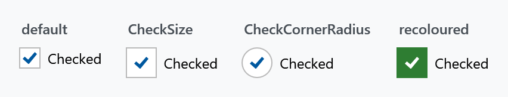

Order: 10
Title: CheckBoxHelper
Description: Size, shape, glyph and per-state brushes of a CheckBox
---

Applies to `CheckBox`. It has 81 attached properties, but they are three settings and one naming scheme rather than 81 things to learn.



## Size and shape

| Property | Type | Default | |
| --- | --- | --- | --- |
| `CheckSize` | `double` | `18` | edge length of the box |
| `CheckCornerRadius` | `CornerRadius` | `0` | rounds it; half the size makes a circle |
| `CheckStrokeThickness` | `double` | `1` | thickness of its outline |

```xml
<CheckBox mah:CheckBoxHelper.CheckSize="26"
          mah:CheckBoxHelper.CheckCornerRadius="13"
          Content="Checked" />
```

## The brushes

The remaining properties are all brushes, named `{Part}{CheckState}{Interaction}`:

| Part | |
| --- | --- |
| `Foreground` | the label |
| `Background` | behind the whole control |
| `BorderBrush` | around the whole control |
| `CheckBackgroundFill` | inside the box |
| `CheckBackgroundStroke` | outline of the box |
| `CheckGlyphForeground` | the tick itself |

**Check state** is `Unchecked`, `Checked` or `Indeterminate`. **Interaction** is nothing at all for the resting state, or `MouseOver`, `Pressed` or `Disabled`.

Every combination exists, which is where 6 × 3 × 4 = 72 of the properties come from:

```xml
<CheckBox mah:CheckBoxHelper.CheckBackgroundFillChecked="#2E7D32"
          mah:CheckBoxHelper.CheckBackgroundStrokeChecked="#2E7D32"
          mah:CheckBoxHelper.CheckGlyphForegroundChecked="White"
          Content="Checked" />
```

:::{.alert .alert-info}
`RadioButtonHelper` uses `PointerOver` where this one uses `MouseOver`. The two helpers were written at different times and the naming was never reconciled.
:::

Recolouring one state only changes that state, so a check box that should look different throughout needs the resting, hover, pressed and disabled variants set. The states as they come out of the box:


## The glyph

Each check state has its own glyph, and each glyph has its own template:

| Property | Type | |
| --- | --- | --- |
| `CheckGlyphUnchecked`, `CheckGlyphChecked`, `CheckGlyphIndeterminate` | `object` | what is drawn in the box |
| `CheckGlyphUncheckedTemplate`, `CheckGlyphCheckedTemplate`, `CheckGlyphIndeterminateTemplate` | `DataTemplate` | how it is drawn |

The style fills these in with `Path` geometry and a template that renders it, so replacing the content alone leaves the template trying to read your value as geometry. Set the template as well, or clear it with `{x:Null}` to fall back to plain content.

## Related

`ToggleButtonHelper.ContentDirection` puts the box on the right of the label. See [ToggleButtonHelper](togglebuttonhelper).
