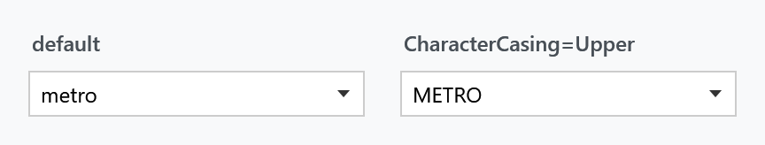

Order: 20
Title: ComboBoxHelper
Description: Text input rules for an editable ComboBox
---

Applies to `ComboBox`. Two properties, both about the text an editable combo box accepts — a `ComboBox` has no `MaxLength` or `CharacterCasing` of its own, so these fill the gap that `TextBox` does not have.



| Property | Type | Default | |
| --- | --- | --- | --- |
| `MaxLength` | `int` | `0` | how many characters may be typed; `0` means no limit |
| `CharacterCasing` | `CharacterCasing` | `Normal` | `Upper` or `Lower` converts as the user types |

```xml
<ComboBox IsEditable="True"
          mah:ComboBoxHelper.CharacterCasing="Upper"
          mah:ComboBoxHelper.MaxLength="10" />
```

Both only apply while `IsEditable` is `True`. On a drop-down-only combo box there is no text box for them to reach.

## Related

Most of what else a `ComboBox` offers comes from other helpers: the watermark and the clear button from [TextBoxHelper](textboxhelper), the corner radius and focus brushes from [ControlsHelper](controlshelper), and the brushes for the items in the drop-down from [ItemHelper](itemhelper).
