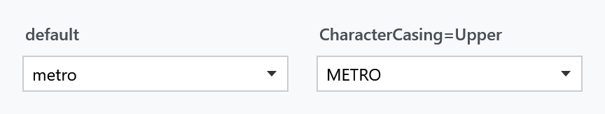

Order: 20
Title: ComboBoxHelper
Description: Text input rules and drop-down chrome for a ComboBox
---

Applies to `ComboBox`. Two properties are about the text an editable combo box accepts — a `ComboBox` has no `MaxLength` or `CharacterCasing` of its own, so these fill the gap that `TextBox` does not have. Three more are about the list that drops out of it.



| Property | Type | Default | |
| --- | --- | --- | --- |
| `MaxLength` | `int` | `0` | how many characters may be typed; `0` means no limit |
| `CharacterCasing` | `CharacterCasing` | `Normal` | `Upper` or `Lower` converts as the user types |

```xml
<ComboBox IsEditable="True"
          mah:ComboBoxHelper.CharacterCasing="Upper"
          mah:ComboBoxHelper.MaxLength="10" />
```

Both only apply while `IsEditable` is `True`. On a drop-down-only combo box there is no text box for them to reach.

## The drop-down

On `develop` the fill, the frame and the corners of the list are the box's own rather than three keys everything else reads too. A list hangs over whatever is behind it, so it needs a chrome that can differ from the one the box wears, and a set that gives its boxes a look of its own wants the same one here:

| Property | Type | Default | |
| --- | --- | --- | --- |
| `DropDownBackground` | `Brush` | `null` | what the list is filled with |
| `DropDownBorderBrush` | `Brush` | `null` | the frame around it |
| `DropDownCornerRadius` | `CornerRadius` | `0` | how far its corners are rounded |

`MahApps.Styles.ComboBox` sets the first two from `MahApps.Brushes.ComboBox.PopupBackground` and `MahApps.Brushes.ComboBox.PopupBorder`, so overriding either key in a theme still does what it always did.

```xml
<ComboBox mah:ComboBoxHelper.DropDownBorderBrush="{DynamicResource MahApps.Brushes.Accent}"
          mah:ComboBoxHelper.DropDownCornerRadius="8" />
```

## Opening with Enter

| Property | Type | Default | |
| --- | --- | --- | --- |
| `OpenDropDownOnEnterAndSpace` | `bool` | `false` | Enter and the space bar open the list of a closed box |

WPF opens the list of a combo box with F4 or with Alt and an arrow key. The combo box of UWP and WinUI also opens it with Enter and the space bar, and with this property set a MahApps box does the same. It only applies to a box that cannot be typed into: an editable one takes the space as a character and Enter as the end of what was typed. A key held together with Alt or Ctrl is left alone too. It works on a `MultiSelectionComboBox` as well.

The [Win10](../stylevariants/win10) and [WinUI](../stylevariants/winui) styles of both boxes turn it on, while the Metro style keeps the WPF behaviour. The property is new in `develop` and not in 2.4.11.

```xml
<ComboBox mah:ComboBoxHelper.OpenDropDownOnEnterAndSpace="True" />
```

## Related

Most of what else a `ComboBox` offers comes from other helpers: the watermark and the clear button from [TextBoxHelper](textboxhelper), the corner radius and focus brushes from [ControlsHelper](controlshelper), and the brushes for the items in the drop-down from [ItemHelper](itemhelper).
