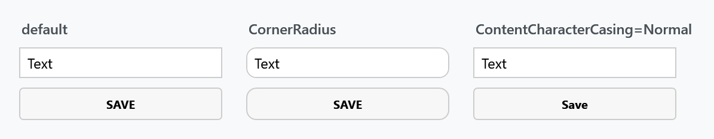

Order: 30
Title: ControlsHelper
Description: Corner radius, focus and mouse-over borders, content casing
---

The general-purpose one. Where the other helpers belong to a single control, `ControlsHelper` is read by the templates of `ButtonBase`, `CheckBox`, `ColorPalette`, `ComboBox`, `ContentControl`, `DatePicker`, `DropDownButton`, `NumericUpDown`, `PasswordBox`, `RadioButton`, `SplitButton`, `TextBox`, `Tile` and `WindowCommands`.



| Property | Type | Default | |
| --- | --- | --- | --- |
| `CornerRadius` | `CornerRadius` | `0` | rounds the control's border |
| `FocusBorderBrush` | `Brush` | transparent | border while the control has keyboard focus |
| `FocusBorderThickness` | `Thickness` | `0` | its thickness, where the template uses one. Obsolete on `develop`, see below |
| `MouseOverBorderBrush` | `Brush` | transparent | border while the pointer is over the control |
| `ContentCharacterCasing` | `CharacterCasing` | `Normal` | converts the content to upper or lower case |
| `DisabledVisualElementVisibility` | `Visibility` | `Visible` | the overlay drawn over a disabled control |
| `RecognizesAccessKey` | `bool` | `true` | whether an underscore in the content marks an access key |
| `IsReadOnly` | `bool` | `false` | makes the content of a control not editable |

:::{.alert .alert-warning}
**`FocusBorderThickness` is obsolete on `develop`, and no template reads it any more.** Swapping the border thickness on focus made the control jump, because its content had to move along with the thicker border, and a style built on top of that had no way to keep the layout still. Focus now colours the border the control already has, through `FocusBorderBrush`, and nothing moves. Setting the property still compiles and still does nothing to the built-in styles.
:::

```xml
<TextBox mah:ControlsHelper.CornerRadius="4"
         mah:ControlsHelper.FocusBorderBrush="{DynamicResource MahApps.Brushes.Accent}" />
```

## The two defaults worth knowing

**Buttons already upper-case their content.** The helper's own default is `Normal`, but the MahApps button style sets `ContentCharacterCasing` to `Upper`, so the interesting direction is turning it off again:

```xml
<Button mah:ControlsHelper.ContentCharacterCasing="Normal" Content="Save" />
```

**The border brushes default to transparent, and the styles fill them in.** The MahApps text box style sets `FocusBorderBrush` to `MahApps.Brushes.TextBox.Border.Focus` and `MouseOverBorderBrush` to `MahApps.Brushes.TextBox.Border.MouseOver`. Reading the raw default is therefore misleading — what a styled control actually shows is whatever its style set.

`DisabledVisualElementVisibility` set to `Collapsed` removes the wash that MahApps draws over a disabled control, which is worth doing when the control is inside something already dimmed.
