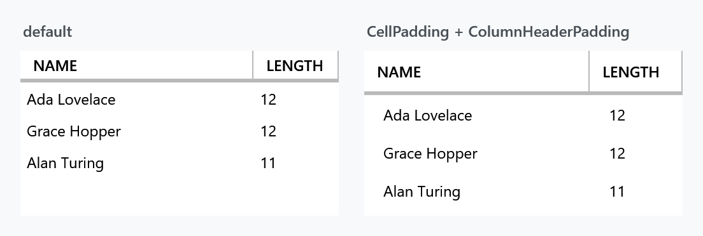

Order: 40
Title: DataGridHelper
Description: Cell padding, selection unit and styles for auto-generated columns
---

Applies to `DataGrid`, `DataGridRow` and `DataGridCell`. Two halves: a few properties for the look of the grid, and a set for styling the columns WPF generates for you.



## Layout and behaviour

| Property | Type | Default | |
| --- | --- | --- | --- |
| `CellPadding` | `Thickness` | `0` | padding inside every cell |
| `ColumnHeaderPadding` | `Thickness` | `10 0 4 0` | padding inside every column header |
| `SelectionUnit` | `DataGridSelectionUnit` | `FullRow` | which unit the MahApps styles draw as selected |
| `EnableCellEditAssist` | `bool` | `false` | a click straight onto a cell's editing control uses it right away |

```xml
<DataGrid mah:DataGridHelper.CellPadding="10 6"
          mah:DataGridHelper.ColumnHeaderPadding="10 8" />
```

`EnableCellEditAssist` is the one that changes how the grid feels. It hooks `PreviewMouseLeftButtonDown` and, when the click landed directly on a cell's editing control, puts the cell into edit mode and passes the click on — so a check box column toggles on the first click instead of needing one to select the cell and another to hit the box. Read-only cells are left alone.

:::{.alert .alert-info}
`DataGridHelper.SelectionUnit` is not `DataGrid.SelectionUnit`. The MahApps cell and row styles read the attached one to decide what to highlight; WPF's own property still decides what selection actually does. Set both when you change it.
:::

## Styling auto-generated columns

`AutoGenerateColumns="True"` builds columns from the bound type, which leaves nowhere to hang a style. These properties give the generated columns one, in pairs — a display style and an editing style:

| Column type | Display | Editing |
| --- | --- | --- |
| `DataGridCheckBoxColumn` | `AutoGeneratedCheckBoxColumnStyle` | `AutoGeneratedCheckBoxColumnEditingStyle` |
| `DataGridTextColumn` | `AutoGeneratedTextColumnStyle` | `AutoGeneratedTextColumnEditingStyle` |
| `DataGridComboBoxColumn` | `AutoGeneratedComboBoxColumnStyle` | `AutoGeneratedComboBoxColumnEditingStyle` |
| `DataGridNumericUpDownColumn` | `AutoGeneratedNumericUpDownColumnStyle` | `AutoGeneratedNumericUpDownColumnEditingStyle` |
| `DataGridHyperlinkColumn` | `AutoGeneratedHyperlinkColumnStyle` | `AutoGeneratedHyperlinkColumnEditingStyle` |

```xml
<DataGrid AutoGenerateColumns="True"
          mah:DataGridHelper.AutoGeneratedTextColumnStyle="{StaticResource RightAlignedCell}" />
```

`ColumnStylesHelper` takes an `IDataGridColumnStylesHelper` and does the same job for cases the ten properties above do not cover — it is handed each generated column and can decide what to apply.
